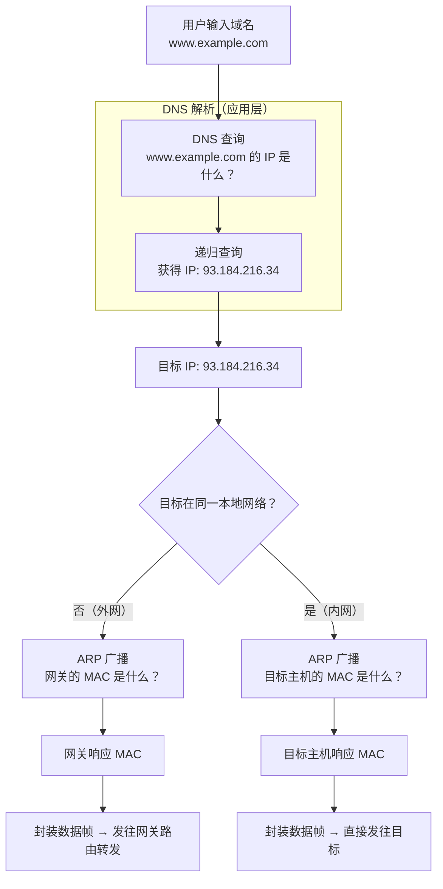

# DNS 与 ARP 的协同合作

**ARP 和 DNS 是网络通信中两个至关重要的"翻译官"**。它们分别工作在不同层级，协同完成从**域名 → IP → MAC** 的完整映射，使得网络通信得以实现。

## 解析流程



---

## 核心关联：两次翻译

一次完整的 Web 访问需要经过**两次关键的地址解析**：

| 步骤 | 负责协议 | 问题 | 结果 |
|------|----------|------|------|
| **1. 域名 → IP** | **DNS**（应用层） | 浏览器不知道 `www.example.com` 在哪 | 获取 IP `93.184.216.34` |
| **2. IP → MAC** | **ARP**（数据链路层） | 网卡不知道下一跳的物理地址 | 获取网关/目标主机的 MAC |

### 通俗类比

- **DNS** = 导航 App 输入店名 → 告诉你街道地址（IP）
- **ARP** = 到了街道 → 根据门牌号找到具体大门（MAC）

> 没有 DNS，你不知道目标在哪条街；没有 ARP，即使站在正确街道上，也不知该敲哪扇门。

---

## 安全层面的相似性

两者都因"天真"的信任模型成为攻击重灾区：

| | **DNS** | **ARP** |
|------|----------|----------|
| **设计理念** | 简单、高效、基于信任 | 简单、高效、基于信任 |
| **主要缺陷** | 查询/响应**明文**且**无认证** | 请求/响应**广播**且**无认证** |
| **核心攻击** | **DNS 欺骗/缓存投毒** — 伪造响应将域名指向恶意 IP | **ARP 欺骗/毒化** — 伪造响应将 IP 指向恶意 MAC |
| **攻击后果** | 引导至钓鱼网站或恶意服务器 | 实现中间人攻击，窃听或篡改局域网流量 |
| **安全扩展** | DNSSEC（验证）、DoH/DoT（加密） | DAI + DHCP Snooping（交换机端验证） |

**结论**：两者都需要额外的安全扩展来加固其原始协议的安全缺陷。

---

## 工作流程上的时序依赖

### 场景一：目标在外网（最常见）

```
① DNS 查询    →  获取目标域名公网 IP
② 路由判断    →  公网 IP 需经过默认网关
③ 检查 ARP 表 →  网关 IP 对应的 MAC？
④ ARP 请求    →  "谁有网关 IP 的 MAC？"
⑤ 封装发送    →  目标 MAC = 网关 MAC，发往网关
⑥ 网关转发    →  后续路由跳转
```

### 场景二：目标在内网（如打印机/共享文件）

```
① 可能不需要 DNS（直接用 IP 访问）
② 一定需要 ARP → "目标 IP 的 MAC 是什么？"
③ ARP 响应 → 封装后直接通信
```

---

## 对比总结

| 维度 | **DNS** | **ARP** |
|------|----------|----------|
| **工作层级** | 应用层（第 7 层） | 数据链路层（第 2 层） |
| **翻译内容** | 域名 → IP | IP → MAC |
| **作用范围** | 全球互联网 | 单个局域网（LAN） |
| **协议端口** | UDP/TCP 53 | 无端口（直接封装以太网帧） |
| **缓存** | DNS 缓存（浏览器/OS/递归服务器） | ARP 缓存表（各设备本地） |
| **共同要害** | 均缺乏认证机制，易遭受欺骗类攻击 | ⬅ 同 |

> 它们是上网过程中**一前一后、紧密配合的两个关键步骤**：DNS 先找到目标的逻辑地址（IP），ARP 再找到局域网内的物理地址（MAC），从而完成一次完整的数据传输。
