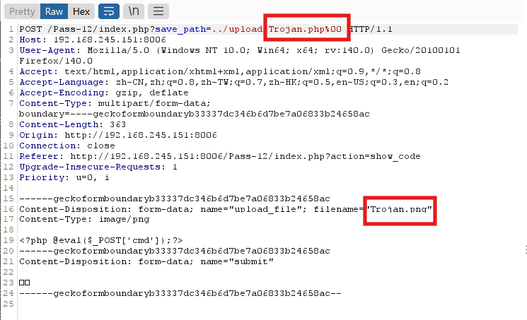
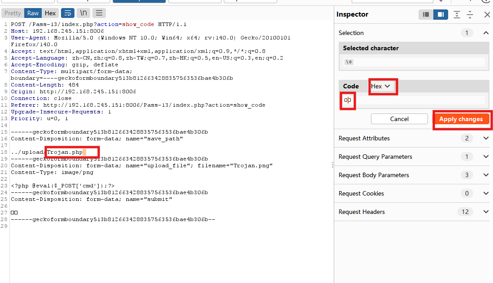
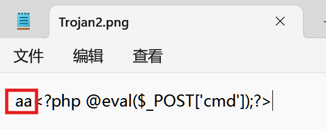
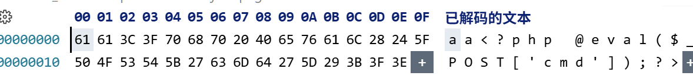
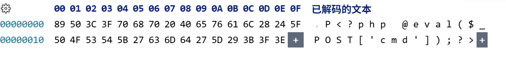
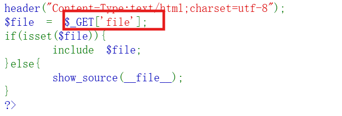
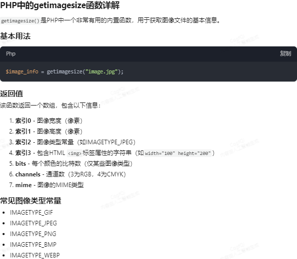
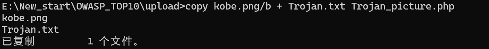

### 第一关

前端js验证：

    特征:上传的文件不合格是无法抓取到请求数据包的，浏览器根本不会发起请求。

    绕过方法：

        - 在about:config中关闭浏览器javascript:enable

        - 上传符合要求的文件后缀，然后bp拦截修改为php后缀

        - F12修改js验证逻辑代码

```javascript
    substring  ：substring() 是 JavaScript 中字符串对象的方法，用于截取字符串中指定位置的子串。
    示例
    let str = "example.jpg"; 

    console.log(str.substring(7));     // 输出 ".jpg"（从索引7到末尾）    

    console.log(str.substring(1,  4)); // 输出 "xam"（索引1到3）
    lastIndexOf  ：lastIndexOf() 是 JavaScript 字符串和数组的内置方法，用于从后向前搜索指定元素/子字符串，返回其最后一次出现的索引位置。
    示例
    let file = "archive.tar.gz"; 

    let ext = file.substring(file.lastIndexOf("."));  // ".gz"
```

### 第二关

后端MIME验证

    特征：

```php
if (($_FILES['upload_file']['type'] == 'image/jpeg') || ($_FILES['upload_file']['type'] == 'image/png') || ($_FILES['upload_file']['type'] == 'image/gif')) 
        {...} else {
            $msg = '文件类型不正确，请重新上传！';
        }
```

    绕过方法:

        -修改MIME为符合要求的格式如image/jpeg, image/png, image/gif,后缀依旧为php无需更改也能正确解析

### 第三关

后缀黑名单

    特征:

```php
 扩展名黑名单检查
 if(!in_array($file_ext, $deny_ext)) {...} else {
            $msg = '不允许上传.asp,.aspx,.php,.jsp后缀文件！';
        }
 文件名处理流程 
 $deny_ext = array('.asp','.aspx','.php','.jsp');
 $file_name = trim($_FILES['upload_file']['name']);
 $file_name = deldot($file_name);//删除文件名末尾的点
 $file_ext = strrchr($file_name, '.');
 $file_ext = strtolower($file_ext); //转换为小写
 $file_ext = str_ireplace('::$DATA', '', $file_ext);//去除字符串::$DATA
 $file_ext = trim($file_ext); //收尾去空
```

    绕过:

        进入Apache配置文件在AddType application/x-httpd-php .php 后面添加其它后缀,意思是将添加的后缀都按php文件解析.

        - php3

        - phtml

        - php5

        注:php版本为不带nts版本    

```php
trim() :去除字符串首尾的空白字符（空格、制表符、换行符等）或指定字符。

$text = "  Hello World!  ";
echo trim($text); // 输出："Hello World!"（去首尾空格）
echo trim("...PHP...", "."); // 输出："PHP"（去首尾点）

strrchr() :函数查找字符串中最后一次出现的某个字符，并返回该字符及其后的部分。
$path = "/home/user/file.txt"; 
echo strrchr($path, "/");  // 输出："/file.txt" 
echo strrchr($path, ".");  // 输出：".txt"（常用于提取扩展名） 

strtolower() :将字符串转换为全小写，避免大小写敏感问题。
echo strtolower("Hello PHP!"); // 输出："hello php!"

str_ireplace() :不区分大小写 的字符串替换。与 str_replace() 区别：后者区分大小写。
echo str_ireplace("php", "Python", "I love PHP!"); // 输出："I love Python!"
echo str_ireplace("::$DATA", "", "file.php::$DATA");  // 输出："file.php" 
```

### 第四关

后缀黑名单

    特征：没有禁用.htacess文件

    

```php
 拓展黑名单检查逻辑
 if (!in_array($file_ext, $deny_ext)) {...} else {
            $msg = '此文件不允许上传!';
        }
 文件名处理
  $deny_ext = array(".php",".php5",".php4",".php3",".php2",".php1",".html",".htm",".phtml",".pht",".pHp",".pHp5",".pHp4",".pHp3",".pHp2",".pHp1",".Html",".Htm",".pHtml",".jsp",".jspa",".jspx",".jsw",".jsv",".jspf",".jtml",".jSp",".jSpx",".jSpa",".jSw",".jSv",".jSpf",".jHtml",".asp",".aspx",".asa",".asax",".ascx",".ashx",".asmx",".cer",".aSp",".aSpx",".aSa",".aSax",".aScx",".aShx",".aSmx",".cEr",".sWf",".swf",".ini");
  $file_name = trim($_FILES['upload_file']['name']);
  $file_name = deldot($file_name);//删除文件名末尾的点
  $file_ext = strrchr($file_name, '.');
  $file_ext = strtolower($file_ext); //转换为小写
  $file_ext = str_ireplace('::$DATA', '', $file_ext);//去除字符串::$DATA
  $file_ext = trim($file_ext); //收尾去空
```

    绕过：

        -上传符合上下文的.htacess文件，然后上传一句换木马    

### 第五关

    后缀黑名单

        特征：没有禁用.user.ini

        

```php
 拓展黑名单检查
 if (!in_array($file_ext, $deny_ext)) {...} else {
            $msg = '此文件类型不允许上传！';
        }
 文件名处理
  $deny_ext = array(".php",".php5",".php4",".php3",".php2",".html",".htm",".phtml",".pht",".pHp",".pHp5",".pHp4",".pHp3",".pHp2",".Html",".Htm",".pHtml",".jsp",".jspa",".jspx",".jsw",".jsv",".jspf",".jtml",".jSp",".jSpx",".jSpa",".jSw",".jSv",".jSpf",".jHtml",".asp",".aspx",".asa",".asax",".ascx",".ashx",".asmx",".cer",".aSp",".aSpx",".aSa",".aSax",".aScx",".aShx",".aSmx",".cEr",".sWf",".swf",".htaccess");
  $file_name = trim($_FILES['upload_file']['name']);
  $file_name = deldot($file_name);//删除文件名末尾的点
  $file_ext = strrchr($file_name, '.');
  $file_ext = strtolower($file_ext); //转换为小写
  $file_ext = str_ireplace('::$DATA', '', $file_ext);//去除字符串::$DATA
  $file_ext = trim($file_ext); //首尾去空
```

    绕过

        -.user.ini绕过

        - 点空点绕过

    

### 第六关

    大小写绕过

### 第七关

    空格绕过

### 第八关

    点绕过

### 第九关

    额外数据流,上传额外数据流时的文件不会被验证后缀

### 第十关

    点空格点绕过

### 第十一关

    后缀黑名单

```php
$is_upload = false;
$msg = null;
if (isset($_POST['submit'])) {
    if (file_exists(UPLOAD_PATH)) {
        $deny_ext = array("php","php5","php4","php3","php2","html","htm","phtml","pht","jsp","jspa","jspx","jsw","jsv","jspf","jtml","asp","aspx","asa","asax","ascx","ashx","asmx","cer","swf","htaccess","ini");

        $file_name = trim($_FILES['upload_file']['name']);
        $file_name = str_ireplace($deny_ext,"", $file_name);
        $temp_file = $_FILES['upload_file']['tmp_name'];
        $img_path = UPLOAD_PATH.'/'.$file_name;        
        if (move_uploaded_file($temp_file, $img_path)) {
            $is_upload = true;
        } else {
            $msg = '上传出错！';
        }
    } else {
        $msg = UPLOAD_PATH . '文件夹不存在,请手工创建！';
    }
}
```

        关键函数

```php
 $file_name = str_ireplace($deny_ext,"", $file_name);
 在$file_name中查找$deny_ext如果有替换为空

 替换方向从左往右，替换次数一次
 举例
 $file_name = str_ireplace("php","","1php2php3php");

 $file_name=12php3php值替换了最左边的php
```

    绕过

        -双写绕过

### 第十二关

            后缀白名单

```php
$is_upload = false;
$msg = null;
if(isset($_POST['submit'])){
    $ext_arr = array('jpg','png','gif');
    $file_ext = substr($_FILES['upload_file']['name'],strrpos($_FILES['upload_file']['name'],".")+1);  #获取文件后缀
    if(in_array($file_ext,$ext_arr)){
        $temp_file = $_FILES['upload_file']['tmp_name'];
        $img_path = $_GET['save_path']."/".rand(10, 99).date("YmdHis").".".$file_ext;

        if(move_uploaded_file($temp_file,$img_path)){
            $is_upload = true;
        } else {
            $msg = '上传出错！';
        }
    } else{
        $msg = "只允许上传.jpg|.png|.gif类型文件！";
    }
}


关键函数     
$file_ext = substr($_FILES['upload_file']['name'],strrpos($_FILES['upload_file']['name'],".")+1);
            假设上传1.php
            $_FILES['upload_file']['name']：获取上传文件名 例如：1.php
            strrpos($_FILES['upload_file']['name'],".")：获取指定元素的索引并返回索引（从0开始）例如此句：获取1.php中.的索引
            strrpos($_FILES['upload_file']['name'],".")返回1，再+1为2

            $file_ext = substr($_FILES['upload_file']['name'],strrpos($_FILES['upload_file']['name'],".")+1);
            变为
            $file_ext = substr(1.php,2);
            值为php
```

    绕过（%00截断只适用于url中）
    在请求体中%00截断后还需要选择%00并进行解码


```php
 $img_path = $_GET['save_path']."/".rand(10, 99).date("YmdHis").".".$file_ext;
```



```php
 $img_path = $_GET['save_path']."/".rand(10, 99).date("YmdHis").".".$file_ext;
 $file_ext为下面的红框，Trojan.png
 $_GET['save_path']为../upload/我自己加的Trojan.php%00
 所以$_GET['save_path']为../upload/Trojan.php%00
 原先 $img_path ="../upload"."/".rand(10, 99).date("YmdHis")."."Trojan.png";
 添加截断后$img_path ="../upload/Trojan.php%00"."/".rand(10, 99).date("YmdHis")."."Trojan.png";
 截断后$img_path ="../upload/Trojan.php"
 原因很简单，url中遇到%00后结束读取了

 例如浏览器搜索:黑%00客实际搜索为黑因为客为截断了。
```

    

### 第十三关

    后缀白名单

```php
  相比于上一关，唯一的区别在于这里save_pash是通过POST获取的，在请求体里适用0x00截断
  $img_path = $_POST['save_path']."/".rand(10, 99).date("YmdHis").".".$file_ext;
```

    绕过

        - 0x00绕过（不能手动输入0x00而是输入一个空格选中，在Code中使用Hex修改值为00然后应用）

        

### 第十四关

    文件包含漏洞

```php
获取图片标识符(十六进制打开图片的前两个字节)
function getReailFileType($filename){
    $file = fopen($filename, "rb");
    $bin = fread($file, 2); //只读2字节
    fclose($file);
    $strInfo = @unpack("C2chars", $bin);    
    $typeCode = intval($strInfo['chars1'].$strInfo['chars2']);  # 获取标识符
    $fileType = '';    
    switch($typeCode){      
        case 255216: ## 不同图片的标识符的十六进制           
            $fileType = 'jpg';
            break;
        case 13780:            
            $fileType = 'png';
            break;        
        case 7173:            
            $fileType = 'gif';
            break;
        default:            
            $fileType = 'unknown';
        }    
        return $fileType;
}
```

```php
判断逻辑
    if($file_type == 'unknown'){
        $msg = "文件未知，上传失败！";
    }else{
        $img_path = UPLOAD_PATH."/".rand(10, 99).date("YmdHis").".".$file_type;
        if(move_uploaded_file($temp_file,$img_path)){
            $is_upload = true;
        } else {
            $msg = "上传出错！";
        }
    }
```

    绕过

        -用假图片修改为符合要求的字节标识符

            

         -修改字节标识符
         

        

        -如果不能上传就把php删去。

        我们访问上传的图片码是不能解析的，但是可以使用文件包含漏洞将上传文件包含按照php代码解析

        
         

### 第十五关

    文件包含漏洞

    与第十四关相较，这一关对图片的审查更严格了，使用了getimagesize函数

    

```php
function isImage($filename){
    $types = '.jpeg|.png|.gif';
    if(file_exists($filename)){
        $info = getimagesize($filename);
        $ext = image_type_to_extension($info[2]);
        if(stripos($types,$ext)>=0){
            return $ext;
        }else{
            return false;
        }
    }else{
        return false;
    }
}
```

    绕过

        -使用真实图片与一句换木马生成新的图片码

        

       -谁在前，谁就在头部，尽量使图片在前，这样图片可以正确解析

### 第十六关

        上传的图片与服务器实际收到的图片，实际上是不一样的，服务器会根据上传的图片对图片内容进行一部分的重写，删去多余部分，因此我们只需要找出不被修改的部分插入一句换木马即可。

       - 对渲染过的图片进行插入一句换木马，因为本关只对图片进行一次渲染，渲染过后的图片是不会被再次渲染的。

### 第十八关

    条件竞争

```php
$is_upload = false;
$msg = null;

if(isset($_POST['submit'])){
    $ext_arr = array('jpg','png','gif');
    $file_name = $_FILES['upload_file']['name'];
    $temp_file = $_FILES['upload_file']['tmp_name'];
    $file_ext = substr($file_name,strrpos($file_name,".")+1);
    $upload_file = UPLOAD_PATH . '/' . $file_name;

    if(move_uploaded_file($temp_file, $upload_file)){
        if(in_array($file_ext,$ext_arr)){
             $img_path = UPLOAD_PATH . '/'. rand(10, 99).date("YmdHis").".".$file_ext;
             rename($upload_file, $img_path);
             $is_upload = true;
        }else{
            $msg = "只允许上传.jpg|.png|.gif类型文件！";
            unlink($upload_file);
        }
    }else{
        $msg = '上传出错！';
    }
}
这里的逻辑是先对我文件进行处理，然后将文件移到储存路径也就是服务器储存路径，然后对文件进行合法性检验，不合法删除，合法保留。
即不和法文件也会在服务器停留极短的时间，当服务器遇到大量请求时，不和法文件可以利用服务器处理不过来的情况保留在服务器中短暂
    时间，如果这个文件的内容为生成一个木马文件，那么在该文件停留的一瞬间我们对其进行访问就可以在服务器植入一个木马，而服务
    器只会对上传文件进行筛选而不会对生成文件进行筛选，在有问题文件被删除前我们只需要生成木马即可。
```

    绕过

        -先上传母体文件，使用bp重复发包，再使用python重复请求，直到母体文件执行成功，然后访问植入的木马文件即可

### 第十九关

    Apeach解析漏洞+条件竞争

    

```php
    $ret = $this->move();
    if( $ret != 1 ){
      return $this->resultUpload( $ret );    
    }

    // check if we need to rename the file

    if( $this->cls_rename_file == 1 ){
      $ret = $this->renameFile();
      if( $ret != 1 ){
        return $this->resultUpload( $ret );    
      }
    }

    合法文件先上传到服务器再对其进行重命名！
    上传合法文件mom.php.7z,此文件上传到服务器后会被重命名为 随机数.7z，再被重命名之前我们对mom.php.7z进行访问，由于服务器不认识.7z因此会按mom.php解析！
        此文件内容为生成木马的文件就会生成木马
```

    绕过

        -上传合法文件mom.php.7z,(母体)，bp重复发包，python 脚本持续访问直到成功

        - 利用文件包含漏洞，被包含文件里的php代码为生成木马的代码

### 第二十关

        黑名单后缀

```php
$is_upload = false;
$msg = null;
if (isset($_POST['submit'])) {
    if (file_exists(UPLOAD_PATH)) {
        $deny_ext = array("php","php5","php4","php3","php2","html","htm","phtml","pht","jsp","jspa","jspx","jsw","jsv","jspf","jtml","asp","aspx","asa","asax","ascx","ashx","asmx","cer","swf","htaccess");

        $file_name = $_POST['save_name'];
        $file_ext = pathinfo($file_name,PATHINFO_EXTENSION);# 获得文件后缀

        if(!in_array($file_ext,$deny_ext)) {
            $temp_file = $_FILES['upload_file']['tmp_name'];
            $img_path = UPLOAD_PATH . '/' .$file_name;
            if (move_uploaded_file($temp_file, $img_path)) { 
                $is_upload = true;
            }else{
                $msg = '上传出错！';
            }
        }else{
            $msg = '禁止保存为该类型文件！';
        }

    } else {
        $msg = UPLOAD_PATH . '文件夹不存在,请手工创建！';
    }
}
```

    绕过

        -.user.ini

        -  . .绕过

        - \\.绕过（move_uploaded_file函数机制，会忽略\\）

        - 附加数据流绕过::DATA

### 第二十一关

    审计+数组绕过

```php
$is_upload = false;
$msg = null;
if(!empty($_FILES['upload_file'])){
    //检查MIME
    $allow_type = array('image/jpeg','image/png','image/gif');
    if(!in_array($_FILES['upload_file']['type'],$allow_type)){
        $msg = "禁止上传该类型文件!";
    }else{
        //检查文件名
        $file = empty($_POST['save_name']) ? $_FILES['upload_file']['name'] : $_POST['save_name'];
        if (!is_array($file)) {
            $file = explode('.', strtolower($file));
        }

        $ext = end($file);
        $allow_suffix = array('jpg','png','gif');
        if (!in_array($ext, $allow_suffix)) {
            $msg = "禁止上传该后缀文件!";
        }else{
            $file_name = reset($file) . '.' . $file[count($file) - 1];
            $temp_file = $_FILES['upload_file']['tmp_name'];
            $img_path = UPLOAD_PATH . '/' .$file_name;
            if (move_uploaded_file($temp_file, $img_path)) {
                $msg = "文件上传成功！";
                $is_upload = true;
            } else {
                $msg = "文件上传失败！";
            }
        }
    }
}else{
    $msg = "请选择要上传的文件！";
}
```

    验证逻辑+绕过：

    

```php
第一结果层验证MIME格式
$allow_type = array('image/jpeg','image/png','image/gif');
    if(!in_array($_FILES['upload_file']['type'],$allow_type)){
        $msg = "禁止上传该类型文件!";
    }else{...}


第二层
首先检查上传文件是否设置了保存文件名，如果没有使用原始文件名
$file = empty($_POST['save_name']) ? $_FILES['upload_file']['name'] : $_POST['save_name'];
        if (!is_array($file)) {
        首先检查上传文件是否为数组，如果不是则按点分割为数组，然后将数组元素全部转为小写
            $file = explode('.', strtolower($file));
        }

end()函数获取数组最后一个元素，进行白名单验证
$ext = end($file);
       $allow_suffix = array('jpg','png','gif');
       if (!in_array($ext, $allow_suffix)) {
           $msg = "禁止上传该后缀文件!";
       }else{...}

问题代码
$file_name = reset($file) . '.' . $file[count($file) - 1];
这里的$file变量为数组hack.php为例子$file[0]=‘hack’，$file[1]='php'
reset()函数会将数组的内部指针重置到第一个元素 并返回其值。所以reset($file)=$file[0]
这段代码理想情况会将文件名字与后缀用.拼接在一起。

但是也有不一般的情况
假设$file=['hack.php',null,'png']
reset($file)='hack.php'
$file[count($file)]='png';
$file[count($file) - 1]=null

那么$file_name = reset($file) . '.' . $file[count($file) - 1];值为hack.php.null也就是hack.php.
在windows中hack.php.就是hack.php

综上：
我们需要绕过MIME，修改content-type
上传一个数组save_name[0]为hack.php   save_name[3]为png(符合要求即可)不用传save_name[2]会默认为null
```
