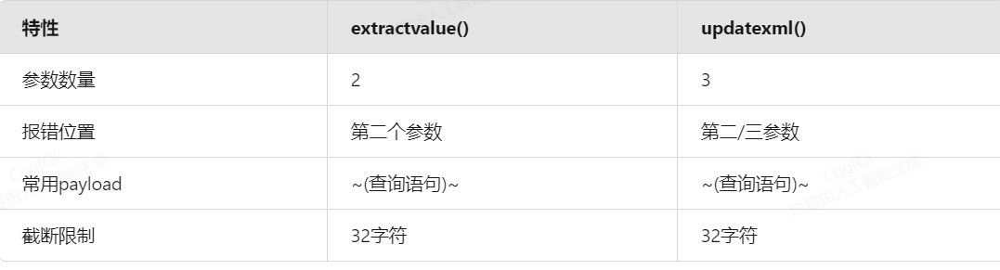

# SQL报错注入：extractvalue()与updatexml()函数解析

##### 1. 函数概述

在SQL报错注入中，`extractvalue()`和`updatexml()`是两个常用的XML处理函数，常被安全研究人员用于错误注入攻击。

##### extractvalue()函数
`extractvalue(XML_document, XPath_string)`

- 作用：从XML文档中提取值
- 参数：
  - XML_document：有效的XML文档字符串
  - XPath_string：XPath格式的字符串
- 报错机制：当XPath_string不符合XPath格式时，会返回错误信息

##### updatexml()函数

`updatexml(XML_document, XPath_string, new_value)`

- 作用：更新XML文档中匹配XPath表达式的值
- 参数：
  - XML_document：有效的XML文档字符串
  - XPath_string：XPath格式的字符串
  - new_value：替换的XML片段
- 报错机制：当XPath_string或new_value不符合XPath格式时，会返回错误信息

##### 2. 报错注入原理

这两个函数在XPath语法错误时会返回错误信息，但会显示错误前的执行结果。攻击者可以利用这一特性构造恶意查询，将想要获取的数据包含在XPath表达式中。

##### 典型注入模式

##### extractvalue注入

`and extractvalue(1, concat(0x7e, (select database()), 0x7e))`

##### updatexml注入

`and updatexml(1, concat(0x7e, (select user()), 0x7e), 1)`

##### `INTO OUTFILE` 是 MySQL 中的一个 SQL 语句子句，用于将查询结果导出到服务器上的文件中。您提供的 SQL 片段是一个典型的 SQL 注入攻击示例，试图通过该功能写入一个 PHP webshell 文件。

# `INTO OUTFILE` 的核心功能

1. **数据导出功能**：将查询结果写入服务器文件系统
   - 语法：`SELECT ... INTO OUTFILE 'file_path'`
   - 文件将被创建在 MySQL 服务器上，而不是客户端机器
   - 需要 MySQL 用户有 FILE 权限
2. **安全限制**：
   - 不能覆盖已存在文件
   - 文件必须写入 MySQL 有权限的目录
   - 需要绝对路径，不能使用相对路径

# mysqli_multi_query() 函数详解

`mysqli_multi_query()` 是 PHP 中 MySQLi 扩展提供的一个函数，用于执行一个或多个用分号分隔的 SQL 查询。

##### 基本语法

`mysqli_multi_query(mysqli $connection, string $query): bool`

##### 参数说明

1. **$connection** - 必需，MySQL 数据库连接对象
2. **$query** - 必需，一个或多个用分号分隔的 SQL 查询语句

##### 函数特点

- 执行多个 SQL 语句，语句之间用分号(;)分隔
- 返回布尔值：成功时返回 TRUE，失败时返回 FALSE
- 需要配合 `mysqli_store_result()` 或 `mysqli_use_result()` 和 `mysqli_next_result()` 来处理结果集