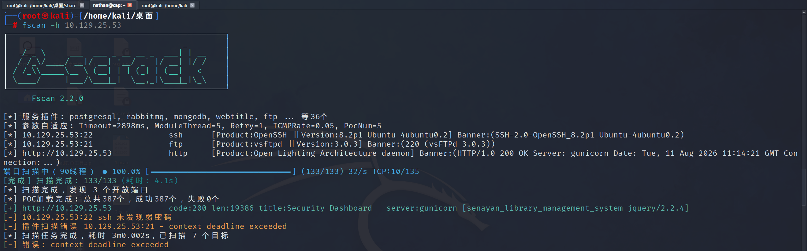
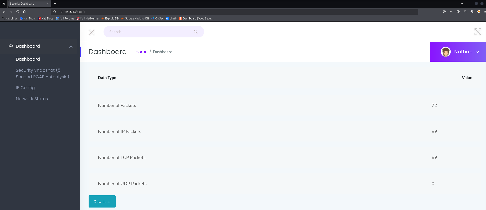
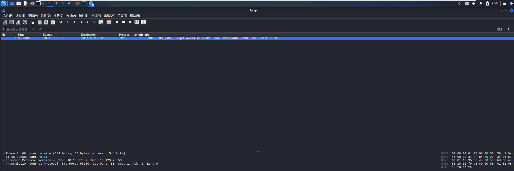
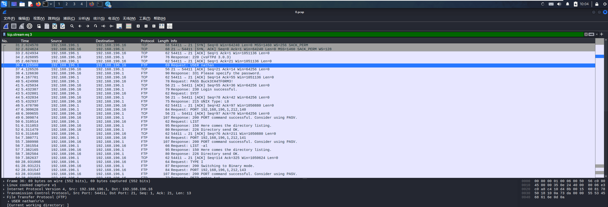
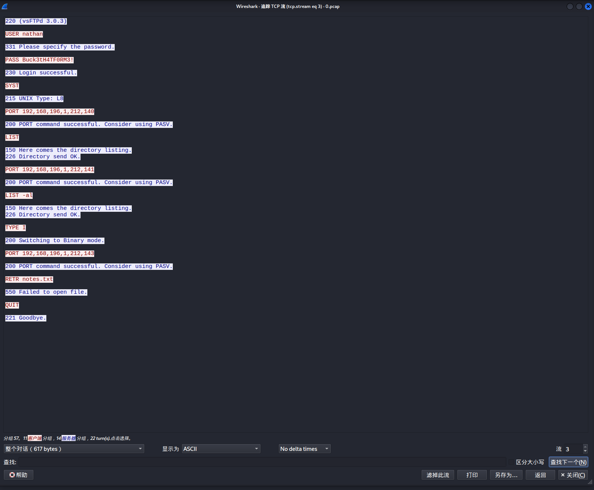
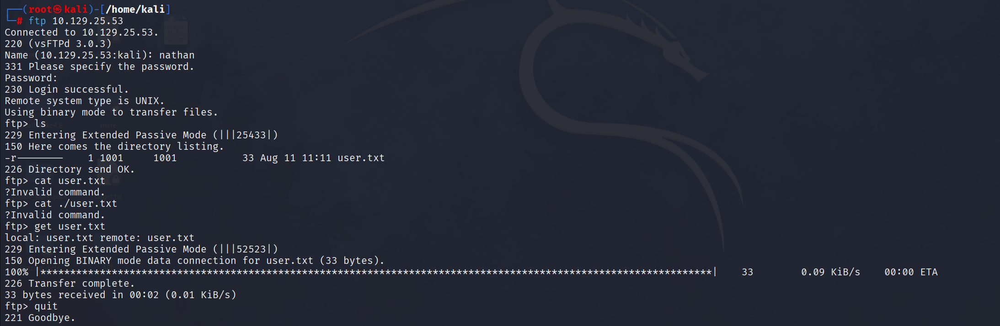
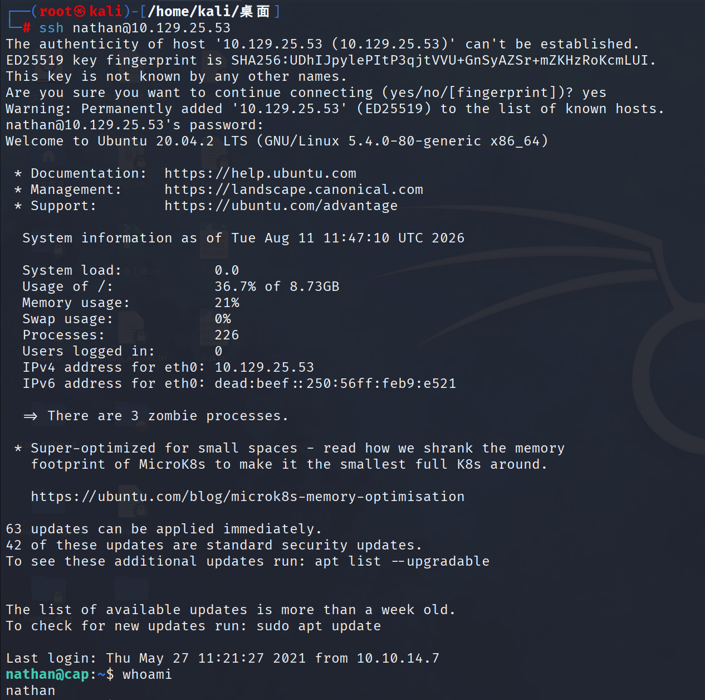
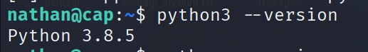
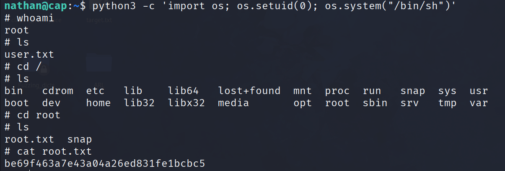

## target_ip: 10.129.25.53
## 信息收集:

发现开放了三个端口，分别对应http的web服务，22端口的ssh服务，21端口的ftp服务

## 访问web页面
一共有三个栏目可供点击每一个都点开看看，最后发现此页面可以下载，为此下载一下看看怎么回事：

发现是一个wireshark可解写的流量

但这里只有一个数据包貌似没什么卵用，因为发起请求的IP为我，请求的IP为目标主机。
## 流量分析
**注意到web访问url格式为http://10.129.25.53/data/1**结合有下载功能可以联想到这是一个下载的api接口，因此尝试更改为http://10.129.25.53/data/0等其它路径下载发现http://10.129.25.53/data/0可以下载很多数据包，结合之前发现的FTP服务开启可以尝试然后**FTP又是明文传输**可以尝试进行流量分析看看是否存在FTP建立连接的过程，里面的用户名与密码是明文传输的。

上面就可以发现建立连接过程中的明文传输了，如果还想更清晰明了可以进行FTP流追踪如图，可以发现整个建立连接的过程，以及其中暴露出的明文密码

用户名：nathan
密码：Buck3tH4TF0RM3!
## 获取FTP账户进行FTP登陆
由于FTP是文件传输协议因此可以执行的操作主要是围绕文件的，不能像cat那样直接读取内容而是要下载下来查看使用**get filename**

至此获取第一个目标。

## 尝试使用FTP账户连接SSH服务
连接成功！

查看当前用户，whoami可以发现这只是一个低权限用户，需要进行提权处理。

### 提权
检测是否具有python环境

尝试使用python进行提权
```python
python3 -c 'import os; os.setuid(0); os.system("/bin/sh")'
```
提权成功！


## 还记得本关卡是有关IDOR的吗？现在就说道说道！
**IDOR**（Insecure Direct Object Reference，不安全的直接对象引用）是一种**访问控制漏洞**，发生在应用程序暴露内部对象（文件、数据库记录、用户信息等）的引用时，但**没有验证用户是否有权限访问这些对象**。

具体体现在http://10.129.25.53/data/1没有对此页面的访问做鉴权导致谁都可以下载访问。

服务器**没有检查**：

- 当前用户是否有权限访问文件 0？
    
- 文件 0 是否应该公开？
    
- 用户是否经过身份验证？