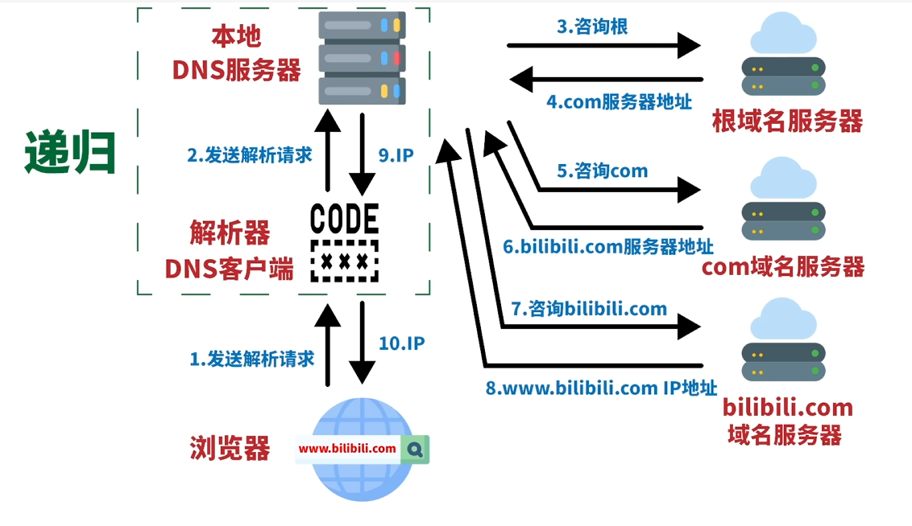
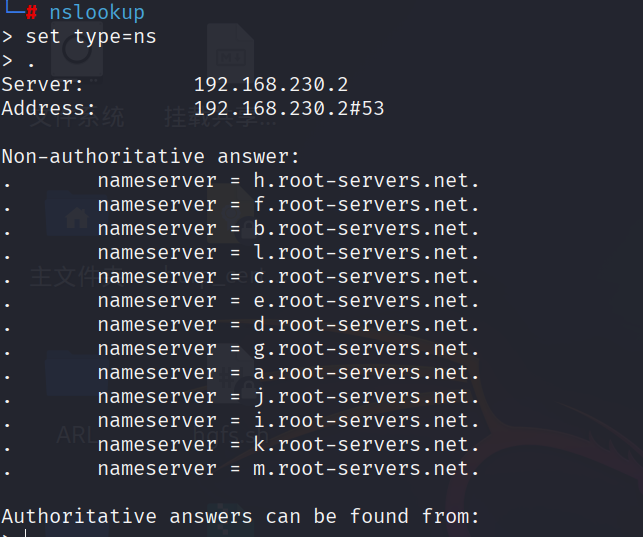
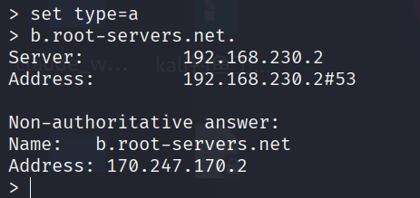
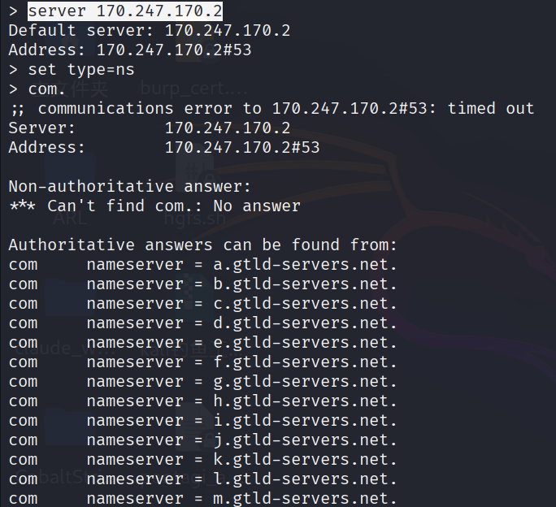
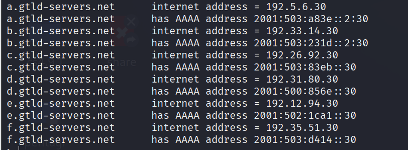
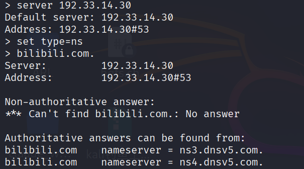
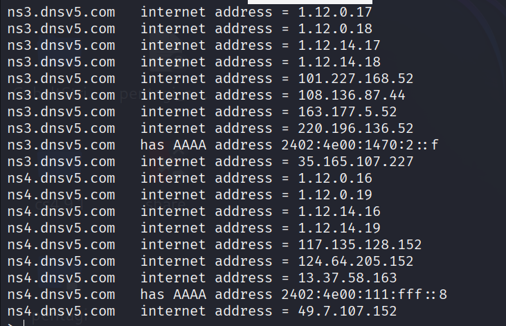
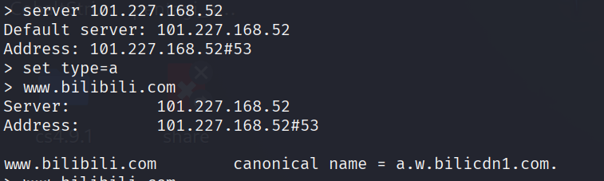
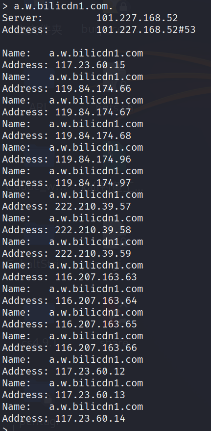

## 递归查询

## 具体过程
**假设**本地DNS服务器没有任何根域名服务器的域名和地址：

**nslookup工具进行查询**
### 获取根服务器IP
**set type=ns：** 查询类型为ns也就是名称域名服务器name server，查询该域名的 **权威 DNS 服务器** 地址
**.：** 查询根服务器的域名输入一个\.表示根
	
	这里返回了非权威的名称域名服务器结果，这里读取的是本地缓存
得到了域名还需要IP才能通信
**set type=a**：设置ipv4格式
**b.root-servers.net.** ：选择其中一个根服务器进行IP查询
	
	得到这个根的IP地址（非权威）
### 获取顶级域名com的IP
**server 170.247.170.2**：与这个根域名服务器进行通信
**set type=ns**：查询类型为ns也就是名称域名服务器name server
**com.**：像根域名服务器咨询com域名服务器的地址
	
	顶级域名服务器的域名（权威回答）
	
	**gtld**：generic top leve domain（通用顶级域名）
	顶级域名服务器域名所对应的IP地址（权威回答）

### 获取bilibili.com域名服务器IP
**server 192.33.14.30**：
**set type=ns**：
**bilibili.com.**：向一个顶级域名服务器的地址192.33.14.30咨询bilibili.com域名服务器的地址
	
	bilibili域名服务器有两个（ns3.dnsv5.com.与ns4.dnsv5.com.）（权威回复）
	
	两个域名对应多个IP地址

### 获取www.bilibili.com子域名的IP
**server 101.227.168.52**：与ns3.dnsv5.com.的其中一个地址进行通信
**set type=a**：a 代表 Address（地址）记录
www.bilibili.com ：向权威服务器咨询www.bilibili.com域名服务器的IPv4地址
	
	这里canonical name = a.w.bilicdn1.com.说明www.bilibili.com 会跳转到a.w.bilicdn1.com.这里的a.w.bilicdn1.com.其实是一个cnd节点域名

**a.w.bilicdn1.com.** ：查询该cnd节点的IP地址
	

## 流程
1. 查 "." 根域 → 得到 13 台根服务器（a.root-servers.net ~ m.root-servers.net）
2. 查 "com." 顶级域 → 得到 gtld-servers.net（13 台）
3. 查 "bilibili.com." 权威 NS → 得到 ns3.dnsv5.com / ns4.dnsv5.com（腾讯云 DNSPod）
4. 向权威 NS 查询 "www.bilibili.com" → 得到 CNAME（a.w.bilicdn1.com）→ 最终 A 记录（多个 IP，包含 117.23.60.15）