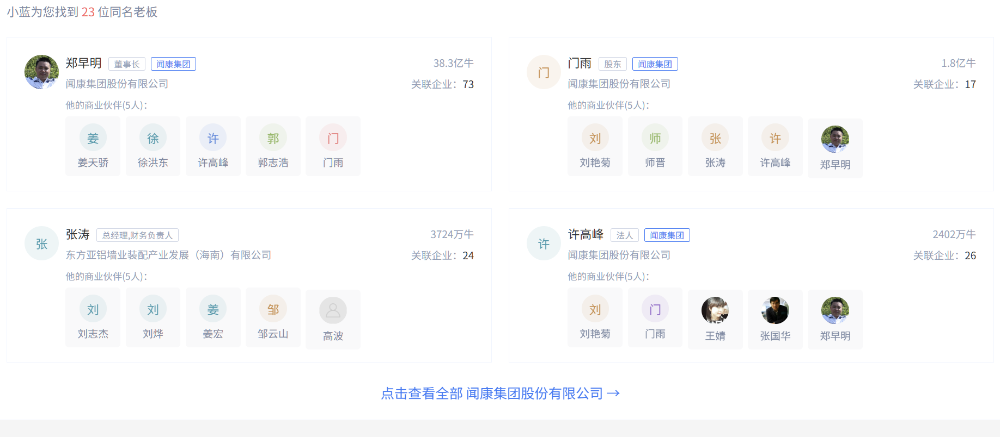
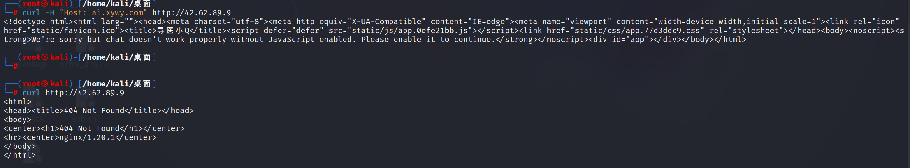

# 目标：www.xywy.com
## 被动收集：

**url网址**：https://www.xywy.com/
**主域名**：xywy.com（配有DNS，防止IP泄露）
**企业**：闻康集团股份有限公司
**归属地**：北京
**备案号**：京ICP备09051930号-1
**员工**：
	
**电话**：010-80493860
邮箱：gaocongrong@xywy.com
**董事长博客**：http://weibo.com/p/1005051947144304
**域名以及对应IP（均为CDN节点）**
```markdown
| IP             |端口   |域名                         |网站标题
| :--------------|:-----|:----------------------------|:--------------------------
| 36.144.56.165  | 80   | passport.xywy.com           | 寻医问药网用户登录
| 36.144.56.165  | 80   | so.m.xywy.com               | 在线问诊_问医生_寻医问药网_xywy.com
| 112.15.9.230   | 443  | hao123.xywy.com             |
| 36.144.56.171  | 80   | passport.xywy.com           | 寻医问药网用户登录
| 117.135.221.92 | 80   | hao123.xywy.com             |
| 120.221.162.173| 80   | passport.xywy.com           | 寻医问药网用户登录
| 111.6.249.237  | 80   | hao123.xywy.com             |
| 182.101.26.190 | 80   | hao123.xywy.com             |
| 112.29.228.247 | 80   | hao123.xywy.com             |
| 183.204.231.171| 80   | so.m.xywy.com               | 在线问诊_问医生_寻医问药网_xywy.com
| 42.62.89.138   | 80   | union.xywy.com              | 抱歉，您访问的页面不存在
| 42.62.89.133   | 80   | doc.api.xywy.com            | 登录 - API平台
| 111.19.181.200 | 80   | xs3.op.xywy.com             |
| 183.240.70.220 | 80   | xs3.op.xywy.com             |
| 183.201.192.251| 80   | hao123.xywy.com             |
| 42.62.89.178   | 80   | api.d.xywy.com              |
| 183.204.231.171| 80   | passport.xywy.com           | 寻医问药网用户登录
| 106.12.37.196  | 80   | bdmjs.xywy.com              | 百度网盟推广
| 42.62.89.138   | 80   | 3g.jck.xywy.com             | 检查_检查查询_检查大全_寻医问药网
| 42.62.89.138   | 80   | mipkewen.xywy.com           | 抱歉，您访问的页面不存在
| 42.62.89.178   | 80   | ucenter.xywy.com            | 寻医问药网用户登录
| 183.230.105.98 | 80   | hao123.xywy.com             |
| 121.204.232.190| 80   | m.imask.xywy.com            | 寻医问药网_医药搜索_医患交流_健康资讯_预约挂号健康服务平台_xywy.com
| 42.62.89.25    | 80   | imgupload.api.xywy.com      |
| 115.223.44.223 | 80   | hao123.xywy.com             |
| 36.158.216.179 | 80   | xs3.op.xywy.com             |
| 42.62.89.178   | 80   | imask.wws.xywy.com          | 寻医问药网_医药搜索_医患交流_健康资讯_预约挂号健康服务平台_xywy.com
| 42.62.89.178   | 80   | imdata.xywy.com             | 寻医问药网_医药搜索_医患交流_健康资讯_预约挂号健康服务平台_xywy.com
| 42.62.89.178   | 80   | 3g.i.xywy.com               | 登录_寻医问药网_xywy.com
| 115.223.44.222 | 80   | m.imask.xywy.com            | 寻医问药网_医药搜索_医患交流_健康资讯_预约挂号健康服务平台_xywy.com
| 42.101.81.203  | 80   | xs3.op.xywy.com             |
| 42.62.89.12    | 80   | shangcheng.kddi.xywy.com    | Apache Tomcat/7.0.53
| 120.226.150.238| 80   | passport.xywy.com           | 寻医问药网用户登录
| 120.221.162.159| 80   | passport.xywy.com           | 寻医问药网用户登录
| 111.42.202.191 | 80   | xs3.op.xywy.com             |
| 42.62.89.26    | 80   | club.app.xywy.com           | 寻医问药网用户登录
| 183.201.120.159| 80   | xs3.op.xywy.com             |
| 42.62.89.58    | 80   | drcenter.xywy.com           | 寻医问药网用户登录
| 119.188.9.131  | 80   | bdmjs.xywy.com              | 百度网盟推广
| 150.139.142.119| 80   | m.imask.xywy.com            | 寻医问药网_医药搜索_医患交流_健康资讯_预约挂号健康服务平台_xywy.com
| 111.177.43.131 | 80   | bdmjs.xywy.com              | 百度网盟推广
| 42.62.89.155   | 80   | zhao.xywy.com               | 在线问诊_问医生_寻医问药网_xywy.com
| 42.62.89.155   | 80   | robot.zhao.xywy.com         | 在线问诊_问医生_寻医问药网_xywy.com
| 111.63.67.131  | 80   | bdmjs.xywy.com              | 百度网盟推广
| 42.62.89.9     | 80   | sso.health-c.xywy.com       | 云健康管理服务系统
| 42.62.89.9     | 80   | sport.hrms.xywy.com         | 运动管理
| 183.204.231.169| 80   | so.m.xywy.com               | 在线问诊_问医生_寻医问药网_xywy.com
| 42.62.89.26    | 80   | api.imgupload.xywy.com      |
| 42.62.89.9     | 80   | health-c.xywy.com           | 云健康管理服务系统
| 42.62.89.9     | 80   | ai.xywy.com                 | 寻医小Q
| 121.204.232.191| 80   | m.imask.xywy.com            | 寻医问药网_医药搜索_医患交流_健康资讯_预约挂号健康服务平台_xywy.com
| 42.62.89.167   | 80   | api.3g.club.xywy.com        |
| 182.101.26.182 | 80   | xs3.op.xywy.com             |
| 183.204.231.169| 80   | passport.xywy.com           | 寻医问药网用户登录
| 36.144.56.171  | 80   | so.m.xywy.com               | 在线问诊_问医生_寻医问药网_xywy.com
| 118.112.229.98 | 80   | m.imask.xywy.com            | 寻医问药网_医药搜索_医患交流_健康资讯_预约挂号健康服务平台_xywy.com
| 42.62.89.9     | 80   | sjb.dm.xywy.com             | 用户登录
| 42.62.89.9     | 80   | sso.hrms.xywy.com           | 惠尔健康管理服务系统
| 42.62.89.9     | 80   | mytnet-admin.xywy.com       | 铭医堂网络科技公司
| 27.152.188.16  | 80   | 3g.xywy.com                 | 医药搜索_医患交流_健康资讯_预约挂号健康服务平台_寻医问药网
| 112.48.170.70  | 80   | hao123.xywy.com             |
| 42.62.89.138   | 80   | jib.api.xywy.com            |
| 42.62.89.12    | 80   | huaweirt.xywy.com           |
| 122.191.142.91 | 80   | passport.xywy.com           | 寻医问药网用户登录
| 121.204.232.191| 443  | m.imask.xywy.com            | 寻医问药网_医药搜索_医患交流_健康资讯_预约挂号健康服务平台_xywy.com
| 111.48.64.106  | 80   | xs3.op.xywy.com             |
| 117.161.47.91  | 443  | hao123.xywy.com             |
| 111.41.50.87   | 80   | hao123.xywy.com             |
| 36.170.23.92   | 80   | hao123.xywy.com             |
| 42.62.89.49    | 80   | sso.wkhe.xywy.com           | 惠尔健康管理服务系统
| 42.62.89.9     | 443  | health-c.xywy.com           | 云健康管理服务系统
| 42.62.89.49    | 80   | sporth.wkhe.xywy.com        | 运动管理
| 42.62.89.9     | 443  | chanjet.xywy.com            | 畅捷通 T+
| 111.47.131.9   | 80   | hao123.xywy.com             | 301 Moved Permanently
| 42.62.89.49    | 80   | sport.wkhe.xywy.com         | 三步健康
| 42.62.89.49    | 80   | health.wkhe.xywy.com        | 惠尔健康管理服务系统
| 42.62.89.9     | 443  | ai.xywy.com                 | 寻医小Q
| 106.119.81.207 | 443  | xs3.op.xywy.com             |
| 42.101.81.203  | 443  | xs3.op.xywy.com             |
| 171.111.157.144| 443  | xs3.op.xywy.com             |
| 106.119.81.207 | 80   | xs3.op.xywy.com             |
| 183.204.245.171| 80   | passport.xywy.com           | 寻医问药网用户登录
| 42.62.89.9     | 80   | health.hrms.xywy.com        | 惠尔健康管理服务系统
| 42.62.89.9     | 80   | sport.health-c.xywy.com     | 运动管理
| 36.144.56.165  | 443  | passport.xywy.com           | 寻医问药网用户登录
| 115.223.44.222 | 443  | m.imask.xywy.com            | 寻医问药网_医药搜索_医患交流_健康资讯_预约挂号健康服务平台_xywy.com
| 171.111.157.144| 80   | xs3.op.xywy.com             |
| 42.62.89.138   | 80   | api.jib.xywy.com            |
| 36.158.216.175 | 443  | xs3.op.xywy.com             |
| 111.42.202.186 | 80   | xs3.op.xywy.com             |
| 183.204.245.171| 443  | passport.xywy.com           | 寻医问药网用户登录
| 42.62.89.12    | 80   | apiso.kddi.xywy.com         | Apache Tomcat/8.0.8
| 120.220.231.102| 80   | xs3.op.xywy.com             |
| 150.139.142.119| 443  | m.imask.xywy.com            | 寻医问药网_医药搜索_医患交流_健康资讯_预约挂号健康服务平台_xywy.com
| 117.156.16.168 | 443  | hao123.xywy.com             |
| 111.51.76.204  | 80   | hao123.xywy.com             |
| 120.221.162.159| 443  | hao123.xywy.com             |
| 42.62.89.178   | 80   | d.xywy.com                  |
| 112.29.228.247 | 443  | hao123.xywy.com             |
| 111.32.145.146 | 443  | hao123.xywy.com             |
| 111.42.202.186 | 443  | xs3.op.xywy.com             |
| 182.101.26.182 | 443  | xs3.op.xywy.com             |
| 183.201.120.159| 443  | xs3.op.xywy.com             |
| 111.19.181.200 | 443  | xs3.op.xywy.com             |
| 42.62.89.133   | 80   | admin.d.xywy.com            | 登陆-管理后台
| 222.186.153.93 | 443  | m.imask.xywy.com            | 寻医问药网_医药搜索_医患交流_健康资讯_预约挂号健康服务平台_xywy.com
| 150.139.142.121| 80   | m.imask.xywy.com            | 寻医问药网_医药搜索_医患交流_健康资讯_预约挂号健康服务平台_xywy.com
| 150.139.142.121| 443  | m.imask.xywy.com            | 寻医问药网_医药搜索_医患交流_健康资讯_预约挂号健康服务平台_xywy.com
| 42.62.89.58    | 80   | doc.z.xywy.com              |
| 42.62.89.56    | 80   | admin.health.huier.xywy.com | 健康风险评估服务系统
| 42.62.89.23    | 80   | api.iu.dr.xywy.com          |
| 42.62.89.18    | 80   | health-wkhe.xywy.com        | 惠尔健康管理服务系统
| 42.62.89.56    | 80   | admin.exactad.xywy.com      | 登陆 - 医美广告管理后台
| 120.220.231.102| 443  | xs3.op.xywy.com             |
| 111.12.66.169  | 443  | hao123.xywy.com             |
| 111.12.66.174  | 443  | hao123.xywy.com             |       
```
## 主动收集
**CDN服务提供商**：创世云（[chuangcdn.com](https://chuangcdn.com/)）
**底层云计算与CDN技术支持**：阿里云
**SSL证书提供商**：天威诚信（vTrus）
**Name Servers**：`ns3.dnsv4.com`，`ns4.dnsv4.com`
## **子域名枚举获取节点背后的源IP，网段：42.62.89.0/24**
直接访问是节点在响应：
	
绕过CDN直接访问源站：
	
## 高价值旁站IP：  
	42.62.89.9: 200（res_code）
	42.62.89.14: 200
	42.62.89.22: 200
	42.62.89.33: 200
	42.62.89.42: 200
	42.62.89.72: 200
	42.62.89.78: 200
	42.62.89.161: 200
	42.62.89.182: 200
	42.62.89.183: 200
	 **这些IP大部分不响应，Apache配置了不接受IP访问需要配置映射表才可以如图：**

## 子域名：
	www.xywy.com
	hm.baidu.com
	static.wkimg.com
	img.static.xywy.com
	ask.xywy.com
	club.xywy.com
	www.jkgls.com.cn
	hao123.xywy.com
	ai.xywy.com
	news.xywy.com
	passport.xywy.com
	ucenter.xywy.com
	club.app.xywy.com
	z.app.xywy.com
	order.yao.app.xywy.com
	dangan.app.xywy.com
	js.static.xywy.com
	so.xywy.com
	zzk.xywy.com
	z.xywy.com
	y.wksc.com
	v.xywy.com
	jinshuju.net
	xs3.op.xywy.com
	doc.static.xywy.com
	www.beian.gov.cn
	beian.miit.gov.cn
	**这些域名背后的IP也都是CDN节点**

**笛卡尔积将IP与域名进行绑定范围，寻找出域名对应的IP：**

```bash
=== IP与域名匹配探测（含响应字节数 + Title） ===

--- 测试 IP: 42.62.89.9 ---
  ai.xywy.com -> 200 (551 bytes) [Title: 寻医小Q]
  club.xywy.com -> 200 (131023 bytes) [Title: 无]
  zzk.xywy.com -> 200 (199501 bytes) [Title: ֢״Ƶ]
  z.xywy.com -> 200 (66266 bytes) [Title: Ѱҽ]
  v.xywy.com -> 200 (78379 bytes) [Title: 健康视频_寻医问药网_xywy.com]

--- 测试 IP: 42.62.89.14 ---
  www.xywy.com -> 200 (142406 bytes) [Title: Ѱҽ]
  club.xywy.com -> 200 (0 bytes) [Title: 无]

--- 测试 IP: 42.62.89.22 ---
  www.xywy.com -> 200 (497 bytes) [Title: the End of The Internet]
  ai.xywy.com -> 200 (497 bytes) [Title: the End of The Internet]
  ucenter.xywy.com -> 200 (497 bytes) [Title: the End of The Internet]
  club.app.xywy.com -> 200 (497 bytes) [Title: the End of The Internet]
  y.wksc.com -> 200 (497 bytes) [Title: the End of The Internet]
  ask.xywy.com -> 200 (497 bytes) [Title: the End of The Internet]
  club.xywy.com -> 200 (497 bytes) [Title: the End of The Internet]
  news.xywy.com -> 200 (497 bytes) [Title: the End of The Internet]
  passport.xywy.com -> 200 (497 bytes) [Title: the End of The Internet]
  so.xywy.com -> 200 (497 bytes) [Title: the End of The Internet]
  zzk.xywy.com -> 200 (497 bytes) [Title: the End of The Internet]
  z.xywy.com -> 200 (497 bytes) [Title: the End of The Internet]
  v.xywy.com -> 200 (497 bytes) [Title: the End of The Internet]
  hao123.xywy.com -> 200 (497 bytes) [Title: the End of The Internet]
  img.static.xywy.com -> 200 (497 bytes) [Title: the End of The Internet]
  js.static.xywy.com -> 200 (497 bytes) [Title: the End of The Internet]

--- 测试 IP: 42.62.89.33 ---
  www.xywy.com -> 200 (142406 bytes) [Title: Ѱҽ]
  club.xywy.com -> 200 (0 bytes) [Title: 无]

--- 测试 IP: 42.62.89.42 ---
  www.xywy.com -> 200 (142406 bytes) [Title: Ѱҽ]

--- 测试 IP: 42.62.89.72 ---
  www.xywy.com -> 200 (32377 bytes) [Title: 内科_医院就医指南]
  ai.xywy.com -> 200 (32377 bytes) [Title: 内科_医院就医指南]
  ucenter.xywy.com -> 200 (32377 bytes) [Title: 内科_医院就医指南]
  club.app.xywy.com -> 200 (32377 bytes) [Title: 内科_医院就医指南]
  y.wksc.com -> 200 (32377 bytes) [Title: 内科_医院就医指南]
  ask.xywy.com -> 200 (32377 bytes) [Title: 内科_医院就医指南]
  club.xywy.com -> 200 (32377 bytes) [Title: 内科_医院就医指南]
  news.xywy.com -> 200 (32377 bytes) [Title: 内科_医院就医指南]
  passport.xywy.com -> 200 (32377 bytes) [Title: 内科_医院就医指南]
  so.xywy.com -> 200 (32377 bytes) [Title: 内科_医院就医指南]
  zzk.xywy.com -> 200 (32377 bytes) [Title: 内科_医院就医指南]
  z.xywy.com -> 200 (32377 bytes) [Title: 内科_医院就医指南]
  v.xywy.com -> 200 (32377 bytes) [Title: 内科_医院就医指南]
  hao123.xywy.com -> 200 (32377 bytes) [Title: 内科_医院就医指南]
  img.static.xywy.com -> 200 (32377 bytes) [Title: 内科_医院就医指南]
  js.static.xywy.com -> 200 (32377 bytes) [Title: 内科_医院就医指南]

--- 测试 IP: 42.62.89.78 ---
  www.xywy.com -> 200 (142406 bytes) [Title: Ѱҽ]
  club.xywy.com -> 200 (0 bytes) [Title: 无]

--- 测试 IP: 42.62.89.161 ---
  www.xywy.com -> 200 (142406 bytes) [Title: Ѱҽ]
  club.xywy.com -> 200 (0 bytes) [Title: 无]

--- 测试 IP: 42.62.89.182 ---
  www.xywy.com -> 200 (497 bytes) [Title: the End of The Internet]
  ai.xywy.com -> 200 (497 bytes) [Title: the End of The Internet]
  ucenter.xywy.com -> 200 (497 bytes) [Title: the End of The Internet]
  club.app.xywy.com -> 200 (497 bytes) [Title: the End of The Internet]
  y.wksc.com -> 200 (497 bytes) [Title: the End of The Internet]
  ask.xywy.com -> 200 (497 bytes) [Title: the End of The Internet]
  club.xywy.com -> 200 (497 bytes) [Title: the End of The Internet]
  news.xywy.com -> 200 (497 bytes) [Title: the End of The Internet]
  passport.xywy.com -> 200 (497 bytes) [Title: the End of The Internet]
  so.xywy.com -> 200 (497 bytes) [Title: the End of The Internet]
  zzk.xywy.com -> 200 (497 bytes) [Title: the End of The Internet]
  z.xywy.com -> 200 (497 bytes) [Title: the End of The Internet]
  v.xywy.com -> 200 (497 bytes) [Title: the End of The Internet]
  hao123.xywy.com -> 200 (497 bytes) [Title: the End of The Internet]
  img.static.xywy.com -> 200 (497 bytes) [Title: the End of The Internet]
  js.static.xywy.com -> 200 (497 bytes) [Title: the End of The Internet]

--- 测试 IP: 42.62.89.183 ---
  www.xywy.com -> 200 (497 bytes) [Title: the End of The Internet]
  ai.xywy.com -> 200 (497 bytes) [Title: the End of The Internet]
  ucenter.xywy.com -> 200 (497 bytes) [Title: the End of The Internet]
  club.app.xywy.com -> 200 (497 bytes) [Title: the End of The Internet]
  y.wksc.com -> 200 (497 bytes) [Title: the End of The Internet]
  ask.xywy.com -> 200 (497 bytes) [Title: the End of The Internet]
  club.xywy.com -> 200 (497 bytes) [Title: the End of The Internet]
  news.xywy.com -> 200 (497 bytes) [Title: the End of The Internet]
  passport.xywy.com -> 200 (497 bytes) [Title: the End of The Internet]
  so.xywy.com -> 200 (497 bytes) [Title: the End of The Internet]
  zzk.xywy.com -> 200 (497 bytes) [Title: the End of The Internet]
  z.xywy.com -> 200 (497 bytes) [Title: the End of The Internet]
  v.xywy.com -> 200 (497 bytes) [Title: the End of The Internet]
  hao123.xywy.com -> 200 (497 bytes) [Title: the End of The Internet]
  img.static.xywy.com -> 200 (497 bytes) [Title: the End of The Internet]
  js.static.xywy.com -> 200 (497 bytes) [Title: the End of The Internet]
```
# **指纹探测**

```
扫描目标1：http://42.62.89.72 (带Host头访问www.xywy.com)
[200 OK] Cookies[PHPSESSID], Country[CHINA][CN], HTML5, HTTPServer[nginx/1.18.0], IP[42.62.89.72], JQuery[1.8.3], PHP[7.4.28], Script[application/javascript], Title[内科_医院就医指南], X-Powered-By[PHP/7.4.28], nginx[1.18.0]

扫描目标2：https://www.xywy.com/
[200 OK] Apache[2.2.21], Bootstrap, Country[CHINA][CN], HTML5, HTTPServer[Apache/2.2.21], IP[42.62.89.161], JQuery[1.8.3], Script[text/javascript], Title[寻医问药网_值得信赖的互联网医疗健康服务平台], UncommonHeaders[srv_id]

对比分析：
42.62.89.72 使用 nginx/1.18.0 + PHP/7.4.28，返回"内科_医院就医指南"
www.xywy.com 当前解析到 42.62.89.161，使用 Apache/2.2.21，返回官网首页
两个IP的Title完全不同，说明42.62.89.72不是主站源站，而是"就医指南"子站
42.62.89.161 才是当前 www.xywy.com 真正响应的IP节点
```
## IP 直连（指定 Host 头）扫描结果
> 使用 IP+Host 头`www.xywy.com`进行访问，探测后端真实节点服务指纹

| IP 地址        | Web 服务        | 中间件 / 脚本   | 状态码    | 页面标题                    | 备注                                                                                                                  |
| ------------ | ------------- | ---------- | ------ | ----------------------- | ------------------------------------------------------------------------------------------------------------------- |
| 42.62.89.72  | nginx/1.18.0  | PHP/7.4.28 | 200 OK | 内科_医院就医指南               | 子业务站点，非官网主站                                                                                                         |
| 42.62.89.22  | nginx/1.4.7   | -          | 200 OK | the End of The Internet | 无效兜底页面                                                                                                              |
| 42.62.89.9   | nginx/1.20.1  | -          | 200 OK | 寻医小 Q                   | 对应子域名[ai.xywy.com](https://link.wtturl.cn/?target=https%3A%2F%2Fai.xywy.com&scene=im&aid=497858&lang=zh "autolink") |
| 42.62.89.33  | Apache/2.2.21 | -          | 200 OK | 寻医问药网（乱码）               | 官网主站节点                                                                                                              |
| 42.62.89.161 | Apache/2.2.21 | -          | 200 OK | 寻医问药网（乱码）               | DNS 解析指向的主站节点                                                                                                       |
| 42.62.89.14  | Apache/2.2.21 | -          | 200 OK | 寻医问药网（乱码）               | 官网主站节点                                                                                                              |
| 42.62.89.42  | Apache/2.2.21 | -          | 200 OK | 寻医问药网（乱码）               | 官网主站节点                                                                                                              |
| 42.62.89.183 | nginx/1.4.7   | -          | 200 OK | the End of The Internet | 无效兜底页面                                                                                                              |
| 42.62.89.182 | nginx/1.4.7   | -          | 200 OK | the End of The Internet | 无效兜底页面                                                                                                              |
| 42.62.89.78  | Apache/2.2.21 | -          | 200 OK | 寻医问药网（乱码）               | 官网主站节点                                                                                                              |
## 子域名指纹扫描汇总(CDN节点响应)

| 域名                                                                                                                                   | IP              | Web 服务       | 状态码           | 关键指纹与业务说明                         |
| ------------------------------------------------------------------------------------------------------------------------------------ | --------------- | ------------ | ------------- | --------------------------------- |
| [hm.baidu.com](https://link.wtturl.cn/?target=https%3A%2F%2Fhm.baidu.com&scene=im&aid=497858&lang=zh "autolink")                     | 112.34.111.235  | Apache       | 200 OK        | 百度统计，开启 HSTS                      |
| [static.wkimg.com](https://link.wtturl.cn/?target=https%3A%2F%2Fstatic.wkimg.com&scene=im&aid=497858&lang=zh "autolink")             | 36.170.23.91    | Byte‑nginx   | 403 Forbidden | 字节 CDN，静态资源拦截访问                   |
| [img.static.xywy.com](https://link.wtturl.cn/?target=https%3A%2F%2Fimg.static.xywy.com&scene=im&aid=497858&lang=zh "autolink")       | -               | -            | -             | 无扫描结果                             |
| [ask.xywy.com](https://link.wtturl.cn/?target=https%3A%2F%2Fask.xywy.com&scene=im&aid=497858&lang=zh "autolink")                     | 36.170.23.91    | Byte‑nginx   | 200 OK        | 在线问诊，PHP5.5.30，jQuery3.1.1，CDN 代理 |
| [club.xywy.com](https://link.wtturl.cn/?target=https%3A%2F%2Fclub.xywy.com&scene=im&aid=497858&lang=zh "autolink")                   | 117.135.199.199 | Byte‑nginx   | 200 OK        | 社区板块，jQuery1.8.3                  |
| [www.jkgls.com.cn](https://link.wtturl.cn/?target=https%3A%2F%2Fwww.jkgls.com.cn&scene=im&aid=497858&lang=zh "autolink")             | -               | -            | -             | 无扫描结果                             |
| [hao123.xywy.com](https://link.wtturl.cn/?target=https%3A%2F%2Fhao123.xywy.com&scene=im&aid=497858&lang=zh "autolink")               | 36.170.23.92    | Byte‑nginx   | 200 OK        | 导航页面，字节 CDN 节点                    |
| [ai.xywy.com](https://link.wtturl.cn/?target=https%3A%2F%2Fai.xywy.com&scene=im&aid=497858&lang=zh "autolink")                       | 42.62.89.9      | nginx/1.20.1 | 200 OK        | 寻医小 QAI 业务，后端源站                   |
| [news.xywy.com](https://link.wtturl.cn/?target=https%3A%2F%2Fnews.xywy.com&scene=im&aid=497858&lang=zh "autolink")                   | 36.170.23.92    | Byte‑nginx   | 301→200       | 新闻板块，301 重定向至 /news 路径            |
| [passport.xywy.com](https://link.wtturl.cn/?target=https%3A%2F%2Fpassport.xywy.com&scene=im&aid=497858&lang=zh "autolink")           | 36.170.23.92    | Byte‑nginx   | 302→200       | 账号登录系统，未登录跳转登录页面                  |
| [ucenter.xywy.com](https://link.wtturl.cn/?target=https%3A%2F%2Fucenter.xywy.com&scene=im&aid=497858&lang=zh "autolink")             | 42.62.89.178    | nginx        | 200 OK        | 用户中心后端源站                          |
| [club.app.xywy.com](https://link.wtturl.cn/?target=https%3A%2F%2Fclub.app.xywy.com&scene=im&aid=497858&lang=zh "autolink")           | 42.62.89.26     | nginx        | 302→200       | APP 社区，未登录强制跳转 passport 登录        |
| [z.app.xywy.com](https://link.wtturl.cn/?target=https%3A%2F%2Fz.app.xywy.com&scene=im&aid=497858&lang=zh "autolink")                 | 36.170.23.92    | Byte‑nginx   | 421           | 请求错误，CDN 返回 421 状态码               |
| [order.yao.app.xywy.com](https://link.wtturl.cn/?target=https%3A%2F%2Forder.yao.app.xywy.com&scene=im&aid=497858&lang=zh "autolink") | -               | -            | -             | 无扫描结果                             |
| [dangan.app.xywy.com](https://link.wtturl.cn/?target=https%3A%2F%2Fdangan.app.xywy.com&scene=im&aid=497858&lang=zh "autolink")       | -               | -            | -             | 无扫描结果                             |
| [js.static.xywy.com](https://link.wtturl.cn/?target=https%3A%2F%2Fjs.static.xywy.com&scene=im&aid=497858&lang=zh "autolink")         | 36.170.23.92    | Byte‑nginx   | 403 Forbidden | JS 静态资源，CDN 拦截                    |
| [so.xywy.com](https://link.wtturl.cn/?target=https%3A%2F%2Fso.xywy.com&scene=im&aid=497858&lang=zh "autolink")                       | 36.170.23.91    | Byte‑nginx   | 301→200       | 搜索业务，重定向至 ask 问诊模块，PHP5.5.30      |
| [zzk.xywy.com](https://link.wtturl.cn/?target=https%3A%2F%2Fzzk.xywy.com&scene=im&aid=497858&lang=zh "autolink")                     | 36.170.23.92    | Byte‑nginx   | 200 OK        | 症状查询业务                            |
| [z.xywy.com](https://link.wtturl.cn/?target=https%3A%2F%2Fz.xywy.com&scene=im&aid=497858&lang=zh "autolink")                         | 117.135.199.199 | Byte‑nginx   | 200 OK        | 业务站点，携带 PHPSESSID 会话 Cookie       |
| [y.wksc.com](https://link.wtturl.cn/?target=https%3A%2F%2Fy.wksc.com&scene=im&aid=497858&lang=zh "autolink")                         | 42.62.89.157    | nginx        | 500           | 服务端内部错误                           |
| [v.xywy.com](https://link.wtturl.cn/?target=https%3A%2F%2Fv.xywy.com&scene=im&aid=497858&lang=zh "autolink")                         | 36.170.23.92    | Byte‑nginx   | 200 OK        | 健康视频业务                            |
| [jinshuju.net](https://link.wtturl.cn/?target=https%3A%2F%2Fjinshuju.net&scene=im&aid=497858&lang=zh "autolink")                     | 52.83.39.254    | liteproxy    | 200 OK        | 金数据平台，境外 IP                       |
| [xs3.op.xywy.com](https://link.wtturl.cn/?target=https%3A%2F%2Fxs3.op.xywy.com&scene=im&aid=497858&lang=zh "autolink")               | 117.135.199.199 | Byte‑nginx   | 200 OK        | 开放接口域名                            |
| [doc.static.xywy.com](https://link.wtturl.cn/?target=https%3A%2F%2Fdoc.static.xywy.com&scene=im&aid=497858&lang=zh "autolink")       | 36.170.23.91    | Byte‑nginx   | 403 Forbidden | 文档静态资源，CDN 拦截                     |
| [www.beian.gov.cn](https://link.wtturl.cn/?target=https%3A%2F%2Fwww.beian.gov.cn&scene=im&aid=497858&lang=zh "autolink")             | 61.132.217.192  | CT‑WAAP      | 405           | 备案平台，WAAP 防护设备                    |
| [beian.miit.gov.cn](https://link.wtturl.cn/?target=https%3A%2F%2Fbeian.miit.gov.cn&scene=im&aid=497858&lang=zh "autolink")           | 36.158.231.210  | nginx        | 521           | 工信部备案，JS 防护返回 521                 |
# **端口开放情况**
## IP 直连（指定 Host 头）扫描结果

```text
42.62.89.9：25 (open‑smtp)、80 (open‑http)、110 (open‑pop3)、143 (open‑imap)、443 (open‑https)

42.62.89.14：80 (open‑http)、110 (open‑pop3)、143 (open‑imap)、443 (open‑https)

42.62.89.22：25 (open‑smtp)、80 (open‑http)、143 (open‑imap)、443 (open‑https)

42.62.89.33：25 (open‑smtp)、80 (open‑http)、110 (open‑pop3)、143 (open‑imap)、443 (open‑https)

42.62.89.42：80 (open‑http)、143 (open‑imap)

42.62.89.72：80 (open‑http)、110 (open‑pop3)、143 (open‑imap)、254 (closed‑unknown)、443 (open‑https)、3998 (closed‑dnx)、9917 (closed‑unknown)

42.62.89.78：25 (open‑smtp)、80 (open‑http)、110 (open‑pop3)、143 (open‑imap)、443 (open‑https)

42.62.89.161：25 (open‑smtp)、80 (open‑http)、143 (open‑imap)、443 (open‑https)

42.62.89.182：25 (open‑smtp)、80 (open‑http)、110 (open‑pop3)、143 (open‑imap)、443 (open‑https)

42.62.89.183：25 (open‑smtp)、80 (open‑http)、110 (open‑pop3)、143 (open‑imap)、443 (open‑https)
```
## 子域名端口扫描汇总(CDN节点响应)
清理后的有效目标
**`www.beian.gov.cn` 和 `beian.miit.gov.cn`响应了所有端口, 这两个域名受严格的WAF/防火墙保护，nmap扫描结果不可信，应直接排除。**

| 域名                                                                                                                             | IP 地址             | 开放端口                                                                 |
| ------------------------------------------------------------------------------------------------------------------------------ | ----------------- | -------------------------------------------------------------------- |
| [ai.xywy.com](https://link.wtturl.cn/?target=https%3A%2F%2Fai.xywy.com&scene=im&aid=497858&lang=zh "autolink")                 | 42.62.89.9        | 25/tcp(smtp)、110/tcp(pop3)、143/tcp(imap)                             |
| [club.app.xywy.com](https://link.wtturl.cn/?target=https%3A%2F%2Fclub.app.xywy.com&scene=im&aid=497858&lang=zh "autolink")     | 42.62.89.26       | 25/tcp(smtp)、80/tcp(http)、110/tcp(pop3)、143/tcp(imap)、443/tcp(https) |
| [club.xywy.com](https://link.wtturl.cn/?target=https%3A%2F%2Fclub.xywy.com&scene=im&aid=497858&lang=zh "autolink")             | 111.124.66.147    | 110/tcp(pop3)、443/tcp(https)                                         |
| [doc.static.xywy.com](https://link.wtturl.cn/?target=https%3A%2F%2Fdoc.static.xywy.com&scene=im&aid=497858&lang=zh "autolink") | 118.112.229.99    | 25/tcp(smtp)、110/tcp(pop3)、143/tcp(imap)、443/tcp(https)              |
| [img.static.xywy.com](https://link.wtturl.cn/?target=https%3A%2F%2Fimg.static.xywy.com&scene=im&aid=497858&lang=zh "autolink") | 118.112.229.99    | 25/tcp(smtp)、80/tcp(http)、110/tcp(pop3)、143/tcp(imap)、443/tcp(https) |
| [jinshuju.net](https://link.wtturl.cn/?target=https%3A%2F%2Fjinshuju.net&scene=im&aid=497858&lang=zh "autolink")               | 52.83.39.254      | 25/tcp(smtp)、143/tcp(imap)                                           |
| [so.xywy.com](https://link.wtturl.cn/?target=https%3A%2F%2Fso.xywy.com&scene=im&aid=497858&lang=zh "autolink")                 | 118.112.229.98    | 25/tcp(smtp)、80/tcp(http)、443/tcp(https)                             |
| [ucenter.xywy.com](https://link.wtturl.cn/?target=https%3A%2F%2Fucenter.xywy.com&scene=im&aid=497858&lang=zh "autolink")       | 42.62.89.178      | 25/tcp(smtp)、80/tcp(http)、110/tcp(pop3)、143/tcp(imap)、443/tcp(https) |
| [www.xywy.com](https://link.wtturl.cn/?target=https%3A%2F%2Fwww.xywy.com&scene=im&aid=497858&lang=zh "autolink")               | 42.62.89.161      | 25/tcp(smtp)、80/tcp(http)、110/tcp(pop3)、143/tcp(imap)、443/tcp(https) |
| [xs3.op.xywy.com](https://link.wtturl.cn/?target=https%3A%2F%2Fxs3.op.xywy.com&scene=im&aid=497858&lang=zh "autolink")         | 111.124.66.147    | 25/tcp(smtp)、80/tcp(http)、110/tcp(pop3)、143/tcp(imap)、443/tcp(https) |
| [z.app.xywy.com](https://link.wtturl.cn/?target=https%3A%2F%2Fz.app.xywy.com&scene=im&aid=497858&lang=zh "autolink")           | 118.112.229.98/99 | 25/tcp(smtp)、110/tcp(pop3)、143/tcp(imap)、443/tcp(https)              |
| [z.xywy.com](https://link.wtturl.cn/?target=https%3A%2F%2Fz.xywy.com&scene=im&aid=497858&lang=zh "autolink")                   | 111.124.66.133    | 25/tcp(smtp)、110/tcp(pop3)                                           |
# 目录扫描（由于时间关系资产过于庞大这里只列举了一个域名）

```
http://www.xywy.com/js
http://www.xywy.com/about
http://www.xywy.com/baby
http://www.xywy.com/zhuanti
http://www.xywy.com/bj
http://www.xywy.com/del
http://www.xywy.com/zixun
http://www.xywy.com/urls
http://www.xywy.com/xl
http://www.xywy.com/zy
http://www.xywy.com/fckeditor
http://www.xywy.com/szukaj
http://www.xywy.com/fck
http://www.xywy.com/eyewonder
http://www.xywy.com/ekml
http://www.xywy.com/eyeblaster
http://www.xywy.com/sz
http://www.xywy.com/wk
http://www.xywy.com/ekaterinburg
http://www.xywy.com/ekomi
http://www.xywy.com/lng
http://www.xywy.com/ekran
http://www.xywy.com/ek
http://www.xywy.com/eye
http://www.xywy.com/lnk
http://www.xywy.com/ln
http://www.xywy.com/ekonomi
http://www.xywy.com/eklentiler
http://www.xywy.com/fk
http://www.xywy.com/nk
http://www.xywy.com/ekle
http://www.xywy.com/bjp
http://www.xywy.com/eyes
http://www.xywy.com/szablony
http://www.xywy.com/wkorb
http://www.xywy.com/ekb
http://www.xywy.com/eko
http://www.xywy.com/eyesonly
http://www.xywy.com/szamlaz
http://www.xywy.com/szav
http://www.xywy.com/szexmoziimg
http://www.xywy.com/szotar
http://www.xywy.com/szemet
http://www.xywy.com/szexparty
http://www.xywy.com/about/css
http://www.xywy.com/about/templates
http://www.xywy.com/about/js
http://www.xywy.com/about/images
http://www.xywy.com/about/img
http://www.xywy.com/about/image
http://www.xywy.com/about/logo
http://www.xywy.com/about/newimages
http://www.xywy.com/about/css/_notes
http://www.xywy.com/about/templates/_notes
http://www.xywy.com/about/js/_notes
http://www.xywy.com/baby/flash
http://www.xywy.com/baby/news
http://www.xywy.com/baby/Flash
http://www.xywy.com/baby/lt
http://www.xywy.com/baby/News
http://www.xywy.com/baby/sitemap_xml
http://www.xywy.com/baby/zhuanti
http://www.xywy.com/baby/FLASH
http://www.xywy.com/baby/NEWS
http://www.xywy.com/baby/mama
http://www.xywy.com/baby/LT
http://www.xywy.com/bj/z
http://www.xywy.com/bj/c
http://www.xywy.com/bj/cp
http://www.xywy.com/bj/t
http://www.xywy.com/bj/pl
http://www.xywy.com/bj/cs
http://www.xywy.com/bj/j
http://www.xywy.com/bj/sm
http://www.xywy.com/bj/zt
http://www.xywy.com/bj/y
http://www.xywy.com/bj/CP
http://www.xywy.com/bj/pf
http://www.xywy.com/bj/sitemap_xml
http://www.xywy.com/bj/zz
http://www.xywy.com/bj/C
http://www.xywy.com/bj/CS
http://www.xywy.com/bj/tf
http://www.xywy.com/bj/ld
http://www.xywy.com/bj/SM
http://www.xywy.com/bj/wg
http://www.xywy.com/bj/J
http://www.xywy.com/bj/T
http://www.xywy.com/bj/PL
http://www.xywy.com/bj/one
http://www.xywy.com/bj/tj
http://www.xywy.com/bj/Z
http://www.xywy.com/bj/Y
http://www.xywy.com/bj/zc
http://www.xywy.com/bj/tz
http://www.xywy.com/bj/jz
http://www.xywy.com/bj/yy
http://www.xywy.com/bj/caiji
http://www.xywy.com/bj/two
http://www.xywy.com/bj/ys
http://www.xywy.com/bj/yd
http://www.xywy.com/bj/bjp
http://www.xywy.com/bj/seven
http://www.xywy.com/bj/sx
http://www.xywy.com/bj/LD
http://www.xywy.com/bj/One
http://www.xywy.com/bj/TF
http://www.xywy.com/bj/ZZ
http://www.xywy.com/bj/five
http://www.xywy.com/bj/four
http://www.xywy.com/bj/jy
http://www.xywy.com/bj/qx
http://www.xywy.com/bj/six
http://www.xywy.com/bj/ten
http://www.xywy.com/bj/three
http://www.xywy.com/xl/sitemap_xml
http://www.xywy.com/xl/zhuanti
http://www.xywy.com/xl/ash
http://www.xywy.com/xl/zs
http://www.xywy.com/xl/jy
http://www.xywy.com/zy/my
http://www.xywy.com/zy/cs
http://www.xywy.com/zy/zt
http://www.xywy.com/zy/My
http://www.xywy.com/zy/sitemap_xml
http://www.xywy.com/zy/CS
http://www.xywy.com/zy/zhuanti
http://www.xywy.com/zy/jc
http://www.xywy.com/zy/jb
http://www.xywy.com/zy/MY
```