## API文档泄露

**GET /api/products/1/price HTTP/2**

在这个请求行中从右往左删除，删除到最后剩余 `/api/` 后突然返回很多内容（api接口）这就是 api 接口泄露。

## 识别并与 API 端点交互

- 在一个商城中存在抓到这样一个数据包

  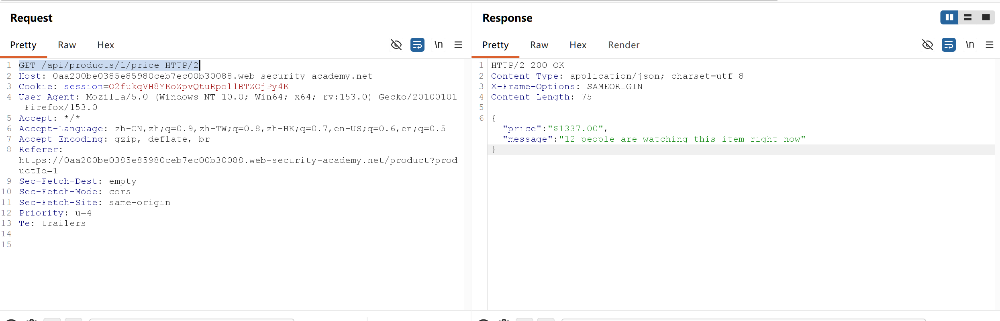

  左边为请求商品，右边响应 json 数据，是商品价格与信息。

- 使用 OPTIONS 探测请求方法，发现 **PATCH** 命令，此命令可以求改数据，结合上面的信息将商品价格修改为 0。

  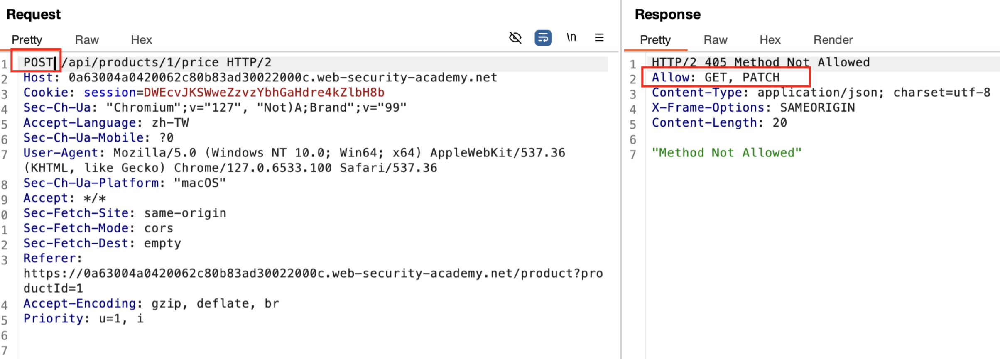

## 框架批量分配API漏洞

### 批量赋值漏洞（Mass Assignment）总结

**核心原因：**

服务器把客户端提交的 JSON 参数直接映射到内部对象，而没有限制哪些字段可以被用户修改。

简单说：

> **本应由服务器决定的数据，被错误地交给了客户端控制。**

---

#### 正常流程

客户端只提交必要信息：

```json
{
  "product_id": "1",
  "quantity": 3
}
```

服务器：

1. 根据 `product_id` 查询数据库：

   ```
   商品ID 1
   ↓
   Lightweight "l33t" Leather Jacket
   ↓
   价格 133700
   ```

2. 服务器计算：

   `133700 × 3`

3. 服务器验证优惠、权限等。

最终价格由服务器决定。

---

#### 存在批量赋值漏洞时

客户端提交：

```json
{
  "product_id": "1",
  "quantity": 3,
  "item_price": 0,
  "discount": 100
}
```

服务器错误处理：

```
JSON字段
    ↓
自动绑定
    ↓
订单对象
    ↓
计算金额
```

结果：

- item_price = 0
- discount = 100%

服务器直接相信攻击者提供的数据。

---

#### 为什么叫"批量赋值"？

因为后端可能类似：

```python
Order(**request.json)
```

或者：

```javascript
Object.assign(order, req.body)
```

意思：

> 用户传什么字段，就批量写入对象什么字段。

于是隐藏字段也可能被修改：

例如：

```json
{
  "username": "wiener",
  "isAdmin": true
}
```

可能导致：

```
普通用户
↓
管理员
```

---

#### 如何识别？

观察：

##### 1. 请求中的字段

例如：

```json
{
  "product_id": 1,
  "quantity": 3,
  "item_price": 133700
}
```

思考：

- `item_price` 是否应该由用户决定？
- `discount` 是否应该由用户决定？

---

##### 2. 查看 API 文档

寻找隐藏参数：

例如：

```json
{
  "chosen_discount": {
    "percentage": 0
  }
}
```

尝试修改：

```json
{
  "percentage": 100
}
```

观察响应。

---

##### 3. 修改敏感字段

常见目标：

- price
- item_price
- discount
- role
- isAdmin
- permissions
- balance
- quantity

---

#### 防御方式

服务器应该：

**[OK] 只接受允许修改的字段（白名单）**

例如：

允许：

```json
{
  "quantity": 3
}
```

拒绝：

```json
{
  "price": 0,
  "discount": 100
}
```

---

**[OK] 敏感字段服务器计算**

不要：

客户端 → price

应该：

```
客户端 → product_id
    ↓
服务器查询价格
    ↓
服务器计算金额
```

---

#### 一句话记忆

> **批量赋值漏洞 = 后端过度信任客户端提交的数据，把用户不应该控制的字段也自动写入服务器对象。**

在购物场景：

正常：

```
用户提交商品ID
    ↓
服务器查价格
    ↓
计算订单
```

漏洞：

```
用户提交商品ID + 价格 + 折扣
    ↓
服务器直接使用
    ↓
价格可被篡改
```

---

- 购物车付款会像服务端发起检测，查看折扣与商品信息

  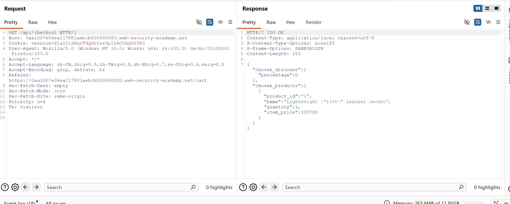

- 更改请求方式为 OPTIONS，看看允许哪些请求方式，这里是 POST, GET

  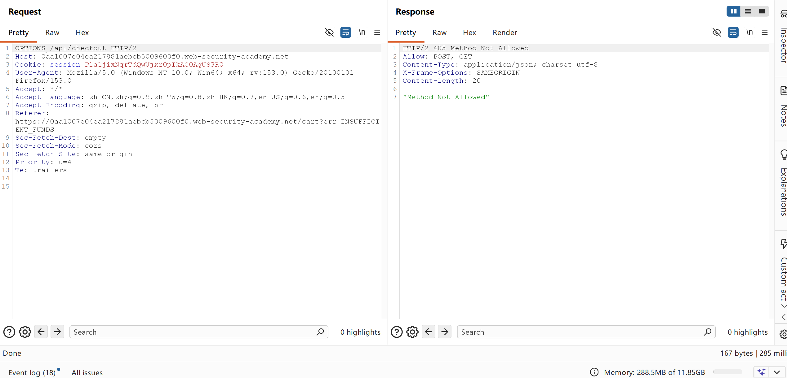

- 允许 POST, GET，那就可以尝试修改信息看是否能直接将我们的信息保存到服务器中，也就是更改数据。

  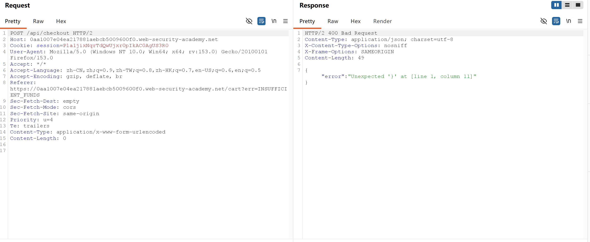

- 由于 JSON 是现在数据传输的绝对王者，并且之前看服务器响应也都是 JSON 格式，那么我们也需要将请求体中传输 JSON 数据，然后请求头中添加 `Content-Type: application/json`，目的是告诉服务器请求体中的内容格式。

  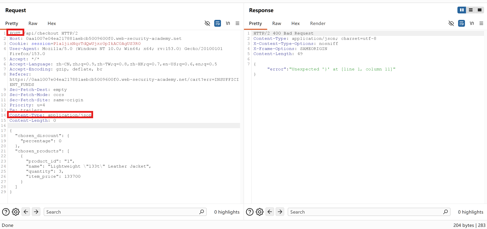

- 可以来回更换 JSON 数据中的值，看是否报错，如果报错说明后端服务器是会对该参数进行处理的。

  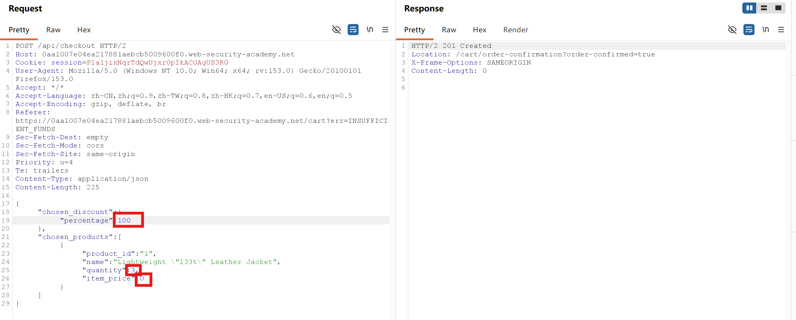

## 测试查询字符串中是否存在服务器端参数污染

==Content-Type: x-www-form-urlencoded== 请求头含有此 x-www-form-urlencoded 说明请求体中数据是编码过的对特殊字符

- 发起更改密码请求

  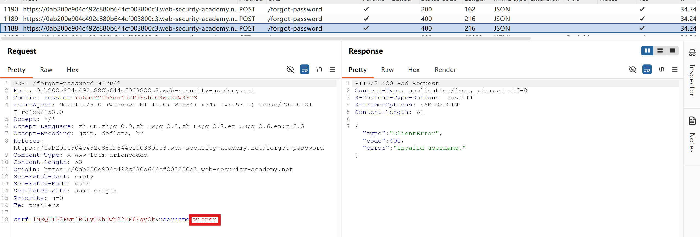

  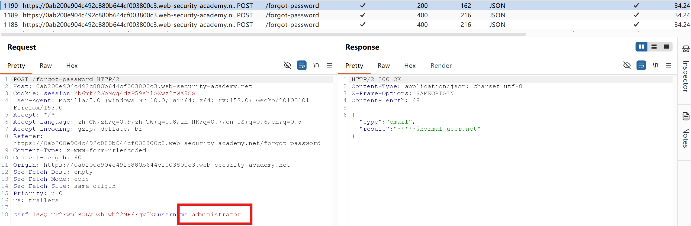

  根据差异可以看出存在 administrator 账户。

- 这里还发现加载了 js 脚本，文件名已经告诉我们了他与忘记密码有关。

  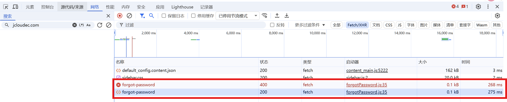

  这里查看 js 脚本里面是修改密码的逻辑

  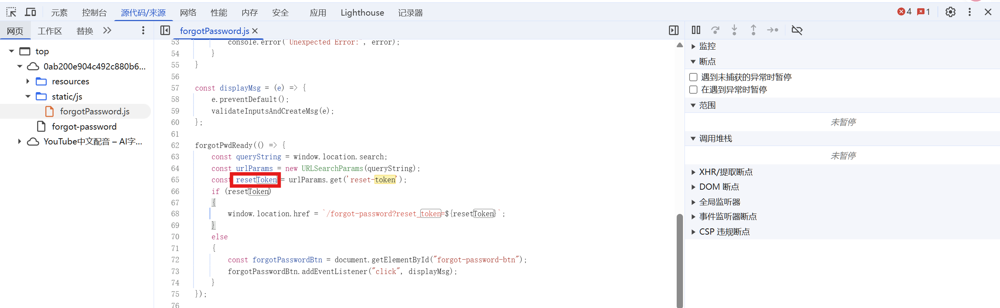

- 对请求参数进行污染尝试

  **&x=y**：返回不变说明后端忽略了未知参数 `x`，或者请求参数解析只取它认识的字段。

  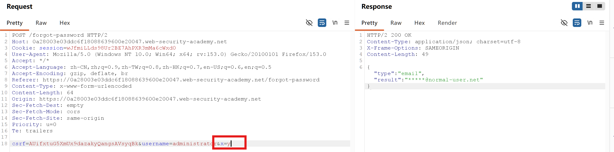

  **%26** 也就是 & 的 url 编码：

  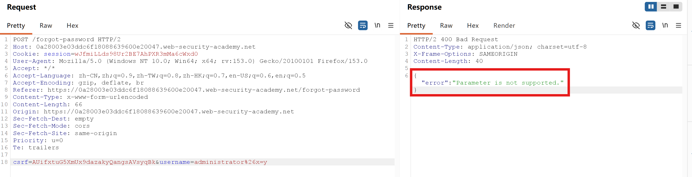

  这个错误与无效用户名的响应不一样，这里是参数不支持，说明 `%26x=y` 被当成了参数

  ```text
  编码与不编码的差异
  正常请求：
  HTTP body
   |
   v
  参数解析
   |
   +---- username
   |
   +---- x
   |
   v
  业务代码
   |
  只使用 username
   |
  成功

  编码请求请求：
  HTTP body
   |
   v
  decode
   |
  username=administrator&x=y
   |
   v
  参数校验
   |
  发现未知参数 x
   |
  拒绝
  ```

  **%23** 触发没有指定 Field

  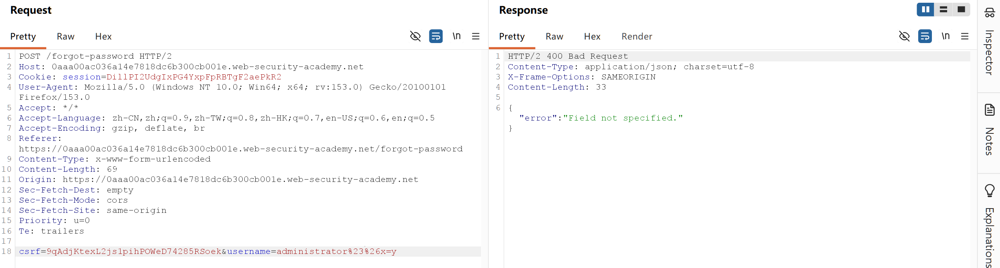

  **#** 触发没有指定 Field

  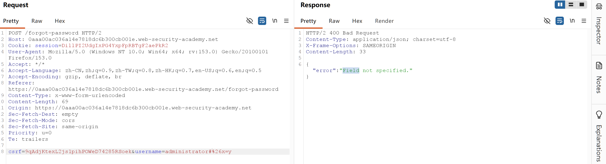

  突然注意到 ==Content-Type: x-www-form-urlencoded==，那就不纠结编不编码了，对请求体中特殊字符全部编码处理。**x-www-form-urlencoded** "请求体的格式是 URL 编码表单格式，请按照这种规则解析。"

  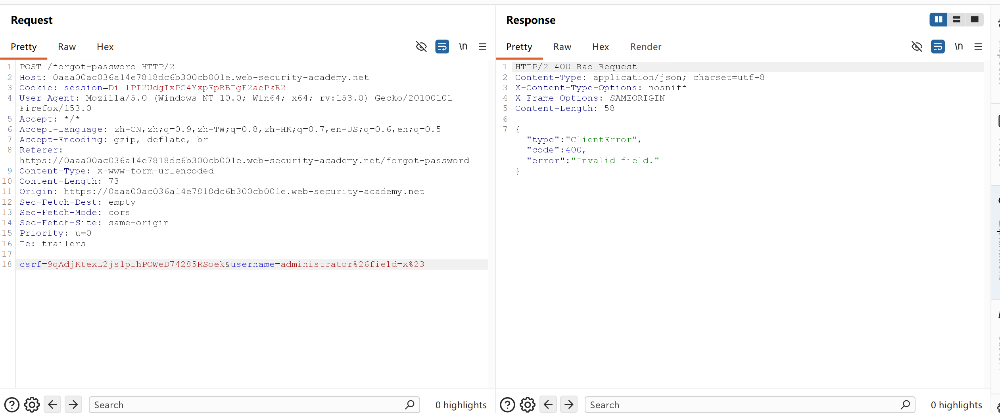

  响应 invalid fields 说明服务端已经意识到这里的 file 参数值存在问题

  爆破 filed 的值发现 email 与 username 可以成功响应。

  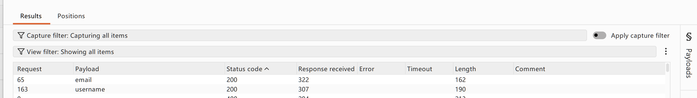

  发现又是正常的响应了

  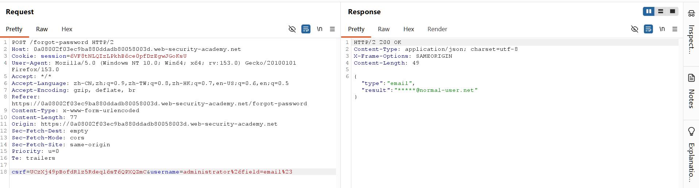

  **攻击者的猜想**：既然后端 API 可以根据 `field` 参数返回 `username` 或 `email` 相关的信息，那它是否也能返回其他敏感信息，比如 `reset_token`？这里没有直接爆出 reset_token 纯属字典小。

- 记得最开始就发现了一个 js 脚本

  ```javascript
  forgotPwdReady(() => {
      const queryString = window.location.search;
      const urlParams = new URLSearchParams(queryString);
      const resetToken = urlParams.get('reset-token');
      if (resetToken)
      {
          window.location.href = `/forgot-password?reset_token=${resetToken}`;
      }
      else
      {
          const forgotPasswordBtn = document.getElementById("forgot-password-btn");
          forgotPasswordBtn.addEventListener("click", displayMsg);
      }
  });
  ```

- **前端服务器的操作**：它将这个值拼接到后端请求中，最终后端收到的请求被我们劫持为：将 `field` 参数改为 `reset_token` 后又正常响应说明后端正常解析了该请求，并且返回了一个结果 **5spvhkdfbubgndt1sb17o43fx7tf7cc7**

  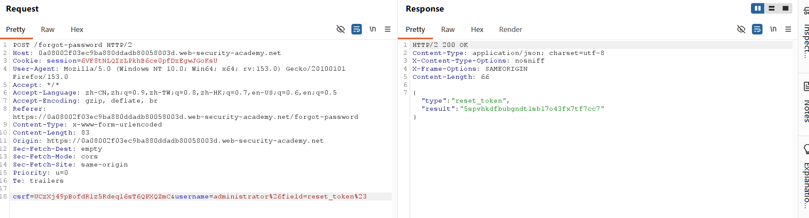

  **后端的反应**：后端 API 的逻辑可能是"根据用户名查找用户，然后返回该用户指定的字段信息"。它接收到指令，查找 `administrator` 用户的 `reset_token` 字段，并直接将令牌返回！

- 通过阅读 js 脚本发现 reset_token 是重置密码的令牌，需要 get 请求传递，后会跳转到重置密码解码 `window.location.href = '/forgot-password?reset_token=${resetToken}'`

  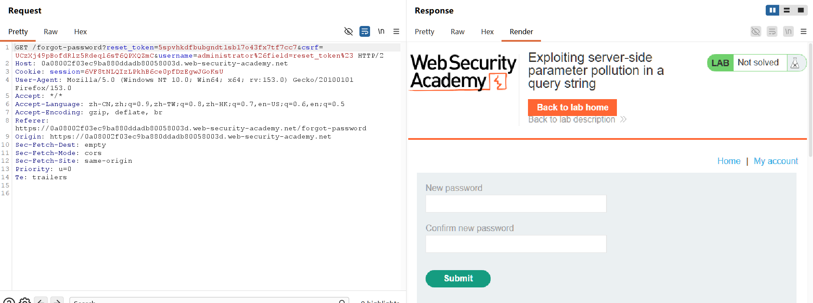

  令牌是有存活期的可能是一次性也可能是规定时间失效，影刺构造好 GET 请求包复制到浏览器进行跳转修改密码成功

  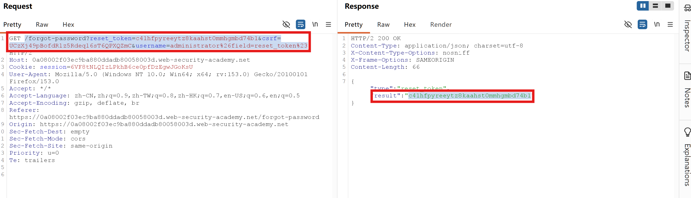

  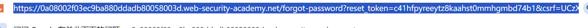

  修改密码成功！！！

## 漏洞根源

后端 API 过度相信了前端传来的 `field` 参数，没有设置一个白名单来限制哪些字段是允许被查询的，导致了敏感信息的泄露。像重置密码这些关键字段本不应该由前端自定义。
