有些网站认为，即使 cookie 使用的是静态值，只要对其进行加密，就无法被破解。如果加密方式正确，这种说法或许成立。然而，简单地使用 Base64 等双向编码对 cookie 进行“加密”根本无法提供任何保护。即使使用单向哈希函数进行正确的加密，也并非万无一失。如果攻击者能够轻易识别哈希算法，并且没有使用加盐值，他们就可以通过简单地对字典进行哈希运算来暴力破解 cookie。如果 cookie 破解没有设置类似的尝试次数限制，这种方法就可能被用来绕过登录尝试次数的限制。

即使攻击者无法创建自己的账户，他们仍然可能利用此漏洞。攻击者可以使用诸如跨站脚本攻击 (XSS) 等常用技术窃取其他用户的“记住我”cookie，并由此推断出该 cookie 的构造方式。如果网站是使用开源框架构建的，那么 cookie 构造的关键细节甚至可能已被公开记录。

## Brute-forcing a stay-logged-in cookie
登陆时有一个保持登陆状态选项，即使在关闭浏览器会话后仍能保持登录状态。用于实现此功能的 Cookie 容易受到暴力攻击的影响。

**使用正常账号验证流程**
- /login登陆界面， 
	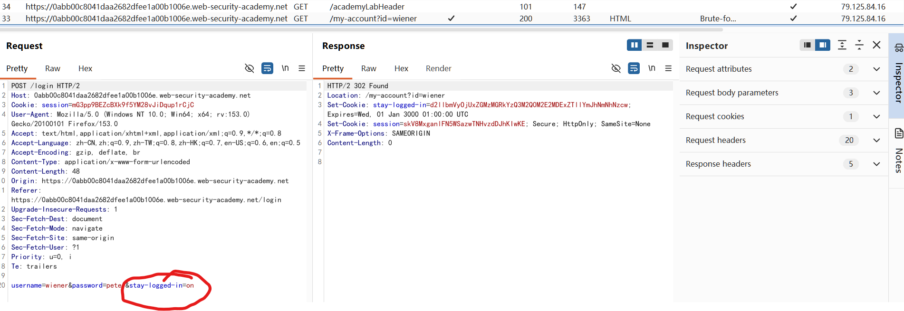
- /my-account?id=wiener登陆后进入登陆成功首页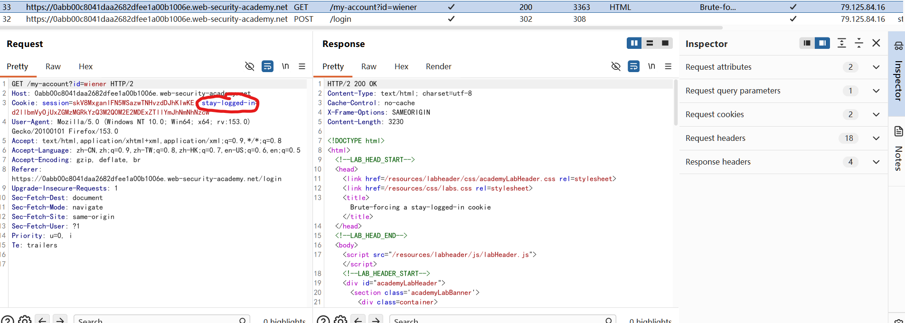
- 这个保持登的stay-logged-in=d2llbmVyOjUxZGMzMGRkYzQ3M2Q0M2E2MDExZTllYmJhNmNhNzcw是bash64编码
	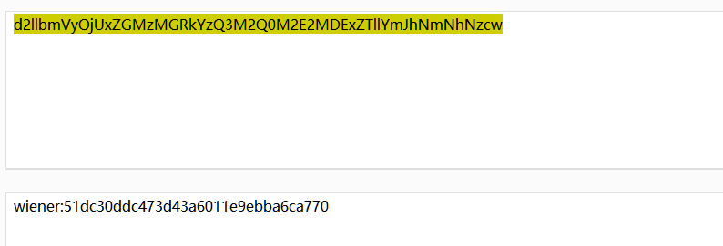

**认证逻辑**
登陆成功条件满足其一即可：
|> cookie正确
|> stay-logged-in正确\[stay-logged-in的构造方式：`base64(username+':'+md5(passwd))`\]
|>cookie + stay-logged-in 正确

窃取carlos账号：
	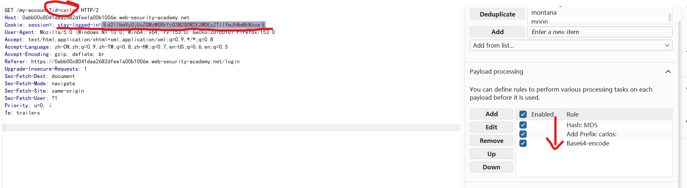
登陆成功：
	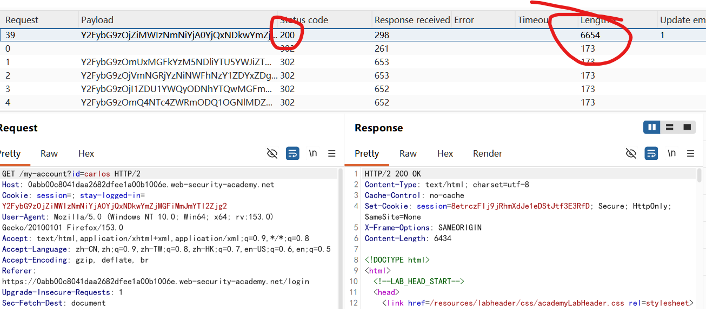

##  Offline password cracking
**hash密码不加salt的后果，知名hash算法是可以直接识别并离线破解的。**

登陆正常账号发现存在xss还是存储型，直接留言区写xss脚本获取用户cookie
	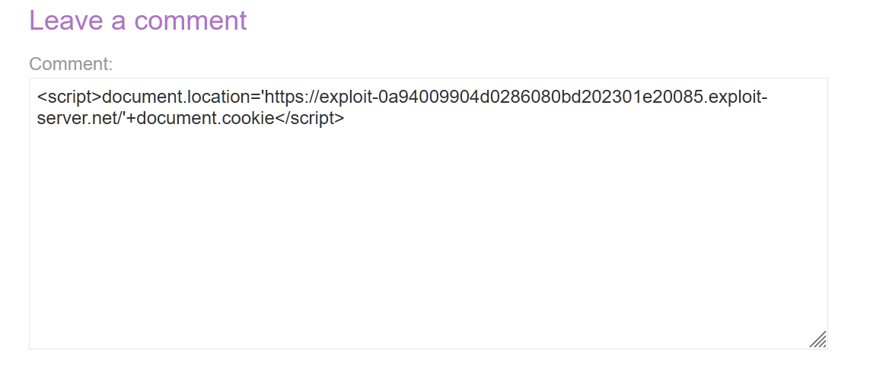
服务器日志显示访问记录，里面有访问者的cookie。
	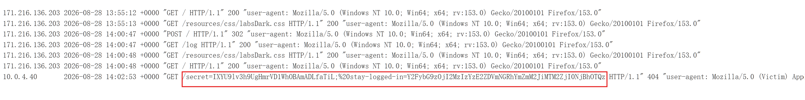

获取到为加salt的hash直接破解：
`secret=IXYU9lv3h9UgHmrVD1WhOBAmADLfaTiL;%20stay-logged-in=Y2FybG9zOjI2MzIzYzE2ZDVmNGRhYmZmM2JiMTM2ZjI0NjBhOTQz`
	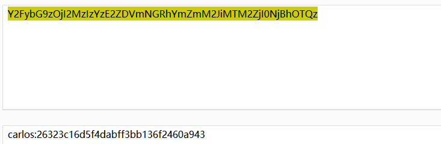

离线识别hash算法：这里优先尝试md5，因为不加salt它概率偏高：
	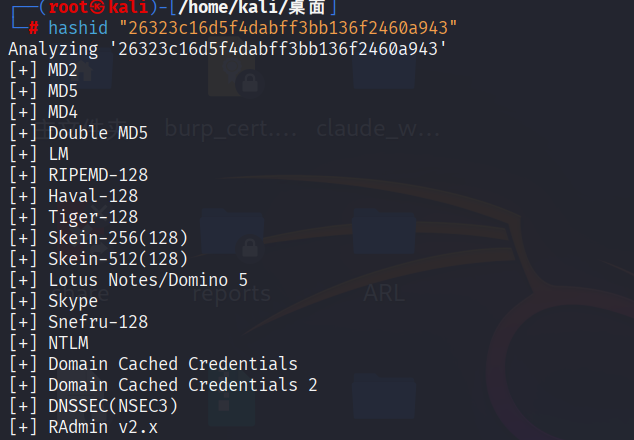

使用hashcat直接碰撞：
	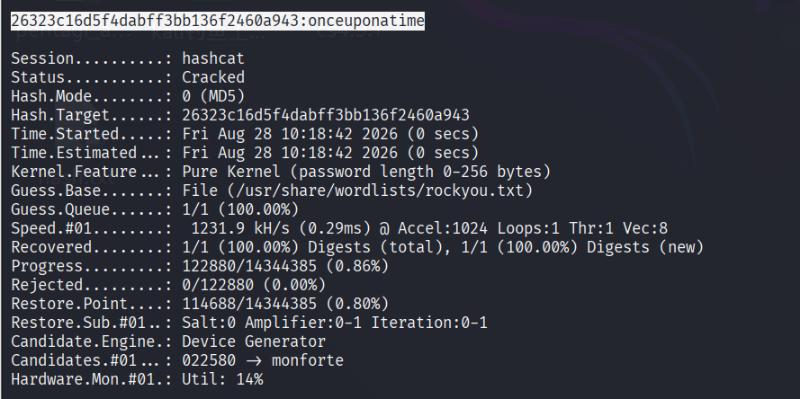
	`26323c16d5f4dabff3bb136f2460a943:onceuponatime`
至此获取到用户与密码。

## Password reset broken logic

可靠的密码重置方法是向用户发送一个唯一的 URL，引导他们访问密码重置页面。安全性较低的实现方式是使用带有易于猜测的参数的 URL 来识别正在重置密码的帐户，例如：
`http://vulnerable-website.com/reset-password?user=victim-user`
在这个例子中，攻击者可以更改`user`参数，使其指向他们已知的任何用户名。然后，他们会被直接引导到一个页面，在该页面上，他们有可能为这个任意用户设置新密码。

更佳的实现方法是生成一个高熵、难以猜测的令牌，并基于该令牌创建重置 URL。理想情况下，该 URL 不应泄露任何关于正在重置哪个用户密码的信息。
`http://vulnerable-website.com/reset-password?token=a0ba0d1cb3b63d13822572fcff1a241895d893f659164d4cc550b421ebdd48a8`
==当用户访问此URL时，系统应检查后端是否存在此令牌，如果存在，则确定要重置哪个用户的密码。此令牌应在短时间内过期，并在密码重置后立即销毁。==
然而，有些网站在用户提交重置表单后，并未再次验证令牌。在这种情况下，攻击者只需使用自己的账户访问重置表单，删除令牌，即可利用此页面重置任意用户的密码。

**流程**
- 访问修改密码界面
- 输入要修改的账号或者邮箱
- 会发送重置密码链接到第三方例如邮箱
- 点击第三方的重置密码邮箱完成密码重置
- 重置目标账户
	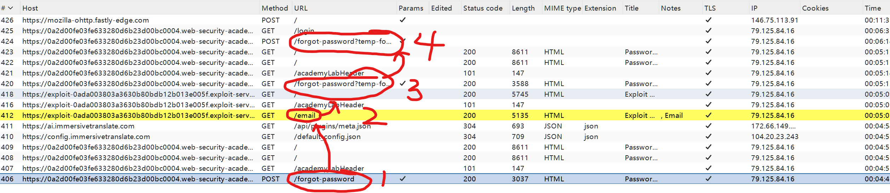
最关键的是这个数据包，这是**邮箱中的重置密码链接**，这里的密码重置token没有与账户进行绑定导致可以重置任意用户的密码。也就是只要拿到此链接就可重置任意用户密码。
	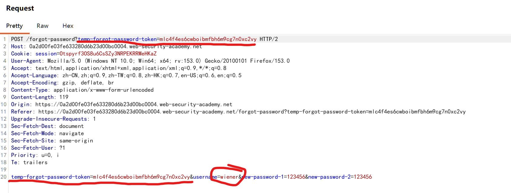
	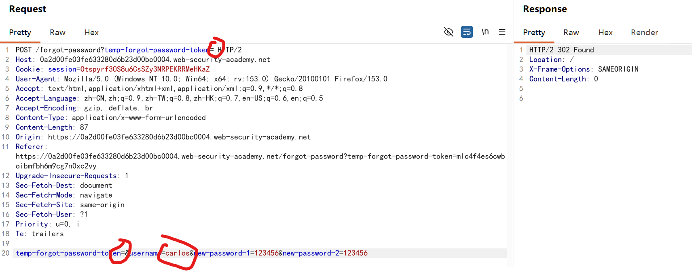

## Password reset poisoning via middleware
这一关的原理是再选择重置账号的时候会发送一个对应账号的重置令牌，正常来说这个重置令牌会发送到修改密码本人的设备上，但是我们通过指定**X-Forwarded-Host**让其将令牌发送到攻击者的服务器其中，然后窃取使用该令牌用于重置密码。

`X-Forwarded-Host` 是一个 **HTTP 请求头字段**，用于在代理/负载均衡器转发请求时，**保留客户端原始请求的主机名（Host）**。
相关的：
	**X-Forwarded-Host**：原始请求的 **域名**
	**X-Forwarded-For**：原始客户端的 **IP 地址**
	**X-Forwarded-Proto**：原始请求的 **协议**（http/https）

指定X-Forwarded-Host：
	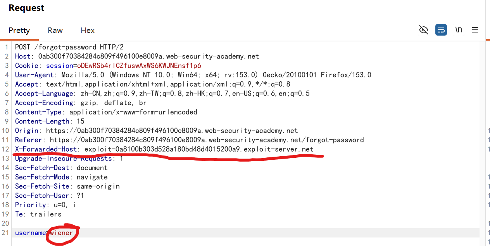
查看访问日志得到k8qj15slj6fvp51n6jr6ilchej6katwt：
	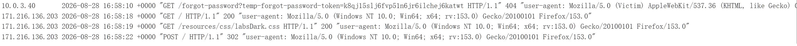
修改token后密码重置成功！
	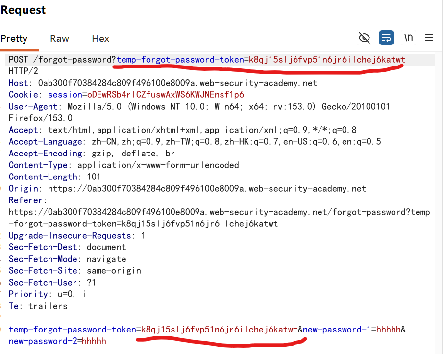

==这里的疑问，访问服务器不是一般是再url中设置访问目标吗，这里使用X-Forwarded-Host为什么攻击者服务器也收到了访问日志？==

之所以**攻击者的服务器会有访问日志**，是因为漏洞目标系统的后端代码存在**逻辑缺陷**，它错误地信任了这个请求头来拼接“密码重置链接”。

具体的攻击逻辑和原理如下：
- 在很多 Web 应用中，发送密码重置邮件时需要**动态**拼接一个带有 Token 的 URL。如果开发人员没有在配置文件中硬编码固定域名（如 `[https://example.com](https://example.com)`），而是选择动态获取，就可能依赖中间件/框架的 API：
	`reset_url = "https://" + request.getHeader("X-Forwarded-Host") + "/forgot-password?temp-forgot-password-token=" + token`
- **中间件/代理逻辑**：如果应用前面有反向代理或中间件，中间件收到含有 `X-Forwarded-Host: attacker.com` 的请求时，会认为这是原始客户端请求的主机名，并将其传递给后端。
- **后端缺陷**：后端代码盲目信任并读取了 `X-Forwarded-Host`，将域名直接拼接到了邮件的重置链接里。

## Password brute-force via password change

通常情况下，更改密码需要输入两次当前密码，然后再输入两次新密码。这些页面在验证用户名和当前密码是否匹配方面，本质上与普通登录​​页面相同。因此，这些页面也可能受到相同技术的攻击。

如果攻击者无需以受害者用户身份登录即可直接访问密码更改功能，则该功能可能尤其危险。例如，如果用户名存储在隐藏字段中，攻击者可能能够在请求中编辑此值，从而针对任意用户。这可能被利用来枚举用户名并暴力破解密码。

**正常修改密码，确认修改密码逻辑**：
三种返回差异情况：
- 当前密码正确，输入两次新密码不匹配：New passwords do not match
- 当前密码错误，输入两次新密码匹配：Current password is incorrect
- 当前密码错误，输入两次新密码不匹配：Current password is incorrect
- 当前密码正确，输入两次新密码匹配：修改成功

**利用密码正确但是新密码不匹配输出为New passwords do not match暴力破解**
	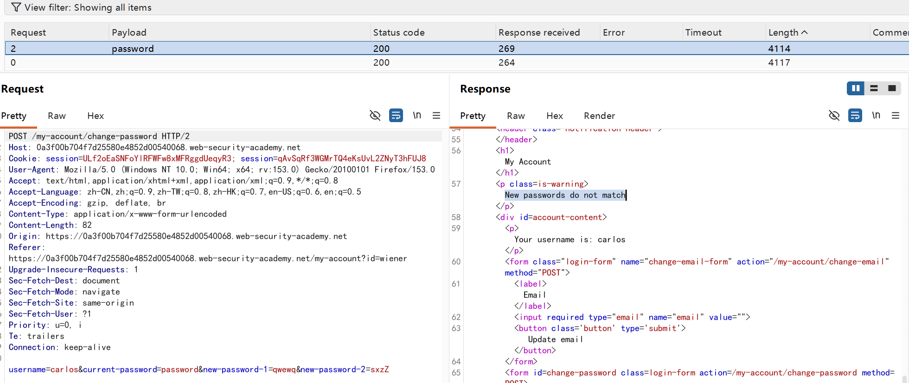

根据差异获取到了正确的账号密码，这里也是没有将更新密码的会话与要更新的用户进行**绑定**导致的，也就是任意的用户只要知道用户名然后用高效字典都可轻易爆破。**身份验证与会话上下文缺乏强绑定**。

**防御：**
- **强制校验会话身份：** 服务端在处理敏感操作（如修改密码、修改个人信息）时，必须直接从服务端经过签名或加密的 Session/JWT 中提取当前已登录的用户标识，而不是信任客户端前端提交的用户名参数。
- **隔离操作上下文：** 不允许通过参数指定目标用户名，或者如果传入参数与当前 Session 中的 User ID 不一致，则直接拒绝请求并记录安全日志。
- **频率限制与锁定机制：** 针对关键接口（如密码校验、修改密码）实施合理的速率限制（Rate Limiting）和异常行为检测，防止通过侧信道响应特征进行批量枚举。

