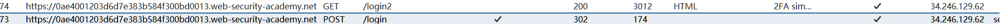
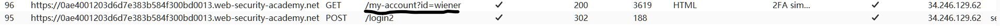
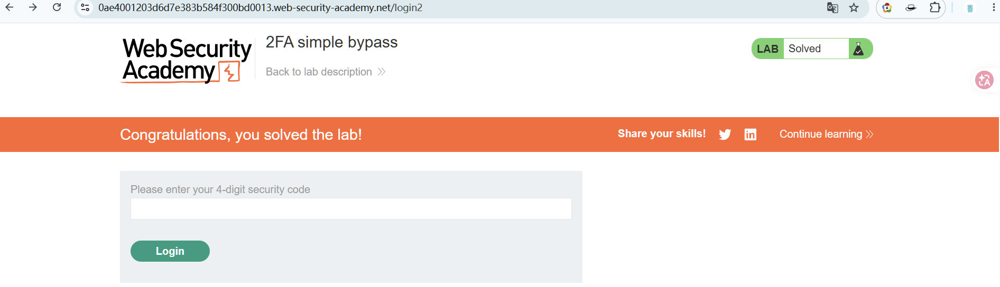
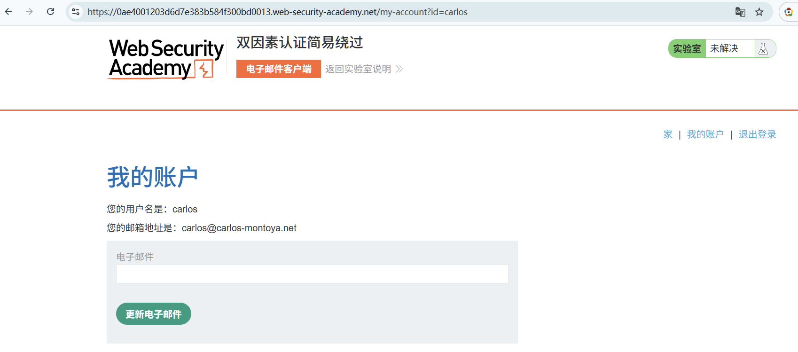
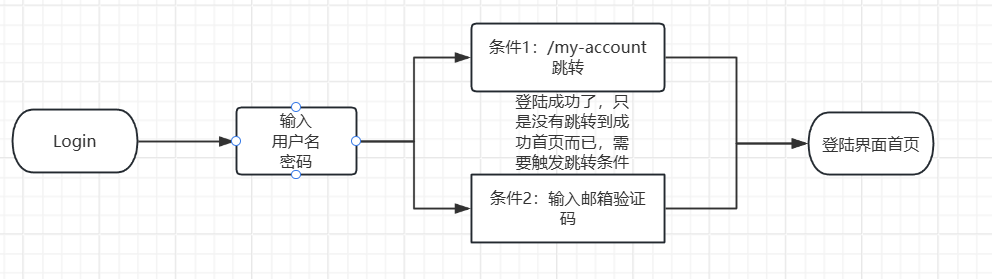
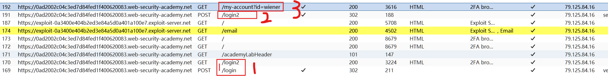
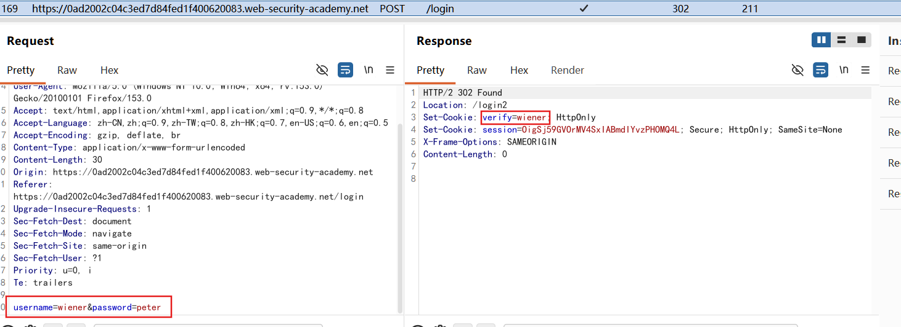
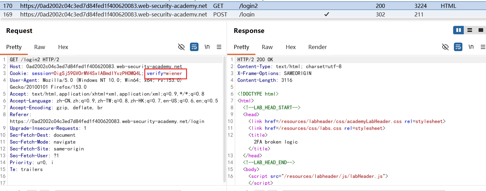
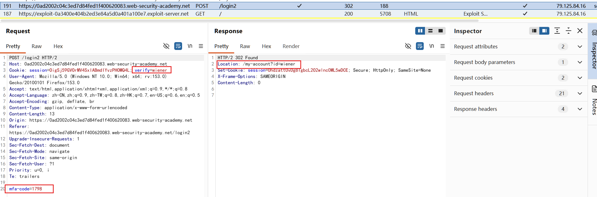

## 什么是双因素验证？其中的弯弯绕绕：

**常见的三种因素是：**

- 你知道的东西：密码、PIN。。。
- 你拥有的东西：手机、硬件令牌、Authenticator App。。。
- 你本人的特征：指纹、人脸。。。

如果登录网站需要：
- 网站密码 + 邮箱验证码
表面上是两步验证，但验证码放在邮箱里。攻击者只要拿到你的邮箱账号密码，就能登录邮箱并读取验证码。

所以实际变成了：
- 知道网站密码 + 知道邮箱密码
这仍然是两个“你知道的东西”，不算真正的两个因素。两个不同的密码，不代表两个不同的因素。

相比之下：
- 网站密码 + Google Authenticator 生成的验证码
验证码由手机上的验证器本地生成，攻击者即使知道密码，也还需要拿到你的手机或验证器密钥，这才是“知道的东西 + 拥有的东西”。

**短信验证码也通常被归类为“拥有手机”，但安全性较弱，因为可能受到短信拦截、SIM 卡交换等攻击。**

**邮箱验证码不是完全没有安全价值，但它更准确地叫“两步验证”，不一定是真正的“双因素认证”。真正的 2FA 要求第二步依赖一个独立的设备、密钥或生物特征。**

## 双因素简单简单绕过
如果用户先被要求输入密码，然后在**另一个页面上**被要求输入验证码，那么用户在输入验证码之前实际上就已经处于“登录”状态。在这种情况下，值得测试一下，看看能否在完成第一个身份验证步骤后直接跳转到“仅限登录用户”的页面。有时，你会发现某些网站在加载页面之前实际上并没有检查你是否完成了第二个步骤。

**用正常账号探测认证逻辑**
- /login页面输入密码
- 302跳转到/login2输入邮箱验证码
	
- 输入验证码发现跳转到my-account?id=wiener
	
**使用受害者账号登陆，但是无法获取受害者邮箱**
- 直接登陆
	
- 将/login2更换成登陆后的页面/my-account?id=carlos
	
- 无需获取邮箱验证码即登陆成功！！！

==认证逻辑缺陷==
- 再用户输入正确账号密码时就已经成功登陆了，之后跳转的邮箱验证码页面用户的状态实际上是登陆成功的，也就是用户获取了访问相关页面的权限，输入邮箱验证码实际上也只是形式上的验证成功本质上就是一个跳转到真正登陆页面的触发条件，但跳转到真正登陆页面的条件不止这一条，直接修改url接口也可。
	

## 双因素认证逻辑失效
双因素身份验证中的逻辑有时存在缺陷，这意味着在用户完成初始登录步骤后，网站无法充分验证**是否是同一用户**正在完成第二步。

**先用正常账户完成完整流程，了解认证逻辑**

- 再/login界面输入账号密码跳转到/login2界面，也就是输入邮箱验证码界面
	/login
	
	/login2数据包cookie中多了给verify=wiener
	
- 输入邮箱验证码，跳转到/my-account?id=wiener
	

**验证逻辑已摸清**：
- 用自己的账号密码完成第一步；
- 拦截提交验证码的请求；
- 将 `account` 改成受害者；
- 遍历验证码；
- 如果服务器只根据这个 Cookie 判断账号，猜中后就可能进入受害者账户。

