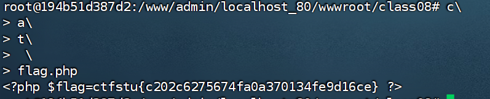
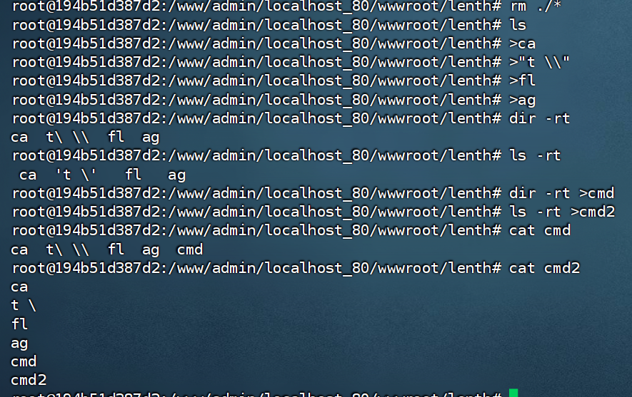
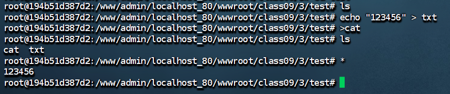

**>符号与>>符号**
```bash
>,重定向符号
echo "hello,world" > a.txt 将echo输出的内容写入a.txt，如果a.txt中有内容会被覆盖

>>,追加符号
echo "hello,world" >> a.txt 将echo输出的内容追加到a.txt，如果a.txt中有内容会被写在内容后不会覆盖

```

**命令换行符\\**
```bash
cat flag.php
可以写成
c\
a\
t\
 \ # \前是一个空格
flag.php
```


**ls -t命令      ls -rt**
```
ls -t按照创建时间排序，最后创建的文件可以看作最年轻的文件，排列是年轻到老排序
ls -rt 与ls -t完全相反
```

ls -t 与\与>配合可以读取命令
```
要执行的命令cat flag
改为
>ag
>fl\\
>"t \\" # 有空格需要""来保持整体性
>ca\\
ls -t >a
```


**. 文件名(这里文件名为cmd)**
```
. cmd 是 source 命令的简写形式，作用是在当前shell环境中执行指定文件中的命令。
```


**sh命令**
```
sh script.sh
# 使用sh解释器执行脚本
sh 文件名 作用是在当前shell环境中执行指定文件中的命令。
```
重要参数：
	-c：从字符串读取命令 `sh -c "ls"`
	-x：显示执行的命令（调试）
	-e：遇到错误立即退出

**dir**
```
dir 与ls功能差不多，但是dir 按列输出，不换行
```


**$(dir \*)**
	==$(dir *)会将当前目录下第一个文件名当作命令执行==

	$(dir *)会将当前目录下第一个文件名当作命令执行,==后续的文件作为参数==


**rev**
	反转文件中每一行的内容，也可以读取文件


**\***
	可以将文件名作为命令执行，与$(dir \*)有些相似
